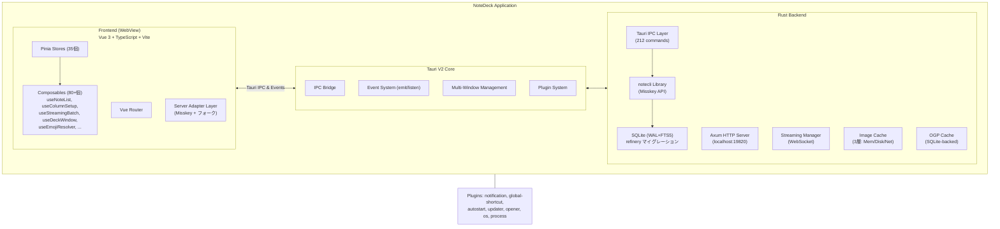
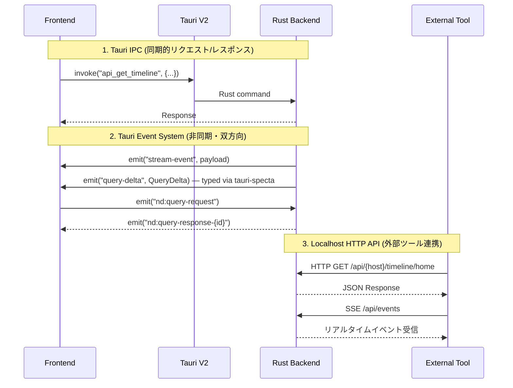
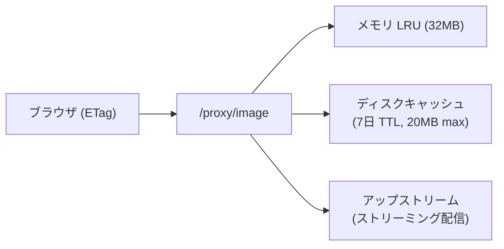
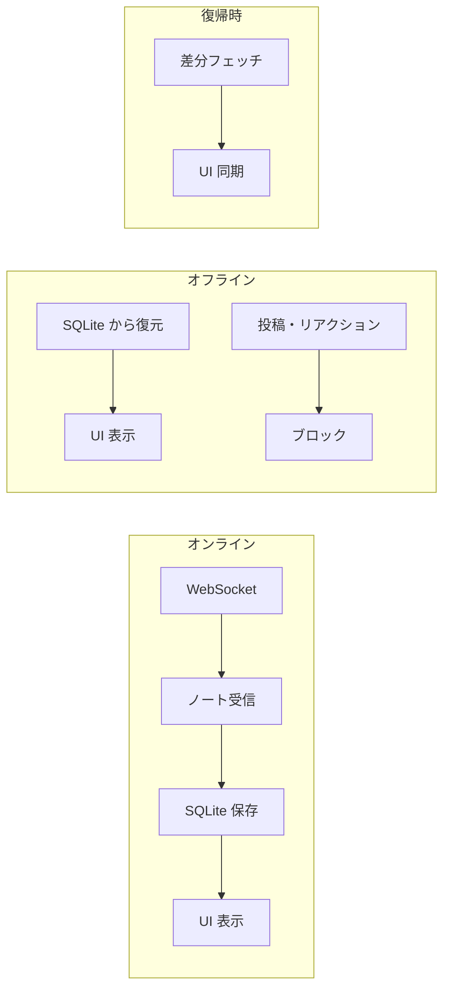
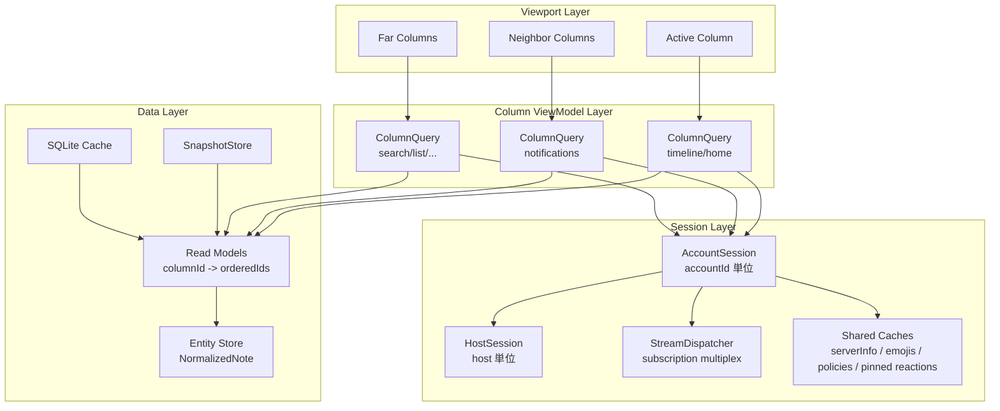
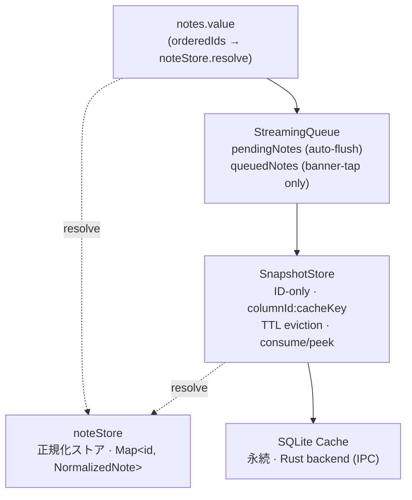
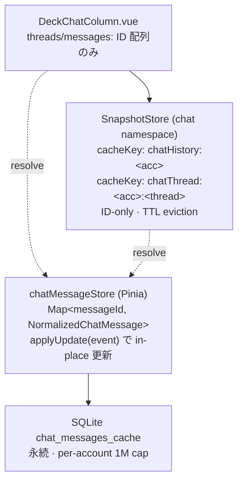

# ARCHITECTURE

NoteDeck — マルチサーバー対応 Misskey デッキクライアントのアーキテクチャ。

---

## 目次

- [アーキテクチャ概要](#アーキテクチャ概要)
  - [全体像](#全体像)
  - [notedeck（GUI アプリ）](#notedeckgui-アプリ)
  - [notecli（コアライブラリ）](#notecliコアライブラリ)
- [Session-centric + Viewport-centric Architecture](#session-centric--viewport-centric-architecture)
- [Rust Query Runtime + Read Model](#rust-query-runtime--read-model)
- [ノートキャッシュ・キューアーキテクチャ](#ノートキャッシュキューアーキテクチャ)
- [チャットキャッシュ・アーキテクチャ（検討中）](#チャットキャッシュアーキテクチャ検討中)
- [レンダリングパフォーマンス](#レンダリングパフォーマンス)
- [採用状況マトリクス](#採用状況マトリクス)

---

## アーキテクチャ概要

### 全体像



**技術スタック:**
- **フレームワーク**: Tauri V2
- **フロントエンド**: Vue 3 + TypeScript + Vite（Vapor モード移行予定 [#52](https://github.com/hitalin/notedeck/issues/52)）
- **バックエンド**: Rust (Axum, notecli)
- **対応プラットフォーム**: Windows, macOS, Linux, Android (開発中)

**Frontend ↔ Backend の3つの通信パターン:**



---

### notedeck（GUI アプリ）

#### A-1. Query Bridge（Rust ↔ フロントエンド双方向クエリ）

**場所**: `query_bridge.rs` + `utils/apiBridge.ts`

外部 HTTP リクエスト → Rust → Tauri Event → Vue/Pinia → Tauri Event → Rust → HTTP レスポンス。
フロントエンドのリアクティブ状態（デッキカラム、コマンド一覧等）を外部ツールから直接取得可能。

---

#### A-2. マルチウィンドウ・デッキ（クロスウィンドウ D&D）

**場所**: `useDeckWindow.ts` + `useColumnDrag.ts`

- カラムを別ウィンドウにポップアウト
- ウィンドウ間でカラムをドラッグ移動
- マルチモニター対応のレイアウト保存・復元
- ウィンドウ閉鎖時の自動カラム回収

---

#### A-2b. PiP ウィンドウ（常前面フローティングカラム）

**場所**: `usePipWindow.ts` + `src/views/PipPage.vue`

- デッキのカラムを常前面フローティングウィンドウとして切り離し
- 375×700px（リサイズ可能）、`alwaysOnTop`、複数同時起動（動的ラベル `pip-*`）
- コマンドパレット / タイトルバー / カラムメニューの 3 経路で起動

---

#### A-3. HTTP API（notecli ルーター共有）

**場所**: `http_server.rs`（notedeck）+ `http_server.rs`（notecli）

notecli の `build_core_routes()` でコア API 16ルートを共有し、notedeck 固有ルート（deck, commands, image proxy, OpenAPI docs）を `.merge()` で追加。SSE イベントストリーム、Scalar UI ドキュメント付き。

---

#### A-4. ストリーミング → マルチ配信ブリッジ

**場所**: `streaming.rs` + `EventBus` + `query_runtime.rs`

WebSocket 受信 → 1箇所で4つの出力先に同時配信:
1. OS ネイティブ通知（`tauri-plugin-notification`）
2. WebView イベント（`app.emit("stream-event")`）
3. SSE（外部 HTTP クライアント向け）
4. **Query Runtime の Read Model**（後述 A-11）— stream-note/mention/notification/chat-message などを ingest し、`query-delta` を typed event として emit

ストリーミングで受信したノートは `db.cache_note()` で SQLite に非同期保存。

#### A-4b. Subscription suspend / resume

**場所**: `notecli::streaming` + `commands::stream_suspend_subscription` / `stream_resume_subscription`

WebSocket 接続は維持したまま、subscription 単位で channel から **WS unsubscribe** する。`info.active = false` にして受信ループから除外し、`WsCommand::Unsubscribe` を WS に送出。Misskey 側もそのチャンネルへの送出を停止するため、suspend 中の noteUpdated は再送されない（resume 時に過去分は届かない）。

JS 側 `MisskeyStream` は `liveCount` と warm timer（既定 8s）で `live → warm → suspended` の状態遷移を自動で行う。

**suspend させる条件**（`useNoteColumn` の `[isVisible, isLive]` watcher）:

| isVisible | isLive | 挙動 |
|-----------|--------|------|
| false | * | warm → 8s 後 suspend (Rust 側 unsub) |
| true | false | **subscription は live 維持**、`streamingBatch` だけ pause |
| true | true | live、`onResume` で sinceId 差分 fetch、batch flush 再開 |

**重要**: 「可視・予算外」だけでは suspend しない。これをやると見えているのに reaction が永続的に取り逃される（Misskey は再送しない）。

#### A-4c. Reaction freshness guarantees

**場所**: `useNoteCapture` + `noteStore.applyUpdate`

reaction / poll vote / delete は **2 経路冗長化** で取り逃しを最小化する。

1. **Channel auto-capture**: `stream-note-updated` が timeline / antenna / channel / role / list / mentions の subscription 経由で届く。新着ノートとセットで運ばれるので一括カバーできるが、subscription が suspend されると止まる
2. **Per-note capture (`subNote` / `unsubNote`)**: 個別 noteId に対する独立した WS subscription。channel と無関係なので、channel が suspend されてもそのノートの noteUpdated は受信し続ける

`useNoteCapture` は表示中の上位 `noteCaptureMax`（既定 80–150）件をすべて自動 subNote する。channel と capture の **両方が同じイベントを fire する** ため、`noteStore.applyUpdate` は `(noteId, type, userId, reaction, choice)` を sig としてキー化し、1.5s 窓で重複を弾く。

**カバー範囲:**

| 状態 | 新着ノート | 既存ノートの reaction |
|------|-----------|---------------------|
| channel alive | ✅ channel | ✅ channel + capture |
| channel suspended（不可視 >8s） | ❌ どちらも届かない | ✅ capture のみ |
| ノートが noteCaptureMax 超過位置にスクロール | — | ❌ capture 対象外 |

つまり **新着ノートを取り逃さない保証は無い**（channel suspend 時）。reaction の鮮度だけは復帰時に古くならない。新着ノートを死守したい場合は warm timer を伸ばすか、`onResume` で先頭ページを refetch するかの別アプローチが必要。

---

#### A-5. 3層画像プロキシキャッシュ

**場所**: `image_cache.rs` + `/proxy/image`



CSP で外部画像を直接ロードせず、Rust 側のプロキシを経由。ETag/304 対応、インフライト重複排除、同時フェッチ30件制限。

---

#### A-6. OGP プラグインシステム（15プラットフォーム対応）

**場所**: `ogp/plugins/` (Twitter, YouTube, Pixiv, Amazon, ニコニコ 等)

URL ごとに専用パーサーが起動し、汎用 OG タグ解析より高精度なプレビューを生成。
3段フォールバック: プラグイン → サーバー API → 直接 HTML パース。

---

#### A-7. グローバルショートカット + ボスキー + システムトレイ

**場所**: `lib.rs`（デスクトップ専用 `#[cfg(not(mobile))]`）

- `Ctrl+Shift+B`: ボスキー（瞬時にウィンドウ非表示）
- `Ctrl+Alt+N`: クイックノート（ウィンドウ表示 + 投稿フォーム起動）
- トレイアイコン: 左クリックで表示切替、右クリックメニュー
- 閉じるボタン: トレイに隠す（終了しない）

---

#### A-8. オフラインファースト（読み取り専用）

**場所**: `useNoteColumn.ts` + `useColumnSetup.ts` + `DeckTimelineColumn.vue`



- **オフライン検出**: WebSocket 切断 (`disconnected`/`reconnecting`) + API fetch 失敗の両方で即座に検出
- **キャッシュ自動切替**: API 失敗時にキャッシュ済みノートを表示し続ける。スクロールで古いノートも SQLite から読み込み
- **書き込みガード**: オフライン時はリアクション・リノート・リプライ・引用・削除・編集・ブックマークをサイレントにブロック
- **自動復帰**: WebSocket 再接続成功 or API fetch 成功で `isOffline` が自動解除
- **UI バナー**: 「オフライン — キャッシュを表示中」をカラム上部に表示

**方針**: 書き込みキューイングは行わない。Misskey はリアルタイム性が重要な SNS であり、オフライン時に蓄積した操作を後から送信しても文脈が失われる。

---

#### A-9. フロントエンド層

**Pinia Stores (21個):**

| Store | 役割 |
|-------|------|
| `accounts` | マルチアカウント管理（ゲスト・ログアウト済みアカウント含む） |
| `deck` | デッキ・カラム・レイアウト・プロファイル管理（31カラム種別） |
| `streaming` | WebSocket接続状態・購読管理 |
| `notes` | ノートのキャッシュ・正規化 |
| `emojis` | カスタム絵文字管理 |
| `servers` | 接続先サーバー情報 |
| `theme` | テーマ設定 |
| `ui` | UI状態 |
| `keybinds` | キーバインド設定 |
| `windows` | マルチウィンドウ管理 |
| `plugins` | AiScriptプラグイン |
| `pinnedReactions` | ピン留めリアクション |
| `recentEmojis` | 最近使った絵文字 |
| `confirm` | 確認ダイアログ管理 |
| `deckProfile` | デッキプロファイル管理 |
| `deckWallpaper` | デッキ壁紙設定 |
| `performance` | パフォーマンス設定 |
| `themeFileSync` | テーマファイル同期 |
| `toast` | トースト通知 |
| `offlineMode` | オフラインモード状態管理 |
| `realtimeMode` | リアルタイムモード状態管理 |

**Server Adapter パターン** (`types.ts` → `registry.ts` → `misskey/`):
Misskey 本家および Misskey を名乗り続けるフォークに共通インターフェースで対応。

---

#### A-10. タイムライン DOM 管理

**場所**: `NoteScroller.vue` + `useNoteList.ts` + `useStreamingBatch.ts`

`@tanstack/vue-virtual` による仮想スクロールで、viewport + overscan 分のみ DOM に描画する。

**仮想スクロール:**

| 設定 | 値 | 説明 |
|------|-----|------|
| `noteListMax` | 200（デフォルト） | データ配列の上限（`performanceStore` で設定可能、50〜1000） |
| `overscan` | 8 | viewport 外に余分に描画する件数 |
| `estimateSize` | 動的 | 実測値の移動平均（20件ごとに更新） |

- `NoteScroller.vue` が `useVirtualizer` で仮想化。実 DOM は 30-50 件程度に抑制
- `measureElement` + ResizeObserver で可変高さ（テキストのみ 80px〜画像付き 400px+）を自動追跡

**現行の制約と次の一手:**

- 現行は `orderedIds` を column ごとに持ち、描画時に `notes.resolve(ids)` で `NormalizedNote[]` を再構築する
- `notes` store は `triggerRef(noteMap)` ベースのため、局所更新でも列単位の再評価が起きやすい
- Misskey らしいリッチ表示を維持したまま持続的なヌルヌルさを上げるには、**Timeline Store (`ids[]`) と Entity Store (`noteId -> ref`) の分離**が次の有力候補
- 高流量対策として、Rust 側で stream event を batch / materialize し、フロントは snapshot / delta を受ける構成（A-11 Query Runtime）の **インフラは導入済み**。WebView カラム側を queryId 購読に置き換えるのは段階移行中
- `near-end` イベントで末尾到達を検知し loadMore を発火
- `scrollToIndex` expose でキーボードナビゲーション（j/k）に対応

**アニメーション:**

`<TransitionGroup>` は使わず、データレイヤーでの ID マーキング + CSS `@keyframes` で新着ノートの slide-in アニメーションを実現。位置指定に `translate` プロパティ、アニメーションに `transform` プロパティを使い、独立プロパティとして干渉なく動作する。Vue Vapor Mode 互換。

**バッファリング:**

- `useStreamingBatch` は RAF バッファリング + pending 2段階で高頻度更新を1フレームにまとめる
- 超過分は末尾から削除。削除されたノートは SQLite に保存済みのため再取得可能

---

#### A-11. Rust Query Runtime + Read Model（インフラ整備済み・段階移行中）

**場所**: `src-tauri/src/query_runtime.rs` + `src/composables/useQuerySubscription.ts`

JS カラムが直接 `MisskeyStream` を握る "column-centric" モデルから、Rust 側で query 単位に subscription を集約・materialize し、WebView は snapshot / delta を購読するだけの "Rust Query Runtime" モデルへ段階移行する。

**QueryKey:**

「同じ stream を共有できる query」を表す正規化キー。

| kind | パラメータ |
|------|-----------|
| `timeline` | accountId / timelineType (home/local/global/hybrid/list) / listId? |
| `antenna` | accountId / antennaId |
| `channel` | accountId / channelId |
| `role` | accountId / roleId |
| `mentions` | accountId（main 経由） |
| `notifications` | accountId（main 経由） |
| `chatUser` | accountId / otherId |
| `chatRoom` | accountId / roomId |

canonical key（serde JSON）で同一 query を dedup し、`subscriber_count` を持つ。

**コマンド:**

- `query_subscribe_{timeline,antenna,channel,role,mentions,notifications,chat_user,chat_room}` — `connect → open → attach_stream_subscription` を 1 IPC で行い `QuerySnapshot` を返す
- `query_open(key)` — stream は張らず query レコードだけ作る（read-only 用途）
- `query_set_runtime_state(queryId, state)` — `live | warm | suspended`。live ↔ suspended 遷移時は対応する subscription も resume / suspend
- `query_close(queryId)` — refcount-- し 0 になったら stream も unsubscribe
- `query_get_snapshot(queryId)` — メタデータ
- `query_get_read_model_snapshot(queryId, limit?)` — 初期 snapshot（item_ids + revision）

**Read Model: id-only design**

```text
QueryEntry {
    recent_ids: VecDeque<String>,  // 上限 200, newest-first
    id_set: HashSet<String>,       // O(1) dedupe lookup
    revision: u64,
    runtime_state: Live | Warm | Suspended,
    source_subscription_id: Option<String>,
}
```

note 本体は保持せず、id 列だけを順序付きで持つ。理由:

1. **二重化回避**: note 本体は JS 側 noteStore (`src/stores/notes.ts`) が唯一の真実。Rust 側に複製を持たない。
2. **dedupe 専用**: insert/delete 時の同一 id 検出を `id_set` で O(1) に。
3. **Suspended で全クリア**: `set_runtime_state(Suspended)` 遷移時に `recent_ids` / `id_set` / `pending` を破棄。`apply()` も Suspended 中は gate される。Live 復帰時は JS 側 noteStore + 各カラムの orderedIds で表示維持、新規 delta のみ流入する。

**delta は note 本体を含む**: pending.inserts / QueryDelta.inserts は依然として `Vec<Value>` で note 本体を JS に流す（16ms debounce window でしか保持されない短期バッファ）。JS 側はこれを noteStore に put する。

`StreamChange::from_event` が以下の stream-* を `Insert(item)` / `Delete(id)` に正規化し `apply()` で entry に反映:

- `stream-note` / `stream-mention` → `payload.note`
- `stream-notification` → `payload.notification`
- `stream-chat-message` → `payload.message`
- `stream-note-updated` (updateType = `deleted`) → `payload.noteId` を削除
- `stream-chat-message-deleted` → `payload.messageId` を削除

**Delta emit:**

`QueryDelta { queryId, revision, inserts, deletes }` を `tauri-specta` の typed event（`#[derive(Event)]`）として emit。bindings.ts に `events.queryDelta` として export される。`mount_events()` を `setup` 内で呼んで registry を登録している。

**WebView 側（`useQuerySubscription`）:**

- `open()` で query を開いて queryId を取得
- `query_get_read_model_snapshot` で初期 itemIds / revision を読む
- `events.queryDelta.listen()` で `queryId` 一致 + 新しい revision のみ itemIds を増分更新（delta.inserts は note 本体を含むので消費側が noteStore に put）
- `isLive` 引数で `query_set_runtime_state` を呼び、Rust 側 subscription の suspend/resume を駆動。Suspended → Live 復帰時は snapshot を再フェッチして itemIds を空からやり直す
- `onScopeDispose` で `query_close` を呼び refcount を返す

**現状（2026-04-27 時点）:**

| 項目 | 状態 |
|------|------|
| stream subscription suspend/resume | **稼働中**（`commands::stream_*_subscription`） |
| JS 側 ManagedSubscription（warm timer） | **稼働中**（`MisskeyStream.acquirePool` + WARM_SUBSCRIPTION_DELAY_MS=8s） |
| QueryRuntime レジストリ + QueryKey/State | **稼働中** |
| Read Model materialize（note/mention/notification/chat） | **稼働中** |
| QueryDelta typed event（inserts / deletes / updates） | **稼働中** |
| useQuerySubscription composable / createQuerySubscription | **稼働中** |
| Mentions / Chat (user/room) カラムの queryId 化 | **完了** |
| Timeline-family（timeline / list / antenna / channel / role）の queryId 化 | **完了** |
| 残課題: 旧 `MisskeyStream.subscribe*` を呼んでいるフォールバック経路の縮小 | accountId 不在 / cross-account / guest 用に温存 |

これで主要なノート列カラム購読は Rust QueryRuntime 経由に切り替え済み。`createQuerySubscription` が `delta.inserts / deletes / updates` を `enqueue / onNoteUpdated` にブリッジするため、`useNoteColumn` 側の API は変更なしで段階移行できた。後述の Session Layer S-3 を参照。

---

### notecli（コアライブラリ）

notecli は notedeck のコア基盤となる Rust クレートであり、**スタンドアロン CLI** と **ライブラリ** の二重の役割を持つ。

#### B-1. デュアルパーパス・クレート設計

| モード | エントリポイント | FrontendEmitter | HTTP サーバー |
|--------|------------------|-----------------|---------------|
| **CLI** | `main.rs` (clap) | `NoopEmitter` | なし |
| **デーモン** | `main.rs --daemon` | `EventBusEmitter` | Axum (16ルート) |
| **notedeck 組込** | `lib.rs` (ライブラリ) | `TauriEmitter` (notedeck側) | 拡張版 Axum (notecli の `build_core_routes()` + notedeck 固有ルート) |

同じビジネスロジック（API呼び出し、DB操作、ストリーミング）が CLI・デーモン・GUI のすべてで共有される。

---

#### B-2. FrontendEmitter トレイトパターン

ストリーミング（WebSocket）からのイベント配信を実行環境ごとに分離する Strategy パターン:
- **CLI**: `NoopEmitter`（何もしない）
- **デーモン**: `EventBusEmitter`（broadcast channel → SSE）
- **Tauri GUI**: `TauriEmitter`（Tauri Event System → Vue）

---

#### B-3. Raw → Normalized モデル変換

Misskey API レスポンスはフォークによってフィールドが異なる問題を2層モデルで解決:

- 既知フィールドは型安全にデシリアライズ
- 未知フィールド（フォーク固有）は `extra: HashMap<String, Value>` に自動収集
- `normalize()` で統一的な `NormalizedNote` に変換
- 新フォーク固有フィールド追加時に **コード変更不要**

セキュリティ: `Account` の `Drop` 実装で `token.zeroize()` を呼び、メモリ残留リスクを最小化。

---

#### B-4. SQLite + FTS5 + refinery マイグレーション

**DB マイグレーション**: refinery による番号付き SQL マイグレーション (`migrations/V1__*.sql`)。`refinery_schema_history` テーブルでバージョンを自動追跡。今後のスキーマ変更は SQL ファイル追加のみで対応可能。

**FTS5 トライグラム検索**:
```sql
CREATE VIRTUAL TABLE notes_fts USING fts5(
    text, content=notes_cache, content_rowid=rowid, tokenize='trigram'
);
```
CJK（日本語・中国語・韓国語）の部分文字列検索に対応。CW も検索対象。

---

#### B-5. プラットフォーム・キーチェーン抽象化

条件付きコンパイルで各 OS ネイティブのキーチェーンに対応:
- Android → `AndroidNativeCredentialStore`
- macOS/iOS → `IosKeychain::Authenticated`
- Windows → `WindowsNativeCredentialStore`
- Linux → `LinuxKeyutilsPersistentStore`

クレデンシャル解決: キーチェーン → DB フォールバック → 遅延移行（既存ユーザーの自動移行）。

**ゲスト・ログアウト対応**: `get_credentials_or_anon()` でトークンがなければ `(host, "")` を返し、notecli が公開 API にフォールバック。認証必須 API は従来の `get_credentials()` を使用。

---

#### B-6. ストリーミング・マネージャー

- **指数バックオフ再接続**: 接続断 → 1秒 → 2秒 → ... → 最大30秒。成功時にバックオフリセット + 全サブスクリプション再送信
- **メッセージ処理**: `spawn_blocking` で SQLite 書き込みを非同期タスクからオフロード
- **ノート自動キャッシュ**: ストリーミング受信ノートを SQLite に非同期保存（オフラインファースト基盤）

---

#### B-7. CLI 設計：Unix 哲学の適用

5つの出力フォーマット（Default, JSON, JSONL, IDs, Compact/TSV）でパイプライン処理に対応。

```bash
notecli tl -f compact | fzf | cut -f1 | xargs notecli note
notecli tl -f json | jq '.[].text'
```

---

#### B-8. エラーハンドリング: safe_message() パターン

内部情報（SQLite クエリ、ネットワークトレース、キーチェーン詳細）はフロントエンドに露出させない。`Serialize` 実装で `code` + `safe_message` のペアを自動生成。

---

### Vue Vapor モード移行（[#52](https://github.com/hitalin/notedeck/issues/52)）

Vue 3.6 で導入予定の Vapor モード（仮想DOMレス）への移行準備が**完了**。
既知の移行ブロッカーはゼロ。Vue 3.6 リリース時にそのまま有効化可能。

**対応済み項目:**

- `<script setup>` 必須 — Options API / `export default {}` / `h()` / JSX の使用なし
- `<Transition>` / `<TransitionGroup>` 完全除去済み（全22箇所を composable + CSS `@keyframes` に移行）
- `<Teleport>` 完全除去済み（全箇所を `usePortal()` composable に移行）
- `getCurrentInstance()` / カスタムディレクティブ / mixins / extends の使用なし
- `<Suspense>` / `<KeepAlive>` の使用なし
- `app.config.errorHandler` → `onErrorCaptured` composable に移行済み
- `__VUE_OPTIONS_API__: false` 設定済み

---

## Session-centric + Viewport-centric Architecture

現行実装は **column-centric architecture** をベースとし、各カラムがそれぞれ adapter 初期化、stream 購読、API fetch、描画状態を持つ。ただし以下の最適化は **既に実装済み**:

- **host 単位の共有**: `serversStore`（serverInfo + in-flight dedup + SWR）、`emojisStore`（emoji + in-flight dedup + backoff）
- **account 単位の共有**: `pinnedReactionsStore`（in-flight dedup）
- **Rust 側の stream dedup**: `stream_connect(accountId)` は idempotent — 物理 WebSocket 接続は account 単位で 1 本
- **Viewport 制御**: `useColumnMount`（IntersectionObserver + 遅延 unmount）、`maxLiveColumns`（active 近傍のみ live）、非表示カラムの streaming batch pause
- **スナップショット復元**: `useSnapshotStore`（ID-only、TTL eviction、再マウント時の即時復元）

**解消済みの column-centric な課題**:

- **adapter インスタンスの重複**: `initAdapterFor()` が accountId 単位で `MisskeyApi` / `MisskeyStream` を singleton 化する
- **JS 側の event listener 重複**: 同一 accountId の `MisskeyStream` は 1 インスタンスになり、subscription pool で fan-out される
- **同時 live 数の制御**: `maxLiveColumns` budget により active 近傍だけが live になる
- **shell / snapshot 表示**: 未マウントカラムは shell、snapshot があれば preview を表示する

**残存する課題**:

- **Hydration 段階の明示化**: shell / snapshot / live は実装済みだが、状態機械としては `useColumnMount` + `useNoteColumn.connect()` に分散している
- **off-screen の実購読停止**: 非表示・budget 外では JS 側処理を pause するが、瞬時復帰を優先して実 subscription は維持する

引き続き以下の 2 原則で改善する。

1. **Session-centric**: adapter インスタンスを **account 単位で singleton 化** し、JS 側の重複を排除する
2. **Viewport-centric**: 同時 live 数に **budget** を設け、off-screen カラムの shell/snapshot 表示を改善する

目標:

- 同一 account の adapter / MisskeyStream インスタンスは 1 つに集約済み
- 同時 live カラム数は `maxLiveColumns` で制御済み
- 初回表示は「枠が出る → キャッシュ / snapshot が出る → live 化」を維持しつつ、状態遷移をより明示する

### 設計方針

責務を以下の 3 層に分ける。

| 層 | 単位 | 責務 |
|----|------|------|
| **Session Layer** | `accountId` / `host` | adapter, stream 接続、購読集約、serverInfo / emoji / policy / pinned reactions 共有 |
| **ViewModel Layer** | `columnId` | session 上の query 定義、並び順、snapshot、UI 状態 |
| **Viewport Layer** | 可視範囲 | mount / hydrate / suspend / dispose の制御 |

column は「接続主体」ではなく、**session に対する query client** として扱う。

### 新しい全体像



### Session Layer

#### S-1. HostSession（大部分が実装済み）

**単位**: `host`

**実装済み（既存 Pinia store）**:

- `serversStore.getServerInfo(host)` — serverInfo 取得 + in-flight dedup + SWR revalidation
- `emojisStore.ensureLoaded(host, fetcher)` — emoji 取得 + in-flight dedup + backoff
- server policy / timeline availability の共有

**追加不要**: HostSession を新しいクラス/store として導入する必要はない。既存の `serversStore` + `emojisStore` がこの責務を果たしている。

#### S-2. AccountSession（adapter singleton 化は実装済み）

**単位**: `accountId`

**実装済み**:

- `pinnedReactionsStore.ensureLoaded(accountId, fetcher)` — pinned reactions 共有 + in-flight dedup
- Rust 側 `stream_connect(accountId)` — 物理 WebSocket 接続の dedup（account 単位で 1 本）
- `initAdapterFor()` — 通常カラム / クロスアカウント機能の両方で accountId 単位の adapter cache を共有

**実装済み（主要課題は解消）**:

- **adapter の singleton 化**: `src/adapters/factory.ts` の `initAdapterFor()` が accountId 単位で adapter cache を持つ
- **in-flight dedup**: 同一 accountId の同時初期化は `adapterPending` で 1 本に畳まれる
- **JS 側の event listener 集約**: 複数カラムが同じ accountId を使っても `MisskeyStream` は 1 インスタンス

**推奨アプローチ**: 新しい AccountSession クラスは不要。既存の `initAdapterFor()` / `destroyAdapter()` を Session Layer として扱う。

**制約**:

- 同一 `accountId` で `MisskeyApi` / `MisskeyStream` は原則 1 インスタンス
- column が unmount しても adapter cache は即破棄しない
- adapter の寿命は column より長く、account 切替・ログアウト時にのみ破棄する

#### S-3. SharedSubscription / Query Runtime（インフラ実装済み）

**単位**: `QueryKey`

`QueryKey` は「同じ stream を共有できる query」を表す正規化キー（[A-11](#a-11-rust-query-runtime--read-model実装済み段階移行中) 参照）。

**現状の実装**:

- **Rust 側**: `QueryRuntime`（`query_runtime.rs`）が `QueryKey` 単位で subscription を集約。canonical key で同一 query を dedup し、`subscriber_count` を持つ。Read Model（最大 200 件 / query）に stream event を ingest し、`QueryDelta` を typed event として emit
- **JS 側**: `useQuerySubscription`（`composables/useQuerySubscription.ts`）が `open → snapshot → delta listen → close` のライフサイクルを担う
- **Suspend/Resume**: `query_set_runtime_state(queryId, live|warm|suspended)` で Rust 側 stream subscription も連動して suspend/resume される（WebSocket は維持）

**カラム移行は段階的**: 現行カラムは依然として `MisskeyStream` の subscription pool を経由している。Query Runtime のインフラは整っており、`useNoteColumn` 系を順次 queryId 購読に置き換えていく。

**責務**:

- Rust / Tauri 側の subscription を `QueryKey` 単位で 1 本だけ持つ
- 複数 column observer に配信する
- observer 数が 0 になったとき即 unsubscribe（refcount-- が 0 で `query_close` → `stream_unsubscribe`）
- 再表示時に `sinceId` 差分 fetch + 既存 query の resume を行う

### ViewModel Layer

#### V-1. ColumnQuery

column は adapter を直接持たず、以下を宣言するだけにする。

- `queryKey`
- `fetchPolicy`
- `cacheKey`
- `streamMode`
- `filter`
- `sort`
- `hydratePriority`

これにより、`useNoteColumn()` の責務を次の 2 つに分割する。

- **Query 定義**: カラムが何を見たいか
- **Hydration 制御**: いつ live にするか

#### V-2. Read Model — 不採用

~~per-column Read Model（columnId 単位の fine-grained invalidation）~~ は検討の結果 **不採用** とした。

**不採用の理由**:

- Phase 1-2 完了後の計測で `resolve()` は平均 0.10ms、`triggerRef` は 0.00ms — ボトルネックではない
- `maxLiveColumns` が trigger 頻度自体を制限するため、fan-out コストは column 数に比例しない（20 カラム × 0.10ms × 3 回/秒 = 6ms/秒 → CPU 0.6%）
- 共有 noteStore + per-column orderedIds の現行設計は SNS クライアントの要件（同じノートの同じ状態を全カラムが見る）に最適
- Read Model は entity のコピーをカラム数分持つため、メモリ増加 + リアクション等の cross-column 同期を自前で実装する必要がある
- 実装コストに対してリターンが合わない

### Viewport Layer（実装済み、状態機械化は拡張余地あり）

**実装済み**:

- `useColumnMount`（IntersectionObserver + `columnUnloadDelay` で遅延 unmount）
- `DeckColumnsArea.vue` + `DeckStackCell.vue` による shell 表示
- `maxLiveColumns` budget（active からの距離順に live カラム数を制限、超過分は suspended）
- shell 段階での snapshot preview 表示（`DeckColumnsArea.vue` の `getShellPreview()`）
- `useNoteColumn` が `isVisible` + `isLive` の 2 軸で streaming batch 処理を制御

#### P-1. Hydration State Machine（拡張提案）

現行の 2 状態を以下の 6 状態に拡張する。

| 状態 | 意味 | 現行の対応 |
|------|------|-----------|
| `unmounted` | DOM なし | `v-if="false"` / skeleton 表示 |
| `shell` | 枠だけ表示。接続なし | `DeckStackCell.vue` |
| `snapshot` | Snapshot / SQLite の読み取り結果を表示 | shell preview / mount 後の snapshot restore |
| `warming` | adapter attach 済み、API fetch / diff 取得中 | `connect()` 内部で暗黙的に存在 |
| `live` | stream 購読あり、差分反映中 | `mounted` 状態 |
| `suspended` | DOM はあるが購読停止、snapshot のみ更新 | `useNoteColumn` の非表示時 pause |

状態遷移:

```text
unmounted -> shell -> snapshot -> warming -> live
live -> suspended -> live
snapshot -> unmounted
```

#### P-2. 初期起動ルール

**現行の動作**: `useColumnMount` が IntersectionObserver で可視 / 近傍カラムを mount し、`maxLiveColumns` budget 内のカラムだけが live として streaming batch 処理を行う。

**現行方針**: mount と live 化を分離する。

起動直後に live 化するのは以下のみ:

- アクティブカラム
- 左右の近傍カラム（通常 1 本ずつ）
- モバイルでは表示中の 1 カラムのみ

それ以外のカラムは:

- DOM は shell または snapshot preview
- stream event の JS 処理は pause
- API 差分 fetch は再可視化 / resume 時に寄せる

#### P-3. Visibility Budget

viewport layer は同時 live 数に上限を持つ。

例:

- Desktop: `maxLiveColumns = 3`
- Mobile: `maxLiveColumns = 1`
- Low quality mode: `maxLiveColumns = 2`

新しいカラムが live 化されるとき、予算超過なら最も遠い live column を `suspended` に落とす。

### 起動フロー仕様

#### UI シェルキャッシュ（Linear 式）

`beforeunload` 時に `#app` の innerHTML + テーマ CSS 変数を localStorage に保存し、次回起動時に Vue より先に復元する。キャッシュがあれば前回の画面が即表示され、スプラッシュは表示されない。

`index.html` のインラインスクリプト（同期実行）:
1. localStorage から `nd-theme-compiled` を読み、`<html>` に CSS 変数を適用
2. localStorage から `nd-shell-cache` を読み、`#app.innerHTML` に注入
3. キャッシュがなければ HEARTBEAT スプラッシュを DOM に挿入

FOUC 防止: `index.html` で `html[data-shell-cached] #app { visibility: hidden }` を設定し、Vite の CSS バンドル（`global.css`）がロードされた時点で `visibility: visible` に上書き。CSS Modules と同時に表示される。

#### Cold Start（キャッシュあり）

1. `index.html` がキャッシュ HTML + テーマ CSS 変数を即復元（上記）
2. Vite が JS/CSS をロード → CSS 適用と同時にキャッシュ HTML が visible に
3. `app.mount('#app')` がキャッシュ HTML を Vue の live DOM に置き換え
4. viewport manager が active / neighbor を判定
5. 各対象カラムは snapshot を同期表示
6. `AccountSession` を attach → stream 購読 → `live` に移行

ユーザーから見ると、step 1 で前回の画面が即表示され、step 3 の置き換えはシームレス。

#### Cold Start（キャッシュなし / 初回起動）

1. HEARTBEAT スプラッシュを表示
2. `DeckLayout` が全カラムの shell を即描画
3. `deckMounted = true` でスプラッシュをフェードアウト
4. 以降はキャッシュありと同じ（step 4-6）

#### キャッシュの無効化

- バージョン不一致: `onMounted` で `__APP_VERSION__` と比較し、異なればキャッシュ削除（次回起動でスプラッシュに）
- ログアウト / アカウント削除: `useAccountActions` でキャッシュクリア（プライバシー保護）
- PiP ウィンドウ: キャッシュ保存をスキップ（メインウィンドウのキャッシュを上書きしない）
- 容量ガード: innerHTML が 2MB を超える場合は保存をスキップ

#### Resume / Foreground 復帰

1. session は生きていれば再利用
2. live column のみ `sinceId` 差分取得
3. suspended column は再可視になるまで差分取得しない
4. offline 復帰時は session 単位で reconnect し、column ごとに個別 reconnect しない

### データ取得ポリシー

#### Fetch Policy

| ポリシー | 用途 |
|----------|------|
| `cache-only` | far column, offline, low-memory |
| `cache-and-network` | 起動直後の active / neighbor |
| `network-live` | active live column |
| `suspendable-live` | desktop の近傍列 |

#### Prefetch Policy

prefetch は chunk だけでなく session も対象にする。

- **UI prefetch**: カラム component chunk
- **Data prefetch**: `HostSession` warmup
- **Live prefetch**: 近傍列のみ stream attach 準備

この 3 つを分離し、`UI chunk を読んだ = API も stream も開始` にならないようにする。

### Rust / IPC の現状

Rust 側は session 指向 + query 指向の両方の設計になっている。

**実装済み**:

- `stream_connect(accountId)` は idempotent（account 単位で 1 WebSocket）
- `load_cached_timeline` は viewport 表示用の軽量レスポンスを返せる
- `fetch timeline diff` は `sinceId` / `untilId` を cheap に扱える
- `stream_suspend_subscription` / `stream_resume_subscription` で WebSocket 維持のまま購読単位で送出を停止可能
- `QueryRuntime`（[A-11](#a-11-rust-query-runtime--read-modelインフラ整備済み段階移行中)）が QueryKey 単位で subscription を集約し、Read Model を materialize し、`QueryDelta` を typed event で配信する

### UI 表示仕様

初回体感を安定させるため、カラム UI は 3 段階で出す。

1. **Shell**: ヘッダ、枠、プレースホルダ
2. **Snapshot**: キャッシュ済みノートを即表示
3. **Live Upgrade**: リアクション数、未読、streaming badge、OGP 等を段階的に有効化

初回 1 画面では「完全な live 機能」より「スクロール可能な内容が見えること」を優先する。

### 移行ステップ

#### Phase 1. Adapter Cache 導入 ✅ 完了

`src/adapters/factory.ts` に accountId 単位の adapter cache を導入済み。

- `initAdapterFor()` で既存 adapter があればそれを返す（in-flight dedup 付き）
- MisskeyApi / MisskeyStream インスタンス数が account 数に制限された
- adapter の寿命は column unmount で終わらない（`destroyAdapter()` で明示破棄）
- `useColumnSetup.disconnect()` は `stream.cleanup()` を呼ばず、subscription dispose + handler off のみ
- `useMultiAccountAdapters` はグローバル cache に委譲して簡素化済み
- `accounts.removeAccount()` / `logoutAccount()` で `destroyAdapter()` を呼び出し

#### Phase 2. Visibility Budget 導入 ✅ 完了

`useColumnMount` に `maxLiveColumns` budget を導入済み。

- `maxLiveColumns`（Desktop: 3、Mobile: 1、Low quality: 2）
- 予算超過時に active から遠い mounted column を `suspended` に落とす
- shell 段階での snapshot preview 表示（`DeckStackCell.vue`）

**不要な作業**（既に実装済み）:
- ~~active / neighbor 判定~~ → `useColumnMount` の初期 mount と IntersectionObserver で実装済み
- ~~off-screen column の JS 処理 pause~~ → `useNoteColumn` の可視性監視で実装済み

#### ~~Phase 3. Read Model 分離~~ — 不採用

Phase 1-2 完了後の計測で `resolve()` コストが無視できるレベル（0.10ms）であり、`maxLiveColumns` が trigger 頻度を制限するため不要と判断。詳細は V-2 を参照。

#### Phase 3. Lightweight First Paint

- initial note card の軽量化
- heavy interaction popup / detail fetch の遅延化
- OGP / MFM / highlight の段階的 upgrade

### 追加で検討できる高インパクト施策

Phase 1-4 の主計画に加えて、**さらに構造変更で大きく効く余地があるか**を再評価した結果、候補は多くない。

現時点で「劇的改善」の可能性がある追加候補は、以下の 2 つにほぼ絞られる。

#### A-1. JS 側 stream dispatcher の単一化 — ✅ Phase 1 で大部分解消

adapter singleton 化（Phase 1）により、MisskeyStream は accountId 単位で 1 インスタンスになった。`listen('stream-event')` の登録も adapter 単位で 1 つに集約されている。

column は `createSubscription()` で subscription を登録し、handler maps（`noteHandlers`, `notifHandlers` 等）は subscriptionId をキーとして分離管理される。column unmount 時は `subscription.dispose()` で自分の handler のみ解除し、他 column に影響しない。

**残る改善余地**:

- `stream.reconnect()` が複数 column の `deckResumeSignal` watch から重複呼び出しされる（generation guard で安全だが無駄）
- reconnect を adapter cache 側で一括管理すれば、resume 時の無駄な `registerListeners()` 呼び出しを排除できる

**期待効果**: 小（現状で既に実用上の問題なし）

#### A-2. Initial Hydration の batch 化

現行の `useNoteColumn()` は、各 column が個別に cache restore, streaming 準備, API fetch を進める。adapter 初期化は Phase 1 の cache + in-flight dedup で accountId 数に削減済みだが、subscription 登録や API fetch は依然として column ごとに個別実行。

**改善案**:

- Rust / IPC に「visible columns の初期 hydrate をまとめて返す」入口を追加する
- 返却内容は `snapshot IDs`, `latest note metadata`, `diff fetch に必要な cursor` など、first paint に必要な最小集合に絞る
- column ごとの `connect()` は段階的 upgrade に使い、初回表示の責務を batch hydration に寄せる

**期待効果**:

- IPC latency 100-200ms 短縮（複数 subscription 同時登録）
- 実装コスト: **高**（Rust 側に batch command 追加が必要）

**位置づけ**:

- Phase 2 完了後に起動体感がまだ重い場合に検討する
- `maxLiveColumns` と競合しない。むしろ相性が良い

### 今は優先度を上げなくてよい施策

#### N-1. `MkNote` / `MkMfm` の全面軽量化を先にやること

`MkNote` の setup コストや `MkMfm` の同期 parse は確かに重いが、これは「表示中の数十件をどう軽くするか」という話であり、column ごとの接続 fan-out や live attach の構造課題とは別である。

- first paint 安定化には有効
- ただし、起動全体の構造ボトルネックを置いたままでは改善幅が読みづらい

したがって、**Phase 4 の軽量 first paint** として扱うのが妥当である。

### 追加施策を含めた優先順位

| # | 施策 | 状態 | 次のアクション |
|---|------|------|---------------|
| 1 | adapter singleton 化 + stream listener 集約 | ✅ **完了** | — |
| 2 | `maxLiveColumns` + shell / snapshot / live の hydration state machine | ✅ **完了** | — |
| 3 | initial hydration の batch 化 | 未着手 | 起動体感がまだ重い場合に検討 |
| ~~4~~ | ~~Read Model / fine-grained invalidation~~ | **不採用** | 計測の結果、コスト対効果が合わない |
| 4 | lightweight first paint の拡張 | 未着手 | ボトルネックが IPC/API から移った場合のみ |

起動時のボトルネックは Rust IPC + API fetch のレイテンシ（500-1200ms）が支配的であり、MkNote/MkMfm のレンダリングコストではない。Phase 2 の `maxLiveColumns` で同時 live 数を制限すれば、IPC/API の並列度も自然に制御される。

### 採用判断基準

この移行を「成功」とみなす条件:

| 条件 | 対応 Phase | 現行の達成状況 |
|------|-----------|---------------|
| 同一 account の adapter / MisskeyStream が 1 インスタンス | Phase 1 | **達成済み**（adapter cache 導入） |
| カラム数が増えても同時 live 数が一定 | Phase 2 | **達成済み**（`maxLiveColumns` budget） |
| off-screen column が CPU と stream listener をほぼ消費しない | Phase 2 | **達成済み**（pause + unsub + live budget） |
| 2回目以降の起動で前回の画面が即表示される | — | **達成済み**（UI シェルキャッシュ） |

### 現行構成との対応

| 領域 | 現行 | 状態 | 改善後 |
|------|------|------|--------|
| serverInfo 共有 | `serversStore`（in-flight dedup + SWR） | **実装済み** | 変更不要 |
| emoji 共有 | `emojisStore`（in-flight dedup + backoff） | **実装済み** | 変更不要 |
| pinnedReactions 共有 | `pinnedReactionsStore`（in-flight dedup） | **実装済み** | 変更不要 |
| stream 接続 dedup | Rust 側 `stream_connect(accountId)` | **実装済み** | 変更不要 |
| adapter 管理 | `initAdapterFor()` の accountId 単位 cache | **実装済み** | adapter singleton + destroyAdapter API |
| 同時 live 数制限 | `useColumnMount` の `maxLiveColumns` budget | **実装済み** | active からの距離順に budget 配分 |
| 可視性制御 | `useColumnMount` + `maxLiveColumns` | **実装済み** | — |
| off-screen pause | `useNoteColumn` で streaming batch 処理を pause | **実装済み** | 変更不要 |
| snapshot 復元 | `useSnapshotStore`（ID-only, TTL） + shell preview | **実装済み** | — |
| note invalidation | `noteStore`（RAF batch + skipTrigger） | **実装済み** | 変更不要（計測の結果、コスト無視できる） |

---

## Rust Query Runtime + Read Model

カラムが直接 stream を持つ "column-centric" モデルから、Rust 側で query 単位に subscription を集約・materialize する "Rust Query Runtime" モデルへの段階移行。

### 全体像

```mermaid
graph LR
    subgraph WebView["WebView"]
        UQ["useQuerySubscription"]
        UN["useNoteColumn (legacy)"]
    end
    subgraph Rust["Rust"]
        QR["QueryRuntime<br/>QueryKey -> QueryEntry"]
        SM["StreamingManager"]
        WS["WebSocket"]
    end
    UQ -- query_subscribe_*<br/>query_get_read_model_snapshot --> QR
    UQ <-.events.queryDelta.- QR
    UN -- stream_*_subscription --> SM
    QR -- subscribe / suspend / resume --> SM
    SM <--> WS
    SM -- stream-* events --> QR
    SM -- stream-event --> UN
```

### 移行ステップと現状

| Phase | 内容 | 状態 | 主なコミット |
|-------|------|------|-------------|
| 1 | `stream_suspend_subscription` / `stream_resume_subscription` コマンド | **稼働中** | `907f606f` |
| 2 | JS 側 ManagedSubscription（warm timer 付き live/warm/suspended） | **稼働中** | `a7560f14` |
| 3 | `QueryRuntime` レジストリ（QueryKey / QueryRuntimeState / refcount） | **稼働中** | `83700021` |
| 4a | timeline 系の Read Model materialize（items を Vec<Value> に保持） | **稼働中** | `1e3a6cee` / `b1d38960` |
| 4b | `QueryDelta` を typed event として emit | **稼働中** | `82e82bee` |
| 5 | chat / notifications を Query Runtime に統合 + items 汎用化 | **稼働中** | `c368f2bf` |
| 6 | WebView 用 `useQuerySubscription` / `createQuerySubscription` | **稼働中** | `c8473902` / `351a34b4` |
| 7a | DeckMentionsColumn を queryId 購読化 | **稼働中** | `5a6bd6f1` |
| 7b | DeckChatColumn (user/room) を queryId 購読化 | **稼働中** | `d62f7b17` |
| 7c | QueryDelta に updates (note-updated) を追加 | **稼働中** | `1e758f53` / `8037532b` |
| 7d | DeckListColumn / DeckAntennaColumn / DeckRoleColumn / DeckChannelColumn を queryId 購読化 | **稼働中** | `538c06c9` / `5e63d826` / `b4f5ea14` |
| 7e | DeckTimelineColumn (home/local/global/social/custom) を queryId 購読化 | **稼働中** | `34dfa6d6` |

### 詳細

- Rust 側: [A-11. Rust Query Runtime + Read Model](#a-11-rust-query-runtime--read-modelインフラ整備済み段階移行中)
- Session 層: [S-3. SharedSubscription / Query Runtime（インフラ実装済み）](#s-3-sharedsubscription--query-runtimeインフラ実装済み)
- 既存 column-centric 経路の Suspend/Resume: [A-4b](#a-4b-subscription-suspend--resume)

---

## ノートキャッシュ・キューアーキテクチャ

ノートデータは **正規化ストア + ID ベースビュー** で管理する。各カラムはノート実体を持たず、ID の順序リストのみを保持する。



### 正規化ストア（noteStore）

全ノートの唯一の実体を保持するグローバル `Map<string, NormalizedNote>`。

- カラムは `orderedIds`（ID 配列）のみを保持し、`noteStore.resolve(ids)` で実体を取得
- ノート更新は `noteStore.put()` で in-place 反映 → 全カラムに自動伝播
- ノート削除は `noteStore.remove()` → `onDelete` リスナーで全カラムの `orderedIds` をクリーンアップ
- `noteStoreMax` 超過時に FIFO eviction（`get()` 時に insertion order を更新し LRU 風に動作）

### Layer 1: SQLite Cache

Rust 側（notecli）で管理する永続キャッシュ。フロントエンドは read + delete のみ。

- `loadCachedTimeline(accountId, tlType)` — キャッシュ読み込み
- `loadCachedTimelineBefore(accountId, tlType, before)` — 過去ノート読み込み
- `purgeStaleCachedNotes(adapter, ids, ...)` — サーバーに存在しないノートを削除

書き込みは Rust 側のストリーミング処理が担当。

### Layer 2: SnapshotStore（ID-only）

カラム再マウントやタブ切り替え時の即時復元用。**ID のみ保存**し、復元時に `noteStore.resolve()` で実体を取得する。

- **キー**: `${columnId}:${cacheKey}` の複合キー
  - `cacheKey` は `config.cache.getKey()` が返す値（カラムタイプに応じた文脈キー）
  - Timeline カラム: `"home"`, `"local"`, `"global"` 等
  - Antenna カラム: `"antenna:${antennaId}"`
  - Channel カラム: `"channel:${channelId}"`
  - Favorites/Mentions 等: `"favorites"`, `"mentions"` （固定）
- **内部値**: `{ noteIds: string[], scrollTop: number, savedAt: number }`
- **復元値**: `{ notes: NormalizedNote[], scrollTop: number }`（resolve 済み）
- **eviction**: TTL ベース（`performanceStore.snapshotTTL`）。save 時に expired を一括削除
- **上限**: `performanceStore.snapshotMaxNotes` で保存 ID 数を制限
- **メモリ効率**: NormalizedNote[] を丸ごと保持する設計と比較して約 100 倍削減

| 操作 | 用途 | 消費 |
|------|------|------|
| `save(colId, cacheKey, notes, scrollTop)` | ID + scrollTop を保存 | — |
| `restore(colId, cacheKey)` | タブ切り替え復元 | **非消費**（何度も復元可能） |
| `restoreAndConsume(colId, cacheKey)` | カラム再マウント復元 | **消費**（1回限り） |
| `evictColumn(colId)` | カラム削除時に全 cacheKey 消去 | — |

### Layer 3: StreamingQueue（useStreamingBatch）

ストリーミングで受信したノートのバッファリングとバナー表示を管理。

| キュー | 用途 | auto-flush |
|--------|------|------------|
| `pendingNotes` | スクロール中に溜まったストリーミングノート | **する**（Misskey 本家準拠: スクロールトップで flush） |
| `queuedNotes` | タブ切り替え差分フェッチ結果 | **しない**（バナータップ / `scrollToTop()` のみ） |

`scrollToTop()` 時に `queuedNotes` → `pendingNotes` にマージしてから `flushPending()` を実行。アニメーション処理を統一する。

### ロードパス共通ヘルパー（useNoteColumn）

4 つのデータロードパス（`connect` / `reconnect` / `switchWithSnapshot` / `onResume`）は以下の共通ヘルパーを使用:

- `fetchAndDedup(adapter, opts)` — dedup 付き API フェッチ
- `verifyStaleNotes(adapter, cachedIds, freshIds)` — キャッシュ整合性検証
- `handleFetchError(e, tryCacheFallback?)` — エラーハンドリング（オフラインフォールバック）
- `mergeUpdate(newNotes)` — 既存ノートを in-place 更新 + 新規ノートを挿入（`useNoteList`）

### キー不変条件

1. **正規化ストアが唯一の実体**: ノートの正規データは `noteStore` にのみ存在。カラム・スナップショットは ID 参照のみ
2. **スナップショットは降順**: noteIds は `createdAt` 降順で保存。復元時に再ソートしない
3. **noteIds 整合性**: `setNotes()` 後、`noteIds` は `notes.value` の ID と完全一致（`useNoteList` の setter が保証）
4. **StreamingQueue 分離**: `pendingNotes` は auto-flush、`queuedNotes` は明示 flush。混同しない
5. **SnapshotStore TTL**: 唯一の eviction 手段。LRU/容量制限は不要（カラム数はデッキレイアウトで制約）
6. **SQLite は読み取り専用**: フロントエンドは read + delete のみ

---

## チャットキャッシュ・アーキテクチャ

> **Status**: Phase A + B-1 + B-2 + B-3 + B-4 + B-5 + B-6 実装済 (#460)。Phase 全完了。

Misskey チャット (`/chat/messages/*`) の履歴は現状 `DeckChatColumn.vue` の `shallowRef` のみで保持されており、コンポーネント unmount や再起動で消失する。notes が `notes_cache` で堅牢にキャッシュされているのと非対称になっており、IDE という建付けと整合しない。

設計の出発点として、先行チャットアプリ (Signal / Telegram TDLib / LINE / Element [matrix-rust-sdk] / WhatsApp / iMessage) のローカル DB 設計を調査した。**全アプリで共通する 4 つのパターン**:

1. **`thread_id` 単一概念への正規化** — DM も「2 人だけの room」として thread として扱う
2. **正規化ストア + ID 参照** — message 実体は 1 か所に持ち、UI/カラムは ID 配列のみ
3. **gap 検出機構** — sync token / sequence number / `since_id` で WS 切断中の差分を埋める
4. **reactions / read state を message 行で持つ or 別テーブルで持つ** — どちらかは選択

NoteDeck はこの業界共通パターンに従い、`notes_cache` と並列に **`chat_messages_cache` テーブルを新設し、frontend に `chatMessageStore` (Pinia 正規化ストア、`noteStore` のシグネチャを流用) を導入し、SnapshotStore / SQLite の 3 段層構造**で管理する。

### なぜノートキャッシュに合流させないか

| 観点 | 理由 |
|------|------|
| スキーマ | チャットは `thread_id` (DM/room) という note に無い概念がある。スレッドあたり最新 1 件を取得する index を独立に貼りたい |
| retention | チャットだけ「履歴を残さないモード」(`chat.cacheEnabled`) を独立させたい |
| eviction | per-account 計算量を `notes_cache` に巻き込まない |
| 物理削除 | アカウント削除時に index が異なるため独立テーブルの方が早い |

### Misskey 新 Chat API ([#15686](https://github.com/misskey-dev/misskey/pull/15686), v2025) の確定事実

| 機能 | 結論 |
|---|---|
| 編集 (update) | **なし** (`update.ts` 不在) |
| 引用 / `replyId` | **なし** |
| 既読 | サーバ管理 (`reads: userId[]`)、timeline 取得時に自動 read |
| リアクション | あり (`chat/messages/react` / `unreact`)。**WS で `react` / `unreact` event が流れる** |
| 削除 | ハード削除。WS で `deleted` event |
| Sequence number / sync token | **なし**。client が `since_id` で再同期 |
| Pagination | `since_id` / `until_id` ベース、`limit` 1-100 |
| スレッド | DB レベルで `(toUserId XOR toRoomId)` 排他 |

### 設計判断

| 論点 | 採用 |
|------|------|
| **テーブル** | `chat_messages_cache` を別建て (`notes_cache` と同 DB ファイル) |
| **スレッド表現** | `thread_id` 単一列 (`"u:<userId>"` / `"r:<roomId>"`) + `thread_kind` enum。先行アプリ全部がこの形 |
| **PK** | `(message_id, account_id)` (notes_cache と同形、room で複数の自 account 観測時は別行を許容) |
| **正規化ストア** | frontend に `chatMessageStore` (Pinia) を新設。`noteStore` のシグネチャ・`applyUpdate` パターンをそのまま流用。UI は ID 参照のみ。WS の `react`/`unreact` で in-place 更新 → 全カラム自動伝播 |
| **層構造** | 3 段 (SQLite → chatMessageStore → SnapshotStore) |
| **書き込みパス** | REST レスポンス + WS イベント (`message` / `deleted` / `react` / `unreact`) すべてで upsert |
| **gap 検出** | 起動時・WS 再接続時に DB 最新 `message_id` 以降を `since_id` で fetch |
| **削除 reconciliation** | 積極削除しない。WS `deleted` のみ即時削除 |
| **retention default** | 無期限 (per-account 1M 件 cap のみ、TTL なし) |
| **暗号化** | 平文 SQLite + `chat.cacheEnabled` opt-out フラグ |
| **FTS5 / `text` 列** | 持たない。チャット内検索は当面サポートしない方針 |

### スキーマ

```sql
CREATE TABLE IF NOT EXISTS chat_messages_cache (
    message_id        TEXT NOT NULL,
    account_id        TEXT NOT NULL,
    server_host       TEXT NOT NULL,
    thread_id         TEXT NOT NULL,                                  -- "u:<userId>" or "r:<roomId>"
    thread_kind       TEXT NOT NULL CHECK (thread_kind IN ('dm','room')),
    from_user_id      TEXT NOT NULL,
    created_at        TEXT NOT NULL,                                  -- ISO 8601 (string-comparable)
    message_json      TEXT NOT NULL,                                  -- ChatMessage 全量 (reactions / isRead 含む)
    cached_at         INTEGER NOT NULL,
    PRIMARY KEY (message_id, account_id)
);

CREATE INDEX idx_chat_cache_thread ON chat_messages_cache (account_id, thread_id, created_at DESC);
CREATE INDEX idx_chat_cache_cached_at ON chat_messages_cache (cached_at);
```

`thread_id` 一本化により index は 1 系統で済み、history view (`GROUP BY thread_id`) も SQL 一発で取れる。

### 3 段層構造



責務:

- **SQLite `chat_messages_cache`** (Layer 1, 永続) — REST/WS で受信した全メッセージを upsert。eviction を担う
- **`chatMessageStore`** (Layer 0, frontend 正規化ストア) — 唯一の実体。Pinia store として `noteStore` ([src/stores/notes.ts](src/stores/notes.ts)) のシグネチャを流用。`put()` / `update(id, msg)` / `applyUpdate(event)` で in-place 更新 → UI 自動伝播。LRU 風 eviction (`chatMessageStoreMax` default 10000)
- **SnapshotStore** (Layer 2, ID-only) — タブ切替・カラム再マウント時の即時復元用。`noteStore` と同じ TTL eviction 機構 ([src/composables/useSnapshotStore.ts](src/composables/useSnapshotStore.ts)) を共有 (cacheKey で namespace 分離)
- **DeckChatColumn.vue** (UI) — `threads: Ref<thread_id[]>` と `messages: Ref<message_id[]>` のみ保持。実体は `chatMessageStore.resolve()` で取得

### データフロー

#### 書き込みパス (Phase A)

```
Misskey REST GET /chat/messages/* ──► messaging.rs commands
                                        ├─► chatMessageStore.put(msgs)         (UI 即時反映)
                                        └─► spawn_blocking { db.cache_chat_messages() }

WS chat:message ──────────────────► streaming.rs
                                        ├─► chatMessageStore.put(msg)
                                        └─► db.cache_chat_message()

WS chat:react / chat:unreact ─────► streaming.rs
                                        ├─► chatMessageStore.applyUpdate({ kind:'reaction', msgId, ... })
                                        └─► db.update_chat_message_reactions(msgId, account_id, reactions)

WS chat:deleted ──────────────────► streaming.rs
                                        ├─► chatMessageStore.remove(msgId)
                                        └─► db.delete_cached_chat_message()
```

#### Gap 検出パス (Phase A) — Misskey に sync token が無いための補完

```
[アプリ起動 / WS 再接続時]
foreach (account, thread) in 直近アクセス済 thread:
   latest_id = db.get_latest_message_id(account, thread)
   fresh = api.getChatMessages(thread, sinceId: latest_id, limit: 100)
   foreach msg in fresh:
      chatMessageStore.put(msg)
      db.cache_chat_message(msg)
```

#### 読み込みパス (Phase B, offline-first)

```
DeckChatColumn.vue.connect()
   ├─[1]─► SnapshotStore.restoreAndConsume("chatHistory:<acc>")
   │         └─► (あれば) threads = ids → 即時 render
   ├─[2]─► commands.apiGetCachedChatHistory(accountId)
   │         └─► chatMessageStore.put(msgs); threads = ids → render
   └─[3]─► adapter.api.getChatHistory()
             └─► reconcile (id 重複: fresh で置換 / cached のみ: 保持 / fresh のみ: 時系列挿入)
                  └─► chatMessageStore.put(merged); threads = ids
```

#### Eviction パス

```
DB::open_with_eviction(path, notes_cfg, chat_cfg)
   ├─► cleanup_with_eviction(notes_cfg)            (既存)
   ├─► cleanup_chat_with_eviction(chat_cfg)        (新規)
   │     ├─► (TTL: cfg.ttl_days = None なので skip)
   │     └─► per_account: ROW_NUMBER() OVER PARTITION BY account_id で 1M 超を削除
   └─► incremental_vacuum_step()                   (既存)
```

### Phase 分割

実装中の判断で Phase B を価値順に B-1〜B-6 に細分化した (一度に巨大な refactor をやらず、価値の高い B-1 から段階的にクローズ可能にするため)。

| Phase | 範囲 | UI 影響 | 状態 |
|-------|------|---------|---|
| **A** | notecli `chat_messages_cache` テーブル + WS 全 event (`message`/`deleted`/`react`/`unreact`) を notecli 内で DB 反映 + REST 受信時の透過 upsert + `chat.cacheEnabled` opt-out + frontend `chatMessageStore` (Pinia 正規化ストア) 新設 + adapter 層の `cache` 引数と cached-getter wrapper | UI 影響なし (既存 `DeckChatColumn` はそのまま動作) | ✅ 実装済 |
| **B-1** | (a) `DeckChatColumn` の `connect` / `openConversation` / `loadOlder` でログアウト中・API エラー時にキャッシュ fallback (b) chat カラムを `guestAllowed: true` (timeline と統一)、ログアウト中アカウントでも追加可能 (c) auth 必須操作 (送信・リアクションピッカー・添付) はボタン押下時点で `showLoginPrompt()` で先行誘導 (d) 「ログアウト中」バナーは DeckColumn 既存仕組みに任せる | **ログアウト後でも履歴閲覧できる**。トークン失効・サーバ BAN・オフライン時もキャッシュで救済。auth 必須操作は TL カラムと同じ「再ログインすると操作できます」トーストで誘導 | ✅ 実装済 |
| **B-2** | `connectPerAccount` / `connectCrossAccount` / `openConversation` で **キャッシュから先に hydrate して即時 render → 並行で API fetch して reconcile** (server is source of truth で完全置換)。cross-account history view の entry build を `buildCrossAccountHistoryEntries` に抽出して両 phase で再利用 | カラム作成・タブ切替・thread を開く操作が**瞬時に表示**される。ネット遅延の影響は API reconcile 中だけ | ✅ 実装済 |
| **B-3** | WS `react` / `unreact` イベントを `chatMessageStore.applyUpdate()` で UI 反映 | 他クライアントの reaction がリアルタイムに見える (現状は楽観的更新のみ) | ✅ 実装済 |
| **B-4** | 起動 / WS 再接続時の sinceId gap reconcile | WS 切断中に届いたメッセージを起動時に取り戻す | ✅ 実装済 (B-6 と統合: DB 2 件以上ある thread は `sinceId` 差分 reconcile に切替、未満は untilId pagination 全件取得) |
| **B-5** | `DeckChatColumn.vue` を ID 参照ベースに refactor して `chatMessageStore` を唯一の実体に統合 + SnapshotStore のタブ切替復元 | アーキ整合 (`noteStore` パターンに揃う) | ✅ 実装済 (SnapshotStore 統合は B-2 段階で見送り、B-3+B-5 では `chatMessageStore` 統合のみ) |
| **B-6** | history view 表示時の thread prefetch (= 全 thread のローカル全 messages 化) | 「他のチャットルームは最後のメッセージしか見れない」が解消。UI 変更なし | ✅ 実装済 (DB 2 件未満の thread に対して並列 3 / limit 20 で `cache=true` 透過 upsert) |

> **注**: B-1 はログアウト/エラー時の fallback としてキャッシュを呼ぶだけで、`chatMessageStore` は未統合。在庫しているキャッシュは `apiGetCachedChatHistory` / `apiGetCachedChatThreadMessages` で直接読む。<br>
> notecli 側 (Phase A) は WS の `react`/`unreact` event を **DB に反映している**ため、再起動後にも reactions の最新状態が DB から復元できる。だが**実行中の UI に即時反映する**には B-3 で `chatMessageStore.applyUpdate()` を呼ぶ必要がある。<br>
> 「他のチャットルームは最後のメッセージしか見れない」のは Misskey `chat/history` API が各 thread の最新 1 件しか返さない仕様による (= ユーザーが開いた thread だけ全 messages がキャッシュされる構造)。全 thread のローカル全 messages 化は B-6 で thread prefetch ジョブとして対応する。

### 関連設定

```ts
// src/settings/schema.ts に実装済 (Phase A)。設定画面に専用 UI は持たず、
// settings.json5 の直接編集のみ。notes と chat で別個に retention を
// 調整したい需要は薄い + 設定行を増やさない方針 (DESIGN.md 参照) のため。
'chat.cacheEnabled'?: boolean          // default true (履歴を残さないモード = false)
'chat.perAccountLimit'?: number | null // default 1_000_000
'chat.ttlDays'?: number | null         // default null (無期限)
```

### キー不変条件

1. **`chatMessageStore` が唯一の実体**: `noteStore` と同じ哲学。UI/カラム/SnapshotStore はすべて ID 参照のみ
2. **`notes_cache` は変更しない**: 完全に増分追加で済ませる
3. **`(message_id, account_id)` が PK**: 同じメッセージが複数アカウントで観測された場合は別行
4. **`thread_id` は `"u:<userId>"` または `"r:<roomId>"` の形式**: prefix で kind を識別、`thread_kind` 列でも CHECK 制約。DM の partner は write 時に `from == account.user_id ? to : from` で計算
5. **削除 reconciliation はしない**: Misskey 側削除を確実検出する公式 API が無いため、API fetch 結果に存在しない行も保持
6. **gap 検出は client 側責務**: Misskey に sync token が無いため、起動/再接続時に `since_id` ベースで補完
7. **`notecli.db` 同居**: WAL/incremental_vacuum を共有することで cross-process consistency を担保

---

## レンダリングパフォーマンス

3つの基盤で描画パフォーマンスを維持する:

1. **CSS レンダリング規約** — Compositor-only アニメーション（transform, opacity のみ）、Layout Thrashing 回避、CSS Containment
2. **Frame Scheduler** — DOM read/write のフェーズ分離による Layout Thrashing 回避（fastdom と同じ考え方）
3. **Adaptive Quality** — Jank 検出に基づく CSS 描画プロパティ（blur, shadow, animation）の自動調整

仮想スクロールは TanStack vue-virtual（NoteScroller）で対応済み。

詳細は **[DEVELOPMENT.md — レンダリングパフォーマンス](DEVELOPMENT.md#レンダリングパフォーマンス)** を参照。

---

## 採用状況マトリクス

| 領域 | 採用済み |
|------|---------|
| Rust↔Frontend通信 | A-1 Query Bridge |
| マルチウィンドウ | A-2 クロスウィンドウ D&D |
| PiP ウィンドウ | A-2b 常前面フローティングカラム |
| 外部API公開 | A-3 HTTP API（notecli ルーター共有） |
| リアルタイム通信 | A-4 マルチ配信ブリッジ / A-4b suspend/resume / A-4c reaction freshness |
| Query 集約 | A-11 Rust Query Runtime + Read Model（インフラ実装済み・カラム移行は段階的） |
| キャッシュ | A-5 3層画像 / A-6 OGP / A-8 オフラインファースト |
| チャットキャッシュ | A-12 `chat_messages_cache`（Phase A + B-1〜B-6 実装済み [#460](https://github.com/hitalin/notedeck/issues/460)） |
| DOM管理 | A-10 上限付き積み上げ（デフォルト200件/カラム、設定で可変） |
| レンダリングパフォーマンス | [DEVELOPMENT.md](DEVELOPMENT.md#レンダリングパフォーマンス) に詳細 |
| OS統合 | A-7 トレイ/ショートカット |
| DB管理 | B-4 refinery マイグレーション |
| テスト | notecli 18件 + notedeck 239件 |
| パフォーマンス改善 | [PERFORMANCE.md](PERFORMANCE.md) に詳細ロードマップ |

---

## 責務境界の課題と改善方針

現状のアーキテクチャは機能的に動作しているが、モジュール間の責務境界が弱く、UI・状態・永続化・IPC・プラグイン実行が相互に食い込みやすい構造になっている。以下は CodeX による静的分析（2026-04 実施）をファクトチェックした結果に基づく。

### 課題 1: 起動ライフサイクルの分散

初期化処理が 3 ファイルに分散し、暗黙の順序依存がある。

| ファイル | 責務 | 遅延戦略 |
|----------|------|----------|
| `main.ts` (L53–70) | テーマ・キーバインド・パフォーマンス・アカウント/サーバー読み込み | mount 前に同期実行 |
| `App.vue` (L84–149) | ウィンドウ表示・テーマ（ネットワーク I/O）・スプラッシュ・PiP | onMounted |
| `useDeckInit.ts` (L62–140) | ストリーミング・コマンド登録・通知・プラグイン・Tauri イベント | onMounted + rAF / rIC / setTimeout |

**意図的な設計**: FOUC 防止のためテーマは mount 前、ウィンドウ表示は DOM 準備後、ストリーミングは DeckLayout mount 後。各段階に理由がある。

**問題**: 起動順序がコード上で明示されておらず、各ファイルの `onMounted` 内で `requestAnimationFrame` / `requestIdleCallback` / `setTimeout` の組み合わせで暗黙的に制御されている。機能追加時に起動順序を壊しやすい。

**改善方針**: 起動処理を bootstrap orchestrator に一本化し、フェーズ（`before-mount` → `after-mount` → `after-first-paint` → `idle`）を明示的に管理する。

### 課題 2: IPC 境界の粒度

`src-tauri/src/lib.rs` の `invoke_handler`（L342、`specta_builder.invoke_handler()` 経由）に **212 個**のコマンドが登録されており、フロント側からは **specta 生成の `commands.<name>()`** 経由で 97 ファイル / 326 回呼ばれている。

- `src/adapters/misskey/api.ts` が呼び出しの集中点 (78 回 = 全体の 24%)
- コマンドの追加・変更時は Rust 側で `#[specta::specta]` を付けるだけでフロント側 `src/bindings.ts` が自動再生成される (`pnpm tauri:dev` 起動時)
- 型付き契約により契約の変更耐性が大幅に改善 (PR #388 develop マージ済み、段階0 + 段階A 完了)

**残課題**: 旧 `invoke()` 直接呼び出しは 1 箇所のみ残存。今後の検討は「domain service 層を挟むか、commands を直接呼んで十分か」の判断になる。

### 課題 3: Adapter Layer の抽象軸のずれ

`src/adapters/types.ts` の `ServerSoftware` は `'misskey-dev/misskey' | 'yamisskey-dev/yamisskey' | 'lqvp/misskey-tepura' | 'unknown'` で owner/repo 形式のフォーク単位に再定義済み。`registry.ts` の `resolveSoftware()` で nodeinfo から検出し、未知のフォークは `'misskey-dev/misskey'` にフォールバックする。

**現状の評価**: フォーク単位の分類は既に実装されている。残る課題は各フォーク adapter が capability フラグ（`hasAntenna`, `hasClip` 等）で機能差分を宣言する仕組みの拡充。

**改善方針**: adapter パターン自体は残す。各 adapter が capability フラグで機能差分を宣言する形に拡充し、registry/factory の仕組みをフォーク間の切り替えに活かす。

### 課題 4: Store がアプリケーションサービス層を兼務

`stores/deckProfile.ts`（L91 `mutateProfile` → L135 `flushPersist`）は、1 つの関数フロー内で reactive state 変更 → localStorage 同期 → ファイル永続化 → クロスウィンドウ同期イベント発行を実行している。

`composables/useNoteColumn.ts` は fetch / cache / streaming / offline fallback / sound / navigation の 6+ 責務を 1 composable に統合し、31 個のプロパティを返却。

**改善方針**: 状態変更（command）と読み取り（query）を分離し、副作用（永続化・イベント発行）を明示的なレイヤーに分ける。CQRS-lite の発想が合う — 特にこのアプリは「書き込み」と「表示」が非対称なため。

### 課題 5: プラグイン境界

`aiscript/plugin-api.ts`（L450–461 `launchPlugin`）でプラグインが `deckStore` / `commandStore` への直接参照を取得し、`notedeck-api.ts` の `Nd:addColumn` / `Nd:removeColumn` / `Nd:register_command` で store に直接作用する。

**現状の評価**: 拡張性は高いが、第三者プラグインを増やす場合、store への直接アクセスは保守負債になる。

**改善方針**: 短期的には capability manifest で権限を明示化。長期的には Extension Host Sandbox（VS Code 式の worker 隔離）を検討。[ROADMAP.md](ROADMAP.md) のプラグイン開発支援と連動。

### 改善の判定結果

パフォーマンス・セキュリティ・メンテナンス性に実際に寄与するものだけ採用。

| 施策 | 判定 | 理由 |
|------|------|------|
| useNoteColumn の merge パターン統合 | **実施済み** | 4箇所の重複を `mergeOrEnqueue` ヘルパーに集約 |
| adapter を Misskey 系フォーク単位に再定義 | **実施済み** | コード削減方向。フォーク対応の実態に合致 |
| invoke の型付き契約（specta/tauri-specta） | **実施済み** | 段階0 (27→34 専用コマンド) + 段階A (6 ジャンル型化) 完了。`pnpm tauri:dev` 起動時に specta が bindings (`src/bindings.ts`) を自動再生成 |
| 起動処理の bootstrap orchestrator | **見送り** | 起動コードの変更頻度が低い。意図的な段階設計が機能している |
| deckProfile.ts の CQRS-lite 分離 | **見送り** | 線形フローを分割するメリットなし。1箇所完結だから永続化漏れが起きにくい |
| plugin Extension Host Sandbox | **見送り** | 第三者プラグイン不在。YAGNI |
| domain service 層の新設 | **見送り** | adapter 層が既にその役割を果たしている |

### やらない方がいいもの

この規模のデスクトップアプリでは、複雑さの増加が先に来るもの:

- マイクロサービス化
- フル Event Sourcing
- 全面 GraphQL 化
- 全面 CRDT 化（読み取り中心の local-first で十分）
