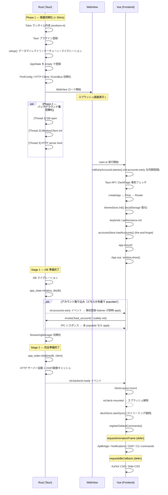
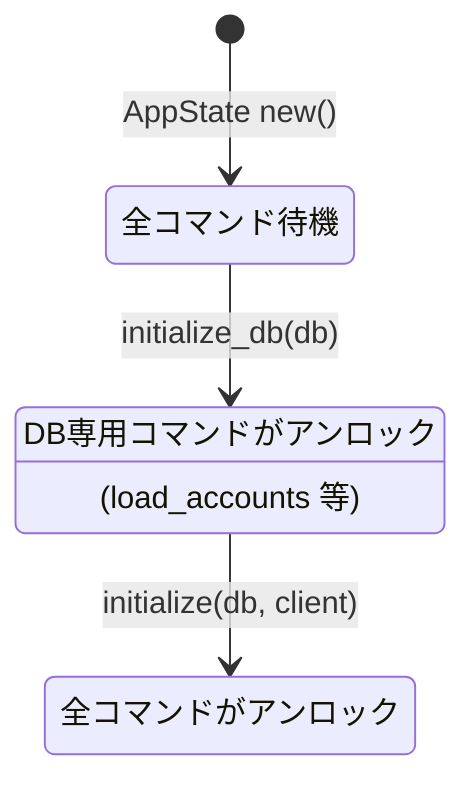
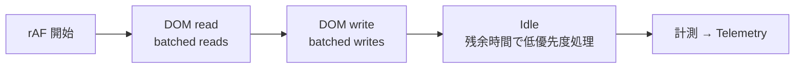
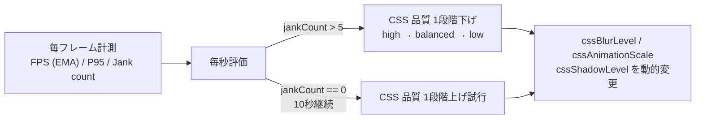

# NoteDeck Development Guide

Multi-server Misskey IDE (Integrated Deck Environment) with fork support. 設計思想・方針は [DESIGN.md](DESIGN.md) を参照。

## Tech Stack

| | |
|---|---|
| Frontend | Vue 3 + TypeScript（Vapor モード移行予定） |
| Backend | Rust (Tauri v2) + [notecli](https://github.com/hitalin/notecli) |
| Build | Vite 8 (Rolldown) + Cargo |
| State | Pinia |
| Local DB | SQLite (rusqlite, WAL mode, FTS5) |
| HTTP | reqwest (Rust, via notecli) |
| WebSocket | tokio-tungstenite (Rust, via notecli) |
| HTTP API | Axum (localhost:19820) |
| Script | AiScript (@syuilo/aiscript) |
| Editor | CodeMirror 6 |
| Linter | Biome |
| Style | SCSS + CSS Modules (`$style`) |
| Test | Vitest + happy-dom |

## Prerequisites

### 推奨: Nix flake（ワンコマンドセットアップ）

[Nix](https://nixos.org/) がインストール済みなら、全ての開発依存が自動で揃います。

```bash
nix develop        # Node.js, pnpm, Rust 等が揃ったシェルに入る
pnpm install       # パッケージインストール
```

[direnv](https://direnv.net/) を使うと `cd` するだけで自動的に環境が有効になります（`.envrc` 同梱）。

### 手動セットアップ

| ツール | インストール |
|--------|-------------|
| [Node.js](https://nodejs.org/) (LTS) | 公式サイト or `nvm install --lts` |
| [pnpm](https://pnpm.io/) | `corepack enable && corepack prepare pnpm@latest --activate` |
| [Rust](https://www.rust-lang.org/) (stable) | `curl --proto '=https' --tlsv1.2 -sSf https://sh.rustup.rs \| sh` |

**Linux のみ**: Tauri のビルドに追加パッケージが必要です。

```bash
# Ubuntu / Debian
sudo apt install libwebkit2gtk-4.1-dev libappindicator3-dev librsvg2-dev patchelf
```

## Getting Started

```bash
# Install dependencies
pnpm install

# Start dev server (Tauri desktop)
pnpm tauri:dev

# Start dev server (browser, for development only)
pnpm dev
```

## Available Scripts

```bash
pnpm dev          # Vite dev server
pnpm tauri:dev    # Tauri dev
pnpm build        # Production build
pnpm tauri:build  # Tauri native build
pnpm test         # Run unit tests
pnpm test:watch   # Run tests in watch mode
pnpm lint         # Lint & format check
pnpm lint:fix     # Lint & format fix
pnpm typecheck    # TypeScript type check
pnpm clean        # Remove build artifacts
```

### テスト構成

テストは 2 プロジェクトに分離（`vitest.config.ts`）:

| プロジェクト | 環境 | ファイルパターン | 用途 |
|------------|------|----------------|------|
| `unit` | Node.js | `*.test.ts` | ロジック・ユーティリティ |
| `dom` | happy-dom | `*.dom.test.ts` | Vue コンポーネント・DOM 操作 |

## Architecture

NoteDeck は **notecli** と **notedeck** の 2 リポジトリで構成されています。

### notecli ([github.com/hitalin/notecli](https://github.com/hitalin/notecli))

Tauri に依存しない Misskey ヘッドレスクライアント。Rust ライブラリ兼 CLI デーモン。

- Misskey HTTP API クライアント、WebSocket ストリーミング、SQLite DB、REST API サーバー
- 単体で `localhost:19820` の HTTP API デーモンとして動作（GUI 不要）
- NoteDeck の Rust バックエンドとして `Cargo.toml` の git 依存で利用される

### notedeck (このリポジトリ)

notecli の上に Tauri v2 + Vue 3 の GUI を載せたクライアント。
対象プラットフォームは Windows / macOS / Linux / Android。

```
src/                        # Vue 3 frontend
├── adapters/               # Server API adapters (Misskey, forks)
│   ├── types.ts            # Shared interfaces (ServerAdapter, ApiAdapter, StreamAdapter)
│   ├── registry.ts         # Adapter factory
│   └── misskey/            # Misskey implementation (IPC via invoke/listen)
├── aiscript/               # AiScript runtime & Misskey Play API
├── commands/               # Command registry, definitions, CLI handlers
├── components/             # Vue components
│   ├── common/             # MkNote, MkPostForm, MkEmoji, CommandPalette, etc.
│   └── deck/               # DeckLayout, DeckColumn, column types
├── composables/            # Vue composables (useNoteFocus, useTimeMachine, etc.)
├── core/                   # Business logic (server detection)
├── data/                   # Static data & constants
├── router/                 # Vue Router definitions
├── stores/                 # Pinia stores (accounts, deck, servers, emojis, theme, etc.)
├── styles/                 # Global CSS (CSS variables)
├── theme/                  # Misskey-compatible theme compiler & applier
├── utils/                  # Shared utilities
└── views/                  # Page components (NoteDetail, UserProfile)

src-tauri/src/              # Rust backend (Tauri 固有部分)
├── lib.rs                  # App setup (tray, plugins, state)
├── commands/               # Tauri IPC command handlers (notecli 呼び出し)
│   ├── mod.rs              # 共通ユーティリティ (validate_host, get_credentials 等)
│   ├── timeline.rs         # タイムライン系コマンド
│   ├── content.rs          # ノート操作系コマンド
│   ├── user.rs             # ユーザー系コマンド
│   ├── messaging.rs        # チャット・DM 系コマンド
│   ├── streaming.rs        # ストリーミング系コマンド
│   ├── settings.rs         # 設定系コマンド
│   ├── admin.rs            # 管理系コマンド
│   ├── auth.rs             # 認証系コマンド
│   ├── enrichment.rs       # OGP・エンリッチメント系コマンド
│   └── utility.rs          # ユーティリティ系コマンド
├── http_server.rs          # Axum HTTP API server (localhost:19820)
├── image_cache.rs          # 3-tier image cache (memory → disk → network)
├── ogp/                    # OGP metadata extraction & cache
├── streaming.rs            # TauriEmitter adapter (FrontendEmitter trait impl)
├── query_bridge.rs         # HTTP API ↔ frontend (Pinia) bridge
├── perf_config.rs          # パフォーマンス設定 (Rust 側)
└── main.rs                 # Entry point
```

Misskey API クライアント・DB・モデル・ストリーミングコアなどの共通ロジックは全て `notecli` クレートにあり、`src-tauri/` には Tauri 固有の薄いラッパーのみ残っています。

### Boot Sequence

NoteDeck は **UI 表示までの時間を最小化** するため、バックエンドの重い初期化をバックグラウンドで行いながらフロントエンドを先行起動する設計になっている。

#### 全体フロー

Rust バックエンドとフロントエンドが並列に動作し、イベントで連携する。



#### Two-stage AppState

バックエンドの初期化を 2 段階に分けて、DB が準備できた時点で一部のコマンドを先行アンロックする仕組み（`src-tauri/src/commands/mod.rs`）。



内部的には `tokio::sync::watch::channel` を 2 本持ち、`db()` は DB チャネルのみ、`client()` はフルチャネルを待機する。これにより `load_accounts` のようなDB専用コマンドは MisskeyClient の初期化を待たずに応答できる。

#### スプラッシュ画面

`index.html` にインラインで定義された `#nd-splash`（ハートビートアニメーション付きロゴ）。

- **表示**: WebView ロード直後（Vue マウント前から表示済み）
- **解除**: `nd:deck-mounted` イベント受信時（DeckLayout の DOM 構築完了時点）
- **フォールバック**: 500ms タイムアウトで強制解除
- **アニメーション**: `opacity: 0` トランジション → `transitionend` で DOM 削除

データ（ノート等）のロード完了は待たず、カラムフレームの描画が完了した時点でスプラッシュを解除する。

#### 起動時の最適化テクニック

| テクニック | 実装箇所 | 効果 |
|-----------|---------|------|
| Two-stage AppState | `commands/mod.rs` | DB 準備次第でアカウント読み込み開始 |
| 早期アカウントイベント | `lib.rs` → `nd:accounts-early` | IPC 往復を待たずにフロントへ通知 |
| 事前登録 listener | `stores/accounts.ts:initEarlyAccountListener` | `main.ts` 最上部で `listen()` を同期登録し、Rust 側 emit を取りこぼさない（Pinia 初期化前でも module-scope バッファに保存） |
| 未ロード時の空状態ガード | `DeckColumn.vue` `requireAccount` prop | カラム本体スロットを `accountsStore.isLoaded` まで抑制し「アカウントが見つかりません」の一瞬のチラつきを防止 |
| 動的 import 事前フェッチ | `main.ts` | DeckPage / カラムチャンクを並列ダウンロード |
| テーマ localStorage 復元 | `themeStore.init()` | ネットワーク不要で FOUC 防止 |
| 3 スレッド並列初期化 | `lib.rs` Phase 2 | DB / Client / HTTP bind を同時実行 |
| 非クリティカル処理の defer | `useDeckInit` | rAF / rIC で初回描画を優先 |

### Multi-Window & Profile Architecture

ウィンドウとプロファイルは**直交する概念**です。

- **プロファイル**: カラム構成・レイアウトの保存単位。データの所有者
- **ウィンドウ**: プロファイルの表示先。同じプロファイルを複数ウィンドウで開ける

```
Profile A ──→ Main Window（windowId なしのカラムを表示）
         └──→ Sub Window 1（windowId = "w1" のカラムを表示）

Profile B ──→ Main Window（プロファイル切り替え時）
```

**設計原則:**

1. プロファイルが変更されたら、そのプロファイルを開いている**全ウィンドウ**がリアクティブに追従する
2. 各ウィンドウは `windowLayout`（computed）で自分に属するカラムだけをフィルタして表示する
3. ウィンドウの作成・破棄はプロファイルのデータに影響しない

**同期方式:** localStorage（全 webview 共有）を SSoT とし、Tauri イベント（`deck:profile-updated`）でキャッシュ無効化を通知。Rust 側に SSoT を移す案も検討したが、localStorage が既に全 webview で共有されており、本質的に同じ構造になるため不採用（[PR #172](https://github.com/hitalin/notedeck/pull/172) で議論）。

### Window / Column Model（[#194](https://github.com/hitalin/notedeck/issues/194)）

ウィンドウとカラムは「ストリーム / 詳細 / ツール」の3分類で役割を分担する。

| 分類 | UI | 用途 | 永続性 |
|------|-----|------|--------|
| **ストリーム** | カラム | 継続的なデータフィード（TL、通知、検索、チャット等） | プロファイルに永続化 |
| **IDE ツール** | カラム | 開発・デバッグ支援（Stream Inspector、Workspace Explorer 等）、ローカル PKM（メモ — `settings/memos/*.md` を Obsidian vault としても開ける） | プロファイルに永続化 |
| **詳細** | ウィンドウ | 特定アイテムの一時的な表示（ノート詳細、プロフィール、フォローリスト） | セッション限り |
| **インスペクタ** | ウィンドウ | Raw JSON 表示・デバッグ（ノート/通知インスペクタ、settings.json エディタ） | セッション限り |
| **ツール** | ウィンドウ | アプリ設定・管理（ログイン、エディタ群、プラグイン、about） | セッション限り |

**Cross-account カラム:**

ストリーム系カラムは `accountId` で動作モードが決まる。

- `accountId: "user-xxx"` → **per-account**（`useColumnSetup` で単一アダプタ）
- `accountId: null` → **cross-account**（`useMultiAccountAdapters` で全アカウント並列取得）

対応済みカラム: 通知、検索、チャット、メンション、ダイレクト、フォローリクエスト。

**ナビバー（VSCode Activity Bar 式）:**

左ナビバーのアイコンはカラムの**トグルボタン**として機能する。クリックでサイドバーカラムを左端（`layout[0]`）に挿入、再クリックで削除。同時に1スロットのみ（`sidebar: true` フラグで管理）。

ナビバーのボタン構成はカスタマイズ可能（設定 → ナビバー）。`NavItem = { type, accountId } | { type: 'divider' }` 構造体でプロファイルに永続化される。

**共通コンポーネント:**

| コンポーネント | 用途 | 使用箇所 |
|-------------|------|---------|
| `ColumnBadges` | サーバー/アカウントバッジ表示 | DeckNavbar, DeckBottomBar, DeckMobileNav |
| `AvatarStack` | cross-account 時のアカウントアバター重ね表示 | AddColumnDialog, カラムヘッダー |
| `EditorTabs` | ビジュアル/コード 2タブ切替（コードタブはデフォルト値との差分のみ表示） | 全エディタ系ウィンドウ共通 |
| `RawJsonView` | Raw JSON 表示（機密マスキング・コピー対応） | NoteInspectorContent, NotificationInspectorContent, UserProfileContent |

**共通 composable:**

| composable | 用途 | 使用箇所 |
|-----------|------|---------|
| `usePointerReorder` | Pointer イベントによるドラッグ&ドロップ並び替え（軸指定対応） | NavEditorContent, ProfileEditorContent |
| `useCrossAccountNotes` | 複数アカウントからのノート並列取得・統合・重複排除 | DeckMentionsColumn, DeckSpecifiedColumn |
| `useVerticalResize` | 上下分割ペインのドラッグリサイズ（高さ制限付き） | DeckStreamInspectorColumn, DeckAiScriptColumn |
| `useSensitiveMask` | 機密フィールドのマスキング表示・トグル reveal | NoteInspectorContent, NotificationInspectorContent, UserProfileContent |

**アイコン・ラベルの一元定義:**

`useColumnTabs.ts` の `COLUMN_ICONS` / `COLUMN_LABELS` がカラムタイプのアイコンとラベルの SSoT。ナビバー、ボトムバー、エディタすべてがこれを参照する。

### Vue Vapor モード（[#52](https://github.com/hitalin/notedeck/issues/52)）— 移行準備完了

Vue 3.6 の Vapor モード（仮想DOMレス・コンパイル時DOM操作）への移行準備が**完了**。
既知のブロッカーはゼロ。Vue 3.6 リリース時にそのまま有効化可能。

**コーディング制約（新規コンポーネントでも維持すること）:**

- `<script setup>` 必須 — Options API / `export default {}` 禁止
- `h()` / JSX 禁止 — テンプレート構文のみ使用
- カスタムディレクティブ禁止 — composable で代替
- mixins / extends 禁止 — composable で代替
- `getCurrentInstance()` 禁止 — provide/inject または composable で代替
- `app.config.globalProperties` 禁止 — provide/inject で代替
- `<Transition>` / `<Teleport>` 禁止 — `useVaporTransition` / `usePortal` で代替

**対応済み:**

- `<Transition>` / `<TransitionGroup>`: 全22箇所を composable + CSS `@keyframes` に移行
- `<Teleport>`: 全箇所を `usePortal()` composable に移行済み
- `app.config.errorHandler`: `onErrorCaptured` composable に移行
- `<Suspense>` / `<KeepAlive>`: 使用なし
- `__VUE_OPTIONS_API__: false` 設定済み（vite.config.ts）

### Styling

コンポーネントのスタイリングには **CSS Modules + SCSS** を使用しています。

```vue
<template>
  <div :class="$style.container">...</div>
</template>

<style module lang="scss">
.container {
  display: flex;
}
</style>
```

- `<style module lang="scss">` で CSS Modules として定義し、テンプレートから `$style.xxx` で参照
- `vite.config.ts` で `localsConvention: 'camelCaseOnly'` を設定済み（`kebab-case` → `camelCase` 自動変換）
- グローバルな CSS 変数は `src/styles/global.css` で定義
- モバイル/デスクトップの切り替えは CSS の `display` ではなく `v-if` で制御

### キーボード操作（アクセシビリティ）

すべての UI 操作がキーボードだけで完結できることを目標とする。以下の composable を利用する。

#### `useFocusTrap(containerRef, options?)`

ダイアログ・モーダル・ポップアップで **Tab をコンテナ内にトラップ** + **Esc で閉じる** + **初期フォーカス設定**。

```ts
const dialogRef = ref<HTMLElement | null>(null)
const { activate, deactivate } = useFocusTrap(dialogRef, {
  initialFocus: 'button.primary', // CSSセレクタ（省略時は最初のfocusable要素）
  onEscape: () => close(),
})

// ダイアログ表示時: nextTick(activate)
// ダイアログ非表示時: deactivate()
```

**適用済み**: `AppConfirm`, `AddColumnDialog`, `NoteReactionPickerPopup`

#### `useMenuKeyboard(options)`

メニュー・ポップアップで **Arrow Up/Down ナビ** + **Home/End** + **Enter 選択** + **Esc 閉じ**。

```ts
const menuRef = ref<HTMLElement | null>(null)
const { activate, deactivate } = useMenuKeyboard({
  containerRef: menuRef,
  itemSelector: 'button',  // ナビ対象のCSSセレクタ
  onClose: () => close(),
})
```

**適用済み**: `PopupMenu`（NoteMoreMenu 等の全派生に波及）, `DeckSettingsMenu`, `DeckProfileMenu`, `NavAccountMenu`

#### 新規コンポーネント作成時のルール

- **ダイアログ/モーダル** → `useFocusTrap` を適用（Esc 閉じ + Tab トラップ必須）
- **ポップアップメニュー** → `PopupMenu` を使えば自動対応。手動メニューは `useMenuKeyboard` を適用
- **クリック専用の `<div>`** → `tabindex="0"` + `@keydown.enter` を追加してキーボードから操作可能にする
- **新機能** → コマンドパレット（`src/commands/definitions.ts`）へのコマンド登録を検討

### AI 設定

| ファイル | 役割 |
|---------|------|
| `src/components/window/AiSettingsContent.vue` | AI 設定ウィンドウ (AI 接続ピッカー・モデル・権限・データソース・HEARTBEAT) |
| `src/defaults/ai.json5` | 初期設定 (`activeConnectionId` / `models` / 権限 preset / dataSources preset / heartbeat block) |
| `src/composables/useAiConfig.ts` | `AiConfig` schema + normalize / merge + Vault 接続移行 |

**永続化:**
- AI 設定は `ai.json5` に格納 (`useAiConfig` が単一 source of truth)。`activeConnectionId` + `models` のみで、API キー / endpoint は持たない
- **API キーは Secret Vault (OS キーチェーン)** に統合。詳細は [AI Credentials](#ai-credentials)

**対応プロバイダー:** Anthropic Messages 互換 / OpenAI Chat Completions 互換 (OpenAI / OpenRouter / Groq / 自前 LLM ゲートウェイ等)。Vault 接続として登録し、AI 設定でピッカー選択する。詳細は [AI Chat Streaming](#ai-chat-streaming)。

**主要セクション:**
- 権限 (`permissions: PermissionsConfig`): preset (`readonly` / `safe` / `full` / `custom`) + 個別 toggle。AI tool calling 時に capability の required permissions と照合
- データソース (`dataSources: DataSourcesConfig`): system prompt の `<notedeck-context>` ブロックに含める情報の制御 (現在のアカウント / カラム / 可視ノート / 会話履歴 / memos)
- HEARTBEAT (`heartbeat: HeartbeatConfig`): 詳細は [HEARTBEAT Daemon](#heartbeat-daemon-411)

**permission の動的反映 (再起動不要):**
- `useAiConfig` を module-scope singleton 化し、`dispatchCapability` の直前に `reloadAiConfig()` を呼ぶ
- 外部エディタで `settings.json` を編集しても、次回 dispatch 時に最新値で照合される
- AI 設定 UI からの変更も同じ singleton に流れるため即時反映

**capability の `aiTool:false` ガード:**
- skill / widget / plugin / theme の **write 系 capability** (例: `skills.replaceSection`, `widgets.create`, `plugins.update`, `theme.create`) は `aiTool: false` 属性で **AI tool calling のスキーマに含まれない**
- AI から呼べる状態にするには capability ごとに個別有効化が必要 (自己改変系の安全弁)
- `requiresConfirmation: true` の capability は dispatch 直前に **確認ダイアログ** で enforce (引数 JSON は code block + Shiki シンタックスハイライトで表示)

### AI Capability Registry

**ファイル:** `src/capabilities/`

`Capability` は `Command` を拡張した構造 (`signature` / `permissions` / `requiresConfirmation` / `aiTool`) で、**コマンドパレット / HTTP API / CLI / AiScript (`Nd:call`) / AI tool calling** の 5 経路が同じ registry を共有する。

**builtin は v0.24.0 時点で 144 個 / 39 subject** (`src/capabilities/builtins/` 配下の unique id 集計)。subject 別のグループは [SKILLS.md §4.0](SKILLS.md#40-capability-一覧) を参照。実装は `src/capabilities/builtins/<subject>.ts`。

**API capability の実装方針**: 原則 `ApiAdapter` (`src/adapters/types.ts`) 経由で実装する (フォーク対応の抽象化を維持するため)。Tauri commands 直呼びは `registry.*` / `chat.*` のように Misskey 専用機能で他フォーク対応想定が無い場合のみ許容。詳細は [SKILLS.md §4.0.2](SKILLS.md#402-adapter-経由--tauri-直呼び-の使い分け) 参照。

**AI 用 tool schema は `capability.signature` (zod) から自動変換**:
- Anthropic `tools[]` / OpenAI `functions[]` block を `src/capabilities/toolSchema.ts` で生成
- `.` を含む id は `^[a-zA-Z0-9_-]{1,128}$` 制約のため `_` に変換 (例: `time.now` → `time_now`)
- dispatcher で逆引きするため AI / プラグイン作者は意識不要

**編集履歴 + revert:**
- skill / widget / plugin / theme の各カテゴリで `*.history` / `*.revert` capability を提供
- 編集前のスナップショットをリング (10 件) で sidecar 管理 (`src/utils/historyFs.ts`)
- AI が誤って編集しても 1 capability で巻き戻せる

**AiScript からの拡張:**
- `Nd:register_command(id, label, fn, options)` の `options` に `signature` / `permissions` / `aiTool` / `requiresConfirmation` を渡すと **capability registry にもミラー登録**され、即 5 経路に公開される
- `Nd:capabilities()` で registry にある capability の宣言情報を列挙 (プラグインの自己発見)
- `Nd:on(name, handler)` で `account:switch` / `column:added` / `column:removed` / `streaming:status` / `note:new` / `notification:new` を購読

### Theme 管理

**ファイル:**
- `src/stores/theme.ts` — `manualMode` (`'light' | 'dark' | null`) + `isCurrentDark` の合流点
- `src/capabilities/builtins/theme.ts` — theme.* capability 群

**per-account 紐付け:** `theme.create` は作成時に当該 account の `installedFor` に自動追加。プロファイル切替で適用範囲が切り替わる (詳細は [DESIGN.md] の「per-account 設定」)。

**自動モード切替:** `theme.apply(id, mode?)` は明示 mode 指定がない場合でも、テーマの base (`light` / `dark`) に応じて `manualMode` を自動切替し、画面が即時更新される。AI が theme 作成 → apply のフローで「画面が変わる」体験を成立させるための仕組み。


### パフォーマンス設定

NoteDeck のパフォーマンス関連パラメータはすべてユーザーが調整可能。設定エディタ UI とファイルベースのバックアップに対応している。

| ファイル | 役割 |
|---------|------|
| `src/stores/performance.ts` | Pinia ストア（`PerformanceConfig` 型定義・Rust 同期） |
| `src/components/window/PerformanceEditorContent.vue` | 設定エディタ UI |
| `src/defaults/performance.json5` | デフォルト値（スライダー中央値と一致） |
| `src/utils/settingsFs.ts` | Tauri ファイル I/O |

**カテゴリ:** 絵文字キャッシュ / ノート / パースキャッシュ / リアルタイム / バックエンド（Rust）

**操作モデル:** 両端「省メモリ ↔ 高性能」の **スライダー** で線形補間する。固定プリセット名 (preset 列挙) は持たない。中央値が `src/defaults/performance.json5` と同値。

**永続化:**
- 設定は `settings.json`（`performance.*` キー）に一元化（`useSettingsStore` が単一 source of truth）
- デフォルト値と同じキーはオーバーライドに含めない（差分のみ保存）
- バックエンド（Rust）側のパラメータは `invoke('update_performance_config')` で即時同期
- 旧 `performance.json5` は初回起動時の移行読込のみ。新規書込は `settings.json` のみ

### レンダリングパフォーマンス

SNS クライアントに必要な3つのパフォーマンス基盤を実装済み。

#### CSS レンダリング規約

- **Compositor-only アニメーション**: `transform`, `opacity`, `translate`, `scale`, `rotate` のみ。`width`/`height`/`top`/`left` 等は禁止（全コンポーネント監査済み）
  - タブインジケータ: `left`/`width` → `translate`/`scale`（`useTabIndicator.ts`）
  - 投票バー: `width` → `scaleX` + CSS 変数（`MkPoll.vue`）
  - カラムドラッグ: `style.left`/`top` → `translate` + 幅キャッシュ（`useColumnDrag.ts`）
- **Layout Thrashing 回避**: DOM 読み取り（`offsetHeight` 等）と書き込みを交互に行わない
- **CSS Containment**: スクロール内アイテムに `contain: layout style paint` + `content-visibility: auto`（24+ コンポーネントで適用済み）
- **ペイント誘発プロパティ**: `box-shadow`/`border-radius`/`clip-path`/`backdrop-filter` のアニメーション禁止（静的使用は可）
- **CSS Custom Properties 優先**: JS から直接 `style.top` 等を操作せず `setProperty('--nd-offset', ...)` 経由

#### Frame Scheduler — DOM read/write バッチング

fastdom と同じ考え方で、DOM 読み取りと書き込みをフェーズ別に分離して Layout Thrashing を回避する。ワークがないフレームではループを停止し、CPU ウェイクアップを避ける（常時ループではなくイベント駆動）。



- `src/engine/frameEngine.ts` — 5フェーズ RAF ループ、フレーム予算管理、Jank 検出
- `src/composables/useFrameScheduler.ts` — Vue composable ラッパー
- 使用例: `useTabIndicator`（read/write 分離）、`useStreamingBatch`（write フェーズでノートバッチ投入）

#### Adaptive Quality — CSS 品質の自動調整

Jank（33ms 超のフレーム）を検出し、CSS 描画プロパティ（blur, shadow, animation speed）のみを動的に調整する。キャッシュサイズやノート保持数などフレームパフォーマンスと無関係な設定は変更しない。



- `src/engine/telemetry/frameTelemetry.ts` — P95 計測、自動品質調整（low/balanced/high）
- `src/composables/useAdaptiveQuality.ts` — デバイス検出（CPU, RAM, prefers-reduced-motion）
- 開発時のみ `DevFrameOverlay`（Ctrl+Shift+F）で FPS/フレーム時間を可視化

#### ディレクトリ構成

```
src/engine/
├── index.ts                    # エクスポート
├── frameEngine.ts              # DOM read/write バッチスケジューラ
└── telemetry/
    └── frameTelemetry.ts       # フレーム監視・品質自動調整
```

### Build

Vite 8 (Rolldown + OXC ベース) を使用。`vite.config.ts` で以下のカスタムプラグインを定義：

- **stripUnusedFonts** — 未使用フォント形式（woff, ttf）をビルドから除外
- **subsetTablerIcons** — ソースコードから使用中のアイコンを検出し、CSS ルールとフォントをサブセット化

### Guest Mode & Logout Fallback

NoteDeck はトークンを持たないユーザーでも公開タイムラインを閲覧できます。

#### ゲストモードとログアウト済みアカウント

| | ゲスト | ログアウト済み |
|---|---|---|
| **userId** | `__guest__`（固定値） | 正規のユーザー ID |
| **hasToken** | `false` | `false` |
| **カラム・設定** | 一時的 | 保持される |
| **UI** | 操作ボタンをグレーアウト | 赤い「ログアウト中」バナー + 再ログイン促進 |

#### Rust バックエンド（`src-tauri/src/commands/`）

- **`get_credentials_or_anon()`** — トークンがあればそのまま、なければ `(host, "")` を返す。notecli が空トークンを検知して公開 API を呼び出す
- **`create_guest_account()`** — `userId = "__guest__"`, `token = ""` のアカウントを DB に作成
- **`logout_account()`** — トークンのみ削除し、アカウント記録と設定は保持

公開 API 対応のコマンドは `get_credentials_or_anon()` を使用し、認証必須のコマンド（投稿・リアクションなど）は従来通り `get_credentials()` を使用します。

#### フロントエンド

| ファイル | 役割 |
|---------|------|
| `src/stores/accounts.ts` | `GUEST_USER_ID`, `isGuestAccount()` |
| `src/composables/useAccountMode.ts` | `isGuest`, `canInteract` computed |
| `src/utils/loginPrompt.ts` | `showLoginPrompt()` — ログイン促進トースト |

ゲスト / ログアウト時の操作ボタン（リアクション・リプライ・リノート）は disabled になり、クリックすると `showLoginPrompt()` でログイン促進トーストを表示します。

#### 新しい API コマンドを追加するとき

- **公開 API**（認証不要）→ `get_credentials_or_anon()` を使う
- **認証必須 API** → `get_credentials()` を使う

### AI Credentials

AI プロバイダー (Anthropic / OpenAI / OpenAI 互換) の API キーは **Secret Vault ([#564](#secret-vault-564))** に統合されています。AI 設定は「どの Vault 接続を使うか」(`activeConnectionId`) と「接続ごとのモデル名」(`models`) だけを `ai.json5` に持ち、endpoint / API キー / protocol は Vault 接続から Rust 側で解決します。フロントエンド・AI はキー本体に**触れません** (credential proxy モデル)。

#### データの所在

| 項目 | 場所 |
|------|------|
| API キー | OS キーチェーン (Vault 接続の secret slot `vault/v1/<conn_id>/primary`) |
| endpoint / protocol / 認証方式 | `connections.json` の `Connection` (Rust が source of truth) |
| 使用する接続 + モデル名 | `ai.json5` の `activeConnectionId` + `models: { [connectionId]: model }` |

AI プロバイダーとして使える接続は `Connection.protocol` (`anthropic` / `openai-compat`) が `Some(_)` のもの。AI 設定のピッカーはこの接続のみを表示し、`ai_chat.rs` の SSE パース分岐にもこの `protocol` を使います。

#### 旧 `ai.<provider>` キーチェーンからの移行

初回起動時、`ai.json5` に旧 provider 系フィールド (`provider` / `anthropic` / `openai` / `custom`) が残っていれば一度だけ自動移行します (`useAiConfig.ts` の `migrateProvidersToVault`)。

1. `ai_migrate_provider_to_vault(provider, name, baseUrl, protocol)` (`src-tauri/src/commands/vault.rs`) が旧 `ai.<provider>` キーチェーンエントリーを読み、Vault 接続 (`origin = External`, `externalSource = "ai-provider"`) を作成して secret を移し替え、旧エントリーを削除する。キーチェーンに該当エントリーが無ければ `None` を返す。
2. フロント側が返ってきた接続 id を `models` / `activeConnectionId` に記録し、provider 系フィールドを含まない形で `ai.json5` を書き戻す → 次回以降は移行をスキップ。

#### フロントエンド

| ファイル | 役割 |
|---------|------|
| `src/composables/useAiConfig.ts` | `AiConfig` schema (`activeConnectionId` + `models`)、`resolveAiConnection()`、`migrateProvidersToVault()` |
| `src/components/window/AiSettingsContent.vue` | AI 接続ピッカー (Vault 接続のラジオリスト) + モデル名入力。接続の追加・編集は「接続」ウィンドウへ誘導 |
| `src/data/connectionTemplates.ts` | 内蔵テンプレ (OpenAI / Anthropic / OpenRouter) に `protocol` / `defaultModel` を定義 |
| `src/defaults/ai.json5` | `activeConnectionId` + `models` スキーマ。**API キー / endpoint は含まない** |

#### 新しい AI プロバイダーを追加するとき

ユーザーは「接続」ウィンドウから手動で任意の OpenAI 互換 / Anthropic 互換エンドポイントを登録できます。内蔵テンプレを増やす場合は `src/data/connectionTemplates.ts` の `BUILTIN_TEMPLATES` に `protocol` 付きでエントリーを追加するだけ。新しい SSE プロトコルを足す場合のみ `ConnectionProtocol` enum (`src-tauri/src/vault/model.rs`) と `ai_chat.rs` の dispatch に分岐を追加します。

### Secret Vault ([#564](https://github.com/hitalin/notedeck/issues/564))

AiScript / AI / プラグインが**任意の外部サービス** (GitHub / Linear / 任意の Web API) に接続するための汎用シークレット基盤。Misskey トークン・AI API キーで確立済みの credential proxy モデル (Rust 側で注入、JS / AI には raw secret を渡さない) を任意の外部 API へ拡張する。仕様は 5 round の adversarial review で確定 (170+ 件の指摘を反映、[Issue #564](https://github.com/hitalin/notedeck/issues/564) 参照)。

#### データモデル

| レイヤー | 場所 | 内容 |
|---------|------|------|
| metadata | `<configDir>/notedeck/connections.json` | 接続定義。Rust が source of truth として読み書き (atomic write: 同一 dir への一時ファイル + rename)。`schemaVersion` + `connections[]` |
| secret | OS キーチェーン | `service` = `notedeck`、`account` = `vault/v1/<conn_id>/<slot>`。`/` 区切りの構造化 path で既存エントリーと名前空間分離。slot で OAuth (v2) 拡張余地を確保 |

`Connection` フィールド: `id` (ULID) / `name` / `baseUrl` (scheme+host+path のみ、query/userinfo/fragment 拒否) / `kind` ('outbound') / `authType` / `allowedHosts` / `accountScope` / `origin` / `templateId` / `aiVisible` / `slots` / `notes` 等。`authType` は判別共用体: `{ kind: 'bearer' }` / `{ kind: 'header', name }` / `{ kind: 'query', param }` / `{ kind: 'basic', username }`。

#### Rust モジュール (`src-tauri/src/vault/`)

| ファイル | 役割 |
|---------|------|
| `model.rs` | `Connection` データモデル、slot / conn_id バリデーション |
| `backend.rs` | `SecretBackend` trait (同期 / dyn-safe)。Android 用 backend を v2 でこの trait に追加 |
| `keychain_backend.rs` | `notecli::keychain` を使う `KeychainBackend` |
| `connections_store.rs` | `connections.json` の atomic read/write |
| `auth_inject.rs` | bearer/header/query/basic の注入、呼び出し側の危険ヘッダー除去 |
| `ssrf.rs` | DNS pinning resolver + redirect 各 hop の host 再検証 |
| `redaction.rs` | レスポンスからの secret redaction + 機密ヘッダー drop |
| `fetch.rs` | `vault_fetch` の本体 |
| `error.rs` | `VaultError` (specta::Type で型生成) |

#### Tauri コマンド (`src-tauri/src/commands/vault.rs`)

12 コマンド: `vault_list_connections` / `vault_get_connection` / `vault_upsert_connection` / `vault_upsert_connection_with_secret` / `vault_set_secret` / `vault_get_secret_status` / `vault_delete_secret` / `vault_delete_connection` / `vault_set_ai_visible` / `vault_fetch` / `vault_test_connection` / `ai_migrate_provider_to_vault`。全コマンド入口で `assert_main_window` (main ウィンドウ限定) + `validate_slot` + `validate_conn_id`。secret は `secrecy::SecretString` で扱い、最小長 16 文字を強制。

#### `vault.fetch` のセキュリティ

- **SSRF**: HTTP/1.1 only、`path` は baseUrl 相対のみ (絶対 URL / protocol-relative 拒否)、redirect 各 hop で URL/IP/allowedHosts 再検証、DNS resolver は fetch スコープで共有 (rebinding 防御)、IP deny rules (private/loopback/link-local/multicast、`commands::http` から再利用)、`no_proxy()`
- **redaction**: 注入した secret を literal memmem で `<vault-redacted-<nonce>>` に置換 (per-fetch nonce で confuse 攻撃を防ぐ)、`Set-Cookie` / `Authorization` 等の機密ヘッダー drop、レスポンス body は 500 KiB でストリーミング打ち切り
- **型安全**: secret は `secrecy::SecretString` で扱い、`Connection` (メタデータのみ、secret なし) と分離

#### AI 統合

- `vault.fetch` は capability registry に登録 (`aiTool: true`, permission `vault.use`, `requiresConfirmation: true`)。AI / AiScript / コマンドパレットから呼べる
- `aiVisible` toggle (接続単位、default OFF) で AI 開示を制御。`vault.fetch` capability は `aiVisible: true` の接続のみ `connectionRef` (name / id) で解決
- AI の system prompt に `<available-connections>` ブロックを注入 (`aiVisible` な接続の name / baseUrl / auth のみ、secret / id は出さない)
- permission `vault.use` は preset readonly/safe = false、full = true。HIGH_RISK 指定

#### v1 スコープ外 (後続)

file lock / rate limit / `vault.manage` 権限 / error 3 値正規化 / latency 量子化 / confirm batching / CLI (`notecli vault`) / export-import / audit log は v1.x 以降。OAuth 2 / Webhook (inbound) は v2 以降 ([Issue #564](https://github.com/hitalin/notedeck/issues/564) 参照)。

**AI provider key の Vault 統合は完了済み** — AI プロバイダーの API キーは Vault 接続 (`protocol` 付き) に統合され、`ai_chat_send` は `connection_id` から endpoint / key / protocol を解決する。詳細は [AI Credentials](#ai-credentials)。

#### Tauri コマンド追補

`ai_migrate_provider_to_vault(provider, name, baseUrl, protocol)` — 旧 `ai.<provider>` キーチェーンを Vault 接続へ移行 (`origin = External`, `externalSource = "ai-provider"`)。`vault.rs` に定義、main ウィンドウ限定。

### AI Chat Streaming

`DeckAiColumn` は `ai_chat_send` コマンド経由で実 LLM にリクエストを送り、サーバーからのストリーミング応答を `nd:ai-chat-event` でフロントへ流す。

#### 対応プロトコル (OpenAI 互換 / Anthropic Messages 互換)

`ai_chat_send` は `connection_id` を受け取り、Vault 接続から endpoint / API キー / `protocol` を解決して dispatch する。

| `ConnectionProtocol` | URL パターン | 認証 | プロトコル |
|----------------------|-------------|------|-----------|
| `anthropic` | `<baseUrl>/v1/messages` | `x-api-key` + `anthropic-version: 2023-06-01` | Anthropic Messages API (SSE: `content_block_delta` / `delta.text`) |
| `openai-compat` | `<baseUrl>/chat/completions` | `Authorization: Bearer <key>` | OpenAI Chat Completions 互換 (SSE: `data: {...}` + `[DONE]`)。OpenAI / OpenRouter / Groq / 自前ゲートウェイ等 |

endpoint は接続の `baseUrl`、API キーは Vault の secret slot `primary` から Rust 側で取得する。フロントは決してキー本体を持たない (詳細は [AI Credentials](#ai-credentials))。

#### イベントフロー

```
┌─ Vue (DeckAiColumn) ─────┐
│ aiChat.sendMessage(req)  │
│   stream_id = uuid()     │
│   listen('nd:ai-chat-event')
│   commands.aiChatSend(req)│
└──────────┬───────────────┘
           │ invoke
           ▼
┌─ Rust (commands/ai_chat.rs) ────┐
│ tauri::async_runtime::spawn {   │
│   vault: 接続から endpoint/key/protocol を解決 │
│   reqwest POST + SSE stream      │
│   for chunk → emit("nd:ai-chat-event", { stream_id, kind: "delta", text }) │
│   on done  → emit({kind: "done"})│
│   on error → emit({kind: "error", error}) │
│ }                                │
└──────────────────────────────────┘
```

`stream_id` で複数列の並行ストリームを区別する。

#### Frontend composables

| ファイル | 役割 |
|---------|------|
| `src/composables/useAiChat.ts` | `sendMessage(opts)` で 1 回の chat 呼び出し。`currentText` ref が delta で更新される。`cancel()` で進行中 stream を中断 (Rust 側 `ai_chat_cancel` 経由) |
| `src/composables/useAiConversation.ts` | 指定 sessionId のメッセージ配列に対する reactive な参照を返す薄いラッパー。本文の永続化と debounce は `useAiSessionsStore` 側で集中管理 |
| `src/stores/aiSessions.ts` | AI セッション (`notedeck/sessions/<YYYYMMDDhhmmss>.json5`) の集中管理。メタは全件常駐、本文は遅延ロード、debounce 500ms 永続化。`createNew` / `updateMessages` / `setTitle` / `deleteSession` / `listSorted` を提供 |
| `src/stores/skills.ts` の `composedSystemPrompt()` | `mode: 'always'` + active な skill body を結合した system prompt |
| `src/utils/aiSessionId.ts` | Zettelkasten ID (`YYYYMMDDhhmmss`) 生成。同一秒衝突は `a`, `b`, `c`, ... サフィックスで回避 |
| `src/utils/aiSessionTitle.ts` | `timestampTitle(now)` 初期プレースホルダー / `generateSessionTitle()` 決定論的フォールバック |

#### セッション管理 UI (DeckAiColumn)

`DeckAiColumn` は単一カラム内の master-detail で動作する:

- **viewMode = 'sessions'**: セッション一覧 (グループ: 今日/昨日/過去 7 日/それ以前)、検索バー (タイトル絞込)、行ホバーで rename / delete インラインボタン
- **viewMode = 'chat'**: 選択中セッションのメッセージ表示 + 入力欄。ストリーミング中は送信ボタンが停止ボタンに切替

セッションはカラムから独立した**グローバル資産**で、`column.aiCurrentSessionId` が「現在表示中の sessionId」を保持する。`null` ならセッション一覧を表示。同じ sessionId を 2 カラムで開いても破綻しない (`useAiSessionsStore` 経由で書込先は 1 ファイル)。

セッションタイトルは初回 round (user 発話 → assistant 応答) 完了後に AI で自動生成される。失敗時は `timestampTitle` (`<YYYY-MM-DD HH:mm> のチャット`) がそのまま残る。AI への依頼は別 `useAiChat` インスタンス (`titleGen`) で会話を 1 つの user メッセージに集約して投げる (Anthropic は last message が assistant role だと続行扱いになるため)。

#### エラー UI

| 状況 | 表示 |
|------|------|
| 401 / 403 | 「APIキーが無効です」(設定画面誘導) |
| 429 | 「レート制限に達しました」 |
| 5xx / network | サーバーエラー / 接続失敗 |

エラーは最後の assistant メッセージに `⚠️ <message>` として表示し、履歴にも保存される。

### HEARTBEAT Daemon ([#411](https://github.com/hitalin/notedeck/issues/411))

OpenClaw HEARTBEAT 仕様 ([docs.openclaw.ai/gateway/heartbeat](https://docs.openclaw.ai/gateway/heartbeat)) に揃えた **アプリ起動中ずっと走る global daemon**。AI カラムの有無 / 開いているカラム数に依存しない (= per-column scope ではない)。

#### アーキテクチャ

```
┌─ Tauri App プロセス ──────────────────────────────────┐
│  [Rust] HeartbeatScheduler (Option<ScheduledTask>)    │
│    heartbeat_configure(intervalMinutes)               │
│    heartbeat_unconfigure() / heartbeat_trigger_now()  │
│    tick → emit('nd:ai-heartbeat-tick')                │
│                                                        │
│  [JS] useHeartbeatDaemon (App.vue で 1 mount)         │
│    listen → AI inference → suppression → session append│
│                                                        │
│  [出力先] AiSessionKind='heartbeat' な session 1 個   │
│    AI カラムの session ドロワーに表示 (最上位 pin)    │
└───────────────────────────────────────────────────────┘
```

#### 主要ファイル

| ファイル | 役割 |
|---------|------|
| `src-tauri/src/commands/heartbeat.rs` | global single scheduler (HashMap ではなく Option)。tokio::time::interval で tick を emit。column_id 引数なし |
| `src/composables/useHeartbeatDaemon.ts` | App-level singleton。Rust scheduler 制御 + tick listener + AI inference + suppression + session append + AI タイトル要約 + silent fail UX |
| `src/composables/useAiConfig.ts` | `HeartbeatConfig`: enabled / intervalMinutes (1〜1440) / target / permissions (PermissionsConfig) |
| `src/stores/skills.ts` | `SkillMeta.mode === 'heartbeat'` な skill が daemon で実行される (skillsStore.heartbeatSkills computed) |

#### Skill 駆動

OpenClaw `HEARTBEAT.md` の `tasks:` に相当するのが NoteDeck の `mode: heartbeat` skill。MisStore 配布の skill (例: `ai-cost-pulse` / `server-pulse` / `time-capsule` / `mindful-pulse`) は frontmatter で `mode: heartbeat` を宣言しておけば install 直後に daemon が拾う。tick ごとに全 heartbeat skill body を結合して 1 回の AI inference にまとめて投げる。

#### Suppression (`HEARTBEAT_OK`)

`applyHeartbeatSuppression()` が AI 応答の先頭/末尾の `HEARTBEAT_OK` トークンを剥がし、残りが `HEARTBEAT_ACK_MAX_CHARS=300` 以下なら全体 drop (= 履歴に残さない)。OpenClaw `ackMaxChars` と同じ数値・同じ挙動。長文 alert (>300 字) は通常の assistant message として heartbeat session に append される。

#### Target Routing

`config.heartbeat.target` で 3 mode:
- `'auto'` (default): kind='heartbeat' な session を find or auto-create + 永続使用 (1 個だけを使い回す)
- `'none'`: session に append しない (silent log only)
- `<session id>`: 既存 session に明示 pin

新規 session 作成時は `timestampTitle(now, 'のHEARTBEAT')` でプレースホルダー → 初回 tick の応答内容を AI で要約してタイトル上書き (失敗時は timestamp が残る)。

#### Permissions (HEARTBEAT 中の権限)

`config.heartbeat.permissions: PermissionsConfig` で chat (`config.permissions`) とは独立管理。default `'readonly'` preset で write 系 / external network 全部 deny。

daemon の `runAiInference()` で `resolvePermissions()` した granted map と各 capability の `permissions: PermissionKey[]` (required) を照合し、満たさない capability を AI に渡す tool 一覧から除外する。AI が write 系 capability を呼ぼうとしても tool 自体が見えない仕組み。

#### Silent Fail Prevention

provider error / network error / 429 等で daemon が無言で動かなくなる問題を防ぐ:

- `runOnce()` 内の AI inference を try-catch で保護
- 失敗時: `⚠ HEARTBEAT 失敗 (source=...): <msg>` を heartbeat session に append (target='none' は除く)
- 連続 `MAX_CONSECUTIVE_FAILURES=3` 回失敗で daemon `enabled = false` 自動切替 + `useToast().show('HEARTBEAT を停止しました...', 'warning')`
- 1 回成功で counter リセット

#### Session Drawer 表示 (DeckAiColumn)

session 一覧では `AiSessionKind` 別の icon 統一 (`chat` → `ti-message-circle` / `heartbeat` → `ti-activity-heartbeat` / `command` → `ti-terminal-2` / `task` → `ti-checklist`)。kind='heartbeat' な session は専用「💓 HEARTBEAT」section に最上位 pin され、行は accent カラー強調 (avatar 円 + 左 2px border)。

### Fork support

NoteDeck の対応範囲は **Misskey 本家および「Misskey を名乗り続けるフォーク」** です（yamisskey, misskey-tepura 等）。
**Misskey から名前が別物になったフォーク（Sharkey, CherryPick, Firefish, Iceshrimp 等）は対応していません。**

#### 自動検出で動くもの（コード変更不要）

Misskey を名乗るフォークは追加の設定なしで自動的に認識されます。以下の機能は動的に検出されるため、コード変更なしで動作します:

- **カスタムタイムライン**（bubble, yami, hanami 等）— `/api/endpoints` スキャンで自動検出（`src/utils/customTimelines.ts`）
- **モードフラグ**（`isInYamiMode`, `isNoteInYamiMode` 等）— ポリシー API から動的に検出
- **タイムラインフィルター**（`withBots`, `withSensitive` 等）— ポリシー API で可用性を判定

#### フォーク固有の adapter 対応を追加する

フォーク固有の機能が動的検出では不十分な場合（静的な capability 宣言が必要な場合等）、adapter パターンで対応できます。

**ServerSoftware は `owner/repo` 形式**で管理されます。サーバーの識別には nodeinfo 2.1 の `software.repository` フィールド（GitHub URL）を優先し、`software.name` をフォールバックに使います。

**手順:**

1. `src/adapters/types.ts` — `ServerSoftware` 型にリテラルを追加

```typescript
export type ServerSoftware =
  | 'misskey-dev/misskey'
  | 'your-org/your-fork'   // ← 追加
  | 'unknown'
```

2. `src/adapters/registry.ts` — `resolveSoftware()` に検出ルールを追加

```typescript
// repository URL による検出（nodeinfo 2.1）
if (ownerRepo === 'your-org/your-fork') return 'your-org/your-fork'
// software.name によるフォールバック（nodeinfo 2.0）
if (n === 'your-fork-name') return 'your-org/your-fork'
```

3. `src/stores/servers.ts` — `KNOWN_SOFTWARE` セットに追加

4. `src/core/server.ts` — `detectFeatures()` にフォーク固有の capability を設定

```typescript
if (software === 'your-org/your-fork') {
  features.yourFeature = true
}
```

5. カスタムタイムラインのアイコンを追加する場合は `src/utils/customTimelines.ts` の `CUSTOM_TL_ICONS` に SVG パスを追加

**PR を出す前に:**
- `pnpm lint && pnpm typecheck && pnpm test` を通す
- フォークのどの機能が動的検出では動かず、なぜ静的な capability 宣言が必要かを PR 本文に記載する

### Icon Overlay System

アイコンに重ねるバッジ・インディケーターは **4象限ルール** に従います。

```
┌──────────────────┬──────────────────┐
│ 左上 (TL)         │ 右上 (TR)         │
│ 数量（静的）       │ コンテキスト       │
│ - スタック数       │ - サーバーアイコン  │
│                   │ - 更新ドット       │
├──────────────────┼──────────────────┤
│ 左下 (BL)         │ 右下 (BR)         │
│ アイデンティティ    │ 注意・補足情報      │
│ - アカウントアバター│ - 注意カウント(数字)│
│ - オンライン状態   │ - リアクション種別  │
│                   │ - 通知種別アイコン  │
└──────────────────┴──────────────────┘
```

| 象限 | 意味 | 問い | 例 |
|------|------|------|-----|
| TL (左上) | 数量（静的） | 「いくつ？」 | スタック数バッジ |
| TR (右上) | コンテキスト | 「どこの？」 | サーバー favicon、更新ドット |
| BL (左下) | アイデンティティ | 「誰の？」 | アカウントアバター、オンライン状態 |
| BR (右下) | 注意・補足情報 | 「何が起きた？」 | 注意カウント（通知数、要対応件数）、リアクション絵文字、通知種別 |

**統一デザイントークン:**

- box-shadow（浮き出し枠）: 一律 `3px`
- サーバーバッジ offset: `top: -4px; right: -4px`
- タブ内 stackBadge: `top: 4px; left: calc(50% - 16px); height: 14px`

**主要コンポーネント:**

- `ColumnBadges.vue` — カラムボタン用のサーバー/アカウントバッジ（CSS変数でオーバーライド可）
- `MkAvatar.vue` — オンラインインディケーター（BL）
- `AvatarStack.vue` — 複数アバターの重ね合わせ

## License

[AGPL-3.0](LICENSE)
