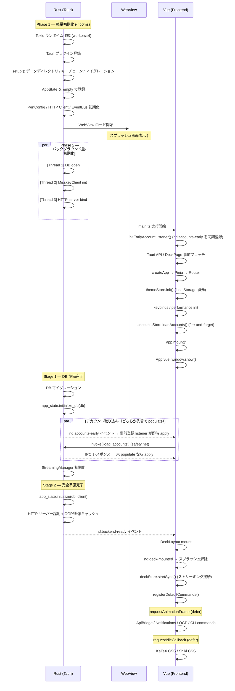
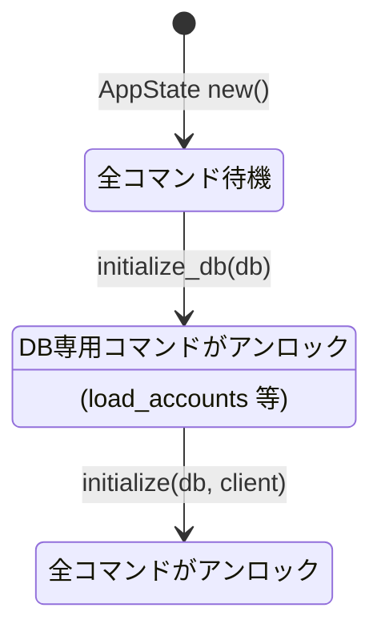
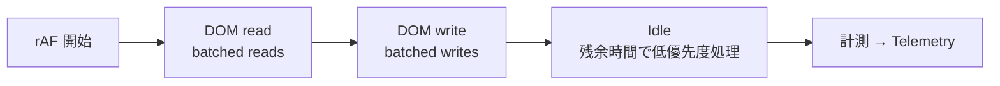
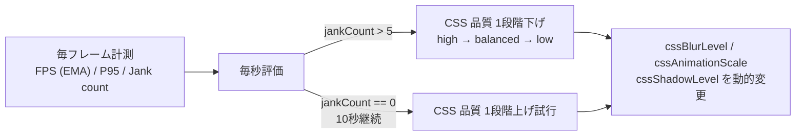

# NoteDeck Development Guide

Misskey IDE (Integrated Deck Environment) with fork support — branded as "Misskey Pro" for power users ([BRANDING.md](BRANDING.md))。設計思想・方針は [DESIGN.md](DESIGN.md) を参照。

## Tech Stack

| | |
|---|---|
| Frontend | Vue 3 + TypeScript（Vapor モード移行予定） |
| Backend | Rust (Tauri v2) + [notecli](crates/notecli/) |
| Build | Vite 8 (Rolldown) + Cargo |
| State | Pinia |
| Local DB | SQLite (rusqlite, WAL mode, FTS5) |
| HTTP | reqwest (Rust, via notecli) |
| WebSocket | tokio-tungstenite (Rust, via notecli) |
| HTTP API | Axum (localhost:19820) |
| Script | AiScript (@syuilo/aiscript) |
| Editor | CodeMirror 6 |
| Linter | Biome |
| Style | SCSS + CSS Modules (`$style`) |
| Test | Vitest + happy-dom |

## Prerequisites

### 推奨: Nix flake（ワンコマンドセットアップ）

[Nix](https://nixos.org/) がインストール済みなら、全ての開発依存が自動で揃います。

```bash
nix develop        # Node.js, pnpm, Rust 等が揃ったシェルに入る
pnpm install       # パッケージインストール
```

[direnv](https://direnv.net/) を使うと `cd` するだけで自動的に環境が有効になります（`.envrc` 同梱）。

Android SDK / NDK は nix store を数 GB 占めるため、既定のシェルには入っていません。Android をビルドするときだけ専用シェルに入ってください:

```bash
nix develop .#android    # 上記に加えて JDK + Android SDK/NDK が揃う（内訳は flake.nix）
```

### 手動セットアップ

| ツール | インストール |
|--------|-------------|
| [Node.js](https://nodejs.org/) (LTS) | 公式サイト or `nvm install --lts` |
| [pnpm](https://pnpm.io/) | `corepack enable && corepack prepare pnpm@latest --activate` |
| [Rust](https://www.rust-lang.org/) (stable) | `curl --proto '=https' --tlsv1.2 -sSf https://sh.rustup.rs \| sh` |

**Linux のみ**: Tauri のビルドに追加パッケージが必要です。

```bash
# Ubuntu / Debian
sudo apt install libwebkit2gtk-4.1-dev libappindicator3-dev librsvg2-dev patchelf
```

### 環境診断

セットアップしたのに動かないときは、原因を自力特定せず診断コマンドを実行してください:

```bash
pnpm doctor
```

必要なツールチェーン・システム依存・モバイル SDK の有無を検査し、欠落ごとに具体的な対処コマンドを提示します（[#896](https://github.com/notedeck-dev/notedeck/issues/896)）。

### エディタ / 言語サーバー

言語サーバーは開発環境に同梱されており、`nix develop` に入った時点でエディタを問わず補完・定義ジャンプが動きます:

| 対象 | 言語サーバー | 導入経路 |
|------|-------------|---------|
| Rust | rust-analyzer + rust-src | `rust-toolchain.toml` の components |
| TOML | taplo | `flake.nix` |
| Nix | nil | `flake.nix` |
| Vue SFC | vue-language-server | `flake.nix` |
| TypeScript | tsserver | `node_modules` の typescript（ワークスペース版） |

VS Code 向けの表示層は `.vscode/` に同梱（推奨拡張・ワークスペース設定・デバッグ構成）:

- リポジトリ直下に Cargo マニフェストが無いため、`rust-analyzer.linkedProjects` で
  `src-tauri/Cargo.toml` を明示している。他エディタでも同等の設定が必要
- デバッグ構成「Tauri desktop (debug)」で Rust 側にブレークポイントを張れる
  （CodeLLDB 使用。vite dev server は preLaunchTask で自動起動）
- WSL2 では `nix develop` したシェルから VS Code を起動すること（EGL 対策の環境変数を継承するため）

#### IPC 境界を跨ぐジャンプ

[#897](https://github.com/notedeck-dev/notedeck/issues/897) —
言語サーバーはフロントと Rust の境界を越えられないため、`commands.xxx()` から実装へは飛べません。
生成物である `src/bindings.ts` の各コマンドに、実装ファイルへの `@see` が埋め込んであります（生成のたびに実測から作り直されるので腐りません）。

| 知りたいこと | 手順 |
|---|---|
| このコマンドの実装はどこか | `commands.xxx()` の定義へ飛び、JSDoc の `@see` のパスを開く |
| この Rust 実装を誰が呼んでいるか | `bindings.ts` を関数名（snake_case のまま）で検索して TS 側の名前を得る → その名前で `src/` を検索 |

逆方向が 2 手になるのは、呼び出し元の情報を手書きの Rust ソースへ書き戻すことになり、生成物ではなくなるためです。
どちらの手順も snake_case と camelCase の変換を人間がやる必要はありません。

## Getting Started

```bash
# Install dependencies
pnpm install

# Start dev server (Tauri desktop)
pnpm tauri:dev

# Start dev server (browser) — tauri:dev 起動中に開くと Dev Dashboard になる（下記参照）
pnpm dev
```

## Available Scripts

```bash
pnpm dev          # Vite dev server
pnpm tauri:dev    # Tauri dev
pnpm build        # Production build
pnpm tauri:build  # Tauri native build
pnpm test         # Run unit tests
pnpm test:watch   # Run tests in watch mode
pnpm test:e2e     # Run E2E tests (要デバッグビルド、下記参照)
pnpm lint         # Lint & format check
pnpm lint:fix     # Lint & format fix
pnpm typecheck    # TypeScript type check
pnpm clean        # Remove build artifacts
```

### テスト構成

テストは 2 プロジェクトに分離（`vitest.config.ts`）:

| プロジェクト | 環境 | ファイルパターン | 用途 |
|------------|------|----------------|------|
| `unit` | Node.js | `*.test.ts` | ロジック・ユーティリティ |
| `dom` | happy-dom | `*.dom.test.ts` | Vue コンポーネント・DOM 操作 |

### E2E テスト（[#702](https://github.com/notedeck-dev/notedeck/issues/702)）

実アプリ（デバッグビルド）を隔離プロファイルで起動し、外部アプリと同じ
HTTP API 面（[#709](https://github.com/notedeck-dev/notedeck/issues/709)、port 19820）で駆動する。設定は `vitest.e2e.config.ts`
（`pnpm test` とは独立、`tests/e2e/` 配下）。

```bash
cd src-tauri && cargo build && cd ..   # デバッグバイナリを用意 (初回のみ)
nix develop -c pnpm test:e2e           # WSL2 では nix develop 必須 (EGL 対策)
```

- ハーネス（`tests/e2e/harness.ts`）は一時ディレクトリを `NOTEDECK_APP_DIR`
  に指定してバイナリを spawn し、実データに触れない。バイナリの場所は
  `NOTEDECK_E2E_BINARY` で上書き可能
- port 19820 が使用中（= 実アプリ起動中）の場合は誤操作防止のため即失敗する
- デバッグビルドは devUrl（vite 5173）から frontend を読むため、vite が
  いなければハーネスが自前で起動・終了する
- アサーションは HTTP の state 読み取り（`/api/health` / `/api/deck/columns`
  等）ベース。DOM/ピクセルには依存しない
- モック Misskey サーバー（`tests/e2e/mockMisskey.ts`）でストリーミングの
  切断/再接続/購読 replay を決定論的にテストする。接続には
  `NOTECLI_INSECURE_HOSTS` / `NOTEDECK_E2E_ALLOW_HOSTS`（デバッグビルド限定の
  http/ws 許可）を使う
- CI では `xvfb-run` で実行する。視覚スモーク（`NOTEDECK_E2E_SCREENSHOT=1`
  でスクリーンショットをアーティファクト保存）は develop / main への push の
  ときだけ有効にしている。GPU なしランナーではソフトウェアレンダリングを
  強制するため実機の描画崩れは再現できず、検証も「単色ではない」ことに
  留まる（崩れの判断はアーティファクトを見る人間に委ねている）。実接続を
  伴い所要時間も大きいので、PR では回さない

#### Android 実機 / エミュレータで同一スイートを実行

アプリをデバイス上で起動した状態で、HTTP API を adb 経由でホストに引き込み、
attach モードで同じテストを流す（モック接続系テストは自動スキップ）:

```bash
adb forward tcp:19820 tcp:19820
# デバイスの api-token を取得 (デバッグビルドは run-as が使える。
# app_data_dir 配下の api-token — パスは要確認)
TOKEN=$(adb shell run-as com.notedeck.desktop cat files/api-token)
NOTEDECK_E2E_ATTACH=1 NOTEDECK_E2E_TOKEN=$TOKEN pnpm test:e2e
```

※ この手順は未実機検証。

attach モードはデバイス側アプリを終了させず、デッキ操作系テストは実際に
カラムを追加/削除する（テスト用プロファイルのデバイスで実行すること）。

## Dev Dashboard（[#977](https://github.com/notedeck-dev/notedeck/issues/977)）

`pnpm tauri:dev` 中にブラウザで http://localhost:5173/ を開くと、実行中の
アプリを外から覗く **開発者ダッシュボード** になる（アプリ未起動時は起動案内が
出て、起動を検知すると自動で切り替わる）。デッキとは独立した画面なので、
アプリの UI 状態を汚さずに観測できる。

できること:

- **デッキ状態** — カラム一覧と、折りたたみで `/api/health` raw・
  `/api/openapi.json`・起動計測（起動マーク + WebView 固定費、[#985](https://github.com/notedeck-dev/notedeck/issues/985)）・
  HEARTBEAT 状態（最終 tick / 結末 / 連続失敗、[#411](https://github.com/notedeck-dev/notedeck/issues/411)）・キャッシュ観測
  （上限つきキャッシュの size / limit 実測、[#987](https://github.com/notedeck-dev/notedeck/issues/987)）・Query Bridge トレース
  （query 往復の所要時間）。JSON はシンタックスハイライト付き
- **SSE ライブビューア** — `/api/events` を購読して Rust 側イベントバスの
  流れをリアルタイム表示。type prefix フィルタ・種別チップ（クリックで
  絞り込み）・流量表示・JSON Lines エクスポート・切断時自動再接続。
  折りたたみで Inspector 突き合わせ（アダプタ層 vs SSE の種別別カウント）
- **Capabilities 実行盤** — 登録済み capability の一覧からパラメータを
  JSON で組んで実行。external principal として dispatcher を通るので、
  権限ゲート（[#712](https://github.com/notedeck-dev/notedeck/issues/712)）の deny・確認ダイアログ・DispatchResult → HTTP status の
  写像をそのまま目視テストできる。principal 別実効権限マトリクスと
  実行履歴つき
- **統合タイムライン** — Rust の tracing ログ（Vite dev server の
  `/dev/logs` が SSE 配信、所在は `/api` インデックスの `logDir` から解決）
  + SSE イベント + フロント in-app ログを単一時系列にマージ。
  「どの層でイベントが消えたか」をソース切替しながら 1 画面で追える
- **Scalar API ドキュメント** — `/api/docs` へのリンク

仕組み: Vite の dev proxy（`vite.config.ts`）が `/api` と `/proxy` を
内蔵 HTTP サーバー（127.0.0.1:19820、[#940](https://github.com/notedeck-dev/notedeck/issues/940)）へ転送し、無認証の `/api`
インデックスが開示する tokenPath から Bearer トークンを読んで注入する。
ブラウザ側は相対パスの fetch だけで認証込みの external API を叩ける。
dev マシン上でしか成立しない橋渡しなので、本番の攻撃面は増えない。

Stream Inspector カラムとの違い: Stream Inspector は**フロントのアダプタ層**
（Misskey WebSocket の raw イベント）を見るのに対し、ダッシュボードの SSE
ビューアは **Rust 側イベントバス → `/api/events`** を見る。別系統なので、
両方を並べると「どの層までイベントが届いているか」の切り分けに使える。

位置づけ（#940 との関係）: このダッシュボードは external API の最初の
本格クライアント（dogfooding）を兼ねる。19820 に新しい面を足すときの
テストベンチとして育てる。

## Architecture

NoteDeck は 1 つのリポジトリ (Cargo workspace) で、`crates/notecli` (Misskey クライアント + CLI) と `src-tauri` (アプリの Rust) を持ちます (notecli は 2026-09-23 に別リポジトリから取り込んだ、[#1106](https://github.com/notedeck-dev/notedeck/issues/1106))。

### notecli (`crates/notecli`)

Tauri に依存しない Misskey ヘッドレスクライアント。Rust ライブラリ兼 CLI デーモン。

- Misskey HTTP API クライアント、WebSocket ストリーミング、SQLite DB、REST API サーバー
- 単体で `localhost:19820` の HTTP API デーモンとして動作（GUI 不要）
- アプリの Rust (`src-tauri`) がパス依存で利用する。CLI バイナリはリリースの成果物として同じタグから出す

### notedeck (このリポジトリ)

notecli の上に Tauri v2 + Vue 3 の GUI を載せたクライアント。
対象プラットフォームは Windows / macOS / Linux / Android。

### 目指す構成: notecore と notecored ([#1106](https://github.com/notedeck-dev/notedeck/issues/1106))

`src-tauri/` には Tauri に依存しないドメイン (Vault / クエリランタイム / 画像キャッシュ / AI SSE クライアント / 設定ファイル store / 認可解決) が同居している。これを **notecore** (notedeck リポジトリ内の同名クレート) に集め、同じ notecore を 2 つの殻で動かす。

```
フロントエンド (Vue)            WebView は常に手元の Rust とだけ話す
      │ IPC
┌─ 殻: Tauri (手元) ──────┐   中継   ┌─ 殻: notecored (自分のサーバー) ─┐
│ OS 統合 + クライアント層 │ ───────▶ │ 常駐、RPC + SSE、ペアリング       │
└──────────┬──────────────┘          └──────────────┬──────────────────┘
           ▼                                        ▼
        notecore ─────────── 同じクレート ──────── notecore
           ▼                                        ▼
        notecli                                  notecli
```

- **切る基準**: 「その処理はデバイスが 1 台も繋がっていない状態で意味を持つか」。持つなら notecore、持たないなら手元 (ウィンドウ / トレイ / OS 通知 / クリップボード / dialog / OS キーチェーン)
- **クライアント層**は手元の Rust の中の切替点 1 箇所。データ系コマンドはコマンド表 (型付き関数 + JSON アダプタを 1 つの宣言から生成) を通り、ローカル構成では in-process で埋め込み notecore を、リモート構成では notecored を呼ぶ。表に載っていないデータ系コマンドはどの構成でも存在しない
- **AI エージェントループは Rust で notecore に置く** ([#1133](https://github.com/notedeck-dev/notedeck/issues/1133))。WebView に残るのは UI、確認ダイアログ、UI 系 capability、AiScript (plugin / widget / scratchpad) の実行。チャット 1 ターンの状態機械 (ターン実行器)、確認要求、セッションの書込 (単一の書き手) と汚染の記録は移設済み。純データ系の capability (ノート / ユーザー / 通知 / アンテナ / チャンネル / ロール / リスト / クリップ / ドライブ / お気に入り / チャット / registry / アナウンス / Pages / Play / ギャラリー / 連合 / 外部 HTTP / MisStore の読取と書込、AI セッションの読取、principal の権限解決、skill / メモ / テーマ / カスタム CSS / プラグイン / ウィジェット / クエリの読み書き (AiScript の構文検証が要る作成・更新はデバイス)。正本は宣言表の `exec` 属性) は `exec: core` で notecore が直接実行し、確認内容の組み立て (プレビュー) も notecore 側 (`capabilities/exec/preview.rs`)。デバイスの状態に触るもの (UI / ミュート / Vault / 下書き / 設定系) はデバイスへの実行要求 (詳細は [AI Chat Streaming](#ai-chat-streaming))。設定系の `exec: core` 化 (#1098 の services が前提) / HEARTBEAT の無人契約は後続
- notecli の役割 (Misskey 通信・DB・ストリーミング) は変えない。notecore はその消費者。**notecli は notedeck の workspace に取り込む** (リポジトリは 1 つ、クレートは notecli / notecore / notecored / アプリの 4 つ。`notecli` の CLI と `notecored` のデーモンはクレートからバイナリとして出す)
- 段階と受け入れ条件、認証・ペアリング・イベント面・状態の所在の仕様は #1106 の仕様コメントが正本。ローカル構成は残り、リモート構成は追加の構成

**今すぐ守ること (段階 0a、機械検査あり)**:

- notecore 側のモジュールは `crates/notecore` に置く (2026-09-23 にクレート化済み)。notecore は `tauri` を参照せず、Cargo.toml に tauri 系を足さない (`tests/lint/rustCoreBoundary.test.ts`)。手元側 (WebView / managed state / OS 統合) が要る処理は trait (`FrontendBridge` / `AiChatSink`) で受け取り、Tauri 側 (`src-tauri/`) が実装を渡す。app dir のような値は `&Path` で受ける
- **データ系コマンドは notecore のコマンド表に載せる** (`crates/notecore/src/commands/table.rs`、#1106 §4.1。2026-09-23 に既存のデータ系は全件移行済み。跨り (mixed) も「データ側は notecore の関数 (`export_service` / `backup_service` / `commands::admin` 等)、手元側は dialog や保存先の解決だけの薄い包み」に分けたので、`src-tauri/src/commands/` に `#[tauri::command]` で残るのは local と authz だけ)。本体は `&Core` と引数を取る関数として `crates/notecore/src/commands/<module>.rs` に書き、表に 1 行足す。表から Tauri ラッパー (`src-tauri/src/commands/table.rs`)、JSON アダプタ (`dispatch`)、フィクスチャが生成され、属性検査 (許可ウィンドウ) は型付き経路でも JSON 経路でも本体の前に通る。全コマンドを JSON 経路で往復させるテストが notecore にあり、引数の型は `Default` を要求する。手元側 (OS 統合) と認可境界のコマンドは従来どおり `#[tauri::command]` で書く
- **行数の多い DB の読み書き (取り込み / キャッシュ検索 / 一括削除) は `Core::blocking` を通す** (notecli の Database は同期の rusqlite なので、async の本体から直接呼ぶと tokio の worker を塞ぐ)。1 行のキー引きや統計は直接呼んでよい。プール化や async API を notecli 側に持たせる判断 (#1098) はこの境界の裏で差し替える
- 表に載らない `#[tauri::command]` は直前の行に種別マーカー `// nd-command: <kind>` を持つ (`tests/lint/rustCommandKinds.test.ts`)。種別は `data` (データ系、notecore で実行できる) / `local` (OS 統合、手元に残る) / `authz` (認可境界を動かす操作: 権限ファイル / 信頼設定 / 公開 API トークン / Vault secret / アカウント資格情報。リモート構成では橋がネイティブ確認してから通す) / `mixed` (data と local が同居、段階 0b で分割)。優先順位は authz > mixed > local > data。認可境界に触れる本体は denylist で二重に検査され、authz 以外なら落ちる

```
src/                        # Vue 3 frontend
├── adapters/               # Server API adapters (Misskey, forks)
│   ├── types.ts            # Shared interfaces (ServerAdapter, ApiAdapter, StreamAdapter)
│   ├── registry.ts         # Adapter factory
│   └── misskey/            # Misskey implementation (IPC via invoke/listen)
├── aiscript/               # AiScript runtime & Misskey Play API
├── commands/               # Command registry, definitions, CLI handlers
├── components/             # Vue components
│   ├── common/             # MkNote, MkPostForm, MkEmoji, CommandPalette, etc.
│   └── deck/               # DeckLayout, DeckColumn, column types
├── composables/            # Vue composables (useNoteFocus, useTimeMachine, etc.)
├── core/                   # Business logic (server detection)
│   ├── queryDeltaBus.ts    # query-delta の単一リスナー多重化・復帰時再アタッチ
│   ├── queryRegistry.ts    # プラグイン fan-out 用の queryId refcount レジストリ
│   └── streamHealth.ts     # 生のストリーム接続状態台帳 (#698)
├── data/                   # Static data & constants
├── router/                 # Vue Router definitions
├── stores/                 # Pinia stores (accounts, deck, servers, emojis, theme, etc.)
├── styles/                 # Global CSS (CSS variables)
├── theme/                  # Misskey-compatible theme compiler & applier
├── utils/                  # Shared utilities
└── views/                  # Page components (NoteDetail, UserProfile)

crates/notecore/src/        # notecore (Tauri 非依存のドメイン層、#1106)。アプリと notecored の両方で使う
├── lib.rs                  # モジュール一覧と境界の説明
├── error.rs                # Result alias (エラー型は notecli の NoteDeckError)
├── context.rs              # Core: 実行文脈 (DB / Misskey クライアント / OGP、二段階初期化)。旧 AppState
├── commands/               # コマンド表 (table.rs) とデータ系コマンドの本体 (timeline.rs, ...)
├── permissions_gate.rs # external principal gate (#712) — 永続トークンの per-route 権限判定
├── permissions_profile.rs # permissions.json5 → 実効権限の解決 (#1099) — JS と golden vector で一致検査
├── image_cache.rs      # 3-tier image cache (memory → disk → network)。host 単位の 429 throttle 窓と half-open circuit breaker で一時失敗を  のエラーにしない
├── emoji_cache_store.rs # サーバー絵文字辞書のディスクキャッシュ (host 単位、鮮度内なら起動時の全件取得を省く)
├── media_warm.rs       # メディア先行取得キュー (辞書到着時に絵文字 variant を低優先で温める)
├── ogp/                # OGP metadata extraction & cache
├── ssrf.rs             # SSRF 防御 (URL / IP の一次検証 + DNS pinning)。汎用 fetch / 画像 / Vault / エクスポートが共用
├── settings_store.rs   # 設定ファイル store (allowlist が正本、export / import)
├── credentials.rs      # アカウント資格情報の解決 (メモリキャッシュ → keychain → DB)
├── ai_chat_service.rs  # AI SSE クライアント。イベントは AiChatSink trait 経由 (Tauri 側が emit 実装を渡す)
├── shutdown.rs         # 終了時のタスク所有。tokio Handle を受け取る
├── query_runtime.rs    # クエリランタイム本体 (購読台帳 / 差分バッファ / 読み取りモデル)。コマンドと flusher は commands/query.rs
├── vault/              # Secret Vault (#564)。app dir を &Path で受け、Tauri を知らない
├── http_server.rs      # Axum HTTP API server (localhost:19820)。手元側への問い合わせは FrontendBridge 経由
├── frontend_bridge.rs  # HTTP API → 手元側 (WebView / managed state) の問い合わせ口 trait
├── perf_config.rs      # パフォーマンス設定 (Rust 側)

crates/notecli/             # Misskey クライアントライブラリ + CLI (Misskey 通信 / DB / ストリーミング)

src-tauri/src/              # Rust backend (Tauri 固有部分 = 手元側)
├── lib.rs                  # App setup (tray, plugins, state)
├── commands/               # Tauri IPC command handlers: データ系は表から生成、残りは手元側 (local / authz / mixed)
│   ├── mod.rs              # 再公開と Tauri 側の sink (OGP ヒント等)
│   ├── table.rs            # notecore のコマンド表から Tauri ラッパーを生成 (#1106)。データ系コマンドはすべてここ経由
│   ├── admin.rs / auth.rs / api_tokens.rs / vault.rs  # 認可境界 (資格情報 / トークン / secret / 信頼設定)
│   ├── settings.rs / backup.rs / export.rs / utility.rs  # dialog / OS 統合 / 端末のファイル (local / mixed)
│   ├── heartbeat.rs / health.rs / system_state.rs  # 手元のランタイム (HEARTBEAT scheduler / 診断 / OS 状態)
│   ├── query.rs            # クエリランタイムの delta flusher と Tauri イベント
│   └── ai_chat.rs          # AI チャットのイベント sink
├── streaming.rs            # TauriEmitter adapter (FrontendEmitter trait impl)
├── query_bridge.rs         # FrontendBridge の Tauri 実装 (Tauri イベントで Pinia store に問い合わせる)
└── main.rs                 # Entry point
```

Misskey API クライアント・DB・モデル・ストリーミングコアは `notecli` クレートにある。一方 `src-tauri/` は Tauri 固有の配線だけではなく、Tauri に依存しないドメインも抱えている (OGP 抽出とサイト別プラグイン / Secret Vault / クエリランタイム / 画像キャッシュ / AI SSE クライアント / HTTP API サーバー / カラムクエリの QIR 評価器)。行数では notecli より大きい。

置き場の規則 (#782):

- `commands/*.rs` は IPC アダプタ。State の取り出しとパス解決だけを行い、薄く保つ
- トップレベルの `*_service.rs` / `*_store.rs` / サブモジュールは、引数を取って単体テストできるサービス。`AppHandle` や `State` を直接受けない
- Misskey の API / DB / ストリーミングに関わる共通処理は notecli に足す (フォークやスタンドアロン CLI からも使えるように)

この規則は一部のモジュールにしか適用されておらず (column_query / export / http は commands/ にドメインを持つ)、ドメインをクレートに切り出すかも含めて #1098 で扱う。終了時のタスク所有は `shutdown.rs` に一元化されている。

### Boot Sequence

NoteDeck は **UI 表示までの時間を最小化** するため、バックエンドの重い初期化をバックグラウンドで行いながらフロントエンドを先行起動する設計になっている。

#### 全体フロー

Rust バックエンドとフロントエンドが並列に動作し、イベントで連携する。


```mermaid
sequenceDiagram
    participant R as Rust (Tauri)
    participant W as WebView
    participant V as Vue (Frontend)

    Note over R: Phase 1 — 軽量初期化 (< 50ms)
    R->>R: Tokio ランタイム作成 (workers=4)
    R->>R: Tauri プラグイン登録
    R->>R: setup(): データディレクトリ / キーチェーン / マイグレーション
    R->>R: AppState を empty で登録
    R->>R: PerfConfig / HTTP Client / EventBus 初期化
    R->>W: WebView ロード開始

    Note over W: スプラッシュ画面表示 (#nd-splash)

    par Phase 2 — バックグラウンド重初期化
        R->>R: [Thread 1] DB open
        R->>R: [Thread 2] MisskeyClient init
        R->>R: [Thread 3] HTTP server bind
    end

    W->>V: main.ts 実行開始
    V->>V: initEarlyAccountListener() (nd:accounts-early を同期登録)
    V->>V: Tauri API / DeckPage 事前フェッチ
    V->>V: createApp → Pinia → Router
    V->>V: themeStore.init() (localStorage 復元)
    V->>V: keybinds / performance init
    V->>V: accountsStore.loadAccounts() (fire-and-forget)
    V->>V: app.mount('#app')
    V->>V: App.vue: window.show()

    Note over R: Stage 1 — DB 準備完了
    R->>R: DB マイグレーション
    R->>R: app_state.initialize_db(db)

    par アカウント取り込み（どちらか先着で populate）
        R-->>V: nd:accounts-early イベント → 事前登録 listener が即時 apply
        V->>R: invoke('load_accounts') (safety net)
        R-->>V: IPC レスポンス → 未 populate なら apply
    end

    R->>R: StreamingManager 初期化

    Note over R: Stage 2 — 完全準備完了
    R->>R: app_state.initialize(db, client)
    R->>R: HTTP サーバー起動 + OGP/画像キャッシュ
    R-->>V: nd:backend-ready イベント

    V->>V: DeckLayout mount
    V-->>V: nd:deck-mounted → スプラッシュ解除
    V->>V: deckStore.startSync() (ストリーミング接続)
    V->>V: registerDefaultCommands()

    Note over V: requestAnimationFrame (defer)
    V->>V: ApiBridge / Notifications / OGP / CLI commands

    Note over V: requestIdleCallback (defer)
    V->>V: KaTeX CSS / Shiki CSS
```

#### Two-stage AppState

バックエンドの初期化を 2 段階に分けて、DB が準備できた時点で一部のコマンドを先行アンロックする仕組み（`src-tauri/src/commands/mod.rs`）。


```mermaid
stateDiagram-v2
    [*] --> Empty : AppState new()
    Empty --> DB_Ready : initialize_db(db)
    DB_Ready --> Fully_Ready : initialize(db, client)

    Empty : 全コマンド待機
    DB_Ready : DB専用コマンドがアンロック
    DB_Ready : (load_accounts 等)
    Fully_Ready : 全コマンドがアンロック
```

内部的には `tokio::sync::watch::channel` を 2 本持ち、`db()` は DB チャネルのみ、`client()` はフルチャネルを待機する。これにより `load_accounts` のようなDB専用コマンドは MisskeyClient の初期化を待たずに応答できる。

#### スプラッシュ画面

`index.html` にインラインで定義された `#nd-splash`（ハートビートアニメーション付きロゴ）。

- **表示**: WebView ロード直後（Vue マウント前から表示済み）
- **解除**: `uiStore.deckMounted`（DeckLayout のマウント完了）を `App.vue` が watch して解除
- **フォールバック**: タイムアウトで強制解除（時間は `App.vue` の splashTimeout が正本）
- **アニメーション**: `opacity: 0` トランジション → `transitionend` で DOM 削除
- **計測**: 起動フェーズは `src/utils/startupTrace.ts` の performance.mark で記録し、About ウィンドウの「起動パフォーマンス」に表示（#985）

データ（ノート等）のロード完了は待たず、カラムフレームの描画が完了した時点でスプラッシュを解除する。

#### 起動時の最適化テクニック

| テクニック | 実装箇所 | 効果 |
|-----------|---------|------|
| Two-stage AppState | `commands/mod.rs` | DB 準備次第でアカウント読み込み開始 |
| 早期アカウントイベント | `lib.rs` → `nd:accounts-early` | IPC 往復を待たずにフロントへ通知 |
| 事前登録 listener | `stores/accounts.ts:initEarlyAccountListener` | `main.ts` 最上部で `listen()` を同期登録し、Rust 側 emit を取りこぼさない（Pinia 初期化前でも module-scope バッファに保存） |
| 未ロード時の空状態ガード | `DeckColumn.vue` `requireAccount` prop | カラム本体スロットを `accountsStore.isLoaded` まで抑制し「アカウントが見つかりません」の一瞬のチラつきを防止 |
| 動的 import 事前フェッチ | `main.ts` | DeckPage / カラムチャンクを並列ダウンロード |
| テーマ localStorage 復元 | `themeStore.init()` | ネットワーク不要で FOUC 防止 |
| 3 スレッド並列初期化 | `lib.rs` Phase 2 | DB / Client / HTTP bind を同時実行 |
| 非クリティカル処理の defer | `useDeckInit` | rAF / rIC で初回描画を優先 |

### Multi-Window & Profile Architecture

ウィンドウとプロファイルは**直交する概念**です。

- **プロファイル**: カラム構成・レイアウトの保存単位。データの所有者
- **ウィンドウ**: プロファイルの表示先。同じプロファイルを複数ウィンドウで開ける

```
Profile A ──→ Main Window（windowId なしのカラムを表示）
         └──→ Sub Window 1（windowId = "w1" のカラムを表示）

Profile B ──→ Main Window（プロファイル切り替え時）
```

**設計原則:**

1. プロファイルが変更されたら、そのプロファイルを開いている**全ウィンドウ**がリアクティブに追従する
2. 各ウィンドウは `windowLayout`（computed）で自分に属するカラムだけをフィルタして表示する
3. ウィンドウの作成・破棄はプロファイルのデータに影響しない

**同期方式:** 永続化の正本はプロファイルフォルダ配下のファイル（#913。ID とファイル名の対応表つき）。localStorage は全 webview 共有の**ミラー**で、起動時の即時復元と他ウィンドウへの伝播に使い、Tauri イベント（`deck:profile-updated` / `deck:profiles-changed`）で変更を通知する。ミラーへ書く直前に対応表を読み直して合流させ、別ウィンドウのリネーム結果を潰さない。Rust 側に正本を移す案は不採用（[PR #172](https://github.com/notedeck-dev/notedeck/pull/172) で議論）。

### Window / Column Model（[#194](https://github.com/notedeck-dev/notedeck/issues/194)）

ウィンドウとカラムは「ストリーム / 詳細 / ツール」の3分類で役割を分担する。

| 分類 | UI | 用途 | 永続性 |
|------|-----|------|--------|
| **ストリーム** | カラム | 継続的なデータフィード（TL、通知、検索、チャット等） | プロファイルに永続化 |
| **IDE ツール** | カラム | 開発・デバッグ支援（Stream Inspector、Workspace Explorer 等）、ローカル PKM（メモ — `settings/memos/*.md` を Obsidian vault としても開ける。サーバーへ送らずローカルで完結し、同じくアカウントなしの AI カラムから参照されるため **アカウントに紐づかない**（#1018）。他のテキストと同じ編集履歴を持つ） | プロファイルに永続化 |
| **詳細** | ウィンドウ | 特定アイテムの一時的な表示（ノート詳細、プロフィール、フォローリスト） | セッション限り |
| **インスペクタ** | ウィンドウ | Raw JSON 表示・デバッグ（ノート/通知インスペクタ、settings.json エディタ） | セッション限り |
| **ツール** | ウィンドウ | アプリ設定・管理（ログイン、エディタ群、プラグイン、about） | セッション限り |

**ウィンドウのジオメトリ永続化（[#874](https://github.com/notedeck-dev/notedeck/issues/874)）:**

位置・サイズの保存と復元は、ウィンドウの種類ごとに要件が違うので**機構を分けたまま統合しない**。「同じ仕事の二重実装」ではなく、グローバル vs per-profile、描画前復元 vs プロファイル適用時復元という要件差から来ている。

| ウィンドウ | 保存先 | 復元 | 内容 |
|---|---|---|---|
| **main** | `tauri-plugin-window-state`（Rust 側、ラベル → ジオメトリのグローバル map。`src-tauri/src/lib.rs`） | 初回描画前。クラッシュやトレイからの Quit でも保存される | サイズ・位置・最大化・フルスクリーン。可視状態は除外（close → トレイ hide → Quit で不可視が保存されると次回起動が見えなくなる）、装飾も除外（`decorations: false` 固定） |
| **デッキ派生**（カラムのポップアウト。`?profile=&window=<id>`） | プロファイル内の `windows[]`（per-profile。`useDeckWindow` が論理 px に正規化して保存し、モニタ名を添える） | プロファイル適用時に、カラムが割り当てられているものだけ開き直す。保存モニタが無ければ primary の中央、はみ出していれば境界に clamp | 位置・サイズ・モニタ名。最大化状態は持たない（現状） |
| **ミラー**（`?profile=` のみ、windowId なし）/ **PiP**（`pip-<時刻>-<連番>`） | 非永続 | 都度、既定サイズで開く | — |

- **Rust プラグインに寄せない理由**: 派生ウィンドウのジオメトリはプロファイル切替でウィンドウ構成ごと復元される per-profile データで、プラグインのグローバル map にはプロファイルを載せる場所がない。どのウィンドウを作るかはアプリロジックなので、生成時にジオメトリを渡す現行の形が最も atomic。プロファイルは持ち出せる単位なので、ジオメトリだけ別ファイルに分けるとバックアップ・エクスポートの整合が壊れる
- **フロント側に寄せない理由**: 描画前の復元とクラッシュ時・トレイ Quit 時の保存は Rust 側でフックしているから成立している。フロントに移すと復元は JS ブート後（見えてから跳ぶ）、保存は beforeunload 頼みになり、プラグインが解決済みのクロスプラットフォームの罠を再実装することになる
- **動的ラベルのウィンドウをプラグインの対象から外す理由**: 復元先が二度と一致せず、state ファイルにゴミが溜まり続ける。ラベルを安定化しても、プロファイル削除時に同じ問題が形を変えて再発する
- どちらも他方の上位互換ではない。プラグインは現存モニタと交差しなければ OS に配置を任せるオフスクリーンガードと最大化・フルスクリーンを持ち、フロント側はモニタ名一致・境界 clamp・primary 中央寄せ・論理 px 正規化を持つ

**Cross-account カラム:**

カラムのアカウントスコープは 3 状態ある。`accountId` は `string | null` のままで、`null` の意味は registry の `crossAccount` 宣言から引き直す（#1018）。

| スコープ | 条件 | 動作 |
|---------|------|------|
| **per-account** | `accountId` あり | `useColumnSetup` で単一アダプタ |
| **全アカウント** | `accountId: null` + `crossAccount: true` | `useMultiAccountAdapters` で全アカウント並列取得 |
| **アカウントなし** | `accountId: null` + `crossAccount` 宣言なし | アカウントに紐づかない（AI・スキル・タスク等） |

判定は `src/columns/accountScope.ts` の `getAccountScope()` 一本。「全アカウント」で開けない理由（サーバーごとに ID を選ぶ面 / サーバー単位の面 / 未対応）も同じファイルの `crossAccountUnavailableReason()` で導き、カラム追加ダイアログは行を消す代わりに無効の行と理由を出す（[#1017](https://github.com/notedeck-dev/notedeck/issues/1017)）。カラムを受け取る側が「束ねるべき」か「関係ない」かを各自で判定すると、対応種別が増えるたびに虫食いが再発するため、この 1 箇所を経由する。対応種別の正本は `src/columns/registry.ts` の `crossAccount` 宣言。

全アカウントのカラムはヘッダーに `AvatarStack` が出る（アカウントなしは何も出ない）。そこからアカウント必須の操作を始めるときは `useAccountPicker` でどのアカウントで実行するかを選ばせる。「アクティブアカウント」という概念は持たない（[#941](https://github.com/notedeck-dev/notedeck/issues/941)）: 実態は登録順の先頭でユーザーが選んだものではなかったので、UI・capability・スラッシュコマンドのどこでも暗黙にフォールバックしない。capability は「明示の `accountId` → 呼び出し文脈のアカウント（per-account の AI カラム、ノートメニューから起動したプラグイン）」の順で解決し、どちらも無ければ `accountId` を必須にする。文脈が無いときの UI の初期値（投稿フォームの宛先、メモの絵文字辞書）だけ `accountsStore.fallbackAccount`（トークンを持つ先頭）を使い、これを「現在のアカウント」として見せない。

**同一ノートの束ね（[#1058](https://github.com/notedeck-dev/notedeck/issues/1058)）:**

複数サーバー（複数アカウント）で観測した同じノートは、全アカウント面では別々の行として並べず 1 つの group に束ねる。設計の正本は #1058 の設計コメント。要点だけ書く。

- **キーは 2 つ**。行の一意性は「取得元アカウント + ノート ID」の複合（`VariantKey`、`src/services/noteKey.ts`）。ノート ID はサーバー内でしか一意でないので、ID 単独をキーにする箇所は残さない。同一性は正規化した ActivityPub object id（`NormalizedNote._identity`）で、導出と origin 判定・整合検査は notecli 側で行い、TS は値を読むだけ
- **束ねはカラム単位**。`useNoteList({ bundle: true })` がそのカラムの順序配列を identity で畳み、`groups` を表示単位として返す。ストアは variant 単位のままで identity の索引は持たない（他カラムの取得で表示が揺れないように）。純関数は `src/services/noteGroup.ts`
- **主ビュー**は静的な事実だけで選ぶ（公開範囲の階級 → トークン → 本文の有無 → 埋め込みの健全性 → 凍結 → 投稿者一致 → origin → 更新時刻 → アカウント順）。反応数や取得順では選ばない。数（reactions / renoteCount / repliesCount）は主ビューの値をそのまま使い、合算も max もしない（Like は origin と反応者のフォロワー先の両方に配送されるので足すと二重計上）
- **可視性**はユーザー意思（ミュート）を variant の OR で、サーバー判断（削除・凍結）を対象ノート自身の origin で下されたときだけ権威として扱う
- **採用しない**: public 階級で origin の variant が本文非公開（投稿者の「古いノートを隠す」設定）でも、それをトークンの有無より優先しない。中身は連合先に届いていてユーザーはそこで読めるので露出は広がらず、guest の origin を主にするとログイン済みアカウントが本文を持っているのに伏せ字を見せて操作もできなくなる。origin にもログインしていれば既存の順位で origin が主になる（2026-09 の PR #1092 レビューで検討）
- **Note Capture の予算**（`noteCaptureMax`）は実際の購読数で数える（本体 + Renote 元、`src/services/captureBudget.ts`）。per-account / 全アカウントの両実装で共通
- **操作の宛先**: ノート文脈のある操作（返信・リアクション・Renote・引用）の既定は主ビューの取得元アカウント。per-account 面で「そのノートを取得したアカウント」が既定なのと同じ規則で、上の `useAccountPicker` の規則はノート文脈の無い操作（新規投稿）に適用する。トグルは「押したら主ビューの状態が反転」の 1 本。他アカウントの反応の取り消しはノートメニュー「別のアカウントで…」から。実装は `useColumnSetup` の `handlers.*` に一本化してあり、カラム adapter が無い全アカウント面ではノートの `_accountId` で adapter を解決する（未ログインなら toast で止め、無言 no-op にしない）。投稿フォームは `ColumnCrossPostForm` が `postForm.accountId`（操作したノートの取得元）宛てに描画する。全アカウント面のカラムで `handlers.*` を迂回して自前の操作関数を書かない。ノートを noteStore に置かない面は保持形態に合わせて追従する — ルックアップは `applyNotePatch` オプションで deep ref に差分を当て、削除済みキーを手元に持って再マージから除外する。通知は `setOnNotesMutated` で store の最新へ差し替え、`noteStore.onDelete` の購読で削除を落とす
- **ライブ更新（全アカウント TL / メンション、[#1059](https://github.com/notedeck-dev/notedeck/issues/1059)）**: `useCrossAccountNotes` がアカウントごとに購読し、新着は 1 つの `useStreamingBatch` に合流させる。同じ identity の group が既に列にある variant は行を増やさず既存 group の直後に差し込む（サイレント挿入）。新着バナーの数は variant 数でなく増える行数。復帰時の catch-up はアカウントごとに `hasGap`（`src/services/timelineGap.ts`）を評価し、欠落したアカウントの variant だけを置換する（他アカウントの行は消さない）。全アカウント TL の対象はホームとグローバルだけ（ローカルと、ローカルを含むソーシャルは「そのサーバーの民」の性質が強い。グローバルは各サーバーから見た連合全体なので跨いでも意味が通り、束ねの効果も一番出る）
- **段階表示（[#1095](https://github.com/notedeck-dev/notedeck/issues/1095)）**: 全アカウント面の取得は `mapWithConcurrency` の `onSettled`（完了順・直列）で返ったアカウントの分から扱い、待っている間は `CrossAccountProgress`（「N アカウントのうち M 件待ち」）を出す。規則は面で分ける。**TL / メンション / 通知の初回**は「何も出ていなければ最初に返った分で描画し、既に何か（キャッシュ・先に返った分）が出ていれば全部揃ってから 1 回で並べ直す」— 速い分を先に出すと後から上に差し込まれて画面が動くので、動くのを最大 1 回に抑える。**追加読み込み**は下に足すだけなので全面で到着順に足す。**サーバー検索**は初回から到着順（速い分から出して困らない面）。照会は以前から同じ方式。HTTP タイムアウトは notecli 共通の 30 秒のまま — 段階表示にした以上、遅い 1 件が他を止めないので短い見切りは入れていない
- **フィルタメニュー**: 全アカウント TL でも per-account と同じ組込トグルとクエリトグルが効く。評価器は `useColumnQuery` を per-account (`useNoteColumn`) と共有し、キャッシュ / 初回 / 追加読み込み / 復帰 / streaming の全経路で組込 → クエリの順に AND 合成する。復帰の取り直しでは既存行も判定を通し、切断中の編集で合致しなくなった行は表示から外す（本文編集にはライブイベントが無く、取り直しが唯一の回収経路。[#1120](https://github.com/notedeck-dev/notedeck/issues/1120)、per-account も同じ）。組込フィルタの候補はログイン中の全サーバーが対応するキーだけ（片方だけ対応するキーを出すと効くサーバーと効かないサーバーが混ざる）、API 側パラメータは per-account と同じ。フィルタ変更は全アカウント取り直し。クエリの候補は全体スコープのみ（全アカウント面は accountId を持たない）。バッジ・フィルタボタン・バナーは `ColumnQueryBadge` / `ColumnFilterButton` / `ColumnQueryBanners` を両面で共有する
- **基準サーバーの絶対化**: Misskey の API は取得元サーバーのローカルユーザーを `host: null` で返し、ティッカーもリモートにしか付けない。全アカウント面では行ごとに基準が変わって不自然なので、全アカウント面のカラムは `provideNoteFrame(isCrossAccount)` を宣言し、`MkNote` はローカルユーザーにも取得元（`_serverHost`）を補って `@user@server` とティッカーを全員に出す（規則は `src/services/noteFrame.ts`）。per-account 面は本家どおり相対表示のまま
- **クライアント検索（[#945](https://github.com/notedeck-dev/notedeck/issues/945) / [#958](https://github.com/notedeck-dev/notedeck/issues/958)）**: 手元のキャッシュ（SQLite）をサーバー・アカウント横断で引く `clientSearch` 種別。既存の「サーバー検索」（`search` 種別、Misskey の notes/search）とは並立する別の面で、置き換えではない。アカウントに紐づかず（`accountIndependent`）ログアウト中でも動く。経路は notecli の `search_cached_notes_across`（検索語・期間・投稿者 `name@host`・添付の有無）を `apiSearchNotesCachedAcross` で呼び、結果は `useNoteList({ bundle: true })` で束ねて基準サーバーを絶対表示にする。検索語と絞り込みはカラムに永続化するので、条件を置いたまま常設できる（#958 の段階 2）。純ロジックは `src/services/clientSearch.ts`。AI からは `notes.searchArchive` capability で同じ経路を引ける（[#947](https://github.com/notedeck-dev/notedeck/issues/947)）。索引にはフォロワー限定・ダイレクトも入るので権限は `notes.read` と分けた `notes.readArchive`（readonly / safe では閉じ、full だけ開く。external の既定 custom でも落とす）にし、公開範囲は既定で public のみ（`includePrivate` で明示）。チャットは対象外（#951）
- **UI**: `MkNote` の `group` prop。主ビュー以外のアカウントだけが押している反応は破線の副スタイル + アバター、主ビューに無い反応は数字なしの合成チップ。ヘッダーのバッジ（アイコン + 数）で内訳（どのアカウントで見えているか・どれが主か）を開く。内訳にサーバー別の数字は出さない。開発者モードの Raw JSON インスペクタで variant を切り替えられる

**ナビバー（VSCode Activity Bar 式）:**

左ナビバーのアイコンはカラムの**トグルボタン**として機能する。クリックでサイドバーカラムを左端（`layout[0]`）に挿入、再クリックで削除。同時に1スロットのみ（`sidebar: true` フラグで管理）。

ナビバーのボタン構成はカスタマイズ可能（設定 → ナビバー）。`NavItem = { type, accountId } | { type: 'divider' }` 構造体でプロファイルに永続化される。

**共通コンポーネント:**

| コンポーネント | 用途 | 使用箇所 |
|-------------|------|---------|
| `ColumnBadges` | サーバー/アカウントバッジ表示 | DeckNavbar, DeckBottomBar, DeckMobileNav |
| `AvatarStack` | cross-account 時のアカウントアバター重ね表示 | AddColumnDialog, カラムヘッダー |
| `EditorTabs` | ビジュアル/コード 2タブ切替（コードタブはデフォルト値との差分のみ表示） | 全エディタ系ウィンドウ共通 |
| `RawJsonView` | Raw JSON 表示（機密マスキング・コピー対応） | NoteInspectorContent, NotificationInspectorContent, UserProfileContent |

**共通 composable:**

| composable | 用途 | 使用箇所 |
|-----------|------|---------|
| `usePointerReorder` | Pointer イベントによるドラッグ&ドロップ並び替え（軸指定対応） | NavEditorContent, ProfileEditorContent |
| `useCrossAccountNotes` | 複数アカウントからのノート並列取得・統合・重複排除 | DeckMentionsColumn, DeckSpecifiedColumn, DeckFavoritesColumn |
| `useVerticalResize` | 上下分割ペインのドラッグリサイズ（高さ制限付き） | DeckStreamInspectorColumn, DeckAiScriptColumn |
| `useSensitiveMask` | 機密フィールドのマスキング表示・トグル reveal | NoteInspectorContent, NotificationInspectorContent, UserProfileContent |

**アイコン・ラベルの一元定義:**

`useColumnTabs.ts` の `COLUMN_ICONS` / `COLUMN_LABELS` がカラムタイプのアイコンとラベルの SSoT。ナビバー、ボトムバー、エディタすべてがこれを参照する。

### 開発者モードと露出タグ（[#1034](https://github.com/notedeck-dev/notedeck/issues/1034)）

開発者向けの面を既定で隠し、開発者モードで開放する。**隠すのは入口だけ**で、デッキに置かれたカラムや開いたウィンドウの描画は止めない。認可の境界でもない（認可は `permissions.json5` の principal — 開発者モードを off にしてもプラグインや AI の権限は変わらない）。

**AI は開発者向けではない。** 接続と権限の設定は一般側に出ていて、接続の組込テンプレートは AI プロバイダーで占められている。AI の存在は既定の顔に露出しているので、AI カラムとエージェント設定を隠すと「鍵は登録できるが使う場所が無い」袋小路になる。API キーを持つことも開発者に限らない。隠すのは API コンソール・API ドキュメント・ストリーム・スクラッチパッド・タスクと、Raw データを見る面・生ファイルを編集する面、About の起動 / 実行時パフォーマンス表示（数値は性能 issue の材料で、一般ユーザーが読んで行動できるものではない。「情報をコピー」の本文には表示に関係なく同梱される）。About の自己診断は隠さない — 「何かが壊れている」を一般ユーザーが知る唯一の場所。

**配布物は「カラムは一般 / 作成・編集は開発者」。** テーマ・プラグイン・ウィジェット・クエリ・スキルが同じ規則に従う。管理カラムごと隠すと MisStore からの受け取りが死ぬ。

**帰属タグ:** カラム / ウィンドウ / コマンド / チュートリアルのカテゴリが `exposure` を持つ。未指定は `'general'` 扱いなので、既存の面は宣言を足さない限り従来どおり出る。判定は `src/settings/exposure.ts` の `isExposed()` 一本で、「アクティブなタグ集合が要求タグを含むか」を見る。複雑さの軸（[#1024](https://github.com/notedeck-dev/notedeck/issues/1024)）が来たらタグを 1 つ足して集合を広げる — boolean にしていないのはこのため。

**判定を参照する面（追加時はここに繋ぐ）:**

| 面 | 参照するもの |
|------|------|
| カラムの追加導線（追加ダイアログ / パレット / ナビバーエディタ / LaunchPad「もっと」） | `src/columns/exposure.ts` の列挙アクセサ |
| ナビバーのボタン | `isColumnExposed`（`navbar.json5` からは消さず描画側で絞る） |
| ウィンドウの入口（文脈メニュー・カード上の編集ボタン） | `src/windows/exposure.ts` の `isWindowExposed` |
| 設定メニュー / 設定のクイックピック | 開くウィンドウのタグ（両者が自動で揃う） |
| コマンドパレット / キーバインド割り当て一覧 | `Command.exposure` |
| 生ファイルを直接編集するタブと、その「OS 既定エディタで開く」 | 各ウィンドウが宣言的に opt-in（`tests/lint/rawFileEditorExposure.test.ts` が宣言漏れを検査する） |
| 配布物の作成・編集の入口（新規作成ボタン / カードの編集 / プラグインのソースタブ） | 編集ウィンドウがあれば `isWindowExposed`、窓自体は一般でタブだけ隠す場合（プラグイン）は `isExposed('developer')` |
| 独立ウィンドウでない Raw 面（プロフィールの Raw、サーバー情報の meta/stats、チャートの JSON、連合インスタンス） | `isExposed('developer')` を直接参照 |

ウィンドウの `open()` は塞がない。プラグイン・AI・`notedeck://` からの正当な呼び出しまで壊すと「機能の削除・劣化はしない」原則に反する。

**初期値:** 既存インストールは on、新規のみ off。判定に `settings.json5` のキー有無は使わない（スカラー設定を一度も変えていない既存ユーザーが新規と区別できなくなる）。アカウントの有無と `ai.json5` の痕跡を信号にして、起動時に一度だけ確定させる（`src/services/developerMode.ts` + `useDeveloperMode`）。

**トグル:** コマンドパレットのトグルコマンドと、「NoteDeck について」のスイッチ。設定メニューには置かない。読み書きは `useDeveloperMode` に集約している。

### Note List: 表示述語とフェッチカーソル（[#831](https://github.com/notedeck-dev/notedeck/issues/831)）

大原則は **データは保持し、表示時に決める**。取り込み時フィルタ・物理削除は採らないため、ミュート/凍結の解除で表示が即時に復活する。

**2 つの基底（`useNoteList`）:**

| ref | 内容 | 用途 |
|-----|------|------|
| `rawNotes` | unfiltered な書込基底（writable） | 全ての read-modify-write（マージ・挿入・削除・truncate）と**同期位置の決定** |
| `notes` | `isHidden` 述語でフィルタした表示列（readonly） | 描画・**ユーザー可視状態の判定** |

読取の判別規則: `sinceId` / `untilId` / `hadNotes` / 空ガード / `refreshFetch` 引数 / キャッシュアンカーは `rawNotes`。skeleton 表示・エラー UI は `notes`。filtered を書込基底にすると、隠れているノートが書き戻しのたびに列から落ちて焼き込まれ、解除で復活しなくなる。

**規約**: `rawNotes` の setter を迂回してノートを挿入する経路を増やさない（[#828](https://github.com/notedeck-dev/notedeck/issues/828) の凍結 probe が「新規挿入 1 点フック」で全経路を捕捉する前提）。

**フェッチカーソル（`useNoteColumn`）:**

`fetchCursor = { id, createdAt } | null` に、取り込んだ**生ページ**（`filterNotes` 適用前）の最古ノートを保持する。ページングの位置決めはバッファ末尾ではなくこれを使う。

- API `loadMore` の `untilId` = `fetchCursor.id ?? rawNotes 末尾`
- キャッシュ `loadMore` のアンカー = `fetchCursor.createdAt ?? rawNotes 末尾の createdAt`
- 単調前進: 生ページの最古が現カーソルより古いときだけ更新（最新側ページで新しい方向へ戻さない）
- リセット: バッファを全置換する操作（reconnect / gap catch-up / タブ切替 / 非 streaming の refresh）で null にし、置換ページから貼り直す。旧世代カーソルが残ると新バッファとの間がサイレントにスキップされる

バッファ末尾を位置決めに使うと、ページが丸ごとフィルタで落ちたとき位置が前進せず、`loadMore` が同じページを取り続ける無限ループになる。

**表示述語 `useNoteVisibility().isHidden(note, opts?)`:**

判定材料は 2 種類に分かれる。**対象由来**（ユーザーミュート [#574](https://github.com/notedeck-dev/notedeck/issues/574) / インスタンスミュート [#613](https://github.com/notedeck-dev/notedeck/issues/613) / リノートミュート [#614](https://github.com/notedeck-dev/notedeck/issues/614) / 凍結 [#828](https://github.com/notedeck-dev/notedeck/issues/828)）は「誰か」に紐づき、**内容由来**（ワードミュート [#610](https://github.com/notedeck-dev/notedeck/issues/610) / 削除 tombstone [#602](https://github.com/notedeck-dev/notedeck/issues/602)）は「何が書かれているか・存在するか」に紐づく。

`VisibilityOpts` は面ごとの opt-out（既定は全適用 = 安全側）:

| opt | 無視する材料 | 適用面 |
|-----|------------|--------|
| `ignoreSuspension` | 凍結のみ | 自分が保存した面（お気に入り・自クリップ・詳細の祖先スレッド） |
| `ignoreSubject` | 対象由来を全て | 明示的に開いた面（プロフィール） |

面別マトリクス（本家の read-time フィルタ挙動に準拠）:

| 面 | opts |
|----|------|
| TL 全種 / リスト / アンテナ / チャンネル / ロール / メンション / explore / 検索 / 通知 | なし（全適用） |
| お気に入り / クリップカラム（自分 + お気に入りしたクリップ） | `ignoreSuspension` |
| クリップ詳細ウィンドウ | 自分のクリップなら `ignoreSuspension`、他人なら なし |
| ノート詳細・Lookup の本体ノート | 述語を通さない |
| ノート詳細・Lookup の祖先スレッド | `ignoreSuspension` |
| ノート詳細・Lookup の返信ツリー | なし |
| プロフィール（ノート / ファイル / ユーザーカラム） | `ignoreSubject` |

カラム系は `NoteColumnConfig.visibility` で指定し `useNoteList` へ透過する。独自 ref の面は `filterVisible(notes, opts)` を表示用 computed で使う（書込基底は unfiltered のまま）。「見えているもの」の下流供給（`reportVisibleItems`）には述語適用後を渡す。

**凍結ストア（`stores/suspensions.ts`）:**

サーバーで凍結（または削除）されたユーザーの per-account 集合。mutes は「自分の意思」、こちらは「サーバー側の事実」なので相乗りさせない。SQLite キャッシュは触らないので、凍結解除で自動的に表示が戻る。

検知は `users/show({ userIds })` の 3 値判定 — 応答から欠落 = 凍結（非モデレーターにはサーバーが `isSuspended:false` で絞る）/ `isSuspended === true` = 凍結（モデレーター経路）/ 返却され false = 解除。取得失敗は無更新（fail-open）。

probe の供給は**挿入 1 点フック**にまとめてある（`useNoteList` の `rawNotes` setter / `DeckNotificationColumn` の `notifications` watch / `useCrossAccountNotes` の `rawNotes` watch）。経路を列挙しないので、ストリーミングやページングの取りこぼしが構造的に起きない。解除の検知はストア自身の周期タイマー（15 分・aging 付き）が担当し、カラム構成にも probe 発火にも依存しない。

### Column Query（[#783](https://github.com/notedeck-dev/notedeck/issues/783)）

Krile 型「カラムごとのクエリフィルタ」。ユーザーは AiScript 1.2.1 の式（v1 サブセット）でカラムの視界を定義し、コンパイラが **QIR**（型付きクエリ IR、Rust が source of truth で specta 経由 bindings.ts に載る）へ落として全取り込み経路（キャッシュ復元 / REST / ページング / streaming / refresh）で同期評価する。表示制御 3 層モデル（#831）の層 2。

- **意味論の正本は AiScript 1.2.1**（不変条件 (a)）。全評価器（JS QIR eval / Rust QIR eval / 降格 Interpreter）は共有 golden vector（`src/services/columnQuery/golden/vectors.json`）で一致を CI 検証する
- 実装: `src/services/columnQuery/`（compiler / evaluator / referenceEvaluator / composeQir / degradedBatch / degradedRunner）。QIR 型・Rust 評価器・FTS プリフィルタ抽出は `src-tauri/src/commands/column_query.rs`
- **実行形態は 2 つ**: コンパイル成功 = ⚡（QIR 同期評価 + インデックスを使ったキャッシュ検索）、サブセット外 = 🐢（専用 Web Worker で逐次適用）。🐢 でもできないのは高速検索だけで、表示の意味論は同じ。Worker バッチにはタイムアウトを張り、超えたら `terminate()` → 評価開始マーカーで犯人フィルタを特定してそれだけサスペンドする（AiScript の同期評価は abort できず step 予算もメモリを縛れないため、これが唯一の確実な停止手段）。サスペンド中を含むバッチは fail-closed。解除はユーザーの明示操作（「再開」）か、そのクエリのソース編集（コードが変わったので 1 回だけ再試行する。#783 追補 D / #1112）。有効・無効の切替やスコープ・適用の変更では解除しない（同じコードを黙って走らせ直さない）。サスペンドはウィンドウ内の共有状態で再起動で消える
- **ローカルキャッシュ検索**: ⚡ のカラムはページングでキャッシュを遡れる（`searchCachedNotesByQuery` → `qir_search_cache`）。FTS5 trigram で粗く絞ってから Rust QIR eval で最終判定する（プリフィルタは偽陰性を出さない = 不変条件 (b)）。母集合はカラムの所属バケット。notecli の実体/所属分離（notecli#30）が前提で、それ以前は所属が後勝ち上書きのため種別で絞ると取りこぼし、全体走査に倒していた
- **UX**: 定義・サイドロード・MisStore 導入はクエリ管理カラム（`queryManager`、ツール系）に一元化。適用はタイムラインカラムのフィルタメニューの「クエリ」トグル（`DeckColumn.noteQueryRefs` に id 参照、複数参照は And 合成）。カラムヘッダのバッジが実行形態（⚡ / 🐢 / ⚠）と per-note エラー件数を示す
- **編集履歴**: 他の配布物と同じ編集前スナップショットのリング（#1117）。保存とストア更新で積み、エディタの「履歴」から差分表示と復元（`queries.revert` capability、権限は `queries.read` / `queries.write`）
- **用語**: 「有効 / 無効」はアイテム（クエリ本体）の状態、「適用」はカラムへの紐付け。両方を「有効」と呼ぶと「無効なアイテムが適用中」という状態を説明できない
- **本体の有効 / 無効（#1043）**: プラグインと同じ位置のキルスイッチ。無効なクエリは参照している全カラムで評価上「無いもの」（fail-open。コンパイルしない・Worker に渡さない・キャッシュ検索の述語にも入れない）で、カラムの適用やスコープ参加には触れない。参照消失の fail-closed とは区別する（消失は意図しない欠落、無効化は意図的な停止。解釈不能なクエリも無効化すれば復帰する）。メタファイルには無効のときだけ印を書く省略書式で、判定は `isQueryActive` の 1 箇所。ストア更新では維持、削除の undo は削除時の状態を復元。ソース欠損の読取専用個体は切り替えを拒否する（保存できず巻き戻るため。可視化と復旧は #1111）。表示: 適用がすべて無効なカラムはセーフモードと同じ「効いていない」バッジ（状態 `disabled`。優先順位は なし → セーフモード → 停止 → 解釈不能 → 🐢 → ⚡）、一部無効なら tooltip に無効名。フィルタメニューは未適用の無効なクエリを候補に出さず（使えない選択肢で場所と認知負荷を食わない）、適用済みの無効なクエリだけ「無効」チップ + 管理カラムへの導線付きで残す（外す導線と、効いていない理由を追えるように）。ライブラリピッカーの有効 / 無効ボタンは適用中（または無効中）の本体にだけ出す — スコープ未参加でも適用済みなら評価され続けるため止める場所が要るが、未適用の本体はプラグインのライブラリと同じく「追加」だけ。有効 / 無効の切替は逐次適用のサスペンドを解除しない（解除は明示の「再開」かソース編集だけ）
- 名前付きクエリはウィジェットと同じ sidecar 形式（`queries/<name>.is` + `.meta.json5`、`useColumnQueriesStore`）。参照消失・コンパイル不能は **fail-closed**（構成は捨てず、カラムを保留 + 診断表示）
- **スコープはプラグインと同型**（#1018）。クエリ管理カラムは全アカウント／per-account の両方で開け、開いた文脈がそのカラムの管理スコープになる。クエリ自体は純粋（アカウント状態を参照しない）だが、どのアカウントのカラムで選べるかを持たせてアカウントごとに使い分けられる。`global` / `installedFor`（`accountScopeKey`）のどちらも持たないものはライブラリのみで、ピッカーから各スコープへ追加する。適用側（フィルタメニューのクエリトグル）もスコープで絞るが、既に適用済みの参照は外れていても出す — 黙って消えると効いている理由が追えないため
- **セーフモード（#794 W1）中は停止する** — 起動時に自動実行されるユーザーコードなのでプラグインと同じ扱い。`useNoteColumn` の最上流 1 点でゲートし、コンパイル・Worker 起動・キャッシュ検索のすべてに入らない。停止中はフィルタなし表示（**fail-open**）で、理由はクエリ管理カラムに出す。仕様当初の fail-closed 案からの変更（#966）。クエリを設定しているカラムでは、停止中もヘッダのクエリバッジを彩度を落として出し続ける — バッジごと消えると「もともとクエリを設定していないカラム」と区別がつかず、隠していたものが予告なく表示に戻ったことに気づけないため（#971）
- MisStore 配布は**導入まで実装済み**（配布はソースのみ・ローカルで必ず再コンパイル = 不変条件 (e)、自動適用なし）。更新導線とソース差分の明示承認は Phase 3.5 の未実装分

### Vue Vapor モード（[#52](https://github.com/notedeck-dev/notedeck/issues/52)）— 移行準備完了

Vue 3.6 の Vapor モード（仮想DOMレス・コンパイル時DOM操作）への移行準備が**完了**。
既知のブロッカーはゼロ。Vue 3.6 リリース時にそのまま有効化可能。

**コーディング制約（新規コンポーネントでも維持すること）:**

- `<script setup>` 必須 — Options API / `export default {}` 禁止
- `h()` / JSX 禁止 — テンプレート構文のみ使用
- カスタムディレクティブ禁止 — composable で代替
- mixins / extends 禁止 — composable で代替
- `getCurrentInstance()` 禁止 — provide/inject または composable で代替
- `app.config.globalProperties` 禁止 — provide/inject で代替
- `<Transition>` / `<Teleport>` 禁止 — `useVaporTransition` / `usePortal` で代替

**対応済み:**

- `<Transition>` / `<TransitionGroup>`: 全22箇所を composable + CSS `@keyframes` に移行
- `<Teleport>`: 全箇所を `usePortal()` composable に移行済み
- `app.config.errorHandler`: `onErrorCaptured` composable に移行
- `<Suspense>` / `<KeepAlive>`: 使用なし
- `__VUE_OPTIONS_API__: false` 設定済み（vite.config.ts）

### UI 文言と多言語化（[#135](https://github.com/notedeck-dev/notedeck/issues/135)）

UI に出す文言は辞書に置き、コードに日本語を直書きしない。設計の正本は #135 の設計コメント。移行は段階的に進めていて、既存の直書きはまだ残っている。

```vue
<script setup lang="ts">
import { i18n } from '@/i18n'
</script>

<template>
  <span>{{ i18n.ts._settings.language }}</span>
  <span>{{ i18n.tsx._settings.languageUnpublished({ name }) }}</span>
</template>
```

- **正本は `locales/ja-JP.yml`**。キーを足したら `pnpm gen:i18n` で型 (`src/i18n/locale.generated.ts`) を再生成してコミットする。存在しないキーは型検査で落ちる
- 補間は `{name}` で `i18n.tsx` から埋める。複数形はキー名を `_plural` で終え、値を CLDR カテゴリ (`other` 必須) で書く。数は `{count}`
- 節 (名前空間) はコンポーネントごとに、ファイル名を lowerCamel にして `_` を付けたもの (`DeckAiColumn.vue` → `_deckAiColumn`)。複数の画面で同じ意味の語は `_common`、カラム名 / ウィンドウ名 / コマンド名と同じ文言は `_columns` / `_windows` / `_commands` を参照する
- 数値の param はそのまま数で渡す。表示言語の書式で桁区切りされる (`toLocaleString()` を渡すと複数形の判定が効かない)
- 文の途中にリンクやタグが入る文言は `<I18n :src="...">` に param 名の slot を渡す。辞書の文言を `v-html` / `MkMfm` に渡さない (param に他人の文字列が入ると表示を偽装できる)
- **モジュールのトップレベルで辞書を読まない**。辞書は起動待ちの中で読むので、import 時に評価される定数からは読めない。定数は getter か辞書のキーで持つ
- **文言は描画のたびに引く**。表示言語の切り替えはリロードせずに辞書を差し替え、辞書を読んだ描画や computed が描き直される。辞書の文言を一度だけ取り出して変数やオブジェクトに保存すると追従しないので、登録物の表示名などは getter で持つ
- 語と表記 (英数字と和文の間の空白、半角括弧、長音、「〜に失敗しました」など) は `locales/GLOSSARY.md` に合わせる。表記は `tests/lint/i18nStyle.test.ts` が検査する。本家と揃えない語は理由をそこに書く
- 訳は `locales/<lang>.yml` に書き、訳し終えたら `pnpm gen:i18n --stamp <lang>` で「どの原文から訳したか」を記録する。原文が後から変わると lint が訳の置き去りとして落とす。未訳のキーは実行時に en-US → ja-JP の順で埋まり、lint では落とさない
- 表示言語は `locale.json5` (端末ごとの値なので `settings.json5` とは別) に `'auto'` か言語コードで持つ。`locales/languages.json5` で `published: false` の言語は開発者モードでだけ選べ、`'auto'` の解決対象にもならない。i18n 導入前からのインストールは日本語に固定される
- 日付・数値の書式は `i18n.lang` を渡す。`'ja-JP'` の直書きと引数なしの `toLocale*()` は増やさない
- 日本語の直書きは `pnpm lint:i18n` が検査する (CI と pre-push)。変更したファイルの合計で増えていなければ通るラチェット。辞書に置けない文字列 (AI プロンプト、MFM 仕様の変換表など) は行末に `i18n-ignore: <理由>` を書くか、`scripts/i18n-lint.ts` のファイル単位の免除に理由つきで足す

### Styling

コンポーネントのスタイリングには **CSS Modules + SCSS** を使用しています。

```vue
<template>
  <div :class="$style.container">...</div>
</template>

<style module lang="scss">
.container {
  display: flex;
}
</style>
```

- `<style module lang="scss">` で CSS Modules として定義し、テンプレートから `$style.xxx` で参照
- `vite.config.ts` で `localsConvention: 'camelCaseOnly'` を設定済み（`kebab-case` → `camelCase` 自動変換）
- グローバルな CSS 変数は `src/styles/global.css` で定義
- モバイル/デスクトップの切り替えは CSS の `display` ではなく `v-if` で制御

### キーボード操作（アクセシビリティ）

すべての UI 操作がキーボードだけで完結できることを目標とする。以下の composable を利用する。

#### `useFocusTrap(containerRef, options?)`

ダイアログ・モーダル・ポップアップで **Tab をコンテナ内にトラップ** + **Esc で閉じる** + **初期フォーカス設定**。

```ts
const dialogRef = ref<HTMLElement | null>(null)
const { activate, deactivate } = useFocusTrap(dialogRef, {
  initialFocus: 'button.primary', // CSSセレクタ（省略時は最初のfocusable要素）
  onEscape: () => close(),
})

// ダイアログ表示時: nextTick(activate)
// ダイアログ非表示時: deactivate()
```

**適用済み**: `AppConfirm`, `AddColumnDialog`, `NoteReactionPickerPopup`

#### `useMenuKeyboard(options)`

メニュー・ポップアップで **Arrow Up/Down ナビ** + **Home/End** + **Enter 選択** + **Esc 閉じ**。

```ts
const menuRef = ref<HTMLElement | null>(null)
const { activate, deactivate } = useMenuKeyboard({
  containerRef: menuRef,
  itemSelector: 'button',  // ナビ対象のCSSセレクタ
  onClose: () => close(),
})
```

**適用済み**: `PopupMenu`（NoteMoreMenu 等の全派生に波及）, `DeckSettingsMenu`, `DeckProfileMenu`, `NavAccountMenu`

#### 新規コンポーネント作成時のルール

- **ダイアログ/モーダル** → `useFocusTrap` を適用（Esc 閉じ + Tab トラップ必須）
- **ポップアップメニュー** → `PopupMenu` を使えば自動対応。手動メニューは `useMenuKeyboard` を適用
- **クリック専用の `<div>`** → `tabindex="0"` + `@keydown.enter` を追加してキーボードから操作可能にする
- **新機能** → コマンドパレット（`src/commands/definitions.ts`）へのコマンド登録を検討

### AI 設定

| ファイル | 役割 |
|---------|------|
| `src/components/window/AiSettingsContent.vue` | AI 設定ウィンドウ (AI 接続ピッカー・モデル・権限・データソース・HEARTBEAT・生成) |
| `src/defaults/ai.json5` | 初期設定 (`activeConnectionId` / `models` / dataSources preset / heartbeat block / generation block)。権限は `permissions.json5` (principal 別 #712) に分離 |
| `src/composables/useAiConfig.ts` | `AiConfig` schema + normalize / merge + Vault 接続移行 |

**永続化:**
- AI 設定は `ai.json5` に格納 (`useAiConfig` が単一 source of truth)。`activeConnectionId` + `models` のみで、API キー / endpoint は持たない
- **API キーは Secret Vault (OS キーチェーン)** に統合。詳細は [AI Credentials](#ai-credentials)

**対応プロバイダー:** Anthropic Messages 互換 / OpenAI Chat Completions 互換のどちらかを話すサービス (自前 LLM ゲートウェイを含む)。Vault 接続として登録し、AI 設定でピッカー選択する。API キーを貼るだけで繋がる内蔵テンプレの一覧は `src/data/connectionTemplates.ts` が正本。詳細は [AI Chat Streaming](#ai-chat-streaming)。

**主要セクション:**
- データソース (`dataSources: DataSourcesConfig`): system prompt の `<notedeck-context>` ブロックに含める情報の制御 (現在のアカウント / カラム / 可視ノート / 会話履歴 / memos)
- HEARTBEAT (`heartbeat: HeartbeatConfig`): 詳細は [HEARTBEAT Daemon](#heartbeat-daemon-411)
- 生成 (`generation: GenerationConfig`): 応答の最大トークン / tool 呼び出しの上限ラウンド / タイトル生成の最大トークン / 応答待ちのアイドルタイムアウト。既定で使える値だけを置き、実行先のモデルによって既定が合わなくなるものに限って開けている。範囲と既定値は `useAiConfig.ts` の `AI_*` 定数が正本で、読み込み時に `normalizeGenerationConfig` が clamp する。アイドルタイムアウトだけは Rust 側にも同じ幅の検査があり (`ai_chat_service.rs`)、`read_timeout` が `ClientBuilder` にしか無いため秒数ごとに HTTP クライアントを使い回す
- 権限は AI 設定には含まれない — #712 で principal 別の `permissions.json5` に分離済み (capability から書き換え不能な場所に隔離)。preset (`readonly` / `safe` / `full` / `custom`) + 個別 toggle の構造と principal 別デフォルトは [SKILLS.md §5](SKILLS.md) 参照

**設定の動的反映 (再起動不要):**
- AI tool 呼び出し前に `reloadAiConfig()` (AI 固有設定) と `reloadPermissionsConfig()` (permissions.json5) で再読込する
- 外部エディタで `settings.json` / `permissions.json5` を編集しても、次回 dispatch 時に最新値で照合される
- 設定 UI からの変更も同じ singleton に流れるため即時反映

**自己改変系 capability の安全弁:**
- skill / widget / plugin / theme の **write 系 capability** (例: `skills.create`, `skills.replaceSection`, `widgets.create`, `plugins.update`, `theme.create`) も `aiTool: true` で tool calling に露出する (plugin 導入時の `aiTool: false` ガードは #107 で廃止)
- 安全弁は 2 層: permission (`skills.write` 等。preset に加え #712 で principal 別解決、`skills.write` は plugin / external に恒久 deny) + `requiresConfirmation` の **確認ダイアログ** (引数 JSON は code block + Shiki シンタックスハイライトで表示)
- `aiTool: false` が残るのは `ai.chat` (プラグイン専用 — AI 自身からの再帰呼び出し防止) のみ。詳細は [SKILLS.md §5.2](SKILLS.md)

### AI Capability Registry

**ファイル:** `src/capabilities/`

`Capability` は `Command` を拡張した構造 (`signature` / `permissions` / `requiresConfirmation` / `aiTool`) で、**コマンドパレット / HTTP API / CLI / AiScript (`Nd:call`) / AI tool calling** の 5 経路が同じ registry を共有する。

**builtin capability の宣言 (id / 権限 / 確認の要否 / cheap / 実行属性 / AI ツールスキーマ) の正本は `crates/notecore/capabilities.json5`** ([#1133](https://github.com/notedeck-dev/notedeck/issues/1133))。`pnpm gen:capabilities` が `src/capabilities/declarations.generated.ts` (TS の宣言表と `CapabilityId` 型) と [SKILLS.md §4.0](SKILLS.md#40-capability-一覧) の表を生成し、最新かどうかは `tests/lint/capabilityDeclarations.test.ts` が検査する (openapi.json / bindings.ts と同じ運用)。実装は `src/capabilities/builtins/<subject>.ts` に `implement('<id>', { execute, requiresConfirmation?, preflight? })` で書く (振る舞いだけ。宣言に無い id はコンパイルで落ち、宣言と実装の不一致は lint で落ちる)。**`exec: 'core'` の capability は本体を notecore (`crates/notecore/src/capabilities/exec/`) に 1 実装だけ置き**、デバイス側は `implementCore('<id>')` で登録だけする (本人操作は `capability_execute` の RPC で notecore の本体を叩き、AI のターンはターン実行器が直接呼ぶ)。確認が要る core capability の表示内容は notecore の `capability_preview` が組む (`exec/preview.rs`。固有の文面が無いものはラベル + 引数 JSON の汎用形)。**notecore が設定フォルダのファイルを書くときは `settings_events` の書込ヘルパを通す**: 書けたら `nd:settings-file-changed` (subdir / name / op) をデバイスに流し、デバイスの store は `registerSettingsFileHandler` で自分の面 (subdir か root) の変更だけ受けて写しを読み直す (`useSettingsFileSync`、購読は App.vue でウィンドウごとに始める)。デバイス発の汎用ファイルコマンドは通知しない (自分の写しは自分で更新している)。AI セッションだけは例外で、ターン中の表示用 placeholder を上書きしないよう、イベントの `message_id` とターン終了時の `reload` で揃える (変更通知には乗せない)。 **メモも同じ形** (`crates/notecore/src/memos.rs`): frontmatter は js-yaml の dump が出す YAML を `yaml_lite.rs` で読み書きし (数値 / 真偽 / 日時に見える文字列は二重引用符)、id はローカル時刻の Zettelkasten 形式 (占有されていれば 1 秒ずつ先へ)。本文の末尾 LF は「無ければ足す」規則で往復が安定する (以前は再保存のたびに増えていた。デバイス側も同時に直した)。AI の `memos.*` は notecore が書いて通知し、デバイスの写し (`useMemos`) はそのファイルだけ読み直して AiScript 向けの `memo:*` を出す。**テーマとカスタム CSS も同じ形** (`crates/notecore/src/themes.rs`): テーマの JSON5 は `json5_out.rs` (`JSON5.stringify` と同じ整形、キー順は `indexmap` で保持、id 凍結の注入も) で書き、ファイル名は表示名の slug。custom.css はルートファイルで、履歴もルートの `custom.css.history.json5` (`edit_history` のルート版)。`theme.apply` (画面への適用と OS の明暗の判定) はデバイスに残る。デバイスの theme store は `themes/` と root の `custom.css` の変更を受けて写しと画面を揃える。 **プラグイン / ウィジェット / カラムクエリも同じ形** (`crates/notecore/src/sidecar/`): src (`.is`) と meta (`.meta.json5`) の 2 ファイルで 1 個体、書込は src → meta、削除は meta → src → 履歴の順、meta のキー順は種別ごとの規定順 (未知のキーは末尾に残す)、ID 欠損はメタファイルの完全名を凍結、ソースの無い個体は読取専用で変更を拒否する。プラグインのヘッダ (`/// @ <ver>` + `### {}`) の解析と MisStore からのインストール (sha512 検証、既存個体は本文の diff と「新しい権限」を 1 枚目の確認に畳む) も notecore。`plugins.create` / `plugins.update` / `widgets.create` / `widgets.update` は AiScript の構文検証 (preflight) が JS の Parser にしか無いのでデバイスに残る。AiScript の実行はデバイスで、各 store が `plugins/` `widgets/` `queries/` の変更通知を受けて写しを揃え、前後を比べて起動 / 停止 (プラグインの有効化・ソース変更・削除)、表示中の再実行 (ウィジェットのソース変更)、暴走サスペンドの解除 (クエリのソース変更) を行う。**skill は最初の消費者**: 本体 (`crates/notecore/src/skills.rs`、frontmatter の codec / slug とファイル名 / ID 凍結 / 編集履歴 `edit_history.rs` / 自己編集の適用) は notecore にあり、AI の `skills.*` は notecore が書いてから通知し、デバイスの skills store はそのファイルだけ読み直す。UI からの編集はデバイスの store が同じファイルを書く (notecore は状態を持たず毎回ファイルを読むので、ファイルだけが正)。自己編集の diff 確認 (#981) は notecore の preview が適用後全文を組んで `staged` に置き、execute はそれを消費する (確認後に対象が変わっていれば中止、保持は確認要求の TTL と同じ)。AI のターン経路は dispatcher を通らないので、dispatcher の実行後 hook (AI Spotlight) は core capability の AI 実行では光らない (プラグイン / 本人操作の経路では従来どおり)。core の宣言 ⇔ 委譲の対応と、core と宣言した id に本体があることは lint (TS / Rust) で落ちる。実行時に決まる enum (カラム種別など) は `enumOf` で getter を差す。説明文の共通句は宣言ファイルの `placeholders` に置き `${name}` で参照する。**権限キーの語彙も同じファイルの `permissions` 節が正本**で、preset (readonly / safe) と floor / deny の集合をキーごとの属性で宣言し、同じ生成器が `src/permissions/keys.generated.ts` と `crates/notecore/src/permissions_keys.generated.rs` を出す (TS と Rust で語彙がずれない。`schema.ts` / `permissions_profile.rs` は生成物を読んで解決規則だけを持つ)。同じ生成器が **Rust の宣言表** `crates/notecore/src/capabilities/generated.rs` (型と tool schema の組み立ては同 `mod.rs`) も出し、AI に渡す tool schema が TS (`toolSchema.ts`) と Rust で一致することは `src/capabilities/golden/tools.json` (期待値の正本は JS 側、`pnpm gen:golden-tools`) で検査する。

**API capability の実装方針**: 原則 `ApiAdapter` (`src/adapters/types.ts`) 経由で実装する (フォーク対応の抽象化を維持するため)。Tauri commands 直呼びは `registry.*` / `chat.*` のように Misskey 専用機能で他フォーク対応想定が無い場合のみ許容。詳細は [SKILLS.md §4.0.2](SKILLS.md#402-adapter-経由--tauri-直呼び-の使い分け) 参照。

**AI 用 tool schema は宣言の params / returns から自動変換**:
- Anthropic `tools[]` / OpenAI `functions[]` block を `src/capabilities/toolSchema.ts` で生成
- `.` を含む id は `^[a-zA-Z0-9_-]{1,128}$` 制約のため `_` に変換 (例: `time.now` → `time_now`)
- dispatcher で逆引きするため AI / プラグイン作者は意識不要

**確認ダイアログの「今後確認しない」(#714):**
- `requiresConfirmation` な capability の確認で「今後この操作を確認しない」を ON にして許可すると、scope × capability 単位で `permissions.json5` の `confirmSkips` に記憶され、次回以降の確認をスキップする (保存先は権限プロファイルと同じく capability から書き換え不能)
- scope は `ai.chat` と `plugin:<pluginId>` (プラグイン / ウィジェット個体単位) のみ。user (本人操作の confirm は削らない) / `ai.heartbeat` (無人実行 — チャットの同意の波及も heartbeat 自身での記憶も不可) / `external` は対象外で常に確認される (同意すり替え防止 #712 §3.3)
- 記憶の一覧・取り消しは権限ウィンドウの該当 principal 行内「確認なしで実行できる操作」
- capability 固有の remember (`onConfirmRemember` — vault.fetch の接続単位信頼) を持つ capability は汎用スキップの対象外

**編集履歴 + revert:**
- skill / widget / plugin / theme / カスタム CSS の各カテゴリで `*.history` / `*.revert` capability を提供
- 編集前のスナップショットを sidecar (`<basename>.history.json5`) で管理 (`src/utils/historyFs.ts`)
- AI が誤って編集しても 1 capability で巻き戻せる
- 各エディタの「履歴」から編集履歴ウィンドウ (`edit-history`) を開くと、選んだスナップショットを「その編集で何が変わったか」の diff で読める (比較相手は 1 つ新しいスナップショット、無ければ現在の内容)。戻す操作は同じウィンドウから `*.revert` capability を通す
- 種別ごとの差分 (snapshot → 全文テキスト・言語・revert 先 capability) は `src/services/editHistory.ts` に集約

**編集履歴の「誰が・なぜ」(#1052):**
- 各スナップショットは帰属 (`by` — 権限の principal をそのまま格納) と理由 (`reason`) を持つ。どちらも無いエントリを読めるようにしてあり、記録開始前の履歴もそのまま表示できる
- 帰属は capability の実行文脈から取る (`src/capabilities/editAttribution.ts`)。store の編集 mutator は帰属を optional 引数で受け、渡されない経路 (UI から直接の編集) は本人の編集として扱う
- 理由は write 系 capability の `reason` パラメータで受ける。AI は編集を要求する時点で理由を持っているので、dispatcher が確認ダイアログへ注入し、**承認前に見せた文字列がそのまま履歴に残る**
- **本人の手編集に理由は付かない** — エディタはデバウンスの自動保存で、保存のたびに入力を求めると破綻する。理由の欄が無いエントリを前提に UI を作ること (空欄を並べない)
- 保持は単純な古い順のリングではなく優先度付き (`evictHistory`)。溢れたときは「本人の手編集かつ理由なし」から先に落とし、AI・プラグインの編集と理由付きを残す。全件が保護対象なら最古から落とす
- 本人の連続した自動保存は直前のエントリに畳んで積まない (`shouldCoalesceEdit`)。スナップショットは「その編集の直前の状態」なので、連続保存では**古い方を残す** = 後続の push を捨てるのが正しい。AI の編集は 1 回ごとに理由が付くため畳まない

**コード面の明暗 (#1053):**
- エディタ / 差分表示 / コードブロックはトークン色と面がセットなので、**アプリのテーマにそのまま追従**する (アプリが OS 追従ならコード面も OS に追従)。設定項目は持たない
- 実効値は root の `data-nd-code-scheme` に出し、CSS 変数 (`--nd-code*`) がそれを見る。CodeMirror のテーマも Shiki のトークン色も同じ実効値から決まる (`useCodeScheme`)
- Shiki はテーマごとに色クラスが変わるので、明暗のパレット CSS を両方読み込み、切替時は再描画する
- 明暗を別扱いしたい場合はカスタム CSS で変数を上書きする

**適用前 diff (#981):**
- 自己拡張系の write 確認 (`ConfirmOptions.diff`) は編集後の断片ではなく、編集前と適用後の**全文**を並べて見せる。部分編集 (追記・セクション置換・props patch) も適用後全文を確認時点で計算する (`src/services/selfEditApply.ts`)
- 承認後は再計算せず、確認に使った全文をそのまま書き込む。確認と書込の間に元ファイルが変わっていたら書かずに中止する (`src/capabilities/stagedEdit.ts` — 「見せたものと書くものの一致」が承認 UI の意味そのもの)

**AiScript からの拡張:**
- `Nd:register_command(id, label, fn, options)` の `options` に `signature` / `permissions` / `aiTool` / `requiresConfirmation` を渡すと **capability registry にもミラー登録**され、即 5 経路に公開される
- `Nd:capabilities()` で registry にある capability の宣言情報を列挙 (プラグインの自己発見)
- `Nd:on(name, handler)` で `column:added` / `column:removed` / `streaming:status` / `note:new` / `notification:new` を購読。`note:new` / `notification:new` は queryDelta を `core/queryRegistry`（queryId → flavor/accountId）で振り分けて fan-out する

### Theme 管理

**ファイル:**
- `src/stores/theme.ts` — `manualMode` (`'light' | 'dark' | null`) + `isCurrentDark` の合流点
- `src/capabilities/builtins/theme.ts` — theme.* capability 群

**per-account 紐付け:** `theme.create` は作成時に当該 account の `installedFor` に自動追加。プロファイル切替で適用範囲が切り替わる (詳細は [DESIGN.md] の「per-account 設定」)。

**自動モード切替:** `theme.apply(id, mode?)` は明示 mode 指定がない場合でも、テーマの base (`light` / `dark`) に応じて `manualMode` を自動切替し、画面が即時更新される。AI が theme 作成 → apply のフローで「画面が変わる」体験を成立させるための仕組み。


### パフォーマンス設定

NoteDeck のパフォーマンス関連パラメータはすべてユーザーが調整可能。設定エディタ UI とファイルベースのバックアップに対応している。

| ファイル | 役割 |
|---------|------|
| `src/stores/performance.ts` | Pinia ストア（`PerformanceConfig` 型定義・Rust 同期） |
| `src/components/window/PerformanceEditorContent.vue` | 設定エディタ UI |
| `src/defaults/performance.json5` | デフォルト値（スライダー中央値と一致） |
| `src/utils/settingsFs.ts` | Tauri ファイル I/O |

**カテゴリ:** 絵文字キャッシュ / ノート / パースキャッシュ / リアルタイム / バックエンド（Rust）

**操作モデル:** 両端「省メモリ ↔ 高性能」の **スライダー** で線形補間する。固定プリセット名 (preset 列挙) は持たない。中央値が `src/defaults/performance.json5` と同値。

**永続化:**
- 設定は `performance.json5` に独立ファイルとして保存する（`usePerformanceStore` が single source of truth）。`settings.json` のスカラーハブとは分けている（構造を持つ定義は専用ファイル、の規則）
- デフォルト値と同じキーはオーバーライドに含めない（差分のみ保存）
- バックエンド（Rust）側のパラメータは `invoke('update_performance_config')` で即時同期

### レンダリングパフォーマンス

SNS クライアントに必要な3つのパフォーマンス基盤を実装済み。

#### CSS レンダリング規約

- **Compositor-only アニメーション**: `transform`, `opacity`, `translate`, `scale`, `rotate` のみ。`width`/`height`/`top`/`left` 等は禁止（`tests/lint/cssTransitions.test.ts` が `transition` 宣言を検査。残存分は同テストの ALLOWED に凍結）
  - タブインジケータ: `left`/`width` → `translate`/`scale`（`useTabIndicator.ts`）
  - 投票バー: `width` → `scaleX` + CSS 変数（`MkPoll.vue`）
  - カラムドラッグ: `style.left`/`top` → `translate` + 幅キャッシュ（`useColumnDrag.ts`）
- **Layout Thrashing 回避**: DOM 読み取り（`offsetHeight` 等）と書き込みを交互に行わない
- **CSS Containment**: スクロール内アイテムに `contain: layout style paint` + `content-visibility: auto`（24+ コンポーネントで適用済み）
- **ペイント誘発プロパティ**: `box-shadow`/`border-radius`/`clip-path`/`backdrop-filter` のアニメーション禁止（静的使用は可。同じく `cssTransitions.test.ts` が検査）
- **CSS Custom Properties 優先**: JS から直接 `style.top` 等を操作せず `setProperty('--nd-offset', ...)` 経由

#### Frame Scheduler — DOM read/write バッチング

fastdom と同じ考え方で、DOM 読み取りと書き込みをフェーズ別に分離して Layout Thrashing を回避する。ワークがないフレームではループを停止し、CPU ウェイクアップを避ける（常時ループではなくイベント駆動）。


```mermaid
graph LR
    START["rAF 開始"] --> READ["DOM read<br/>batched reads"]
    READ --> WRITE["DOM write<br/>batched writes"]
    WRITE --> IDLE["Idle<br/>残余時間で低優先度処理"]
    IDLE --> END["計測 → Telemetry"]
```

- `src/engine/frameEngine.ts` — 5フェーズ RAF ループ、フレーム予算管理、Jank 検出
- `src/composables/useFrameScheduler.ts` — Vue composable ラッパー
- 使用例: `useTabIndicator`（read/write 分離）、`useStreamingBatch`（write フェーズでノートバッチ投入）

#### Adaptive Quality — CSS 品質の自動調整

Jank（33ms 超のフレーム）を検出し、CSS 描画プロパティ（blur, shadow, animation speed）のみを動的に調整する。キャッシュサイズやノート保持数などフレームパフォーマンスと無関係な設定は変更しない。


```mermaid
graph LR
    MEASURE["毎フレーム計測<br/>FPS (EMA) / P95 / Jank count"] --> EVAL["毎秒評価"]
    EVAL -->|jankCount &gt; 5| DOWN["CSS 品質 1段階下げ<br/>high → balanced → low"]
    EVAL -->|jankCount == 0<br/>10秒継続| UP["CSS 品質 1段階上げ試行"]
    DOWN --> CSS["cssBlurLevel / cssAnimationScale<br/>cssShadowLevel を動的変更"]
    UP --> CSS
```

- `src/engine/telemetry/frameTelemetry.ts` — P95 計測、自動品質調整（low/balanced/high）
- `src/composables/useAdaptiveQuality.ts` — デバイス検出（CPU, RAM, prefers-reduced-motion）
- 開発時のみ `DevFrameOverlay`（Ctrl+Shift+F）で FPS/フレーム時間を可視化

#### ディレクトリ構成

```
src/engine/
├── index.ts                    # エクスポート
├── frameEngine.ts              # DOM read/write バッチスケジューラ
└── telemetry/
    └── frameTelemetry.ts       # フレーム監視・品質自動調整
```

### Build

Vite 8 (Rolldown + OXC ベース) を使用。`vite.config.ts` で以下のカスタムプラグインを定義：

- **stripUnusedFonts** — 未使用フォント形式（woff, ttf）をビルドから除外
- **subsetTablerIcons** — ソースコードから使用中のアイコンを検出し、CSS ルールとフォントをサブセット化

#### Rust ビルド成果物の肥大

`target` (workspace root。以前は `src-tauri/target`) は放置すると際限なく膨らむ。cargo は古い成果物を自動 GC しないため、開発期間に比例して単調増加する。要因は 3 つ:

- `[lib] crate-type` — モバイル対応のため同じコードを複数形態で出力する（`staticlib`/`cdylib` は依存ツリー全体を抱え込む）
- 重量級の依存ツリー（tauri, axum, reqwest, image, specta, utoipa 等）にデバッグ情報が付き、上記の形態数と掛け算になる
- `debug/incremental` はビルドのたびにセッションが積まれ、cargo が消さない

2 つ目が支配的で、`src-tauri/Cargo.toml` の `[profile.dev]` でデバッグ情報を削っている（自分のコードは `line-tables-only`、依存クレートと build script / proc-macro は `false`）。デバッグ情報を full にしたフルビルドと比べると 5 倍以上の差が出る。依存クレート内部をデバッガでステップ実行したいときだけ一時的に外すこと。自分のコードのブレークポイントとバックトレースはこの設定のままで効く。

1 つ目は `staticlib`（iOS 専用）を外して 2 形態に減らしてある。iOS プロジェクト（`src-tauri/gen/apple`）を生成するときに戻す。

3 つ目は定期的な手動削除で対処する:

```bash
pnpm clean:incremental   # incremental のみ削除（再ビルドは差分から）
pnpm clean               # dist と target を全消し（フルビルドになる）
```

#### 開発環境全体のディスク使用量

`target` 以外にも、開発を続けると単調増加する置き場がある。容量が逼迫したらこの順で確認する:

```bash
du -sh /nix/store ~/.rustup ~/.cargo src-tauri/target node_modules
```

- **`/nix/store`** — flake の入力が更新されるたび旧世代が残る。`nix-collect-garbage -d` で、どの GC root からも参照されていない分が消える。**direnv 利用時は `.direnv/flake-profile-*` が旧 devShell を GC root として掴んだままなので、flake.nix を変えたら先に `direnv reload` すること**（これを忘れると GC しても何も減らない）。Android SDK/NDK は既定シェルから外してあるので、`nix develop .#android` に入らない限り GC 後に戻ってこない
- **`~/.rustup`** — ツールチェーンは 1 つで数百 MB〜GB 規模。`rustup toolchain list` に `rust-toolchain.toml` が指す版以外が並んでいたら `rustup toolchain uninstall <name>`。`rust-docs` は単体で大きく、かつ `rust-toolchain.toml` の components に無いので、オフラインで `rustup doc` を引かないなら `rustup component remove rust-docs`。`rustup set profile minimal` にしておくと以後のインストールに docs が付いてこない
- **`~/.cargo/registry`** — 依存のソースと `.crate` アーカイブ。消しても次のビルドで再取得されるだけなので、オフラインでないなら消してよい

WSL2 では、以上を削除しても Windows 側の `.vhdx` は自動では縮まない（一度膨らんだサイズを保持する）。Windows のディスクを空けたい場合は PowerShell で `wsl --manage <distro> --set-sparse true` を実行する。

### Guest Mode & Logout Fallback

NoteDeck はトークンを持たないユーザーでも公開タイムラインを閲覧できます。

#### ゲストモードとログアウト済みアカウント

| | ゲスト | ログアウト済み |
|---|---|---|
| **userId** | `__guest__`（固定値） | 正規のユーザー ID |
| **hasToken** | `false` | `false` |
| **カラム・設定** | 一時的 | 保持される |
| **UI** | 操作ボタンをグレーアウト | 赤い「ログアウト中」バナー + 再ログイン促進 |

#### Rust バックエンド（`src-tauri/src/commands/`）

- **`get_credentials_or_anon()`** — トークンがあればそのまま、なければ `(host, "")` を返す。notecli が空トークンを検知して公開 API を呼び出す
- **`create_guest_account()`** — `userId = "__guest__"`, `token = ""` のアカウントを DB に作成
- **`logout_account()`** — トークンのみ削除し、アカウント記録と設定は保持

公開 API 対応のコマンドは `get_credentials_or_anon()` を使用し、認証必須のコマンド（投稿・リアクションなど）は従来通り `get_credentials()` を使用します。

削除/ログアウトは「資格情報の無効化 → backend 切断」の順で行い（#700。先に切断すると購読の自己回復が有効な資格情報で WS を復活させる競合窓がある）、このとき `streamHealth` のエントリも破棄します。

#### フロントエンド

| ファイル | 役割 |
|---------|------|
| `src/stores/accounts.ts` | `GUEST_USER_ID`, `isGuestAccount()` |
| `src/composables/useAccountMode.ts` | `isGuest`, `canInteract` computed |
| `src/utils/loginPrompt.ts` | `showLoginPrompt()` — ログイン促進トースト |

ゲスト / ログアウト時の操作ボタン（リアクション・リプライ・リノート）は disabled になり、クリックすると `showLoginPrompt()` でログイン促進トーストを表示します。

#### 新しい API コマンドを追加するとき

- **公開 API**（認証不要）→ `get_credentials_or_anon()` を使う
- **認証必須 API** → `get_credentials()` を使う

### AI Credentials

AI プロバイダー (Anthropic / OpenAI / OpenAI 互換) の API キーは **Secret Vault ([#564](#secret-vault-564))** に統合されています。AI 設定は「どの Vault 接続を使うか」(`activeConnectionId`) と「接続ごとのモデル名」(`models`) だけを `ai.json5` に持ち、endpoint / API キー / protocol は Vault 接続から Rust 側で解決します。フロントエンド・AI はキー本体に**触れません** (credential proxy モデル)。

#### データの所在

| 項目 | 場所 |
|------|------|
| API キー | OS キーチェーン (Vault 接続の secret slot `vault/v1/<conn_id>/primary`) |
| endpoint / protocol / 認証方式 | `connections.json` の `Connection` (Rust が source of truth) |
| 使用する接続 + モデル名 | `ai.json5` の `activeConnectionId` + `models: { [connectionId]: model }` |

AI プロバイダーとして使える接続は `Connection.protocol` (`anthropic` / `openai-compat`) が `Some(_)` のもの。AI 設定のピッカーはこの接続のみを表示し、`ai_chat.rs` の SSE パース分岐にもこの `protocol` を使います。

#### 旧 `ai.<provider>` キーチェーンからの移行

初回起動時、`ai.json5` に旧 provider 系フィールド (`provider` / `anthropic` / `openai` / `custom`) が残っていれば一度だけ自動移行します (`useAiConfig.ts` の `migrateProvidersToVault`)。

1. `ai_migrate_provider_to_vault(provider, name, baseUrl, protocol)` (`src-tauri/src/commands/vault.rs`) が旧 `ai.<provider>` キーチェーンエントリーを読み、Vault 接続 (`origin = External`, `externalSource = "ai-provider"`) を作成して secret を移し替え、旧エントリーを削除する。キーチェーンに該当エントリーが無ければ `None` を返す。
2. フロント側が返ってきた接続 id を `models` / `activeConnectionId` に記録し、provider 系フィールドを含まない形で `ai.json5` を書き戻す → 次回以降は移行をスキップ。

#### フロントエンド

| ファイル | 役割 |
|---------|------|
| `src/composables/useAiConfig.ts` | `AiConfig` schema (`activeConnectionId` + `models`)、`resolveAiConnection()`、`migrateProvidersToVault()` |
| `src/components/window/AiSettingsContent.vue` | AI 接続ピッカー (Vault 接続のラジオリスト) + モデル名入力。接続の追加・編集は「接続」ウィンドウへ誘導 |
| `src/data/connectionTemplates.ts` | 内蔵接続テンプレ (`BUILTIN_TEMPLATES`) の正本。AI プロバイダーのテンプレは `protocol` / `defaultModel` を持つ |
| `src/defaults/ai.json5` | `activeConnectionId` + `models` スキーマ。**API キー / endpoint は含まない** |

#### 新しい AI プロバイダーを追加するとき

ユーザーは「接続」ウィンドウから手動で任意の OpenAI 互換 / Anthropic 互換エンドポイントを登録できます。内蔵テンプレを増やす場合は `src/data/connectionTemplates.ts` の `BUILTIN_TEMPLATES` に `protocol` 付きでエントリーを追加するだけ。新しい SSE プロトコルを足す場合のみ `ConnectionProtocol` enum (`src-tauri/src/vault/model.rs`) と `ai_chat.rs` の dispatch に分岐を追加します。

### Secret Vault ([#564](https://github.com/notedeck-dev/notedeck/issues/564))

AiScript / AI / プラグインが**任意の外部サービス** (GitHub / Linear / 任意の Web API) に接続するための汎用シークレット基盤。Misskey トークン・AI API キーで確立済みの credential proxy モデル (Rust 側で注入、JS / AI には raw secret を渡さない) を任意の外部 API へ拡張する。仕様は 5 round の adversarial review で確定 (170+ 件の指摘を反映、[Issue #564](https://github.com/notedeck-dev/notedeck/issues/564) 参照)。

#### データモデル

| レイヤー | 場所 | 内容 |
|---------|------|------|
| metadata | `<configDir>/notedeck/connections.json` | 接続定義。Rust が source of truth として読み書き (atomic write: 同一 dir への一時ファイル + rename)。`schemaVersion` + `connections[]` |
| secret | OS キーチェーン | `service` = `notedeck`、`account` = `vault/v1/<conn_id>/<slot>`。`/` 区切りの構造化 path で既存エントリーと名前空間分離。slot で OAuth (v2) 拡張余地を確保 |

`Connection` フィールド: `id` (ULID) / `name` / `baseUrl` (scheme+host+path のみ、query/userinfo/fragment 拒否) / `kind` ('outbound') / `authType` / `allowedHosts` / `accountScope` / `origin` / `templateId` / `exposedTo` (開示先 principal クラス #712) / `trustedFor` / `slots` / `notes` 等。`authType` は判別共用体: `{ kind: 'bearer' }` / `{ kind: 'header', name }` / `{ kind: 'query', param }` / `{ kind: 'basic', username }`。

#### Rust モジュール (`src-tauri/src/vault/`)

| ファイル | 役割 |
|---------|------|
| `model.rs` | `Connection` データモデル、slot / conn_id バリデーション |
| `backend.rs` | `SecretBackend` trait (同期 / dyn-safe)。Android 用 backend を v2 でこの trait に追加 |
| `keychain_backend.rs` | `notecli::keychain` を使う `KeychainBackend` |
| `connections_store.rs` | `connections.json` の atomic read/write |
| `auth_inject.rs` | bearer/header/query/basic の注入、呼び出し側の危険ヘッダー除去 |
| `ssrf.rs` | DNS pinning resolver + redirect 各 hop の host 再検証 |
| `redaction.rs` | レスポンスからの secret redaction + 機密ヘッダー drop |
| `fetch.rs` | `vault_fetch` の本体 |
| `error.rs` | `VaultError` (specta::Type で型生成) |

#### Tauri コマンド (`src-tauri/src/commands/vault.rs`)

12 コマンド: `vault_list_connections` / `vault_get_connection` / `vault_upsert_connection` / `vault_upsert_connection_with_secret` / `vault_set_secret` / `vault_get_secret_status` / `vault_delete_secret` / `vault_delete_connection` / `vault_set_exposed` / `vault_set_trusted` / `vault_fetch` / `vault_test_connection` / `ai_migrate_provider_to_vault`。全コマンド入口で `assert_main_window` (main ウィンドウ限定) + `validate_slot` + `validate_conn_id`。secret は `secrecy::SecretString` で扱い、最小長 16 文字を強制。

#### `vault.fetch` のセキュリティ

- **SSRF**: HTTP/1.1 only、`path` は baseUrl 相対のみ (絶対 URL / protocol-relative 拒否)、redirect 各 hop で URL/IP/allowedHosts 再検証、DNS resolver は fetch スコープで共有 (rebinding 防御)、IP deny rules (private/loopback/link-local/multicast、`commands::http` から再利用)、`no_proxy()`
- **redaction**: 注入した secret を literal memmem で `<vault-redacted-<nonce>>` に置換 (per-fetch nonce で confuse 攻撃を防ぐ)、`Set-Cookie` / `Authorization` 等の機密ヘッダー drop、レスポンス body は 500 KiB でストリーミング打ち切り
- **型安全**: secret は `secrecy::SecretString` で扱い、`Connection` (メタデータのみ、secret なし) と分離

#### AI 統合

- `vault.fetch` は capability registry に登録 (`aiTool: true`, permission `vault.use`, `requiresConfirmation: true`)。AI / AiScript / コマンドパレットから呼べる
- 開示は principal クラス別 (#712 §6.1 / #759): `exposedTo: ('ai' | 'plugin' | 'external')[]` (接続単位、default 空 = 非開示)。「AI に見せる」「プラグイン・ウィジェットに見せる」「外部アプリに見せる」は別の同意で、`vault.fetch` capability は呼び出し principal のクラスに開示された接続のみ `connectionRef` (name / id) で解決。plugin クラスは接続ごとの明示 opt-in (#759 — secret 自体は Rust 側注入のまま AiScript に露出しない)
- 「今後確認なし」(`trustedFor`) もクラス別 — 外部アプリでの確認同意が AI の trust に化けない。plugin クラスのみクラス一括ではなく**個体単位** (`trustedPlugins: {id, name}[]`) — 1 ウィジェットへの同意が全プラグイン / Play / Page に波及しない。取り消しは接続編集の信頼済み一覧から
- AI の system prompt に `<available-connections>` ブロックを注入 (Ai クラスに開示された接続の name / baseUrl / auth のみ、secret / id は出さない)
- permission `vault.use` は preset readonly/safe = false、full = true。HIGH_RISK 指定

#### v1 スコープ外 (後続)

file lock / rate limit / `vault.manage` 権限 / error 3 値正規化 / latency 量子化 / confirm batching / CLI (`notecli vault`) / export-import / audit log は v1.x 以降。OAuth 2 / Webhook (inbound) は v2 以降 ([Issue #564](https://github.com/notedeck-dev/notedeck/issues/564) 参照)。

**AI provider key の Vault 統合は完了済み** — AI プロバイダーの API キーは Vault 接続 (`protocol` 付き) に統合され、`ai_chat_send` は `connection_id` から endpoint / key / protocol を解決する。詳細は [AI Credentials](#ai-credentials)。

#### Tauri コマンド追補

`ai_migrate_provider_to_vault(provider, name, baseUrl, protocol)` — 旧 `ai.<provider>` キーチェーンを Vault 接続へ移行 (`origin = External`, `externalSource = "ai-provider"`)。`vault.rs` に定義、main ウィンドウ限定。

### AI Chat Streaming

チャットの 1 ターン (ユーザー入力 → 応答、途中の tool 呼び出しを含む) は **notecore のターン実行器** (`crates/notecore/src/ai_turn.rs`) が回す ([#1133](https://github.com/notedeck-dev/notedeck/issues/1133) 縦切り 1)。`DeckAiColumn` は `ai_turn_run` で開始し、`nd:ai-turn-event` をセッション store に投影するだけ。1 ラウンド (1 リクエスト分の SSE) の送受信は `ai_chat_service.rs` で、`ai_chat_send` (1 往復、tool なし) もこれを使う。

#### 対応プロトコル (OpenAI 互換 / Anthropic Messages 互換)

`ai_turn_run` / `ai_chat_send` は `connection_id` を受け取り、Vault 接続から endpoint / API キー / `protocol` を解決して dispatch する。

| `ConnectionProtocol` | URL パターン | 認証 | プロトコル |
|----------------------|-------------|------|-----------|
| `anthropic` | `<baseUrl>/v1/messages` | `x-api-key` + `anthropic-version: 2023-06-01` | Anthropic Messages API (SSE: `content_block_delta` / `delta.text`) |
| `openai-compat` | `<baseUrl>/chat/completions` | `Authorization: Bearer <key>` | OpenAI Chat Completions 互換 (SSE: `data: {...}` + `[DONE]`)。OpenAI / OpenRouter / Groq / 自前ゲートウェイ等 |

endpoint は接続の `baseUrl`、API キーは Vault の secret slot `primary` から Rust 側で取得する。フロントは決してキー本体を持たない (詳細は [AI Credentials](#ai-credentials))。

#### ターンのフロー

```
┌─ Vue (DeckAiColumn / useAiTurn) ─────────────────────────────┐
│ user + placeholder を session に積む                          │
│ system prompt を組む (skill + デバイス文脈のスナップショット) │
│ listen('nd:ai-turn-event') → commands.aiTurnRun(req)          │
│   req: principal / 履歴 / system / 生成パラメータ /           │
│        device_tools (plugin 由来) / tool_param_enums (実行時 enum) │
└──────────┬────────────────────────────────────────────────────┘
           │ invoke
           ▼
┌─ Rust (notecore ai_turn::run_turn) ──────────────────────────┐
│ granted = permissions.json5 の principal を解決               │
│ tools = 宣言表 (capabilities/generated.rs) ∩ granted + device_tools │
│ loop {                                                        │
│   1 ラウンド (SSE) → delta を emit、tool_use を貯める          │
│   tool_use が無ければ done                                     │
│   ラウンド上限なら done (stop_reason: tool_round_limit)        │
│   全件を認可 (宣言の権限 ⊆ granted。拒否はデバイスに投げない) │
│   確認の要否を決める (宣言の confirm / クロスアカウント /      │
│     confirmSkips の記憶。無人 HEARTBEAT は聞かずに拒否)        │
│   要る項目があれば: プレビューをデバイスに組ませ               │
│     ("ai/confirm-preview") → 1 枚の confirm_request を emit    │
│     → turn をチェックポイントに書いて解放 (ここで戻る)        │
│   for tool_use in 全件 {                                      │
│     exec: core なら notecore の本体 (capabilities/exec) を直接 │
│     それ以外は bridge.query("ai/execute-capability", confirmed) │
│     tool_use / tool_result を emit、履歴に足す                 │
│   }                                                           │
│ }                                                             │
│ generate_title なら 1 往復でタイトルを作り title を emit      │
│ 失敗は error (phase: before_tool / after_tool)                │
└──────────────────────────────────────────────────────────────┘
           │ query / event
           ▼
┌─ Vue ────────────────────────────────────────────────────────┐
│ apiBridge 'ai/confirm-preview': capability の実装が組む       │
│   確認内容 (diff / 引数 / 帰属 / 理由) を返す。実行はしない   │
│   (exec: core の本文は capability_preview で notecore が組む) │
│ useAiTurn → aiConfirmRequests: confirm_request を 1 枚の       │
│   ダイアログで出し、表示を伝え (aiConfirmShown)、決定を返す   │
│   (aiConfirmRespond)。「次から確認しない」は権限ファイルへ    │
│ apiBridge 'ai/execute-capability': 設定 / 権限を再読込 →      │
│   dispatchCapability(..., { preConfirmed })。capability 本体  │
└──────────────────────────────────────────────────────────────┘
```

- **1 ラウンドの複数 tool_use は全部順に実行する** (以前の JS ループは先頭以外を捨てていたので provider 側で並列を禁止していた。今は禁止しない)
- **認可は notecore で決める**: tool 一覧の絞り込みと呼び出しごとの権限検査は Rust。デバイス側の dispatcher は同じ判定を写しとして二重に通す (golden で一致を検査)
- **確認要求は notecore 発** (`ai_turn/confirm.rs`): 要否 (宣言の `confirm` / クロスアカウント / `confirmSkips` の記憶) は Rust が決め、表示内容は capability の実装がデバイスで組む。1 ラウンドの複数の呼び出しは 1 枚の要求に束ね、決定は全項目に効く。要求を出したループは turn を**チェックポイント** (`<app dir>/notedeck/ai-turns/`、notecore 専有で生ファイル書込の対象外) に書いて解放し、応答で読み戻して再開する。表示してからの TTL と生成してからの絶対 TTL のどちらかを超えると拒否して理由を記録し、応答は compare-and-set で最初の 1 つだけが効く (遅れた応答は明示エラー)。起動時に停止中のまま残った turn は「再起動」の理由で閉じる。無人 HEARTBEAT は確認が要る呼び出しを聞かずに拒否する
- **セッションは notecore が単一の書き手** (`ai_sessions.rs`): ターン実行器がユーザー入力 / tool_use / tool_result / 最終応答 / 失敗の partial をその場で書く。メッセージ id は turn id から決定的に振り (ユーザー入力は `<turn>-u`)、イベントの `message_id` でデバイスが写しを揃える。デバイスの表示用 placeholder はローカルだけで、ターンの終わりに読み直す。HEARTBEAT の使い捨て履歴は `session_id` 無しで書かない
- **汚染 (taint)** (`ai_turn/taint.rs`、#1103 Phase 1): 宣言 `untrusted: true` の capability (他人の投稿 / プロフィール / 通知 / fetch 結果を返す読取) の結果を読んだセッションと、デバイスが「文脈に他人の内容 (可視ノート) を入れた」と申告したターンのセッションは以後 tainted (`<app dir>/notedeck/ai-turns/taint.json`、生ファイル書込の対象外)。tainted なセッションの書き込みは「次から確認しない」を無視して必ず確認する。**宛先の出所**: 宣言 `destinations` の引数 (返信先 / 対象ユーザー / URL など) の値がどこに出てきたかを 3 値で判定する (ユーザー入力 / 信頼済みの結果 / untrusted な本文の中だけ。どこにも無い値も 3 番目に倒す)。3 番目なら確認に「宛先は AI が読んだ他人の内容に由来します」と一文添え (旗は足さない)、記憶の対象外にし、無人実行は聞かずに拒否して理由を記録する。**メモ / skill のラベル**: tainted なセッションからの書込 (実行要求の `tainted`) で作った / 更新したメモと skill には `tainted: true` の frontmatter が付き (一度付いたら外れない)、それを返す読取 capability は `ctx.markTainted()` で申告して読んだセッションを tainted にし、system prompt に注入するときはデバイスが文脈の申告 (`contextUntrusted`) に含める
- **中断** (`ai_turn_cancel`): Rust の task を止め、確認待ちなら要求を cancelled で閉じて (デバイス側はダイアログを畳む)、デバイスが待っている実行要求の確認 (保険の経路) も `AbortSignal` で閉じる。途中までの応答は notecore がセッションに書いて返し、デバイスは写しに載せる
- **失敗の段階**: `before_tool` (tool 未実行) なら user + placeholder を外して再送、`after_tool` (実行済み) なら placeholder だけ外して継続モード (`continuation: true`、system 末尾に切断通知)。実行済み write capability を二重実行する経路は構造的に無い (#737)
- **デバイス文脈はスナップショット**: メモ / 可視ノート / vault の開示状態はターン開始時に 1 回だけ組む (以前はラウンドごと)
- **WebView なしのハーネス**: provider (`ProviderRound`) とデバイス (`FrontendBridge`) と権限 (`GrantedSource`) は trait で受けるので、`ai_turn.rs` のテストは偽 provider + 偽デバイスで複数ラウンドのターンを走らせる

`turn_id` で複数列の並行ターンを区別する。1 往復だけの用途 (`ai.chat` capability、HEARTBEAT 報告先のタイトル) は `ai_chat_send` + `nd:ai-chat-event` (`stream_id`) のまま。

#### Frontend composables

| ファイル | 役割 |
|---------|------|
| `src/composables/useAiTurn.ts` | ターンの投影: `run(req)` で `ai_turn_run` を開始し、`nd:ai-turn-event` を session の placeholder / tool_use / tool_result に投影する。`cancel()` / `retryContext` / `prepareRetry()`。チャットと HEARTBEAT が共用 |
| `src/composables/aiConfirmRequests.ts` | notecore の確認要求の表示と応答。複数項目を 1 枚に束ね、表示を伝え、「次から確認しない」を権限ファイルへ減算してから応答する |
| `src/composables/aiTurnExecutions.ts` | ターン単位の実行要求の台帳。中断時に実行要求側の確認 (保険) を `AbortSignal` で閉じる |
| `src/capabilities/deviceTools.ts` | 宣言表に無い AI tool (plugin 由来) と実行時 enum をターン要求に同梱する |
| `src/composables/useAiChat.ts` | `sendMessage(opts)` で 1 往復の chat 呼び出し (tool なし)。`currentText` ref が delta で更新される。`cancel()` で進行中 stream を中断 (Rust 側 `ai_chat_cancel` 経由) |
| `src/composables/useAiConversation.ts` | 指定 sessionId のメッセージ配列に対する reactive な参照を返す薄いラッパー。本文の永続化と debounce は `useAiSessionsStore` 側で集中管理 |
| `src/stores/aiSessions.ts` | AI セッション (`notedeck/sessions/<YYYYMMDDhhmmss>.json5`) のデバイス側の写し。書き手は notecore (`crates/notecore/src/ai_sessions.rs`、#1133) で、ストアは「作成 / メッセージ追加 / メッセージ削除 / 改名 / trigger skill の累積 / 削除」の構造化された操作を送って写しを揃える (楽観的更新)。進行中のターンの表示は `setLocalMessages` (notecore には書かない)。汎用の設定ファイル操作は `sessions` を受け付けない |
| `src/stores/skills.ts` の `composedSystemPrompt()` | `mode: 'always'` + active な `mode: 'manual'` + extraSkillIds (= session persona + そのターンの trigger マッチ) の skill body を結合した system prompt。trigger マッチは `triggerMatchingSkillIds(text)` が user 入力を部分一致検索して算出 |
| `src/utils/aiSessionId.ts` | Zettelkasten ID (`YYYYMMDDhhmmss`) 生成。同一秒衝突は `a`, `b`, `c`, ... サフィックスで回避 |
| `src/utils/aiSessionTitle.ts` | `timestampTitle(now)` 初期プレースホルダー / `generateSessionTitle()` 決定論的フォールバック |

#### セッション管理 UI (DeckAiColumn)

`DeckAiColumn` は単一カラム内の master-detail で動作する:

- **viewMode = 'sessions'**: セッション一覧 (グループ: 今日/昨日/過去 7 日/それ以前)、検索バー (タイトル絞込)、行ホバーで rename / delete インラインボタン
- **viewMode = 'chat'**: 選択中セッションのメッセージ表示 + 入力欄。ストリーミング中は送信ボタンが停止ボタンに切替

セッションはカラムから独立した**グローバル資産**で、`column.aiCurrentSessionId` が「現在表示中の sessionId」を保持する。`null` ならセッション一覧を表示。同じ sessionId を 2 カラムで開いても破綻しない (`useAiSessionsStore` 経由で書込先は 1 ファイル)。

セッションタイトルは初回 round (user 発話 → assistant 応答) 完了後に AI で自動生成される (ターン実行器が `generate_title` で完了後に 1 往復し、`title` イベントで返す)。失敗時は `timestampTitle` (`<YYYY-MM-DD HH:mm> のチャット`) がそのまま残る。会話は 1 つの user メッセージに集約して投げる (Anthropic は last message が assistant role だと続行扱いになるため)。届く前にユーザーが手動 rename していたら上書きしない。

#### エラー UI

| 状況 | 表示 |
|------|------|
| 401 / 403 | 「APIキーが無効です」(設定画面誘導) |
| 429 | 「レート制限に達しました」 |
| 5xx / network | サーバーエラー / 接続失敗 |

エラーは最後の assistant メッセージに `⚠️ <message>` として表示し、履歴にも保存される。

### HEARTBEAT Daemon ([#411](https://github.com/notedeck-dev/notedeck/issues/411))

OpenClaw の HEARTBEAT の発想 ([docs.openclaw.ai/gateway/heartbeat](https://docs.openclaw.ai/gateway/heartbeat)) に倣った **アプリ起動中ずっと走る global daemon**。本体は notecore (`crates/notecore/src/heartbeat.rs`) にあり、WebView が無くても走る ([#1133](https://github.com/notedeck-dev/notedeck/issues/1133) 縦切り 5)。tick の周期だけ手元側の timer (Tauri は `src-tauri/src/commands/heartbeat.rs`、notecored は自前) が持ち、tick ごとに notecore の `run_once` を呼ぶ。ターン (ラウンドの反復と tool の実行) は notecore のターン実行器 ([AI Chat Streaming](#ai-chat-streaming)) を `ai.heartbeat` principal で使う。AI カラムの有無 / 開いているカラム数に依存しない (= per-column scope ではない)。

#### アーキテクチャ

```
┌─ 手元側 ──────────────────────────────────────────────┐
│  [Tauri] HeartbeatScheduler (Option<ScheduledTask>)    │
│    heartbeat_configure / unconfigure / trigger_now     │
│    tick → notecore::heartbeat::run_once(&core, source) │
│  [JS] useHeartbeatDaemon (App.vue で 1 mount)          │
│    設定 (enabled / interval) → timer                    │
│    'nd:ai-heartbeat-event' → セッション写しの読み直し / │
│      OS 通知 / toast / ペットの活動表示                  │
│    橋 'heartbeat/context' → メモ等の文脈、ローカル時刻   │
└────────────────────────────────────────────────────────┘
┌─ notecore ─────────────────────────────────────────────┐
│  run_once: 設定 (ai.json5) → skill (mode: heartbeat)   │
│    → cheap check (core の cheap な capability だけ)     │
│    → 日次上限 → ターン (session 無し) → 応答契約        │
│    → 報告先 session に書く → HeartbeatSink で通知        │
│  状態: ai-turns/heartbeat.json (日次 / cheap check /    │
│    連続失敗)。連続失敗と日次上限の自動停止は ai.json5 の │
│    heartbeat.enabled を notecore が書き換える            │
└────────────────────────────────────────────────────────┘
```

#### 主要ファイル

| ファイル | 役割 |
|---------|------|
| `crates/notecore/src/heartbeat.rs` | daemon 本体。skill 選択 / cheap check / 日次上限 / system prompt / ターン / 応答契約 / 報告先の解決と書込 / タイトル生成 / 失敗の数え方と自動停止 / 観測用の状態 |
| `crates/notecore/src/ai_config.rs` | ai.json5 の読取断面 (HEARTBEAT / 接続 / 生成の値、正規化はデバイスの `useAiConfig` と同じ規則) と `heartbeat.enabled` の書換 |
| `src-tauri/src/commands/heartbeat.rs` | timer (global single scheduler)。tick で notecore を呼ぶ。`HeartbeatSink` の Tauri 実装は `commands/mod.rs` |
| `src/composables/useHeartbeatDaemon.ts` | 設定を timer に伝え、notecore の出来事をデバイスに反映する |
| `src/core/apiBridge.ts` | `heartbeat/context`: メモの文脈ブロックとローカル時刻の刻印 (無くても notecore は進む) |
| `src/composables/useAiConfig.ts` | `HeartbeatConfig` の正本 (デバイス側)。notecore が ai.json5 を書いたら変更通知で読み直す |

#### Skill 駆動

OpenClaw `HEARTBEAT.md` の `tasks:` に相当するのが NoteDeck の `mode: heartbeat` skill。MisStore 配布の skill は frontmatter で `mode: heartbeat` を宣言しておけば install 直後に daemon が拾う。tick ごとに全 heartbeat skill body を結合して 1 回の AI inference にまとめて投げる。skill の `cheapCheckCapabilities` は notecore 単独で実行できる cheap な capability だけ。notecore 経由の登録 (AI の作成 / 更新、MisStore からのインストール) では他を含む skill を拒み、外部エディタで直接書かれたものは実行時に無視する (warn)。

#### 応答契約 (`heartbeat.report` tool と legacy の `HEARTBEAT_OK`)

AI は報告すべきことがあるときだけ `heartbeat.report` tool を呼び、本文と通知の有無を返す (発想元の OpenClaw と同じ形)。tool を呼ばない応答は legacy の ack として受理する: 先頭 / 末尾の `HEARTBEAT_OK` を剥がし、残りが短ければ (上限は `heartbeat.rs` の定数) 全体を捨てる。tool 経由の報告は `notify` が真のときだけ OS 通知を出す (legacy は常に出す)。報告は target session に `heartbeat: true` のメッセージとして書き、デバイスは変更を受けてそのセッションの写しを読み直す。

#### 停止条件と失敗 (token 予算 / 失敗の永続化)

- **token 予算** (`crates/notecore/src/ai_budget.rs`): Vault 接続ごとの日次 token 予算を ai.json5 の `budgets` に持ち (0 / 無し = 無制限)、台帳は `ai-turns/budget.json` (日境界は UTC)。チャットも HEARTBEAT も同じ勘定。ラウンドの前に「使用済み + 見込み (要求の文字数からの推定)」が予算を超えるなら provider を呼ばずに `budget_exceeded` のエラーで止め、ラウンドの後に応答の usage (Anthropic は message_start / message_delta、OpenAI 互換は最終チャンクの usage。来なければ文字数からの推定) で精算する。OpenAI 互換に usage を返させる指定は送らない (厳格な互換サーバーが拒むため。来たときだけ読む)。ターンの `done` に累計の usage を載せる
- **失敗の永続化**: HEARTBEAT の失敗は理由を状態ファイルに残し (上限つき)、数字と空白の揺れを潰した signature が初めてのときだけ toast で知らせる (同じ原因の連続失敗で通知を繰り返さない)。連続 3 回で自動停止するのは従来どおり。直近の失敗は DevDashboard の HEARTBEAT 面 (`/api/heartbeat/status`) に出る

#### 無人の書込意図 (受信箱カード / 下書き)

無人実行は承認を待たない。確認が要る操作 (宣言の confirm / クロスアカウント。ただし宣言に `unattended` があるものは権限だけで走る) を HEARTBEAT の AI が呼んだら、ターン実行器は走らせずに書込意図として記録し、AI には「記録した」と返す。daemon は target session に `intent` 付きのメッセージ (受信箱カード) として書き、投稿系 (ノート作成) は同時に下書きにも落とす (アカウントは引数から)。人がカードの実行ボタンを押した時点で、デバイスの dispatcher が本人操作として実行する: 確認は必ず出し (「次から確認しない」の記憶は見ない)、本文の先頭に「無人実行が提案した」旨と、他人の内容を読んだ文脈なら「宛先と本文を確かめて」の一文を添える。実行 / 却下の結果はカードの状態として同じメッセージに書き戻す。他人の本文にだけ出てきた宛先への書込は意図にもせず拒否する。

#### Target Routing

`config.heartbeat.target` で 3 mode:
- `'auto'` (default): kind='heartbeat' な session を find or auto-create + 永続使用 (1 個だけを使い回す)
- `'none'`: session に append しない (silent log only)
- `<session id>`: 既存 session に明示 pin

新規 session 作成時は `timestampTitle(now, 'のHEARTBEAT')` でプレースホルダー → 初回 tick の応答内容を AI で要約してタイトル上書き (失敗時は timestamp が残る)。

#### Permissions (HEARTBEAT 中の権限)

`permissions.json5` の `ai.heartbeat` principal で chat (`ai.chat`) とは独立管理 (#712)。default `'readonly'` preset で write 系 / external network 全部 deny。旧 `ai.json5` の `heartbeat.permissions` からは初回起動時に「chat との AND (交差)」で一度きり移行される — 旧実装は絞り込み = heartbeat / 実行時 enforce = chat の実装ずれがあり、実効権限は交差だったため (素朴な複製は権限拡大になる)。

AI に渡す tool 一覧の絞り込みと呼び出しごとの認可は notecore のターン実行器が `ai.heartbeat` の granted で行う (#1133)。デバイス側の dispatcher も同じ `resolveFor({ kind: 'ai.heartbeat' })` で判定するので、露出と実行の判定が一致する。確認が要る capability は dispatcher が拒否する (無人時に承認を待たない)。

#### Silent Fail Prevention

provider error / network error / 429 等で daemon が無言で動かなくなる問題を防ぐ:

- `runOnce()` 内の AI inference を try-catch で保護
- 失敗時: `⚠ HEARTBEAT 失敗 (source=...): <msg>` を heartbeat session に append (target='none' は除く)
- 連続 `MAX_CONSECUTIVE_FAILURES=3` 回失敗で daemon `enabled = false` 自動切替 + `useToast().show('HEARTBEAT を停止しました...', 'warning')`
- 1 回成功で counter リセット

#### Session Drawer 表示 (DeckAiColumn)

session 一覧では `AiSessionKind` 別の icon 統一 (`chat` → `ti-message-circle` / `heartbeat` → `ti-activity-heartbeat` / `command` → `ti-terminal-2` / `task` → `ti-checklist`)。kind='heartbeat' な session は専用「💓 HEARTBEAT」section に最上位 pin され、行は accent カラー強調 (avatar 円 + 左 2px border)。

### ペット ([#1080](https://github.com/notedeck-dev/notedeck/issues/1080))

デッキの上に浮かぶ [petdex](https://petdex.dev) 形式のアニメーションペット。アピアランス設定の一項目で既定はオフ。設計の正本は issue #1080 のコメント。

- **配布物ではなく選択肢**: ギャラリー・審査・テイクダウンは petdex が持つので、NoteDeck のストアや管理カラムには載せない。同梱ペットも無し。設定 (`settings.json5` の `pet.*`) には「どれを選んだか・位置・倍率」だけを置き、本体 (スプライトシート + メタ) は `pet_store` (Rust) がキャッシュ領域に置く。消えても再取得できるのでバックアップ対象外で、保持は選択中の 1 体だけ
- **取得は Rust**: petdex のアセット CDN は CORS ヘッダを返さないので、解決 API → スプライト取得 → 寸法からグリッド判定 (v1 / v2) → 保存 を `commands/pet.rs` が行う。フロントは base64 で受けて Blob URL を CSS 背景に敷く
- **スプライトの表**: 行と状態の対応、コマ数、コマごとの表示時間は pet.json に無く描画側の固定表 (`services/petSprite.ts`、petdex desktop と同じ値)
- **AI 活動の集約状態** (`stores/aiActivity.ts`): 「生成中 / ツール実行中 (読み取り系は review) / 承認待ち / 完了 / 失敗」を横断して見られる唯一のリアクティブ状態。`useAiChat` / `useAiTurn` / capability dispatcher (AI principal のみ) / `taskRunner` が `begin` / `pulse` で報告し、`services/petActivity.ts` が優先順位で 1 つに畳む。ペットはその最初の消費者で、Dev Dashboard や Spotlight も読める
- **表示**: メインウィンドウのデッキ上に 1 体 (`DeckPetOverlay`)。PiP では出さない。コンパクトレイアウトでは下端の基準をモバイルナビの上端 (`--nd-mobileNavHeight`) に置き、位置未設定なら FAB の上に載せる。ドラッグで位置を変えられ (向きで running-left / right)、省電力の `staticEmoji` とウィンドウ非表示の間は 1 コマ目で止める
- **当たり判定は不透明領域だけ**: 要素は矩形だが、透過画素の上のクリック・タップ・スクロールは下のデッキに届く (petdex desktop は別 OS ウィンドウなので矩形で困らないが、デッキの上に載せる NoteDeck では死に領域になる)。`pet_store::hit_mask` が読み込み時にスプライトの alpha から状態 (行) ごとのブロックマスクを作り (行内の全コマの和集合を透明側に膨らませたもの)、`services/petSprite.ts` の `petHitClipPath` が表示寸法の `clip-path: path()` にする。clip-path は描画も切るので「見える画素を必ず含む」が不変条件で、Rust テストで固定している。コマごとではなく状態ごとにしているのは、押した場所の判定が数百 ms で変わらないようにするため。マスクが作れない・`path()` 非対応なら矩形に戻る


### OS の状態への自動適応 ([#931](https://github.com/notedeck-dev/notedeck/issues/931) / [#935](https://github.com/notedeck-dev/notedeck/issues/935) / [#928](https://github.com/notedeck-dev/notedeck/issues/928) / [#986](https://github.com/notedeck-dev/notedeck/issues/986))

バッテリー駆動・省電力モード・従量制回線・集中モードを OS から読み、ウィンドウが隠れていることをフロントで検知して、アプリの挙動を自動で落とす。前者は Web API では取れない領域 (Battery Status API は WebKit に無く、従量制と集中モードは API 自体が無い) なので観測は Rust が担う。

| 層 | ファイル | 役割 |
|---|---|---|
| 観測 (OS) | `src-tauri/src/system_state.rs` | OS ごとのプローブを定期ポーリングし、変化時だけ `SystemState` event を emit。取れない項目は `null` |
| 観測 (ウィンドウ) | `src/composables/useAppBackground.ts` | `document.hidden` が猶予を超えて続いたら `uiStore.isBackground`。`useDeckResume` (復帰) の対になる離脱の発生源 |
| IPC | `src-tauri/src/commands/system_state.rs` | 起動時の初期値取得 (`system_state_get`) |
| 判断 | `src/services/systemAdaptation.ts` | 状態 → 「何を落とすか」の純ロジック (`deriveAdaptation`) と、入るときの通知文言 |
| 購読 | `src/stores/systemState.ts` | event 購読 + 現在値 + `adaptation` computed。`App.vue` が各ウィンドウで `start()` |

**落とすもの** (正本は `deriveAdaptation`):

- バッテリー駆動 / 省電力モード → 画像の先読み (`useImagePrefetch`) を止め、カスタム絵文字を `static=1` で 1 フレーム目に潰す (`proxyEmojiUrl` / `media_proxy.rs`)
- 従量制回線 → 先読みを止め、添付画像・動画は `MkMediaGrid` でタップするまで読まない。ストリーミングは維持する (切ると通知が届かなくなる)
- 集中モード → 自前再生の通知音 (`useNoteSound.play`) を鳴らさない。通知はカラムに積まれ、解除後に鳴らし直さない。OS 通知は OS 側が抑制するので触らない
- ウィンドウが隠れている (#986) → タイムラインカラムの購読を warm に落とす (`useNoteColumn` / `useCrossAccountNotes` の可視性 watch に合流)。カラム単位の不可視と同じ経路で Rust 側が `suspend_subscription` する。**WS 接続と main チャネルは残す**ので OS 通知は届き続ける (main は notecli が suspend を no-op にしている)。復帰は `useDeckResume` → 各カラムの `onResume()` (gap 検知つき差分埋め) がそのまま担う。未読ポーリングは元から hidden で止まる

**設定は 1 つだけ**: `settings.json5` の `system.autoAdapt` (既定 ON、パフォーマンス設定の先頭トグル)。どの状態で何を落とすかは選ばせない。細かく決めたい場合は手動のパフォーマンス設定を使う。集中モードの消音はこの設定に依らず常に効く (#928: OS が静かにしろと言っているなら黙る)。

**適応は一時的な上書き**であり `performance.json5` には書かない (auto quality が override を永続化してしまうのとは違う層)。自動で落ちたことに気付けないと不具合に見えるため、入るときだけ info トーストで知らせ、抜けるときは黙る。

**取得手段は OS ごとに違う** (表は `system_state.rs` の冒頭コメントが正本)。取れないプラットフォームでは `null` = 通常どおりで、代替トグルは作らない。特に集中モードは macOS (private な DB ファイル) / Windows (未公開 WNF) とも公式 API が無く、OS 更新で黙って取れなくなり得る。Android / iOS は全項目未対応。

**採用しなかったもの**:

- HEARTBEAT を background で止める (#986 の候補) — 離席中に AI が働く daemon なので、隠している間こそ動く必要がある。止めると foreground 専用機能に退化する
- Rust 常駐タスクの間隔を background で伸ばす (#986 の候補) — 対象は OS 状態監視と期限切れ資格情報の掃除だけで、どちらも数十秒〜数分に 1 回の軽い処理。pause 機構を足すコストに見合わない
- チャットカラムの購読を background で落とす — 購読ハンドルがチャットスレッド側にあり `useColumnSetup` の runtime state を通っていない。通知カラムは main 共有なのでそもそも落ちない
- OS のウィンドウイベント (`WindowEvent::Focused` / `is_minimized`) で離脱を検知する — 非表示・最小化・トレイ格納はいずれも WebView を不可視にするので `document.hidden` で一様に取れ、既存の復帰検知と同じシグナルで済む
- 残量低下時のストリーミング再接続間隔の延長 (#931 の表にある項目) — バックオフは notecli 側の定数で、外から変える口が無い。notecli に API を足してから
- 電源・回線の状態変更を OS のイベントで受ける — ポーリングで十分な即応性が得られ、OS ごとの購読 API を 3 系統配線するより単純
- `navigator.connection.saveData` / `getBattery()` — WebKit に無い。フォールバックとしても採用しない

### Fork support

NoteDeck の対応範囲は **Misskey 本家および「Misskey を名乗り続けるフォーク」** です（yamisskey, misskey-tempura 等）。
**Misskey から名前が別物になったフォーク（Sharkey, CherryPick, Firefish, Iceshrimp 等）は対応していません。**

対応可否は `src/adapters/registry.ts` の `FORKS` テーブル（`supported` フラグ）が単一の source of truth です。
Misskey を名乗るフォークの多くは nodeinfo の `software.name` が `"misskey"` のままなので、
misskey.io のフォーク (`MisskeyIO/misskey`) は nodeinfo 2.1 の `software.repository` で識別します。
repository を返さないサーバー（nodeinfo 2.0 のみ）や、テーブルに無い小規模フォークは本家扱いにフォールバックします。
未対応でも有名フォーク（Sharkey / CherryPick / Iceshrimp）は識別し、ログイン画面で「Sharkey は未対応です」と
名指しで表示します（`unknown` 扱いにしない）。識別できないサーバーのみ「Misskey サーバーではないため未対応です」に落とします。
未対応サーバーでもファビコンのプレビューは行います (#853)。

#### 自動検出で動くもの（コード変更不要）

Misskey を名乗るフォークは追加の設定なしで自動的に認識されます。以下の機能は動的に検出されるため、コード変更なしで動作します:

- **カスタムタイムライン**（bubble, yami, hanami 等）— `/api/endpoints` スキャンで自動検出（`src/utils/customTimelines.ts`）
- **モードフラグ**（`isInYamiMode`, `isNoteInYamiMode` 等）— ポリシー API から動的に検出
- **タイムラインフィルター**（`withBots`, `withSensitive` 等）— ポリシー API で可用性を判定

#### フォーク固有の adapter 対応を追加する

フォーク固有の機能が動的検出では不十分な場合（静的な capability 宣言が必要な場合等）、adapter パターンで対応できます。

**ServerSoftware は `owner/repo` 形式**で管理されます。サーバーの識別には nodeinfo 2.1 の `software.repository` フィールド（GitHub URL）を優先し、`software.name` をフォールバックに使います。

**手順:**

1. `src/adapters/types.ts` — `ServerSoftware` 型にリテラルを追加

```typescript
export type ServerSoftware =
  | 'misskey-dev/misskey'
  | 'your-org/your-fork'   // ← 追加
  | 'unknown'
```

2. `src/adapters/registry.ts` — `FORKS` テーブルにエントリを追加

```typescript
{
  id: 'your-org/your-fork',
  displayName: 'Your Fork',
  supported: true,          // 未対応フォークを識別だけしたい場合は false
  names: ['your-fork-name'], // nodeinfo software.name (lowercase)
}
```

3. `src/adapters/<fork>/index.ts` — フォーク固有の capability を宣言し、`registerAdapter()` の第 3 引数で渡す

```typescript
export const YOUR_FORK_FEATURES: Partial<ServerFeatures> = { yourFeature: true }
```

`src/core/server.ts` の `detectFeatures()` が `forkFeatures()` 経由でこれを重ねます
（フォークの知識をフォークのディレクトリから外に漏らさないため、`server.ts` 側に
`if (software === ...)` を足さないこと）。

4. 叩くエンドポイント自体が違う場合は、フォーク固有アダプターを作って `registerAdapter()` で登録する

```typescript
// src/adapters/<fork>/index.ts — 本家アダプターを土台に差分だけ上書きする
const base = createMisskeyAdapter(serverInfo, accountId, hasToken)
return { ...base, api: { ...base.api, searchNotes } }
```

API の実体は notecli 側にあるため、**エンドポイントの差し替えは TS だけでは完結しません**。
`notecli` に typed メソッドを足す → `#[specta::specta]` な Tauri コマンドとして出す →
アダプターがそれを呼ぶ、という経路になります（`src/adapters/hanamisskey/` が実例。
はなみすきーはロールポリシーで `notes/search` が無効なため `notes/hanamisearch-v1` に差し替えている）。

どちらを呼ぶかの判定に DB の `accounts.software` 列を使わないこと。ログイン時の値のまま固定されるため、
フォーク定義を後から追加しても既存アカウントが本家扱いのままになります。判定は nodeinfo 由来の
`ServerInfo.software`（= アダプター選択）に一本化します。

5. カスタムタイムラインのアイコンを追加する場合は `src/utils/customTimelines.ts` の `CUSTOM_TL_ICONS` に SVG パスを追加

**PR を出す前に:**
- `pnpm lint && pnpm typecheck && pnpm test` を通す
- フォークのどの機能が動的検出では動かず、なぜ静的な capability 宣言が必要かを PR 本文に記載する

### Icon Overlay System

アイコンに重ねるバッジ・インディケーターは **4象限ルール** に従います。

```
┌──────────────────┬──────────────────┐
│ 左上 (TL)         │ 右上 (TR)         │
│ 数量（静的）       │ コンテキスト       │
│ - スタック数       │ - サーバーアイコン  │
│                   │ - 更新ドット       │
├──────────────────┼──────────────────┤
│ 左下 (BL)         │ 右下 (BR)         │
│ アイデンティティ    │ 注意・補足情報      │
│ - アカウントアバター│ - 注意カウント(数字)│
│ - オンライン状態   │ - リアクション種別  │
│                   │ - 通知種別アイコン  │
└──────────────────┴──────────────────┘
```

| 象限 | 意味 | 問い | 例 |
|------|------|------|-----|
| TL (左上) | 数量（静的） | 「いくつ？」 | スタック数バッジ |
| TR (右上) | コンテキスト | 「どこの？」 | サーバー favicon、更新ドット |
| BL (左下) | アイデンティティ | 「誰の？」 | アカウントアバター、オンライン状態 |
| BR (右下) | 注意・補足情報 | 「何が起きた？」 | 注意カウント（通知数、要対応件数）、リアクション絵文字、通知種別 |

**統一デザイントークン:**

- box-shadow（浮き出し枠）: 一律 `3px`
- サーバーバッジ offset: `top: -4px; right: -4px`
- タブ内 stackBadge: `top: 4px; left: calc(50% - 16px); height: 14px`

**主要コンポーネント:**

- `ColumnBadges.vue` — カラムボタン用のサーバー/アカウントバッジ（CSS変数でオーバーライド可）
- `MkAvatar.vue` — オンラインインディケーター（BL）
- `AvatarStack.vue` — 複数アバターの重ね合わせ

## License

[AGPL-3.0](LICENSE)
