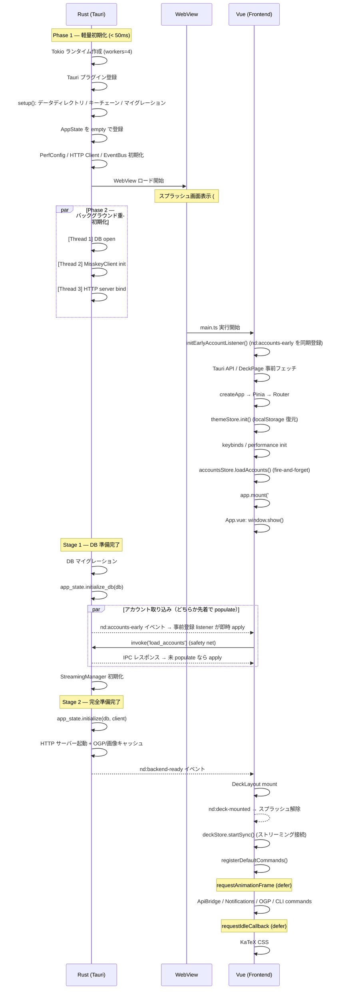
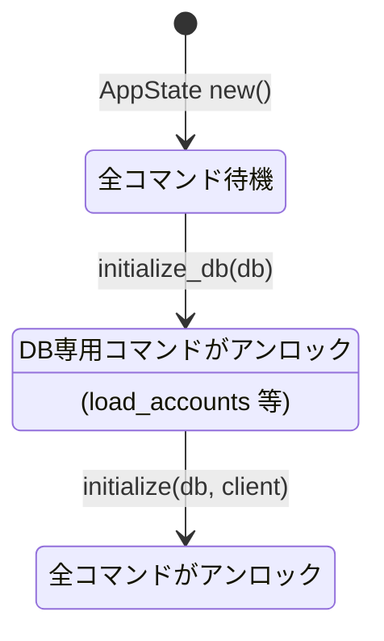
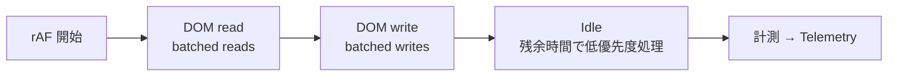
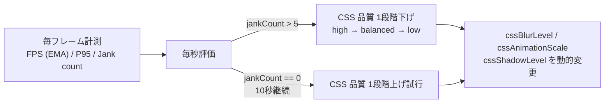

# NoteDeck Development Guide

Misskey IDE (Integrated Deck Environment) with fork support — branded as "Misskey Pro" for power users ([BRANDING.md](BRANDING.md))。設計思想・方針は [DESIGN.md](DESIGN.md) を参照。

## Tech Stack

| | |
|---|---|
| Frontend | Vue 3 + TypeScript（Vapor モード移行予定） |
| Backend | Rust (Tauri v2) + [notecli](crates/notecli/) |
| Build | Vite 8 (Rolldown) + Cargo |
| State | Pinia |
| Local DB | SQLite (rusqlite, WAL mode, FTS5) |
| HTTP | reqwest (Rust, via notecli) |
| WebSocket | tokio-tungstenite (Rust, via notecli) |
| HTTP API | Axum (localhost:19820) |
| Script | AiScript (@syuilo/aiscript) |
| Editor | CodeMirror 6 |
| Linter | Biome |
| Style | SCSS + CSS Modules (`$style`) |
| Test | Vitest + happy-dom |

## Prerequisites

### 推奨: Nix flake（ワンコマンドセットアップ）

[Nix](https://nixos.org/) がインストール済みなら、全ての開発依存が自動で揃います。

```bash
nix develop        # Node.js, pnpm, Rust 等が揃ったシェルに入る
pnpm install       # パッケージインストール
```

[direnv](https://direnv.net/) を使うと `cd` するだけで自動的に環境が有効になります（`.envrc` 同梱）。

Android SDK / NDK は nix store を数 GB 占めるため、既定のシェルには入っていません。Android をビルドするときだけ専用シェルに入ってください:

```bash
nix develop .#android    # 上記に加えて JDK + Android SDK/NDK が揃う（内訳は flake.nix）
```

### 手動セットアップ

| ツール | インストール |
|--------|-------------|
| [Node.js](https://nodejs.org/) (LTS) | 公式サイト or `nvm install --lts` |
| [pnpm](https://pnpm.io/) | `corepack enable && corepack prepare pnpm@latest --activate` |
| [Rust](https://www.rust-lang.org/) (stable) | `curl --proto '=https' --tlsv1.2 -sSf https://sh.rustup.rs \| sh` |

**Linux のみ**: Tauri のビルドに追加パッケージが必要です。

```bash
# Ubuntu / Debian
sudo apt install libwebkit2gtk-4.1-dev libappindicator3-dev librsvg2-dev patchelf
```

### 環境診断

セットアップしたのに動かないときは、原因を自力特定せず診断コマンドを実行してください:

```bash
pnpm doctor
```

必要なツールチェーン・システム依存・モバイル SDK の有無を検査し、欠落ごとに具体的な対処コマンドを提示します（[#896](https://github.com/notedeck-dev/notedeck/issues/896)）。

### エディタ / 言語サーバー

言語サーバーは開発環境に同梱されており、`nix develop` に入った時点でエディタを問わず補完・定義ジャンプが動きます:

| 対象 | 言語サーバー | 導入経路 |
|------|-------------|---------|
| Rust | rust-analyzer + rust-src | `rust-toolchain.toml` の components |
| TOML | taplo | `flake.nix` |
| Nix | nil | `flake.nix` |
| Vue SFC | vue-language-server | `flake.nix` |
| TypeScript | tsserver | `node_modules` の typescript（ワークスペース版） |

VS Code 向けの表示層は `.vscode/` に同梱（推奨拡張・ワークスペース設定・デバッグ構成）:

- `rust-analyzer.linkedProjects` で `src-tauri/Cargo.toml` を明示している（リポジトリ直下の
  `Cargo.toml` は workspace なので、他エディタは設定なしでも全クレートを読める）
- デバッグ構成「Tauri desktop (debug)」で Rust 側にブレークポイントを張れる
  （CodeLLDB 使用。vite dev server は preLaunchTask で自動起動）
- WSL2 では `nix develop` したシェルから VS Code を起動すること（EGL 対策の環境変数を継承するため）

#### IPC 境界を跨ぐジャンプ

[#897](https://github.com/notedeck-dev/notedeck/issues/897) —
言語サーバーはフロントと Rust の境界を越えられないため、`commands.xxx()` から実装へは飛べません。
生成物である `src/bindings.ts` の各コマンドに、実装ファイルへの `@see` が埋め込んであります（生成のたびに実測から作り直されるので腐りません）。

| 知りたいこと | 手順 |
|---|---|
| このコマンドの実装はどこか | `commands.xxx()` の定義へ飛び、JSDoc の `@see` のパスを開く |
| この Rust 実装を誰が呼んでいるか | `bindings.ts` を関数名（snake_case のまま）で検索して TS 側の名前を得る → その名前で `src/` を検索 |

逆方向が 2 手になるのは、呼び出し元の情報を手書きの Rust ソースへ書き戻すことになり、生成物ではなくなるためです。
どちらの手順も snake_case と camelCase の変換を人間がやる必要はありません。

## Getting Started

```bash
# Install dependencies
pnpm install

# Start dev server (Tauri desktop)
pnpm tauri:dev

# Start dev server (browser) — tauri:dev 起動中に開くと Dev Dashboard になる（下記参照）
pnpm dev
```

## Available Scripts

```bash
pnpm dev          # Vite dev server
pnpm tauri:dev    # Tauri dev
pnpm build        # Production build
pnpm tauri:build  # Tauri native build
pnpm test         # Run unit tests
pnpm test:watch   # Run tests in watch mode
pnpm test:e2e     # Run E2E tests (要デバッグビルド、下記参照)
pnpm lint         # Lint & format check
pnpm lint:fix     # Lint & format fix
pnpm typecheck    # TypeScript type check
pnpm clean        # Remove build artifacts
```

### テスト構成

テストは 2 プロジェクトに分離（`vitest.config.ts`）:

| プロジェクト | 環境 | ファイルパターン | 用途 |
|------------|------|----------------|------|
| `unit` | Node.js | `*.test.ts` | ロジック・ユーティリティ |
| `dom` | happy-dom | `*.dom.test.ts` | Vue コンポーネント・DOM 操作 |

### E2E テスト（[#702](https://github.com/notedeck-dev/notedeck/issues/702)）

実アプリ（デバッグビルド）を隔離プロファイルで起動し、外部アプリと同じ
HTTP API 面（[#709](https://github.com/notedeck-dev/notedeck/issues/709)、port 19820）で駆動する。設定は `vitest.e2e.config.ts`
（`pnpm test` とは独立、`tests/e2e/` 配下）。

```bash
cd src-tauri && cargo build && cd ..   # デバッグバイナリを用意 (初回のみ)
nix develop -c pnpm test:e2e           # WSL2 では nix develop 必須 (EGL 対策)
```

- ハーネス（`tests/e2e/harness.ts`）は一時ディレクトリを `NOTEDECK_APP_DIR`
  に指定してバイナリを spawn し、実データに触れない。バイナリの場所は
  `NOTEDECK_E2E_BINARY` で上書き可能
- port 19820 が使用中（= 実アプリ起動中）の場合は誤操作防止のため即失敗する
- デバッグビルドは devUrl（vite 5173）から frontend を読むため、vite が
  いなければハーネスが自前で起動・終了する
- アサーションは HTTP の state 読み取り（`/api/health` / `/api/deck/columns`
  等）ベース。DOM/ピクセルには依存しない
- モック Misskey サーバー（`tests/e2e/mockMisskey.ts`）でストリーミングの
  切断/再接続/購読 replay を決定論的にテストする。接続には
  `NOTECLI_INSECURE_HOSTS` / `NOTEDECK_E2E_ALLOW_HOSTS`（デバッグビルド限定の
  http/ws 許可）を使う
- CI では `xvfb-run` で実行する。視覚スモーク（`NOTEDECK_E2E_SCREENSHOT=1`
  でスクリーンショットをアーティファクト保存）は develop / main への push の
  ときだけ有効にしている。GPU なしランナーではソフトウェアレンダリングを
  強制するため実機の描画崩れは再現できず、検証も「単色ではない」ことに
  留まる（崩れの判断はアーティファクトを見る人間に委ねている）。実接続を
  伴い所要時間も大きいので、PR では回さない

#### Android 実機 / エミュレータで同一スイートを実行

アプリをデバイス上で起動した状態で、HTTP API を adb 経由でホストに引き込み、
attach モードで同じテストを流す（モック接続系テストは自動スキップ）:

```bash
adb forward tcp:19820 tcp:19820
# デバイスの api-token を取得 (デバッグビルドは run-as が使える。
# app_data_dir 配下の api-token — パスは要確認)
TOKEN=$(adb shell run-as com.notedeck.desktop cat files/api-token)
NOTEDECK_E2E_ATTACH=1 NOTEDECK_E2E_TOKEN=$TOKEN pnpm test:e2e
```

※ この手順は未実機検証。

attach モードはデバイス側アプリを終了させず、デッキ操作系テストは実際に
カラムを追加/削除する（テスト用プロファイルのデバイスで実行すること）。

## Dev Dashboard（[#977](https://github.com/notedeck-dev/notedeck/issues/977)）

`pnpm tauri:dev` 中にブラウザで http://localhost:5173/ を開くと、実行中の
アプリを外から覗く **開発者ダッシュボード** になる（アプリ未起動時は起動案内が
出て、起動を検知すると自動で切り替わる）。デッキとは独立した画面なので、
アプリの UI 状態を汚さずに観測できる。

できること:

- **デッキ状態** — カラム一覧と、折りたたみで `/api/health` raw・
  `/api/openapi.json`・起動計測（起動マーク + WebView 固定費、[#985](https://github.com/notedeck-dev/notedeck/issues/985)）・
  HEARTBEAT 状態（最終 tick / 結末 / 連続失敗、[#411](https://github.com/notedeck-dev/notedeck/issues/411)）・キャッシュ観測
  （上限つきキャッシュの size / limit 実測、[#987](https://github.com/notedeck-dev/notedeck/issues/987)）・Query Bridge トレース
  （query 往復の所要時間）。JSON はシンタックスハイライト付き
- **SSE ライブビューア** — `/api/events` を購読して Rust 側イベントバスの
  流れをリアルタイム表示。type prefix フィルタ・種別チップ（クリックで
  絞り込み）・流量表示・JSON Lines エクスポート・切断時自動再接続。
  折りたたみで Inspector 突き合わせ（アダプタ層 vs SSE の種別別カウント）
- **Capabilities 実行盤** — 登録済み capability の一覧からパラメータを
  JSON で組んで実行。external principal として dispatcher を通るので、
  権限ゲート（[#712](https://github.com/notedeck-dev/notedeck/issues/712)）の deny・確認ダイアログ・DispatchResult → HTTP status の
  写像をそのまま目視テストできる。principal 別実効権限マトリクスと
  実行履歴つき
- **統合タイムライン** — Rust の tracing ログ（Vite dev server の
  `/dev/logs` が SSE 配信、所在は `/api` インデックスの `logDir` から解決）
  + SSE イベント + フロント in-app ログを単一時系列にマージ。
  「どの層でイベントが消えたか」をソース切替しながら 1 画面で追える
- **Scalar API ドキュメント** — `/api/docs` へのリンク

仕組み: Vite の dev proxy（`vite.config.ts`）が `/api` と `/proxy` を
内蔵 HTTP サーバー（127.0.0.1:19820、[#940](https://github.com/notedeck-dev/notedeck/issues/940)）へ転送し、無認証の `/api`
インデックスが開示する tokenPath から Bearer トークンを読んで注入する。
ブラウザ側は相対パスの fetch だけで認証込みの external API を叩ける。
dev マシン上でしか成立しない橋渡しなので、本番の攻撃面は増えない。

Stream Inspector カラムとの違い: Stream Inspector は**フロントのアダプタ層**
（Misskey WebSocket の raw イベント。カラムが開いている間だけ Rust が生封筒を
流す）を見るのに対し、ダッシュボードの SSE
ビューアは **Rust 側イベントバス → `/api/events`** を見る。別系統なので、
両方を並べると「どの層までイベントが届いているか」の切り分けに使える。

位置づけ（#940 との関係）: このダッシュボードは external API の最初の
本格クライアント（dogfooding）を兼ねる。19820 に新しい面を足すときの
テストベンチとして育てる。

## MCP サーバー ([#555](https://github.com/notedeck-dev/notedeck/issues/555) / [#513](https://github.com/notedeck-dev/notedeck/issues/513))

外部の AI エージェント (Claude Code / Codex / Cursor など) が動作中の NoteDeck の capability を tool として呼ぶ面。内蔵 HTTP サーバーの `POST /mcp` (Streamable HTTP、JSON-RPC を JSON で返す。状態なし、サーバー発のストリーム無し、GET は 405) で、本体は `crates/notecore/src/mcp.rs`。

- **tool の集合と schema は AI プロバイダーに渡すものと同じ** (宣言表の `ai_tool` な capability、名前は `.` を `_` にした形、schema は `capabilities::input_schema`)。実行は既存の `capabilities/execute` (橋 → デバイスの dispatcher) なので、認可 (呼び手の principal、#712) と汚染 (#1103) は HTTP の `/api/capabilities/{id}/execute` と同じ 1 か所で効く。tool の失敗は JSON-RPC のエラーではなく `isError` の結果 (dispatcher の `code: error` をそのまま文面に)
- **認証は HTTP API と同じ Bearer**。principal は永続トークンの種別 (`api_tokens::ApiTokenKind`) が決める: 権限ウィンドウの「外部アプリ」で発行したトークンは external、ACP (#1104) のために notemaid が発行する harness 種別は ai.chat ([#1188](https://github.com/notedeck-dev/notedeck/issues/1188))。権限ウィンドウでトークンを発行すると、Claude Code 向けの登録コマンド (`claude mcp add ... --transport http`) が一緒に出る
- 永続トークン gate の対応表では `/mcp` は免除 (tools/list は静的 metadata、tools/call は dispatcher が enforce)。OpenAPI には載せない (JSON-RPC のため)。単体テストは `mcp.rs` (版の交渉 / 一覧 / 実行の写像 / 通知と batch)
- ACP (#1104) で手元の CLI を抱えるときは、この URL とトークンを CLI に渡すだけで NoteDeck の capability が使える

## 手元の CLI を AI にする — ACP ([#1104](https://github.com/notedeck-dev/notedeck/issues/1104))

ログイン済みの Claude Agent (Claude Code) / Codex / OpenCode / Hermes Agent / Grok Build を、API キー無しで AI カラムの provider にする面。CLI は ACP (Agent Client Protocol) を stdio で話す子プロセスで、**notemaid が抱える** (本体は `crates/notemaid/src/acp/`)。CLI が持つ資格情報には触れず、公式 CLI か公式アダプタをそのまま起動するだけ (規約の線引き)。

- **接続の 1 種**: 接続 id は `harness:<id>`。組み込みの一覧 (`acp/harness.rs`) は PATH で検出し、AI 設定の接続ピッカーに「手元の CLI」として並ぶ (`commands.aiHarnessList`)。利用者は ai.json5 の `harnesses[]` に自分のコマンドを足せる。`resolveAiConnection` は `kind: 'vault' | 'harness'` の直和を返し、呼び出し側は `connectionId` だけ使う
- **ターン実行器はそのまま**: `AcpProvider` は `ProviderRound` の実装で、1 ラウンド = CLI の 1 ターン。NoteDeck のセッションごとに ACP セッションを 1 つ持ち (`Registry`)、新規セッションの初回はそれまでの会話と context を prompt に畳み、以降は最新の入力だけ送る。`session/update` の `agent_message_chunk` は `delta`、`tool_call` / `tool_call_update` は `ai_turn::external` が通常経路と同じ `tool_use` / `tool_result` のカード (採番・セッション書込も同じ) に写す。CLI は tool を並列に走らせるが、デバイスの写しは「tool_use の次はその tool_result」の順しか扱えないので 1 件ずつに直列化し、表示中に届いた本文は tool_result の後に流す。NoteDeck の MCP tool は `mcp__notedeck__` などの接頭辞を剥がして通常経路と同じ tool 名 (`notes_search` の形) で見せる。タイトル生成は行わない (CLI のセッションを汚す)。1 往復の経路 (`aiChatSend`) は harness を受けない
- **capability は MCP で渡す**: セッション開始時に橋 `api-token/issue` で harness 種別の永続トークンを発行し、`POST /mcp` の URL と一緒に `session/new` の `mcpServers` に載せる。CLI の tool 呼び出しは MCP サーバー (#555) を通り、認可と汚染は同じ dispatcher で効く。**principal は ai.chat** (AI 設定の権限「AI チャット」に従う): CLI は利用者が AI として選んだ本人であって第三者ではないので、外部アプリ用トークンの external principal にはしない ([#1188](https://github.com/notedeck-dev/notedeck/issues/1188)。external だと `ai.memory.write` / `skills.write` / `ai.persona.write` / `tasks.run` / `backup.create` が preset に関わらず恒久 deny になり、CLI 自身のファイル編集も下で拒否しているため記憶を書く手段が無くなる)。トークンは notemaid / アプリの終了時に橋 `api-token/revoke` で失効 (`acp::shutdown_all`)。**確認つきの capability は人の承認を待つ**ので、`/mcp` の実行待ちの上限は人のペース (`http_server::CAPABILITY_EXECUTE_TIMEOUT`) にし、CLI 側の MCP tool のタイムアウトも同じ値を環境変数 (`MCP_TOOL_TIMEOUT`、Claude Code が見る。利用者の設定があればそちら) で子プロセスに渡す。短いと CLI には失敗と返るのに NoteDeck は承認後に実行して「後から反映される」になる (#1188 の点検で判明)
- **許可要求は確認ダイアログ**: `session/request_permission` のうち **NoteDeck の MCP tool への要求は、その段階で NoteDeck 自身に確認させる** ([#1191](https://github.com/notedeck-dev/notedeck/issues/1191)。`notedeck_capability_request`: tool 名は CLI の申告で出自の証明にならないので、`kind` が `other` / 省略で `locations` を持たないときだけ NoteDeck の tool と見なす。保護パスの拒否はそれより先に効く)。notemaid は橋 `acp/confirm` でデバイスに (capability id, 引数, ai.chat) を渡し、デバイスの dispatcher が `confirmOnly` で権限の判定と標準の確認ダイアログ (通常経路と同じプレビュー) を済ませ、承認なら `services/acpPreapproval` に記録する。直後の同じ tool 呼び出し (MCP → `capabilities/execute`) はその記録を 1 回だけ消費して `preConfirmed` で通るので 2 度聞かない。記録が無い呼び出し (CLI 側で許可要求が省かれたとき) やデバイスに届かないときは従来どおり実行時に確認する。人の承認を MCP tool のタイムアウトの内側で待たないための形 (以前は実行時にだけ確認していて、CLI には timed out と返るのに承認後に反映されていた)。CLI 自身の tool (ファイル編集 / コマンド実行など) への要求は `confirm::live_register` で即答型の確認要求 (チェックポイント無し、`capabilityId: acp.permission`) としてフロントの `confirm_request` に出す。見た目は通常経路の汎用プレビュー (`exec::preview::generic`) に揃え、「<CLI> が <tool> を実行しようとしています」+ 引数の JSON + 「実行」ボタン (文言は `_native.acp.permission`)。答えは ACP の `optionId` (allow / reject) に写像する。人格 / 記憶のファイルに触る要求 (rawInput の文字列の途中に埋まったパスも含む) は聞かずに拒否し、失敗した tool_result として残す。ターン中断で `session/cancel`
- **規約で線を引いたもの (2026-09-30 調査)**: Gemini CLI は選べない (`blocked`)。個人の Google ログインは 2026-06-18 に廃止され、Gemini CLI の OAuth を第三者ソフトから使うことは google-gemini/gemini-cli の規約文書が違反と明記している。Claude Code の表示名は「Claude Agent」 (Anthropic は Agent SDK 製の製品が "Claude Code" を名乗ることを認めていない。接続 id `harness:claude-code` は保存済みなので変えない)。OpenCode / Hermes Agent を選んだときだけ「Claude はこの経路でなく Claude Agent で」と一文出す (中で Claude のサブスクへ繋ぐのは Anthropic の規約違反)。トークンに触れない・無人で回さないのは全社共通の線
- **やらないこと**: HEARTBEAT はこの経路で回さない (`model_for_active` が harness を返さない)。モバイルは対象外。CLI のセッション読み込み (`session/load`) と fs / terminal の提供は未 (-32601)。実機での確認は `cargo test -p notemaid acp::client::live -- --ignored` (CLI の契約を 1 リクエスト使う)


## AI の人格と記憶 — ワークスペースファイル ([#1162](https://github.com/notedeck-dev/notedeck/issues/1162))

notemaid の売りは人格なので、人格と記憶は OpenClaw / Hermes Agent 流の**固定名の markdown**で持つ。ファイルが正本で、人が読み書きでき、AI 自身も認可と汚染の規則の下で更新する。設計は 4 視点 (安全 / アーキテクチャ / 上流への忠実度 / 製品) の敵対的レビューを 2 巡回して 2026-09-30 に確定した (正本は issue の「設計 v4」コメント)。**2026-10-01 に段階 1〜6 (notemaid 側 / capability / デバイス側 / UI / バックアップ / 手元の CLI) を develop に入れた**。実機確認は未。ここには確定した設計と、実装で決まった細部を書く。語彙と挙動は上流に寄せ、逸脱は NoteDeck の不変条件 (汚染 #1103 / principal 認可 #712 / notemaid の所有 / 無人の予算) が要求する所だけ。逸脱は理由ごと残す。

### ファイルと置き場

```
<app data>/notedeck/
  notemaid/                 # notemaid の持ち物。書き手は notemaid だけ (UI の編集も notemaid の RPC 経由)
    SOUL.md                 # 人格の核 (キャラクターを切り替えても変わらない)
    USER.md                 # 相手について。OpenClaw user-model の形式。上限つき
    MEMORY.md               # AI の覚え書き: 小さな耐久事実と決定 (索引ではない)。上限つき
    BOOTSTRAP.md            # 初回だけ (OpenClaw と同じ)。条件を満たしたら notemaid が消す
    turns/                  # ← ai-turns/ (checkpoint, taint.json, budget.json, heartbeat.json)
    workspace/              # ← ai-workspace/ (手元の CLI の cwd)
  skills/
    AGENTS.md               # 予約 skill: id / ファイル名 / mode: always 固定、削除・改名・toggle 拒否。notemaid が案内のコメントだけのテンプレで seed
    HEARTBEAT.md            # 予約 skill: mode: heartbeat 固定。既定では置かず「巡回の手順を編集」で初めて seed
```

- ディレクトリ名は種類名の複数形 (`memos` / `skills`) ではなく所有者名 `notemaid` (「1 つの名前 = ディレクトリ = パッケージ = バイナリ」)。`<config dir>/notemaid/` (secret の鍵) とは別物
- HEARTBEAT.md / AGENTS.md は `skills/` の**予約 skill**。既存の capability / 認可 (`skills.write`) / 汚染ラベル / バックアップ / skill UI がそのまま効き、ローダーが 2 系統にならない。予約の強制は notemaid の `skills.rs` と、notecore の汎用設定ファイル書込 (該当名の rename / delete 拒否。notecore はファイル名の定数を知るだけ) の 2 か所
- OpenClaw の TOOLS.md は AGENTS.md に書けばよい (専用の節は置かない)。IDENTITY.md は SOUL / キャラクター (persona) に内包 (Hermes と同じ)。日次ログは作らない (メモ + セッション)
- **手元の CLI の cwd を人格ファイルと同じ場所にしない (不採用)**: cwd を `notemaid/` にすると Codex / Claude Code が AGENTS.md を自動で読む利点があるが、CLI は自前のファイル操作を持つので認可と汚染規則を通さず書き換えられる。`notemaid/` に AGENTS.md を置かないので祖先探索でも拾わない。CLI の fs 書込要求が `notemaid/` 配下 (`workspace/` 以外) なら ACP の permission 中継で人に聞かず自動拒否し、notemaid は自分の書込ごとに人格・記憶ファイルの hash を記録して turn 開始時に不一致なら「外部で変更されました」を 1 行出す

### 注入の契約

- **組み立ての所有者は notemaid 一本。** デバイスが送るのは `device_context` (`<notedeck-context>`) と、その turn で新しく発火した trigger skill の id だけ。persona (session ファイルの `personaSkillId`、HEARTBEAT は ai.json5) / active な manual skill / 累積の trigger は notemaid が読み、`<persona>` ブロックも notemaid が書く
- notemaid が組んだ system は `TurnState` に保持し、ラウンドの再送 / `ProvenanceCorpus` / 予算見積り / checkpoint はそこを読む。**スナップショットの単位は turn run** (turn 開始時に読み、tool 反復 / 継続 / 再開では同じ文字列)。OpenClaw の「毎 run 再構築」と同じで、Hermes の「プロセス寿命の凍結」はセッションが無期限に再開される NoteDeck には持ち込まない。例外は手元の CLI (ACP セッション作成時に畳んだものが続く)
- 順番: SOUL → キャラクター (persona) → USER → MEMORY → NoteDeck の運用規約 (固定の文) → AGENTS → 他の always / trigger skill → device_context。Hermes 寄り (SOUL が先頭。OpenClaw は AGENTS が先頭)
- 使用率ヘッダは Hermes と同じく凍結ブロックの中に入れる (内容から決まるので prefix cache は壊れない)
- `ProvenanceCorpus` には workspace 部分 (SOUL / USER / MEMORY / AGENTS) と store 由来の skill を**入れない** (trusted にも user にも)。そこにしか無い宛先は untrusted に倒れる (tainted な turn で承認された記憶の宛先が、次の turn で trusted になり無人の宛先検査を素通りする経路を塞ぐ)
- HEARTBEAT: system は SOUL → キャラクター → USER → MEMORY → AGENTS → 固定 INSTRUCTION、**HEARTBEAT.md の本文は user 側の heartbeat メッセージ**に付ける (OpenClaw が scratch を user message に置くのと同じ)。device_context は無し。橋 `heartbeat/context` は廃止 (時刻は notemaid、口座は SyncedAccounts)。固定 INSTRUCTION は OpenClaw の既定に合わせる (「HEARTBEAT.md があればそれに従う / 過去のチャットから古い仕事を推測・反復しない / 何も無ければ `heartbeat.report` を呼ばない / 通知本文に USER の内容を書かない」)。**HEARTBEAT.md が無い、または heartbeat mode の skill 本文がすべて実質空なら tick を skip** (実質空 = OpenClaw の `empty-heartbeat-file` の定義: 空行 / コメント / 見出し / fence / 空のチェックリスト + frontmatter)。OpenClaw は scratch が無くても走ってモデルに任せるが、NoteDeck は無人の予算のため skip する (逸脱)。有効なのに空のときは HEARTBEAT セクションと heartbeat session に「巡回の手順が空です」を出し、予算で見送った tick は「巡回を見送りました (予算)」を 1 行
- 入口は `start_turn_with_sink` 一本。タイトル生成と `aiChatSend` には入れない
- どの種類のセッションに入れるか: chat / command / task / heartbeat すべてに全部。external / MCP principal には一切出さない。手元の CLI への USER.md は既定 on (CLI は利用者が AI として選んだ本人なので API 接続と同じ。AI 設定「メモリー」の「手元の CLI にも渡す」で切れる。2026-10-06 に「ACP」セクションの opt-in から移した)。OpenClaw は cron / subagent / group に USER / MEMORY を出さないが、NoteDeck の全セッションは同じ本人の私的なものなので入れる (逸脱)
- `dataSources.memos` (更新の新しい順に上位 N 件 + リンク展開) は**廃止**。常駐するのは MEMORY.md だけで、生のメモは `memos.search` / `memos.list` で必要なときに読む (上流と同じ)。`excludeTags` は注入専用の設定だったので capability 側へは移さず、注入と一緒に削除した (`memos.search` / `memos.list` に相当する絞り込みは無い)
- 上限の単位は文字数 (bytes は CJK が 1/3 になる)。人が書く SOUL / AGENTS は注入コピーを切り詰めて marker (OpenClaw)、tool が書く USER / MEMORY は書込エラーで AI に整理させる (Hermes)。外部エディタで超過させた分は切り詰めず「超過したので注入しない」を AI に伝える

### AI 自身の編集 (capability と認可)

| 対象 | capability | 権限キー | 確認 |
|---|---|---|---|
| USER.md / MEMORY.md | `memory.update` 1 本。params は Hermes の memory tool と同形 `{ action: add \| replace \| remove, target: user \| memory, content?, old_text? }`。`replace` / `remove` は一意な部分文字列で当て、曖昧ならエラー。完全重複の add は no-op | `ai.memory.write` (`aiInstruction` + `thirdPartyDeny`。presets は safe / full) | confirm。「次から確認しない」の記憶キーに `target` を混ぜる (宣言表の `confirmKeyParams`) ので USER と MEMORY で別々 |
| SOUL.md | `soul.propose` (全文の置換案) | `ai.persona.write` (既存) | **常に確認** (宣言表の `alwaysConfirm`、Rust 側で skip を無視)。未依頼の提案は禁止 |
| AGENTS.md / HEARTBEAT.md | 既存 `skills.append` / `skills.replaceSection` | `skills.write` | 既存どおり。OpenClaw の `heartbeat_respond(scratch)` (AI が scratch を自己更新) は無人書込の拒否と整合しないので採らない |

- 戻り値は Hermes と同形 `{ success, error, current_entries, usage }` (turn 内は prompt が凍っていて自分の書込が見えないため)。同一 turn の書込回数上限は置かない (Hermes は同 turn 内で整理して再試行する前提)
- SOUL / USER / MEMORY の読取 capability は作らない (prompt に入っている)。書込前の検査は不可視 Unicode と上限がエラー、Hermes 流の injection / exfil パターンは**確認強制** (拒否ではない。誤検知が害にならない形)
- 「記憶の整理は過去セッション (untrusted) を読まずメモから。詳しくは `memos.search`」「覚えるのは事実と指示だけ」「通知の本文に相手について覚えていることを書かない」は **notemaid の固定の文** (`compose.rs` の `OPERATING_RULES`) として毎 turn 入れる。当初は AGENTS.md の初期テンプレに書いていたが、利用者が消すと効かなくなる安全側の規約を編集できるファイルに置くのは筋が悪いので移した (2026-10-09)。AGENTS.md は利用者の常設の指示 (話し方や避けてほしいこと) だけを書く場所で、案内のコメントだけの初期状態 (実質空) のあいだは何も渡さない。旧テンプレのまま手付かずのファイルは、組み立てのときに新テンプレへ置き換える

### 汚染 (#1103) との整合

- **turn 内の汚染を 2 ビット**で導入する (既存の汚染はセッション単位で、session の無い HEARTBEAT は untrusted を読んでも tainted にならなかった)。`confirm_forced` (skip の記憶を無視して必ず確認) と `label_writes` (メモ / skill にラベル)。`context_untrusted` / untrusted な capability の非エラー結果 / `outcome.tainted` は両ビット、**store 由来 (`store_id` 付き) の skill が文脈にあれば `confirm_forced` だけ** (全 capability の skip を止めるが、ラベル伝播で全セッションを汚さない)。継続 turn は前 turn の値を引き継がず、`TurnState` に持って checkpoint で再開後も維持。intent event の `reason` に乗せてセッションファイルに永続化し、`runIntent` はそれを読む
- 有人 (チャット) で tainted のときの USER / MEMORY 書込は**確認強制** (拒否ではない。TL や通知を読むのがこのアプリの主用途で大半のセッションが早々に tainted になる)。**人が承認した項目には汚染ラベルを付けない** (メモと違う点。常に注入されるファイルにラベルを残すと以後の全セッションが汚染される。#1103 の例外規定)
- 無人 (HEARTBEAT) からの SOUL / USER / MEMORY 書込は拒否 (intent カードにもしない)。MEMORY の整理は提案まで
- 確認カード (USER / MEMORY の書込と SOUL 提案) は束ねず 1 枚 1 件 (束ねると diff が落ちる)。人間語の差分 1 行、汚染源 (「このセッションで読んだ他人の内容: …」)、store skill が理由なら専用の一文 (自分で選んだキャラクターを「他人の内容」と言わない)、項目本文が untrusted の本文にだけ現れる文と一致したら赤字、本文は生テキストで描画。「次から確認しない」のチェックは tainted な turn では出さない
- 読込 (注入) は tainted なセッションでも外さない (途中で人格と記憶が消える方が悪い)。注入で USER.md の内容を投稿に流す経路は、投稿系が tainted で確認強制になることで受ける
- `taint.json` の移行は fallback ではなく新旧の union (安全側)

### 初回とテンプレ

- テンプレは `crates/notemaid/templates/<lang>/` の素の markdown (`lint:i18n` の対象外)。言語は notemaid が `locale.json5` + OS locale から決める。1 回書いたら利用者のファイル
- SOUL.md テンプレは OpenClaw の SOUL テンプレの見出し (Core Truths / Boundaries / Vibe / Continuity) に沿い「意見を持つ / 迎合しない / 簡潔」を核に。末尾は「変えたいときは提案して承認をもらう」
- USER.md は OpenClaw user-model の形式 (`<!-- observed: YYYY-MM-DD | status: active -->` + `- Prefer / Always / Never …`)。変わったら旧項目を `superseded` にして書き直す。話し方の好みもここ。「評価・同意は書かない、事実と指示だけ」は書込規則と SOUL の核で受ける。MEMORY.md は自由な markdown の箇条書き
- **BOOTSTRAP.md** (OpenClaw の first-run ritual): 儀式の主役は AI 自身の名前と雰囲気 (→ SOUL 提案)、相手については呼び方だけ聞く (最初に個人情報を集めない)。存在する間は注入するが「頼まれたときだけ儀式を始める。未依頼で聞かない (chat でも HEARTBEAT でも)」を本文に書く。削除条件は OpenClaw の fallback と同じ「SOUL.md か USER.md がテンプレと違う」+ 「あなたのことを覚える」を OFF にしたとき
- 起点は AI カラムのセッション一覧の空状態に置くローカル文の挨拶 + ボタン「呼び方を教える」(AI を呼ばずに出せる)。再入口は「あなたについて」カードの空状態。USER OFF のときは隠す
- 記憶の自動保存 (Hermes の post-turn review / OpenClaw の compaction 前 flush) は入れない (無人の別 turn は予算に効く)。セッション切替時の催促も作らない

### UI

- 一般側の面は 2 セクション 3 枚: セクション「ペルソナ」に **「人格」** (SOUL の状態とヒントだけ。本文の編集は開発者モードの AI 設定「SOUL.md」タブ = Markdown のコード編集か外部エディター。設定画面の textarea で markdown を直接触らせると見出しの構造を壊すので置かない、[#1186](https://github.com/notedeck-dev/notedeck/issues/1186)) + キャラクターのカード (persona ピッカー) / セクション「メモリー」に **「あなたについて覚えていること」** (本文、行の inline 編集と削除、トグル「あなたのことを覚える」と「手元の CLI にも渡す」、「すべて忘れる」) と **「覚え書き」** (本文、行の inline 編集と削除)。AI 設定の「接続」と「ACP」(手元の CLI) も別セクション。候補から選ぶカード (接続 / AI プロバイダ / ACP / キャラクター / ペット) は共通の `ChoiceCard` + `ChoiceCardGrid`
- **USER OFF の意味** = 注入停止 + `memory.update` の `target: user` を本体が拒否 (tool 一覧からは外さず、エラーで知らせる) + 定数 1 行「利用者に関する記憶は OFF」を system に + MEMORY の書込規則に「本人に関する事実は書かない」。削除はしない (「すべて忘れる」が別)。OFF 中もバックアップには入る旨を説明文に
- ファイル名は UI に出さない (「設定フォルダを開く」で見える。OpenClaw は Settings → Files で編集、Hermes はパスを直接教える。これは製品判断)。使用率バーは出さず、上限に近いときだけ 1 行。書込の tool カードは人間語の差分 1 行、「覚えました」トーストは作らない
- 予約 skill は配布物ではなく AI の土台なので**スキルカラムには出さない** (2026-10-09。サイドロードに並んで利用者が入れたスキルのように見えていた)。編集の入口は AI 設定: ペルソナの「ルール」(AGENTS.md、`maid_agents_seed` で無ければ置いてから skill エディタで開く) と HEARTBEAT セクションの「巡回の手順を編集」(HEARTBEAT 有効時だけ)。mode と名前は固定のまま
- 「送った system prompt」は開発者モードのウィンドウ (Raw JSON インスペクタと同族)。入口はメッセージ / tool カードのメニュー。メモリ保持のみで永続化しない (sessions/ に写すとバックアップにも複製される)

### 移行・バックアップ・RPC

- `ai-turns/` → `notemaid/turns/`、`ai-workspace/` → `notemaid/workspace/` の rename は `notemaid::migrations::run_fs` (notemaid クレート)。daemon は lock 取得後、アプリは in-process のときだけ呼ぶ。sidecar / 常駐時は transport の `Hello` に `fs_layout` を足し、不一致なら `restart_resident()` で古い daemon を先に止める。失敗しても起動は止めず、新パスに無ければ旧パスを読む
- バックアップ: `ALLOWED_SUBDIRS` に `notemaid` を**足さない** (汎用 list / read / write / delete / rename が allowlist だけで通り、上限・承認・汚染規則を素通りする)。`export_bundle` に SOUL / USER / MEMORY を明示列挙。import は専用分岐で名指しの 3 ファイルだけを置き、見えない文字を含むものは外す (上限超過は読む側の「注入しない」で受ける)。アプリの import は人格 / 記憶が入っていれば置き換える前に一覧つきで 1 回聞き、断られたらその分だけ外して残りを入れる。notemaid は毎 turn ファイルを読むので reload 通知は要らない
- UI 編集の RPC (`data` 級、notemaid 経由): `maid_workspace_list()` / `maid_workspace_write(kind, body)` / `maid_user_memory_set(enabled)`。変更通知は `SettingsChange { subdir: "notemaid" }` を relay し、`settingsFileSync` に `notemaid` 用ハンドラを 1 つ足す

### 製品判断として確定したもの (2026-09-30)

persona は残し「人格」1 枚の中のキャラクター行にする / USER・MEMORY は command・task セッションにも入れる / USER.md はバックアップに入れる / USER への「次から確認しない」は許す / injection パターン検査は確認強制として入れる / HEARTBEAT.md が無ければ skip / SOUL は提案 + 常に承認 / `dataSources.memos` は廃止 / HEARTBEAT の既定予算は実測後に見直し

## Architecture

NoteDeck は 1 つのリポジトリ (Cargo workspace) で、`crates/notecli` (Misskey クライアント + CLI)、`crates/notecore` / `crates/notemaid` (下記「目指す構成」) と `src-tauri` (アプリの Rust) を持ちます (notecli は 2026-09-23 に別リポジトリから取り込んだ、[#1106](https://github.com/notedeck-dev/notedeck/issues/1106))。

### notecli (`crates/notecli`)

Tauri に依存しない Misskey ヘッドレスクライアント。Rust ライブラリ兼 CLI。

- Misskey HTTP API クライアント、WebSocket ストリーミング、SQLite DB、REST API サーバー
- 単体の daemon モード（`localhost:19820` の HTTP API）は撤去した（#1106）。HTTP API サーバーはアプリが notecore の `http_server.rs` で立てる
- アプリの Rust (`src-tauri`) がパス依存で利用する。CLI バイナリはリリースの成果物として同じタグから出す

### notedeck (このリポジトリ)

notecli の上に Tauri v2 + Vue 3 の GUI を載せたクライアント。
対象プラットフォームは Windows / macOS / Linux / Android。

### 目指す構成: notecore と notemaid ([#1106](https://github.com/notedeck-dev/notedeck/issues/1106))

`src-tauri/` には Tauri に依存しないドメイン (Vault / クエリランタイム / 画像キャッシュ / 設定ファイル store / 認可解決) が同居していた。これを **notecore** (notedeck リポジトリ内の同名クレート、2026-09-23 に切り出し済み) に集める。AI が所有するもの (エージェントループ / HEARTBEAT / capability の実行 / セッション / skill / メモ / AI 設定) は **notemaid** (lib + bin の 1 クレート、notecli と同形) に置く (2026-09-29 に切り出し済み)。**notemaid は常に別プロセス**で、アプリは AI 系コマンドを socket (Windows は named pipe) で送る。違うのは誰が起動するかだけ: アプリが同梱の sidecar を子プロセスとして起動し終了時に落とす (既定、デスクトップ、設定ゼロ) / ログイン時のユーザー権限タスクとして常駐 (任意のトグル 1 つ。systemd user unit / LaunchAgent / Run キー ONLOGON、Hermes / OpenClaw と同じレシピで管理者権限も Service も不要)。別の端末やサーバーで動く notemaid に繋ぐ構成 (リモート) は採用しない (2026-09-29、理由は ROADMAP)。in-process は iOS / Android と sidecar の無い開発時の transport (コマンド面は同じ)。常駐の対象は notemaid だけで、データ面は常に手元で動く。

2026-09-29 までは「notecore 全体を notecored として自分のサーバーで常駐させる」構成 (データ面の常駐) を目指し、同一ホスト版まで出荷したが、#1106 で中止した (不採用の理由: 購読がセッション所有なのでアプリを閉じている間の蓄積が無く、中継の直列化の税だけが残った / SNS クライアントに daemon 形態の前例が無く、常駐状態はサーバー側が持っている / データ面を含めても AI 面だけでも、届く層は自前サーバー派だけで維持税だけが違う)。旧 `crates/notecored` は notemaid の bin (`daemon` feature、`src/main.rs` + `src/daemon/`) に統合して削除した。

```
フロントエンド (Vue)                WebView は常に手元の Rust とだけ話す
      │ IPC
┌─ アプリ (Tauri、手元) ────────┐   AI 系コマンド    ┌─ notemaid (常に別プロセス) ───────────────────┐
│ OS 統合 + クライアント層     │ ───────────────▶ │ メイド (ループ / HEARTBEAT / 配送)           │
│  notecore (データ面、常に手元)│  socket /        │  notecore (共有基盤: Vault / 認可 / 設定だけ。│
│  notecli                     │  named pipe      │            notes DB は開かない)              │
└──────────────────────────────┘                  │  notecli                                     │
                                                  └──────────────────────────────────────────────┘
誰が notemaid を起動するか: アプリが sidecar を子プロセスで (既定、設定ゼロ) / ログイン時のユーザータスク (任意、常駐)。別の端末やサーバーで動く notemaid に繋ぐ構成 (リモート) は採用しない (2026-09-29、理由は ROADMAP)
iOS / Android は in-process の transport (コマンド面は同じ)
```

- **切る基準**: 「その処理はデバイスが 1 台も繋がっていない状態で意味を持つか」。持つなら notecore、持たないなら手元 (ウィンドウ / トレイ / OS 通知 / クリップボード / dialog / OS キーチェーン)。AI が所有するものは notemaid
- **notecore と notemaid の関係は、クレートでは「上に載る」、プロセスでは「並列」**。クレートの依存は notecli ← notecore ← notemaid ← アプリの一方向で、notemaid が notecore から借りるのは共有基盤 (Vault / principal の認可 / 設定ディレクトリと設定ファイルの store / アカウント情報 / i18n) だけ。データ面 (notes DB / ストリーミング / クエリランタイム) には依存しない。依存先が共有基盤に限ると確かめられたら、それを notecore の下層に割ってデータ面と AI 面を並列にしてもよい。notecore は AI を知らない。capability の**宣言表** (語彙) は認可と HTTP API 面も参照するので notecore、**実行**は notemaid。**データ面の notecore はデバイスに 1 つ (アプリの中) だけで、notemaid は notes DB を開かない** (2 プロセスで同じ DB を触ると、常駐タスクの notemaid がアプリ更新後に古い版のまま新しいスキーマを開く事故と排他ロックが戻ってくる)。Misskey は notecli で直接叩き、アプリが生きていれば socket でアプリ側の notecore にキャッシュを聞く。HEARTBEAT の cheap check も API で足りる。同一端末では設定ディレクトリを共有し、書くのは自分の持ち物 (セッション / メモ / skill / AI 設定) だけ。トークンは同じユーザーセッションの OS キーチェーンを読み、アカウント一覧は接続時にアプリから受け取る (secret の file backend は、キーチェーンの無い環境で `notemaid run --secrets file` を手で使うときだけ)。メイドの持ち物 (セッション / メモ / skill / AI 設定) は同じ設定ディレクトリのファイルで、端末はそれを編集する
- **クライアント層**は手元の Rust の中の切替点 1 箇所。データ系コマンドはコマンド表 (型付き関数 + JSON アダプタを 1 つの宣言から生成) を通り、常に in-process の埋め込み notecore を呼ぶ。AI 系コマンドは notemaid 側の表を通り、`client.json5` の `backend` が `auto` (既定) なら `maid_launcher` が起動時にまず既定の場所 (`notemaid::transport::default_endpoint`) を叩き、居れば繋ぎ (常駐)、居なければ同梱の sidecar を親 pid 入りの場所で子プロセスとして起動して繋ぐ。sidecar が無い (`NOTEDECK_NOTEMAID` で差し替え可) / iOS / Android は in-process。**開発時もアプリの実行ファイルの隣 (`target/debug/notemaid`) があれば sidecar として使う**ので、`pnpm tauri:dev` は起動前に `cargo build -p notemaid` で作り直す (`tauri dev` は notemaid を作らず、古いバイナリが黙って使われていた。旧版の挙動が戻ったように見えたらまずこれを疑う)。起動中に notemaid を変えたら作り直してアプリを再起動する。`embedded` は常に in-process、`resident` は常駐にだけ繋ぐ。子は `--exit-on-stdin-close` で親の stdin の EOF を待ち (全 OS)、Linux は PDEATHSIG も掛ける。子も常駐も OS キーチェーン (`--secrets keychain`)、サーバー (headless) だけ暗号化ファイル。AI 設定のHEARTBEAT の「アプリを終了しても続ける」(`AiHeartbeatResidentRow`) の常駐トグルは `maid_launcher::set_resident` で、子プロセスを止めてログイン時タスク (`notemaid service install/enable`: systemd user unit / LaunchAgent / Run キー) を登録し、中継の繋ぎ先を再起動なしに付け替える (`RelayClient::switch_to`)。デッキ描画は notemaid の起動を待たず、AI 系の要求だけが接続を上限つきで待つ。版は sidecar なら常に同じ、常駐は指紋照合でずれを検知する。表に載っていないデータ系コマンドはどの構成でも存在しない
- **AI エージェントループは Rust で notemaid に置く** (`crates/notemaid`、2026-09-29 に切り出し済み) ([#1133](https://github.com/notedeck-dev/notedeck/issues/1133))。WebView に残るのは UI、確認ダイアログ、UI 系 capability、AiScript (plugin / widget / scratchpad) の実行。チャット 1 ターンの状態機械 (ターン実行器)、確認要求、セッションの書込 (単一の書き手) と汚染の記録は移設済み。純データ系の capability (ノート / ユーザー / 通知 / アンテナ / チャンネル / ロール / リスト / クリップ / ドライブ / お気に入り / チャット / registry / アナウンス / Pages / Play / ギャラリー / 連合 / 外部 HTTP / MisStore の読取と書込、AI セッションの読取、principal の権限解決、skill / メモ / テーマ / カスタム CSS / プラグイン / ウィジェット / クエリの読み書き (AiScript の構文検証が要る作成・更新はデバイス)、キーバインド / ナビバー / パフォーマンス設定の読み書き (ナビバーの全置換はカラム種別の実行時レジストリで検証するのでデバイス)、persona の切替と AI の自己参照 (`meta.*`)。正本は宣言表の `exec` 属性) は `exec: core` で notemaid が直接実行し、確認内容の組み立て (プレビュー) も Rust 側 (`crates/notemaid/src/exec/preview.rs`)。デバイスの状態に触るもの (UI / ミュート / Vault / 下書き / 設定系) はデバイスへの実行要求 (詳細は [AI Chat Streaming](#ai-chat-streaming))。設定系の `exec: core` 化 (#1098 の services が前提) / HEARTBEAT の無人契約は後続
- notecli の役割 (Misskey 通信・DB・ストリーミング) は変えない。notecore はその消費者。**notecli は notedeck の workspace に取り込む** (リポジトリは 1 つ、クレートは notecli / notecore / notemaid / アプリの 4 つ。`notecli` の CLI と `notemaid` の daemon はクレートからバイナリとして出し、notemaid の daemon 専用依存は `daemon` feature の裏に置いてアプリには乗せない)
- 段階と受け入れ条件、認証・イベント面・状態の所在の仕様は #1106 の仕様コメントが正本 (2026-09-29 のコメントで AI 面に縮めた後の読み方が優先)。子プロセスが既定で、常駐は同じ端末のログイン時タスク。リモートは採用しない

**今すぐ守ること (段階 0a、機械検査あり)**:

- notecore 側のモジュールは `crates/notecore` に置く (2026-09-23 にクレート化済み)。notecore は `tauri` を参照せず、Cargo.toml に tauri 系を足さない (`tests/lint/rustCoreBoundary.test.ts`)。手元側 (WebView / managed state / OS 統合) が要る処理は trait (`FrontendBridge` / `AiChatSink`) で受け取り、Tauri 側 (`src-tauri/`) が実装を渡す。app dir のような値は `&Path` で受ける
- **データ系コマンドは notecore のコマンド表に載せる** (`crates/notecore/src/commands/table.rs`、#1106 §4.1。2026-09-23 に既存のデータ系は全件移行済み。跨り (mixed) も「データ側は notecore の関数 (`export_service` / `backup_service` / `commands::admin` 等)、手元側は dialog や保存先の解決だけの薄い包み」に分けたので、`src-tauri/src/commands/` に `#[tauri::command]` で残るのは local と authz だけ)。本体は `&Core` と引数を取る関数として `crates/notecore/src/commands/<module>.rs` に書き、表に 1 行足す。表から Tauri ラッパー (`src-tauri/src/commands/table.rs`)、JSON アダプタ (`dispatch`)、フィクスチャが生成され、属性検査 (許可ウィンドウ) は型付き経路でも JSON 経路でも本体の前に通る。全コマンドを JSON 経路で往復させるテストが notecore にあり、引数の型は `Default` を要求する。手元側 (OS 統合) と認可境界のコマンドは従来どおり `#[tauri::command]` で書く
- **行数の多い DB の読み書き (取り込み / キャッシュ検索 / 一括削除) は `Core::blocking` を通す** (notecli の Database は同期の rusqlite なので、async の本体から直接呼ぶと tokio の worker を塞ぐ)。1 行のキー引きや統計は直接呼んでよい。プール化や async API を notecli 側に持たせる判断 (#1098) はこの境界の裏で差し替える
- 表に載らない `#[tauri::command]` は直前の行に種別マーカー `// nd-command: <kind>` を持つ (`tests/lint/rustCommandKinds.test.ts`)。種別は `data` (データ系、notecore で実行できる) / `local` (OS 統合、手元に残る) / `authz` (認可境界を動かす操作: 権限ファイル / 信頼設定 / 公開 API トークン / Vault secret / アカウント資格情報。) / `mixed` (data と local が同居、段階 0b で分割)。優先順位は authz > mixed > local > data。認可境界に触れる本体は denylist で二重に検査され、authz 以外なら落ちる

```
src/                        # Vue 3 frontend
├── adapters/               # Server API adapters (Misskey, forks)
│   ├── types.ts            # Shared interfaces (ServerAdapter, ApiAdapter, StreamAdapter)
│   ├── registry.ts         # Adapter factory
│   └── misskey/            # Misskey implementation (IPC via invoke/listen)
├── aiscript/               # AiScript runtime & Misskey Play API
├── commands/               # Command registry, definitions, CLI handlers
├── components/             # Vue components
│   ├── common/             # MkNote, MkPostForm, MkEmoji, CommandPalette, etc.
│   └── deck/               # DeckLayout, DeckColumn, column types
├── composables/            # Vue composables (useNoteFocus, useTimeMachine, etc.)
├── core/                   # Business logic (server detection)
│   ├── queryDeltaBus.ts    # query-delta の単一リスナー多重化・復帰時再アタッチ
│   ├── queryRegistry.ts    # プラグイン fan-out 用の queryId refcount レジストリ
│   └── streamHealth.ts     # 生のストリーム接続状態台帳 (#698)
├── data/                   # Static data & constants
├── router/                 # Vue Router definitions
├── services/               # 純ロジック (正規化 / マイグレーション / マージ規則 / codec / 述語)。store・Vue・Tauri に依存せず、テストは隣に置く (#782 / #1098 §5)
├── stores/                 # Pinia stores (accounts, deck, servers, emojis, theme, etc.) — 購読 + キャッシュ + UI 状態
├── styles/                 # Global CSS (CSS variables)
├── theme/                  # Misskey-compatible theme compiler & applier
├── utils/                  # Tauri / DOM / localStorage の薄いラッパーと UI 向けヘルパー (i18n を引くもの)。純ロジックは services へ
└── views/                  # Page components (NoteDetail, UserProfile)

crates/notecore/src/        # notecore (Tauri 非依存のデータ領域、#1106)。AI を知らない
├── lib.rs                  # モジュール一覧と境界の説明
├── error.rs                # Result alias (エラー型は notecli の NoteDeckError)
├── context.rs              # Core: 実行文脈 (DB / Misskey クライアント / OGP、二段階初期化)。旧 AppState
├── commands/               # コマンド表 (table.rs) とデータ系コマンドの本体 (timeline.rs, ...)
├── permissions_gate.rs # external principal gate (#712) — 永続トークンの per-route 権限判定
├── permissions_profile.rs # permissions.json5 → 実効権限の解決 (#1099) — JS と golden vector で一致検査
├── image_cache.rs      # 3-tier image cache (memory → disk → network)。host 単位の 429 throttle 窓と half-open circuit breaker で一時失敗を  のエラーにしない
├── emoji_cache_store.rs # サーバー絵文字辞書のディスクキャッシュ (host 単位、鮮度内なら起動時の全件取得を省く)
├── media_warm.rs       # メディア先行取得キュー (辞書到着時に絵文字 variant を低優先で温める)
├── ogp/                # OGP metadata extraction & cache
├── ssrf.rs             # SSRF 防御 (URL / IP の一次検証 + DNS pinning)。汎用 fetch / 画像 / Vault / エクスポートが共用
├── settings_store.rs   # 設定ファイル store (allowlist が正本、export / import)
├── credentials.rs      # アカウント資格情報の解決 (メモリキャッシュ → keychain → DB)
├── shutdown.rs         # 終了時のタスク所有。tokio Handle を受け取る
├── query_runtime.rs    # クエリランタイム本体 (購読台帳 / 差分バッファ / 読み取りモデル)。コマンドと flusher は commands/query.rs
├── vault/              # Secret Vault (#564)。app dir を &Path で受け、Tauri を知らない
├── http_server.rs      # Axum HTTP API server (localhost:19820)。手元側への問い合わせは FrontendBridge 経由
├── frontend_bridge.rs  # HTTP API → 手元側 (WebView / managed state) の問い合わせ口 trait
├── perf_config.rs      # パフォーマンス設定 (Rust 側)
├── clock.rs            # now_ms (notemaid のセッション / メモと notecore のテーマ / サイドカーが同じ時計を使う)
├── capabilities/       # capability の宣言表 (generated.rs、認可と HTTP API が参照する語彙)。実行は notemaid

crates/notemaid/src/        # notemaid (AI、#1106)。notecore の上に載り、データ面 (notes DB / ストリーミング) には依存しない
├── lib.rs                  # モジュール一覧
├── main.rs                 # バイナリの入口 (`daemon` feature): run / status / service / secrets
├── daemon/                 # 別プロセスの本体: run (Core の組み立て / HEARTBEAT timer / RPC 面)、rpc_server、sinks、service (systemd)、lock、logging、exit
├── transport.rs            # アプリ ⇄ notemaid の経路 (Unix socket / Windows named pipe)、既定の場所と子プロセスの場所
├── sinks.rs                # CoreMaidExt: Core の EventSink (名前 + JSON、notecore の型) を AI 側の 3 つの sink の形で引く薄い変換
├── commands/               # AI 系のコマンド表 (table.rs) と本体 (ai_chat.rs / ai_sessions.rs / heartbeat.rs)。生成器は notecore の define_command_table!
├── ai_turn/                # ターン実行器 (#1133): ラウンドの反復 / 確認 / 汚染 / チェックポイント
├── exec/                   # `exec: core` な capability の本体と確認プレビュー
├── heartbeat.rs            # HEARTBEAT の本体 (tick ごとの skill 実行、報告、失敗停止)
├── ai_chat_service.rs      # AI SSE クライアント (Anthropic / OpenAI 互換)
├── ai_sessions.rs / ai_budget.rs / ai_config.rs  # セッションの単一書き手 / 日次 token 予算 / ai.json5
└── skills.rs / memos.rs    # skill とメモ (AI の持ち物)

crates/notecli/             # Misskey クライアントライブラリ + CLI (Misskey 通信 / DB / ストリーミング)

src-tauri/src/              # Rust backend (Tauri 固有部分 = 手元側)
├── lib.rs                  # App setup (tray, plugins, state)
├── commands/               # Tauri IPC command handlers: データ系は表から生成、残りは手元側 (local / authz / mixed)
│   ├── mod.rs              # 再公開と Tauri 側の sink (OGP ヒント等)
│   ├── table.rs            # notecore のコマンド表から Tauri ラッパーを生成 (#1106)。データ系コマンドはすべてここ経由
│   ├── api_tokens.rs       # 認可境界 (公開 API トークン)。資格情報 / secret / 信頼設定の本体は notecore の commands/ (admin.rs / auth.rs / vault.rs) で、表の authz 行
│   ├── settings.rs / backup.rs / export.rs / utility.rs  # dialog / OS 統合 / 端末のファイル (local / mixed)
│   ├── heartbeat.rs / health.rs / system_state.rs  # 手元のランタイム (HEARTBEAT scheduler / 診断 / OS 状態)
│   ├── query.rs            # クエリランタイムの delta flusher と Tauri イベント
│   └── ai_chat.rs          # AI チャットのイベント sink
├── client_layer.rs         # AI 系コマンドを別プロセスの notemaid に中継する口 (接続 / 再接続 / AI イベント転送 / 橋の問い合わせ / 状態面)
├── maid_launcher.rs        # notemaid の起動役: 常駐が居れば繋ぎ、居なければ同梱の sidecar を子プロセスで起動 (親の死で一緒に終わる)
├── streaming.rs            # TauriEmitter adapter (FrontendEmitter trait impl)
├── query_bridge.rs         # FrontendBridge の Tauri 実装 (Tauri イベントで Pinia store に問い合わせる)
└── main.rs                 # Entry point
```

**層の依存方向** (#1098、`tests/lint/layerImports.test.ts` が検査する):

```
components → composables → stores → services → adapters → bindings
```

services は store / composables / components / Vue / Pinia を runtime import しない (純ロジック)。stores は composables を、adapters は stores を import しない。components は IPC (`tauriInvoke` / `bindings`) と adapter の factory を直接叩かず composable を通す。既存の違反は lint の凍結一覧に理由つきで載っていて、直したら消す。`import type` は依存に数えない。

Misskey API クライアント・DB・モデル・ストリーミングコアは `notecli` クレートにある。`src-tauri/` が抱えていた Tauri に依存しないドメイン (OGP 抽出とサイト別プラグイン / Secret Vault / クエリランタイム / 画像キャッシュ / HTTP API サーバー / カラムクエリの QIR 評価器) は notecore に、AI SSE クライアントは notemaid に移した (上のツリー)。

置き場の規則 (#782):

- `commands/*.rs` は IPC アダプタ。State の取り出しとパス解決だけを行い、薄く保つ
- トップレベルの `*_service.rs` / `*_store.rs` / サブモジュールは、引数を取って単体テストできるサービス。`AppHandle` や `State` を直接受けない
- Misskey の API / DB / ストリーミングに関わる共通処理は notecli に足す (フォークやスタンドアロン CLI からも使えるように)

この規則は一部のモジュールにしか適用されておらず (notecore の column_query / http は commands/ にドメインを持つ)、ドメインをクレートに切り出すかも含めて #1098 で扱う。終了時のタスク所有は `shutdown.rs` に一元化されている。

### Boot Sequence

NoteDeck は **UI 表示までの時間を最小化** するため、バックエンドの重い初期化をバックグラウンドで行いながらフロントエンドを先行起動する設計になっている。

#### 全体フロー

Rust バックエンドとフロントエンドが並列に動作し、イベントで連携する。


```mermaid
sequenceDiagram
    participant R as Rust (Tauri)
    participant W as WebView
    participant V as Vue (Frontend)

    Note over R: Phase 1 — 軽量初期化 (< 50ms)
    R->>R: Tokio ランタイム作成 (workers=4)
    R->>R: Tauri プラグイン登録
    R->>R: setup(): データディレクトリ / キーチェーン / マイグレーション
    R->>R: AppState を empty で登録
    R->>R: PerfConfig / HTTP Client / EventBus 初期化
    R->>W: WebView ロード開始

    Note over W: スプラッシュ画面表示 (#nd-splash)

    par Phase 2 — バックグラウンド重初期化
        R->>R: [Thread 1] DB open
        R->>R: [Thread 2] MisskeyClient init
        R->>R: [Thread 3] HTTP server bind
    end

    W->>V: main.ts 実行開始
    V->>V: initEarlyAccountListener() (nd:accounts-early を同期登録)
    V->>V: Tauri API / DeckPage 事前フェッチ
    V->>V: createApp → Pinia → Router
    V->>V: themeStore.init() (localStorage 復元)
    V->>V: keybinds / performance init
    V->>V: accountsStore.loadAccounts() (fire-and-forget)
    V->>V: app.mount('#app')
    V->>V: App.vue: window.show()

    Note over R: Stage 1 — DB 準備完了
    R->>R: DB マイグレーション
    R->>R: app_state.initialize_db(db)

    par アカウント取り込み（どちらか先着で populate）
        R-->>V: nd:accounts-early イベント → 事前登録 listener が即時 apply
        V->>R: invoke('load_accounts') (safety net)
        R-->>V: IPC レスポンス → 未 populate なら apply
    end

    R->>R: StreamingManager 初期化

    Note over R: Stage 2 — 完全準備完了
    R->>R: app_state.initialize(db, client)
    R->>R: HTTP サーバー起動 + OGP/画像キャッシュ
    R-->>V: nd:backend-ready イベント

    V->>V: DeckLayout mount
    V-->>V: nd:deck-mounted → スプラッシュ解除
    V->>V: deckStore.startSync() (ストリーミング接続)
    V->>V: registerDefaultCommands()

    Note over V: requestAnimationFrame (defer)
    V->>V: ApiBridge / Notifications / OGP / CLI commands

    Note over V: requestIdleCallback (defer)
    V->>V: KaTeX CSS
```

#### Two-stage AppState

バックエンドの初期化を 2 段階に分けて、DB が準備できた時点で一部のコマンドを先行アンロックする仕組み（`crates/notecore/src/context.rs` の `Core`。旧 AppState）。


```mermaid
stateDiagram-v2
    [*] --> Empty : AppState new()
    Empty --> DB_Ready : initialize_db(db)
    DB_Ready --> Fully_Ready : initialize(db, client)

    Empty : 全コマンド待機
    DB_Ready : DB専用コマンドがアンロック
    DB_Ready : (load_accounts 等)
    Fully_Ready : 全コマンドがアンロック
```

内部的には `tokio::sync::watch::channel` を 2 本持ち、`db()` は DB チャネルのみ、`client()` はフルチャネルを待機する。これにより `load_accounts` のようなDB専用コマンドは MisskeyClient の初期化を待たずに応答できる。

#### スプラッシュ画面

`index.html` にインラインで定義された `#nd-splash`（ハートビートアニメーション付きロゴ）。

- **表示**: WebView ロード直後（Vue マウント前から表示済み）
- **解除**: `uiStore.deckMounted`（DeckLayout のマウント完了）を `App.vue` が watch して解除
- **フォールバック**: タイムアウトで強制解除（時間は `App.vue` の splashTimeout が正本）
- **アニメーション**: `opacity: 0` トランジション → `transitionend` で DOM 削除
- **計測**: 起動フェーズは `src/utils/startupTrace.ts` の performance.mark で記録し、About ウィンドウの「起動パフォーマンス」に表示（#985）

データ（ノート等）のロード完了は待たず、カラムフレームの描画が完了した時点でスプラッシュを解除する。

#### 起動時の最適化テクニック

| テクニック | 実装箇所 | 効果 |
|-----------|---------|------|
| Two-stage AppState | notecore `context.rs` | DB 準備次第でアカウント読み込み開始 |
| 早期アカウントイベント | `lib.rs` → `nd:accounts-early` | IPC 往復を待たずにフロントへ通知 |
| 事前登録 listener | `stores/accounts.ts:initEarlyAccountListener` | `main.ts` 最上部で `listen()` を同期登録し、Rust 側 emit を取りこぼさない（Pinia 初期化前でも module-scope バッファに保存） |
| 未ロード時の空状態ガード | `DeckColumn.vue` `requireAccount` prop | カラム本体スロットを `accountsStore.isLoaded` まで抑制し「アカウントが見つかりません」の一瞬のチラつきを防止 |
| 動的 import 事前フェッチ | `main.ts` | DeckPage / カラムチャンクを並列ダウンロード |
| テーマ localStorage 復元 | `themeStore.init()` | ネットワーク不要で FOUC 防止 |
| 3 スレッド並列初期化 | `lib.rs` Phase 2 | DB / Client / HTTP bind を同時実行 |
| 非クリティカル処理の defer | `useDeckInit` | rAF / rIC で初回描画を優先 |

### Multi-Window & Profile Architecture

ウィンドウとプロファイルは**直交する概念**です。

- **プロファイル**: カラム構成・レイアウトの保存単位。データの所有者
- **ウィンドウ**: プロファイルの表示先。同じプロファイルを複数ウィンドウで開ける

```
Profile A ──→ Main Window（windowId なしのカラムを表示）
         └──→ Sub Window 1（windowId = "w1" のカラムを表示）

Profile B ──→ Main Window（プロファイル切り替え時）
```

**設計原則:**

1. プロファイルが変更されたら、そのプロファイルを開いている**全ウィンドウ**がリアクティブに追従する
2. 各ウィンドウは `windowLayout`（computed）で自分に属するカラムだけをフィルタして表示する
3. ウィンドウの作成・破棄はプロファイルのデータに影響しない

**同期方式:** 永続化の正本はプロファイルフォルダ配下のファイル（#913。ID とファイル名の対応表つき）で、Tauri 実行時はこれが唯一の置き場。起動時は Vue の初回描画前にファイルを読み終える（`main.ts` が `preloadFiles` を待つ）。他ウィンドウへの伝播は、ファイルを書いたウィンドウが `nd:settings-file-written` を流し、受け手が notecore 発の `nd:settings-file-changed` と同じ配線表（`services/settingsFileSync`）で該当の 1 件だけ読み直す。テーマ / ウィジェット / プラグイン / クエリも同じ経路。localStorage は Tauri 外（ブラウザ dev モード）だけの永続化で、Tauri では書かない（#1042 — かつての「ファイルが正、localStorage はミラー」の二重永続は、ミラーだけに残った個体の救済とミラー経由の対応表合流を含めて廃止した）。Rust 側に正本を移す案は不採用（[PR #172](https://github.com/notedeck-dev/notedeck/pull/172) で議論）。

### Window / Column Model（[#194](https://github.com/notedeck-dev/notedeck/issues/194)）

ウィンドウとカラムは「ストリーム / 詳細 / ツール」の3分類で役割を分担する。

| 分類 | UI | 用途 | 永続性 |
|------|-----|------|--------|
| **ストリーム** | カラム | 継続的なデータフィード（TL、通知、検索、チャット等） | プロファイルに永続化 |
| **IDE ツール** | カラム | 開発・デバッグ支援（Stream Inspector 等）、ローカル PKM（メモ — `notedeck/memos/*.md` を Obsidian vault としても開ける。サーバーへ送らずローカルで完結し、同じくアカウントなしの AI カラムから参照されるため **アカウントに紐づかない**（#1018）。他のテキストと同じ編集履歴を持つ） | プロファイルに永続化 |
| **詳細** | ウィンドウ | 特定アイテムの一時的な表示（ノート詳細、プロフィール、フォローリスト） | セッション限り |
| **インスペクタ** | ウィンドウ | Raw JSON 表示・デバッグ（ノート/通知インスペクタ、settings.json5 エディタ） | セッション限り |
| **ツール** | ウィンドウ | アプリ設定・管理（ログイン、エディタ群、プラグイン、about） | セッション限り |

**ウィンドウのジオメトリ永続化（[#874](https://github.com/notedeck-dev/notedeck/issues/874)）:**

位置・サイズの保存と復元は、ウィンドウの種類ごとに要件が違うので**機構を分けたまま統合しない**。「同じ仕事の二重実装」ではなく、グローバル vs per-profile、描画前復元 vs プロファイル適用時復元という要件差から来ている。

| ウィンドウ | 保存先 | 復元 | 内容 |
|---|---|---|---|
| **main** | `tauri-plugin-window-state`（Rust 側、ラベル → ジオメトリのグローバル map。`src-tauri/src/lib.rs`） | 初回描画前。クラッシュやトレイからの Quit でも保存される | サイズ・位置・最大化・フルスクリーン。可視状態は除外（close → トレイ hide → Quit で不可視が保存されると次回起動が見えなくなる）、装飾も除外（`decorations: false` 固定） |
| **デッキ派生**（カラムのポップアウト。`?profile=&window=<id>`） | プロファイル内の `windows[]`（per-profile。`useDeckWindow` が論理 px に正規化して保存し、モニタ名を添える） | プロファイル適用時に、カラムが割り当てられているものだけ開き直す。保存モニタが無ければ primary の中央、はみ出していれば境界に clamp | 位置・サイズ・モニタ名。最大化状態は持たない（現状） |
| **ミラー**（`?profile=` のみ、windowId なし）/ **PiP**（`pip-<時刻>-<連番>`） | 非永続 | 都度、既定サイズで開く | — |

- **Rust プラグインに寄せない理由**: 派生ウィンドウのジオメトリはプロファイル切替でウィンドウ構成ごと復元される per-profile データで、プラグインのグローバル map にはプロファイルを載せる場所がない。どのウィンドウを作るかはアプリロジックなので、生成時にジオメトリを渡す現行の形が最も atomic。プロファイルは持ち出せる単位なので、ジオメトリだけ別ファイルに分けるとバックアップ・エクスポートの整合が壊れる
- **フロント側に寄せない理由**: 描画前の復元とクラッシュ時・トレイ Quit 時の保存は Rust 側でフックしているから成立している。フロントに移すと復元は JS ブート後（見えてから跳ぶ）、保存は beforeunload 頼みになり、プラグインが解決済みのクロスプラットフォームの罠を再実装することになる
- **動的ラベルのウィンドウをプラグインの対象から外す理由**: 復元先が二度と一致せず、state ファイルにゴミが溜まり続ける。ラベルを安定化しても、プロファイル削除時に同じ問題が形を変えて再発する
- どちらも他方の上位互換ではない。プラグインは現存モニタと交差しなければ OS に配置を任せるオフスクリーンガードと最大化・フルスクリーンを持ち、フロント側はモニタ名一致・境界 clamp・primary 中央寄せ・論理 px 正規化を持つ

**Cross-account カラム:**

カラムのアカウントスコープは 3 状態ある。`accountId` は `string | null` のままで、`null` の意味は registry の `crossAccount` 宣言から引き直す（#1018）。

| スコープ | 条件 | 動作 |
|---------|------|------|
| **per-account** | `accountId` あり | `useColumnSetup` で単一アダプタ |
| **全アカウント** | `accountId: null` + `crossAccount: true` | `useMultiAccountAdapters` で全アカウント並列取得 |
| **アカウントなし** | `accountId: null` + `crossAccount` 宣言なし | アカウントに紐づかない（AI・スキル・タスク等） |

判定は `src/columns/accountScope.ts` の `getAccountScope()` 一本。「全アカウント」で開けない理由（サーバーごとに ID を選ぶ面 / サーバー単位の面 / 未対応）も同じファイルの `crossAccountUnavailableReason()` で導き、カラム追加ダイアログは行を消す代わりに無効の行と理由を出す（[#1017](https://github.com/notedeck-dev/notedeck/issues/1017)）。カラムを受け取る側が「束ねるべき」か「関係ない」かを各自で判定すると、対応種別が増えるたびに虫食いが再発するため、この 1 箇所を経由する。対応種別の正本は `src/columns/registry.ts` の `crossAccount` 宣言。

全アカウントのカラムはヘッダーにアカウントの顔を並べず `ti-user` アイコンを 1 つ出す（アカウントなしは何も出ない）。そこからアカウント必須の操作を始めるときは `useAccountPicker` でどのアカウントで実行するかを選ばせる。「アクティブアカウント」という概念は持たない（[#941](https://github.com/notedeck-dev/notedeck/issues/941)）: 実態は登録順の先頭でユーザーが選んだものではなかったので、UI・capability・スラッシュコマンドのどこでも暗黙にフォールバックしない。capability は「明示の `accountId` → 呼び出し文脈のアカウント（per-account の AI カラム、ノートメニューから起動したプラグイン）」の順で解決し、どちらも無ければ `accountId` を必須にする。文脈が無いときの UI の初期値（投稿フォームの宛先、メモの絵文字辞書）だけ `accountsStore.fallbackAccount`（トークンを持つ先頭）を使い、これを「現在のアカウント」として見せない。

**同一ノートの束ね（[#1058](https://github.com/notedeck-dev/notedeck/issues/1058)）:**

複数サーバー（複数アカウント）で観測した同じノートは、全アカウント面では別々の行として並べず 1 つの group に束ねる。設計の正本は #1058 の設計コメント。要点だけ書く。

- **キーは 2 つ**。行の一意性は「取得元アカウント + ノート ID」の複合（`VariantKey`、`src/services/noteKey.ts`）。ノート ID はサーバー内でしか一意でないので、ID 単独をキーにする箇所は残さない。同一性は正規化した ActivityPub object id（`NormalizedNote._identity`）で、導出と origin 判定・整合検査は notecli 側で行い、TS は値を読むだけ
- **束ねはカラム単位**。`useNoteList({ bundle: true })` がそのカラムの順序配列を identity で畳み、`groups` を表示単位として返す。ストアは variant 単位のままで identity の索引は持たない（他カラムの取得で表示が揺れないように）。純関数は `src/services/noteGroup.ts`
- **主ビュー**は静的な事実だけで選ぶ（公開範囲の階級 → トークン → 本文の有無 → 埋め込みの健全性 → 凍結 → 投稿者一致 → origin → 更新時刻 → アカウント順）。反応数や取得順では選ばない。数（reactions / renoteCount / repliesCount）は主ビューの値をそのまま使い、合算も max もしない（Like は origin と反応者のフォロワー先の両方に配送されるので足すと二重計上）
- **可視性**はユーザー意思（ミュート）を variant の OR で、サーバー判断（削除・凍結）を対象ノート自身の origin で下されたときだけ権威として扱う
- **採用しない**: public 階級で origin の variant が本文非公開（投稿者の「古いノートを隠す」設定）でも、それをトークンの有無より優先しない。中身は連合先に届いていてユーザーはそこで読めるので露出は広がらず、guest の origin を主にするとログイン済みアカウントが本文を持っているのに伏せ字を見せて操作もできなくなる。origin にもログインしていれば既存の順位で origin が主になる（2026-09 の PR #1092 レビューで検討）
- **Note Capture の予算**（`noteCaptureMax`）は実際の購読数で数える（本体 + Renote 元、`src/services/captureBudget.ts`）。per-account / 全アカウントの両実装で共通
- **操作の宛先**: ノート文脈のある操作（返信・リアクション・Renote・引用）の既定は主ビューの取得元アカウント。per-account 面で「そのノートを取得したアカウント」が既定なのと同じ規則で、上の `useAccountPicker` の規則はノート文脈の無い操作（新規投稿）に適用する。トグルは「押したら主ビューの状態が反転」の 1 本。他アカウントの反応の取り消しはノートメニュー「別のアカウントで…」から。実装は `useColumnSetup` の `handlers.*` に一本化してあり、カラム adapter が無い全アカウント面ではノートの `_accountId` で adapter を解決する（未ログインなら toast で止め、無言 no-op にしない）。投稿フォームは `ColumnCrossPostForm` が `postForm.accountId`（操作したノートの取得元）宛てに描画する。全アカウント面のカラムで `handlers.*` を迂回して自前の操作関数を書かない。ノートを noteStore に置かない面は保持形態に合わせて追従する — ルックアップは `applyNotePatch` オプションで deep ref に差分を当て、削除済みキーを手元に持って再マージから除外する。通知は `setOnNotesMutated` で store の最新へ差し替え、`noteStore.onDelete` の購読で削除を落とす
- **全アカウントのユーザー照会** ([#1185](https://github.com/notedeck-dev/notedeck/issues/1185)): 解決できたアカウントごとに 1 行 (そのアカウントの文脈でクリック / ホバー / フォロー)。アバターの右上に取得元アカウントのサーバーアイコンを出して「どのアカウント経由か」を示す (右上のバッジはサーバーのアイコンだけ)。acct で束ねない (同じ人の行が N 本並ぶのを許す。カード + 行の二段は冗長だったので不採用)。分解と正規化は `src/services/userRef.ts` に 1 本 (検索の投稿者条件も同じ正規化)。自サーバーの acct には `host` を渡さない (渡すと「見つからない」が「解決できない」に包まれる)。失敗はサーバーが区別する 2 種 (見つからない / 解決できない) + その他で、「見つからない」は件数だけに畳む。相手サーバーに残る痕跡は [SECURITY.md](SECURITY.md) の受け入れ済みリスク
- **ライブ更新（全アカウント TL / メンション、[#1059](https://github.com/notedeck-dev/notedeck/issues/1059)）**: `useCrossAccountNotes` がアカウントごとに購読し、新着は 1 つの `useStreamingBatch` に合流させる。同じ identity の group が既に列にある variant は行を増やさず既存 group の直後に差し込む（サイレント挿入）。新着バナーの数は variant 数でなく増える行数。復帰時の catch-up はアカウントごとに `hasGap`（`src/services/timelineGap.ts`）を評価し、欠落したアカウントの variant だけを置換する（他アカウントの行は消さない）。全アカウント TL の対象はホームとグローバルだけ（ローカルと、ローカルを含むソーシャルは「そのサーバーの民」の性質が強い。グローバルは各サーバーから見た連合全体なので跨いでも意味が通り、束ねの効果も一番出る）
- **段階表示（[#1095](https://github.com/notedeck-dev/notedeck/issues/1095)）**: 全アカウント面の取得は `mapWithConcurrency` の `onSettled`（完了順・直列）で返ったアカウントの分から扱い、待っている間は `CrossAccountProgress`（「N アカウントのうち M 件待ち」）を出す。規則は面で分ける。**TL / メンション / 通知の初回**は「何も出ていなければ最初に返った分で描画し、既に何か（キャッシュ・先に返った分）が出ていれば全部揃ってから 1 回で並べ直す」— 速い分を先に出すと後から上に差し込まれて画面が動くので、動くのを最大 1 回に抑える。**追加読み込み**は下に足すだけなので全面で到着順に足す。**サーバー検索**は初回から到着順（速い分から出して困らない面）。照会は以前から同じ方式。HTTP タイムアウトは notecli 共通の 30 秒のまま — 段階表示にした以上、遅い 1 件が他を止めないので短い見切りは入れていない
- **フィルタメニュー**: 全アカウント TL でも per-account と同じ組込トグルとクエリトグルが効く。評価器は `useColumnQuery` を per-account (`useNoteColumn`) と共有し、キャッシュ / 初回 / 追加読み込み / 復帰 / streaming の全経路で組込 → クエリの順に AND 合成する。復帰の取り直しでは既存行も判定を通し、切断中の編集で合致しなくなった行は表示から外す（本文編集にはライブイベントが無く、取り直しが唯一の回収経路。[#1120](https://github.com/notedeck-dev/notedeck/issues/1120)、per-account も同じ）。組込フィルタの候補はログイン中の全サーバーが対応するキーだけ（片方だけ対応するキーを出すと効くサーバーと効かないサーバーが混ざる）、API 側パラメータは per-account と同じ。フィルタ変更は全アカウント取り直し。クエリの候補は全体スコープのみ（全アカウント面は accountId を持たない）。バッジ・フィルタボタン・バナーは `ColumnQueryBadge` / `ColumnFilterButton` / `ColumnQueryBanners` を両面で共有する
- **基準サーバーの絶対化**: Misskey の API は取得元サーバーのローカルユーザーを `host: null` で返し、ティッカーもリモートにしか付けない。全アカウント面では行ごとに基準が変わって不自然なので、全アカウント面のカラムは `provideNoteFrame(isCrossAccount)` を宣言し、`MkNote` はローカルユーザーにも取得元（`_serverHost`）を補って `@user@server` とティッカーを全員に出す（規則は `src/services/noteFrame.ts`）。per-account 面は本家どおり相対表示のまま
- **クライアント検索（[#945](https://github.com/notedeck-dev/notedeck/issues/945) / [#958](https://github.com/notedeck-dev/notedeck/issues/958)）**: 手元のキャッシュ（SQLite）をサーバー・アカウント横断で引く `clientSearch` 種別。既存の「サーバー検索」（`search` 種別、Misskey の notes/search）とは並立する別の面で、置き換えではない。アカウントに紐づかず（`accountIndependent`）ログアウト中でも動く。経路は notecli の `search_cached_notes_across`（検索語・期間・投稿者 `name@host`・添付の有無）を `apiSearchNotesCachedAcross` で呼び、結果は `useNoteList({ bundle: true })` で束ねて基準サーバーを絶対表示にする。検索語と絞り込みはカラムに永続化するので、条件を置いたまま常設できる（#958 の段階 2）。絞り込みの純ロジックはサーバー検索と共通の `src/services/searchFilter.ts`（次項）。AI からは `notes.searchArchive` capability で同じ経路を引ける（[#947](https://github.com/notedeck-dev/notedeck/issues/947)）。索引にはフォロワー限定・ダイレクトも入るので権限は `notes.read` と分けた `notes.readArchive`（readonly / safe では閉じ、full だけ開く。external の既定 custom でも落とす）にし、公開範囲は既定で public のみ（`includePrivate` で明示）。チャットは対象外（#951）
- **クライアント検索へのカラムクエリ適用（[#1178](https://github.com/notedeck-dev/notedeck/issues/1178)）**: クエリ (#783) はノートカラムと同じ縫い目 `useColumnQuery` で、索引から返ったページを列に入れる前に判定する（意味論・バッジ・バナー・fail-closed / fail-open・サスペンドと再開はタイムラインと同じ。streaming は無いので `enqueue` は空、「再開」とクエリ変更の `refresh` は同じ条件での検索のやり直し）。**検索を始める規則は 1 本**（`src/services/searchRun.ts` の `shouldStartSearch`）: 検索語 / フィルターの行 / 本文の条件 / 条件に数えるクエリ のいずれかがあれば検索し、無ければ案内に戻す（索引全件は出さない）。fail-open で「無いもの」になったクエリ（セーフモード / 全無効）は条件に数えない — クエリだけを条件にしたカラムがセーフモードで索引全件（DM 込み）のダンプに退化しないため。fail-closed（解釈不能 / 参照消失 / サスペンド）は数えて検索を始め、最初のページで保留に止める。**ページ位置と続きの判定はクエリを当てる前の生ページ**で持つ。追加読み込みの引き金はスクロールだけなので、結果の末尾（0 件なら空状態の CTA）に「続きを読む」を常設し、明示の操作（Enter / 続きを読む / スクロール / フィルターとクエリの切替）で始まった走査だけ「一画面に満たない間、または直前のページで 1 件も足せなかった間」自動で続ける（`decideContinue`、走査件数の上限はタイムラインの索引検索と揃えない。描画後に測る）。入力中のデバウンス検索と起動時の復元は最初のページで止める。クエリが止まっている間は続けない。除外した件数は結果の末尾に出す（検索 1 回分で累積、評価器の件数ではなく自分で数える — クエリ変更時の表示中への再判定を二重に数えないため）。空状態は 条件なし / クエリは適用しているが条件に数えていない（理由つき）/ 保留 / 全件除外（N 件）/ 結果なし を分ける。サーバー検索へのクエリ適用は不採用（理由は #1178 本文）
- **検索カラムの絞り込みは 1 つのパネルと 1 つの条件モデル（[#1180](https://github.com/notedeck-dev/notedeck/issues/1180)）**: サーバー検索とクライアント検索は並立する別の面のままだが、絞り込みの UI と条件モデル（`DeckColumn.searchFilter`、`src/services/searchFilter.ts`）と語彙は共有する。絞り込みの UI はノートカラムのフィルターメニューそのもの（`ColumnFilterButton` → `TimelineFilterPopup`）で、検索の行（`SearchFilterPanel`）を `extra` スロットで差し込む。別の容器を作らないので、カラムクエリのトグルも同じポップアップに載る（クライアント検索は #1178 で評価経路を繋いだので出す。サーバー検索は評価経路を持たないので `hideQueries` で出さない）。行（範囲 / 投稿者 / 期間 / 添付 / 本文の条件）は面が `FACE_ROWS` で宣言したものだけ出し、パネルに面の分岐を書かない。ノートカラムの組込トグル（`filterKeys`）も同じメニューに出す（サーバー検索は 返信 / Bot / センシティブ、クライアント検索は リノート / 返信 / Bot / センシティブ。添付はフィルターの行にある。評価は返ったページへの手元判定で、検索を始める条件にも数える）。面に意味の無い行に値が残っていれば（サイドバーの差し替えなど）黙って無視せず「効かない」と見せて外せる。**同じ行でも意味が違うものは別の鍵に保存して読み替えない**: 範囲はクライアント検索が索引のサーバー / アカウント（`scope`）、サーバー検索が返すノートのホスト（`host`、`.` = ローカル。選択肢はサーバーの `noteSearchableScope` と連合の有無で出し分け、設定の無いサーバーはローカルだけ。指定ホストが問い合わせ先自身ならローカルに読み替える）。投稿者は `name@host` の表記を正本に、サーバー検索は確定時にだけ解決してアカウントごとの ID を `authorIds` に持ち、表記が変わるまで解決し直さない（未解決は見せて、そのアカウントでは検索しない。全アカウント面は各アカウントで解決し、解決できたアカウントだけに投げる。範囲の選択肢は各サーバーの和集合 `unionHostOptions` で、「すべて」「ホスト指定」を出せないサーバーには投げない `hostPlanForAccount`。投げなかったアカウント数は 0 件と見分けるために検索バーの下に出す、#1182）。並び順はクライアント検索が索引の走査方向、サーバー検索が取得済みページの並べ替え。**検索語の欄は母集合を取る正の語、条件ビルダー（`ConditionBuilder`、フィルターパネルの 1 行として埋め込む。別ボタンにしない）はそれに加える条件**で、構造（いずれかを含む / すべてを含む / 除外する）を正本として保存し、クライアント検索は索引の条件（`text_any` は「いずれか」の行ごとの OR 群を AND する `Vec<Vec<String>>`、`text_all` / `text_exclude` は語の列）に直接、サーバー検索は返ったページの手元照合（`matchesTextConditions`、単一語のリテラル含有 `matchesPlainTerm` も同じ 1 層）に落とす。正規表現モードは廃止した（構造の条件が任意 / 全部 / 除外を賄い、正規表現が足すのはパターン照合だけで、暴走対策の Worker まで抱える価値が無い。2026-10-04）。索引側の条件は本文だけを見る（索引が本文だけで、CW まで見ると全文検索の絞り込みが効かず全走査になる。サーバー検索の手元照合は本文 + CW で、この差は受け入れる。#1182）。`workerClient` の `timeoutMs` は残る。欄への手入力以外（ハッシュタグ / CLI / AI の `column.updateSettings`）からの検索語の差し替えは `externalQueryPatch` で期間と範囲を消し、本文の条件は消さずに止める（`conditionsPaused`、パネルの行の中に印が出て、本人が条件を触るか検索語を手で打てば戻る。投稿者と並び順は残す）。「フィルターをクリア」はパネルの行（本文の条件を含む）を消し、並び順は残す。AI の capability が書けるのは検索語だけで、条件モデルは書けない。旧 `clientSearchFilter` と検索カラムの `userId` はプロファイル読込時に一度きり移行して書き戻す（`migrateSearchColumns`）。揃えない部分は検索の開始（サーバー検索は Enter で確定、クライアント検索は入力のたび。実行ボタンは置かない）と添付の行（サーバーの検索 API に無い）
- **UI**: `MkNote` の `group` prop。主ビュー以外のアカウントだけが押している反応は破線の副スタイル + アバター、主ビューに無い反応は数字なしの合成チップ。ヘッダーのバッジ（アイコン + 数）で内訳（どのアカウントで見えているか・どれが主か）を開く。内訳にサーバー別の数字は出さない。開発者モードの Raw JSON インスペクタで variant を切り替えられる

**ナビバー（VSCode Activity Bar 式）:**

左ナビバーのアイコンはカラムの**トグルボタン**として機能する。クリックでサイドバーカラムを左端（`layout[0]`）に挿入、再クリックで削除。同時に1スロットのみ（`sidebar: true` フラグで管理）。

ナビバーのボタン構成はカスタマイズ可能（設定 → ナビバー）。`NavItem = { type, accountId } | { type: 'divider' }` 構造体でプロファイルに永続化される。

**共通コンポーネント:**

| コンポーネント | 用途 | 使用箇所 |
|-------------|------|---------|
| `ColumnBadges` | サーバー/アカウントバッジ表示 | DeckNavbar, DeckBottomBar, DeckMobileNav |
| `AccountAvatar` | アカウントのアバター + 右上のサーバーバッジ | DeckColumn（カラムヘッダー）, AddColumnDialog, CommandPalette 等 |
| `EditorTabs` | ビジュアル/コード 2タブ切替（コードタブはデフォルト値との差分のみ表示） | 全エディタ系ウィンドウ共通 |
| `RawJsonView` | Raw JSON 表示（機密マスキング・コピー対応） | NoteInspectorContent, NotificationInspectorContent, UserProfileContent |

**共通 composable:**

| composable | 用途 | 使用箇所 |
|-----------|------|---------|
| `usePointerReorder` | Pointer イベントによるドラッグ&ドロップ並び替え（軸指定対応） | NavEditorContent, ProfileEditorContent |
| `useCrossAccountNotes` | 複数アカウントからのノート並列取得・統合・重複排除 | DeckMentionsColumn, DeckTimelineColumn, DeckFavoritesColumn |
| `useVerticalResize` | 上下分割ペインのドラッグリサイズ（高さ制限付き） | DeckStreamInspectorColumn, DeckAiScriptColumn |
| `useSensitiveMask` | 機密フィールドのマスキング表示・トグル reveal | NoteInspectorContent, NotificationInspectorContent, UserProfileContent |

**アイコン・ラベルの一元定義:**

`src/columns/registry.ts` の `COLUMN_ICONS` / `COLUMN_LABELS` がカラムタイプのアイコンとラベルの SSoT。ナビバー、ボトムバー、エディタすべてがこれを参照する。

### 開発者モードと露出タグ（[#1034](https://github.com/notedeck-dev/notedeck/issues/1034)）

開発者向けの面を既定で隠し、開発者モードで開放する。**隠すのは入口だけ**で、デッキに置かれたカラムや開いたウィンドウの描画は止めない。認可の境界でもない（認可は `permissions.json5` の principal — 開発者モードを off にしてもプラグインや AI の権限は変わらない）。

**AI は開発者向けではない。** 接続と権限の設定は一般側に出ていて、接続の組込テンプレートは AI プロバイダーで占められている。AI の存在は既定の顔に露出しているので、AI カラムとエージェント設定を隠すと「鍵は登録できるが使う場所が無い」袋小路になる。API キーを持つことも開発者に限らない。隠すのは API コンソール・API ドキュメント・ストリーム・スクラッチパッド・タスクと、Raw データを見る面・生ファイルを編集する面、About の起動 / 実行時パフォーマンス表示（数値は性能 issue の材料で、一般ユーザーが読んで行動できるものではない。「情報をコピー」の本文には表示に関係なく同梱される）。About の自己診断は隠さない — 「何かが壊れている」を一般ユーザーが知る唯一の場所。

**配布物は「カラムは一般 / 作成・編集は開発者」。** テーマ・プラグイン・ウィジェット・クエリ・スキルが同じ規則に従う。管理カラムごと隠すと MisStore からの受け取りが死ぬ。

**帰属タグ:** カラム / ウィンドウ / コマンド / チュートリアルのカテゴリが `exposure` を持つ。未指定は `'general'` 扱いなので、既存の面は宣言を足さない限り従来どおり出る。判定は `src/settings/exposure.ts` の `isExposed()` 一本で、「アクティブなタグ集合が要求タグを含むか」を見る。複雑さの軸（[#1024](https://github.com/notedeck-dev/notedeck/issues/1024)）が来たらタグを 1 つ足して集合を広げる — boolean にしていないのはこのため。

**判定を参照する面（追加時はここに繋ぐ）:**

| 面 | 参照するもの |
|------|------|
| カラムの追加導線（追加ダイアログ / パレット / ナビバーエディタ / LaunchPad「もっと」） | `src/columns/exposure.ts` の列挙アクセサ |
| ナビバーのボタン | `isColumnExposed`（`navbar.json5` からは消さず描画側で絞る） |
| ウィンドウの入口（文脈メニュー・カード上の編集ボタン） | `src/windows/exposure.ts` の `isWindowExposed` |
| 設定メニュー / 設定のクイックピック | 開くウィンドウのタグ（両者が自動で揃う） |
| コマンドパレット / キーバインド割り当て一覧 | `Command.exposure` |
| 生ファイルを直接編集するタブと、その「OS 既定エディタで開く」 | 各ウィンドウが宣言的に opt-in（`tests/lint/rawFileEditorExposure.test.ts` が宣言漏れを検査する） |
| 配布物の作成・編集の入口（新規作成ボタン / カードの編集 / プラグインのソースタブ） | 編集ウィンドウがあれば `isWindowExposed`、窓自体は一般でタブだけ隠す場合（プラグイン）は `isExposed('developer')` |
| 独立ウィンドウでない Raw 面（プロフィールの Raw、サーバー情報の meta/stats、チャートの JSON、連合インスタンス） | `isExposed('developer')` を直接参照 |

ウィンドウの `open()` は塞がない。プラグイン・AI・`notedeck://` からの正当な呼び出しまで壊すと「機能の削除・劣化はしない」原則に反する。

**初期値:** 既存インストールは on、新規のみ off。判定に `settings.json5` のキー有無は使わない（スカラー設定を一度も変えていない既存ユーザーが新規と区別できなくなる）。アカウントの有無と `ai.json5` の痕跡を信号にして、起動時に一度だけ確定させる（`src/services/developerMode.ts` + `useDeveloperMode`）。

**トグル:** コマンドパレットのトグルコマンドと、「NoteDeck について」のスイッチ。設定メニューには置かない。読み書きは `useDeveloperMode` に集約している。

### Note List: 表示述語とフェッチカーソル（[#831](https://github.com/notedeck-dev/notedeck/issues/831)）

大原則は **データは保持し、表示時に決める**。取り込み時フィルタ・物理削除は採らないため、ミュート/凍結の解除で表示が即時に復活する。

**2 つの基底（`useNoteList`）:**

| ref | 内容 | 用途 |
|-----|------|------|
| `rawNotes` | unfiltered な書込基底（writable） | 全ての read-modify-write（マージ・挿入・削除・truncate）と**同期位置の決定** |
| `notes` | `isHidden` 述語でフィルタした表示列（readonly） | 描画・**ユーザー可視状態の判定** |

読取の判別規則: `sinceId` / `untilId` / `hadNotes` / 空ガード / `refreshFetch` 引数 / キャッシュアンカーは `rawNotes`。skeleton 表示・エラー UI は `notes`。filtered を書込基底にすると、隠れているノートが書き戻しのたびに列から落ちて焼き込まれ、解除で復活しなくなる。

**規約**: `rawNotes` の setter を迂回してノートを挿入する経路を増やさない（[#828](https://github.com/notedeck-dev/notedeck/issues/828) の凍結 probe が「新規挿入 1 点フック」で全経路を捕捉する前提）。

**フェッチカーソル（`useNoteColumn`）:**

`fetchCursor = { id, createdAt } | null` に、取り込んだ**生ページ**（`filterNotes` 適用前）の最古ノートを保持する。ページングの位置決めはバッファ末尾ではなくこれを使う。

- API `loadMore` の `untilId` = `fetchCursor.id ?? rawNotes 末尾`
- キャッシュ `loadMore` のアンカー = `fetchCursor.createdAt ?? rawNotes 末尾の createdAt`
- 単調前進: 生ページの最古が現カーソルより古いときだけ更新（最新側ページで新しい方向へ戻さない）
- リセット: バッファを全置換する操作（reconnect / gap catch-up / タブ切替 / 非 streaming の refresh）で null にし、置換ページから貼り直す。旧世代カーソルが残ると新バッファとの間がサイレントにスキップされる

バッファ末尾を位置決めに使うと、ページが丸ごとフィルタで落ちたとき位置が前進せず、`loadMore` が同じページを取り続ける無限ループになる。

**表示述語 `useNoteVisibility().isHidden(note, opts?)`:**

判定材料は 2 種類に分かれる。**対象由来**（ユーザーミュート [#574](https://github.com/notedeck-dev/notedeck/issues/574) / インスタンスミュート [#613](https://github.com/notedeck-dev/notedeck/issues/613) / リノートミュート [#614](https://github.com/notedeck-dev/notedeck/issues/614) / 凍結 [#828](https://github.com/notedeck-dev/notedeck/issues/828)）は「誰か」に紐づき、**内容由来**（ワードミュート [#610](https://github.com/notedeck-dev/notedeck/issues/610) / 削除 tombstone [#602](https://github.com/notedeck-dev/notedeck/issues/602)）は「何が書かれているか・存在するか」に紐づく。

`VisibilityOpts` は面ごとの opt-out（既定は全適用 = 安全側）:

| opt | 無視する材料 | 適用面 |
|-----|------------|--------|
| `ignoreSuspension` | 凍結のみ | 自分が保存した面（お気に入り・自クリップ・詳細の祖先スレッド） |
| `ignoreSubject` | 対象由来を全て | 明示的に開いた面（プロフィール） |

面別マトリクス（本家の read-time フィルタ挙動に準拠）:

| 面 | opts |
|----|------|
| TL 全種 / リスト / アンテナ / チャンネル / ロール / メンション / explore / 検索 / 通知 | なし（全適用） |
| お気に入り / クリップカラム（自分 + お気に入りしたクリップ） | `ignoreSuspension` |
| クリップ詳細ウィンドウ | 自分のクリップなら `ignoreSuspension`、他人なら なし |
| ノート詳細・Lookup の本体ノート | 述語を通さない |
| ノート詳細・Lookup の祖先スレッド | `ignoreSuspension` |
| ノート詳細・Lookup の返信ツリー | なし |
| プロフィール（ノート / ファイル / ユーザーカラム） | `ignoreSubject` |

カラム系は `NoteColumnConfig.visibility` で指定し `useNoteList` へ透過する。独自 ref の面は `filterVisible(notes, opts)` を表示用 computed で使う（書込基底は unfiltered のまま）。「見えているもの」の下流供給（`reportVisibleItems`）には述語適用後を渡す。

**凍結ストア（`stores/suspensions.ts`）:**

サーバーで凍結（または削除）されたユーザーの per-account 集合。mutes は「自分の意思」、こちらは「サーバー側の事実」なので相乗りさせない。SQLite キャッシュは触らないので、凍結解除で自動的に表示が戻る。

検知は `users/show({ userIds })` の 3 値判定 — 応答から欠落 = 凍結（非モデレーターにはサーバーが `isSuspended:false` で絞る）/ `isSuspended === true` = 凍結（モデレーター経路）/ 返却され false = 解除。取得失敗は無更新（fail-open）。

probe の供給は**挿入 1 点フック**にまとめてある（`useNoteList` の `rawNotes` setter / `DeckNotificationColumn` の `notifications` watch / `useCrossAccountNotes` の `rawNotes` watch）。経路を列挙しないので、ストリーミングやページングの取りこぼしが構造的に起きない。解除の検知はストア自身の周期タイマー（15 分・aging 付き）が担当し、カラム構成にも probe 発火にも依存しない。

### Column Query（[#783](https://github.com/notedeck-dev/notedeck/issues/783)）

Krile 型「カラムごとのクエリフィルタ」。ユーザーは AiScript 1.2.1 の式（v1 サブセット）でカラムの視界を定義し、コンパイラが **QIR**（型付きクエリ IR、Rust が source of truth で specta 経由 bindings.ts に載る）へ落として全取り込み経路（キャッシュ復元 / REST / ページング / streaming / refresh）で同期評価する。表示制御 3 層モデル（#831）の層 2。

- **意味論の正本は AiScript 1.2.1**（不変条件 (a)）。全評価器（JS QIR eval / Rust QIR eval / 降格 Interpreter）は共有 golden vector（`src/services/columnQuery/golden/vectors.json`）で一致を CI 検証する
- 実装: `src/services/columnQuery/`（compiler / evaluator / referenceEvaluator / composeQir / degradedBatch / degradedRunner）。QIR 型・Rust 評価器・FTS プリフィルタ抽出は `crates/notecore/src/commands/column_query.rs`
- **実行形態は 2 つ**: コンパイル成功 = ⚡（QIR 同期評価 + インデックスを使ったキャッシュ検索）、サブセット外 = 🐢（専用 Web Worker で逐次適用）。🐢 でもできないのは高速検索だけで、表示の意味論は同じ。Worker バッチにはタイムアウトを張り、超えたら `terminate()` → 評価開始マーカーで犯人フィルタを特定してそれだけサスペンドする（AiScript の同期評価は abort できず step 予算もメモリを縛れないため、これが唯一の確実な停止手段）。サスペンド中を含むバッチは fail-closed。解除はユーザーの明示操作（「再開」）か、そのクエリのソース編集（コードが変わったので 1 回だけ再試行する。#783 追補 D / #1112）。有効・無効の切替やスコープ・適用の変更では解除しない（同じコードを黙って走らせ直さない）。サスペンドはウィンドウ内の共有状態で再起動で消える
- **ローカルキャッシュ検索**: ⚡ のカラムはページングでキャッシュを遡れる（`searchCachedNotesByQuery` → `qir_search_cache`）。FTS5 trigram で粗く絞ってから Rust QIR eval で最終判定する（プリフィルタは偽陰性を出さない = 不変条件 (b)）。母集合はカラムの所属バケット。notecli の実体/所属分離（notecli#30）が前提で、それ以前は所属が後勝ち上書きのため種別で絞ると取りこぼし、全体走査に倒していた
- **UX**: 定義・サイドロード・MisStore 導入はクエリ管理カラム（`queryManager`、ツール系）に一元化。適用はタイムラインカラムのフィルタメニューの「クエリ」トグル（`DeckColumn.noteQueryRefs` に id 参照、複数参照は And 合成）。カラムヘッダのバッジが実行形態（⚡ / 🐢 / ⚠）と per-note エラー件数を示す
- **編集履歴**: 他の配布物と同じ編集前スナップショットのリング（#1117）。保存とストア更新で積み、エディタの「履歴」から差分表示と復元（`queries.revert` capability、権限は `queries.read` / `queries.write`）
- **用語**: 「有効 / 無効」はアイテム（クエリ本体）の状態、「適用」はカラムへの紐付け。両方を「有効」と呼ぶと「無効なアイテムが適用中」という状態を説明できない
- **本体の有効 / 無効（#1043）**: プラグインと同じ位置のキルスイッチ。無効なクエリは参照している全カラムで評価上「無いもの」（fail-open。コンパイルしない・Worker に渡さない・キャッシュ検索の述語にも入れない）で、カラムの適用やスコープ参加には触れない。参照消失の fail-closed とは区別する（消失は意図しない欠落、無効化は意図的な停止。解釈不能なクエリも無効化すれば復帰する）。メタファイルには `active` を常に書き (#1202 段階 0 で他の配布物と揃えた。旧形式の `disabled` は読めて、起動時に書き戻す)、判定は `isQueryActive` の 1 箇所。ストア更新では維持、削除の undo は削除時の状態を復元。ソース欠損の読取専用個体は切り替えを拒否する（保存できず巻き戻るため。可視化と復旧は #1111）。表示: 適用がすべて無効なカラムはセーフモードと同じ「効いていない」バッジ（状態 `disabled`。優先順位は なし → セーフモード → 停止 → 解釈不能 → 🐢 → ⚡）、一部無効なら tooltip に無効名。フィルタメニューは未適用の無効なクエリを候補に出さず（使えない選択肢で場所と認知負荷を食わない）、適用済みの無効なクエリだけ「無効」チップ + 管理カラムへの導線付きで残す（外す導線と、効いていない理由を追えるように）。ライブラリピッカーの有効 / 無効ボタンは適用中（または無効中）の本体にだけ出す — スコープ未参加でも適用済みなら評価され続けるため止める場所が要るが、未適用の本体はプラグインのライブラリと同じく「追加」だけ。有効 / 無効の切替は逐次適用のサスペンドを解除しない（解除は明示の「再開」かソース編集だけ）
- 名前付きクエリはウィジェットと同じ sidecar 形式（`queries/<name>.is` + `.meta.json5`、`useColumnQueriesStore`）。参照消失・コンパイル不能は **fail-closed**（構成は捨てず、カラムを保留 + 診断表示）
- **スコープはプラグインと同型**（#1018）。クエリ管理カラムは全アカウント／per-account の両方で開け、開いた文脈がそのカラムの管理スコープになる。クエリ自体は純粋（アカウント状態を参照しない）だが、どのアカウントのカラムで選べるかを持たせてアカウントごとに使い分けられる。`global` / `installedFor`（`accountScopeKey`）のどちらも持たないものはライブラリのみで、ピッカーから各スコープへ追加する。適用側（フィルタメニューのクエリトグル）もスコープで絞るが、既に適用済みの参照は外れていても出す — 黙って消えると効いている理由が追えないため。アカウントに紐づかない面（全アカウント TL / クライアント検索）は全体スコープと、ログイン中のどれかのアカウントのスコープに入っているクエリを出す（`isQueryOfferedForAny`。全体スコープだけだとアカウントのカラムで作ったクエリが 1 つも出ずトグルの節ごと消える、2026-10-04）
- **セーフモード（#794 W1）中は停止する** — 起動時に自動実行されるユーザーコードなのでプラグインと同じ扱い。`useNoteColumn` の最上流 1 点でゲートし、コンパイル・Worker 起動・キャッシュ検索のすべてに入らない。停止中はフィルタなし表示（**fail-open**）で、理由はクエリ管理カラムに出す。仕様当初の fail-closed 案からの変更（#966）。クエリを設定しているカラムでは、停止中もヘッダのクエリバッジを彩度を落として出し続ける — バッジごと消えると「もともとクエリを設定していないカラム」と区別がつかず、隠していたものが予告なく表示に戻ったことに気づけないため（#971）
- MisStore 配布は**導入まで実装済み**（配布はソースのみ・ローカルで必ず再コンパイル = 不変条件 (e)、自動適用なし）。更新導線とソース差分の明示承認は Phase 3.5 の未実装分

### 配布物のファイル形式と codec（[#1202](https://github.com/notedeck-dev/notedeck/issues/1202)）

plugin / widget / query / skill / theme の 5 種は on-disk の形が違う（sidecar の `.is` + `.meta.json5` / skill の frontmatter つき `.md` / theme の `.ndtheme.json5`）。その差は **`src/services/distributableCodecs/<kind>Codec.ts` の codec が吸収し、メモリ上は `src/services/distributable.ts` の envelope（`DistributableMeta`: id / name / description / iconUrl / createdAt / updatedAt / store 3 点 / scope / content / extra）** に揃える（段階 0。store の置き換えは段階 1）。

- **codec は固定 projection**: `toFile(fromFile(x))` が store の書くファイルとバイト一致する。TS が正本で、Rust（notecore の `sidecar/{plugins,widgets,queries}.rs` の `normalize_meta` と `themes.rs`、notemaid の `skills.rs`）は同じ golden `src/services/distributableCodecs/golden/vectors.json` を読んで一致を検査する（期待値は `pnpm gen:golden-distributables` で採り直す。tools.json と同じ運用）。store の serialize と codec の一致は `storeParity.test.ts`
- **段階 0 で揃えた on-disk**: plugin と theme に createdAt / updatedAt を足した（theme は Misskey 互換の上位を保つため `$notedeck` の下）。query の `disabled`（反転・true のときだけ）は `active: boolean`（常に書く）になった。widget と skill は変えていない（widget の `accountKey` → 紐付け配列は段階 1 の widget の回）
- **移行は読込時の書き戻し**: 旧形式のファイルは両方の書き手が読め（コレクションの `isOutdated` → `loadAll().outdated`）、TS はメインウィンドウが起動時に一度だけ書き戻す。Rust は書くときに埋める（`normalize_meta` / `install_theme`）
- **「有効」は kind が宣言で opt-in する**（`codec.enabled`）: plugin / query は `active`、skill は `active` + mode=always の実効値。widget（autoRun は有効フラグではない）と theme（選択は settings 側）は持たない
- **スコープは「共有 / なし」の 2 戦略**（決定 (b)）: plugin / query は global + installedFor、theme は installedFor だけ、skill は無し。widget は段階 0 では on-disk の `accountKey` を codec が過渡的に `shared` へ写す（書くときは `extra.accountKey`）

### Vue Vapor モード（[#52](https://github.com/notedeck-dev/notedeck/issues/52)）— 移行準備完了

Vue 3.6 の Vapor モード（仮想DOMレス・コンパイル時DOM操作）への移行準備が**完了**。
既知のブロッカーはゼロ。Vue 3.6 リリース時にそのまま有効化可能。

**コーディング制約（新規コンポーネントでも維持すること）:**

- `<script setup>` 必須 — Options API / `export default {}` 禁止
- `h()` / JSX 禁止 — テンプレート構文のみ使用
- カスタムディレクティブ禁止 — composable で代替
- mixins / extends 禁止 — composable で代替
- `getCurrentInstance()` 禁止 — provide/inject または composable で代替
- `app.config.globalProperties` 禁止 — provide/inject で代替
- `<Transition>` / `<Teleport>` 禁止 — `useVaporTransition` / `usePortal` で代替

**対応済み:**

- `<Transition>` / `<TransitionGroup>`: 全22箇所を composable + CSS `@keyframes` に移行
- `<Teleport>`: 全箇所を `usePortal()` composable に移行済み
- `app.config.errorHandler`: `onErrorCaptured` composable に移行
- `<Suspense>` / `<KeepAlive>`: 使用なし
- `__VUE_OPTIONS_API__: false` 設定済み（vite.config.ts）

### UI 文言と多言語化（[#135](https://github.com/notedeck-dev/notedeck/issues/135)）

UI に出す文言は辞書に置き、コードに日本語を直書きしない。設計の正本は #135 の設計コメント。

```vue
<script setup lang="ts">
import { i18n } from '@/i18n'
</script>

<template>
  <span>{{ i18n.ts._settings.language }}</span>
  <span>{{ i18n.tsx._settings.languageUnpublished({ name }) }}</span>
</template>
```

- **正本は `locales/ja-JP.yml`**。キーを足したら `pnpm gen:i18n` で型 (`src/i18n/locale.generated.ts`) を再生成してコミットする。存在しないキーは型検査で落ちる
- 補間は `{name}` で `i18n.tsx` から埋める。複数形はキー名を `_plural` で終え、値を CLDR カテゴリ (`other` 必須) で書く。数は `{count}`
- 節 (名前空間) はコンポーネントごとに、ファイル名を lowerCamel にして `_` を付けたもの (`DeckAiColumn.vue` → `_deckAiColumn`)。複数の画面で同じ意味の語は `_common`、カラム名 / ウィンドウ名 / コマンド名と同じ文言は `_columns` / `_windows` / `_commands` を参照する
- 数値の param はそのまま数で渡す。表示言語の書式で桁区切りされる (`toLocaleString()` を渡すと複数形の判定が効かない)
- 文の途中にリンクやタグが入る文言は `<I18n :src="...">` に param 名の slot を渡す。辞書の文言を `v-html` / `MkMfm` に渡さない (param に他人の文字列が入ると表示を偽装できる)
- **モジュールのトップレベルで辞書を読まない**。辞書は起動待ちの中で読むので、import 時に評価される定数からは読めない。定数は getter か辞書のキーで持つ
- **文言は描画のたびに引く**。表示言語の切り替えはリロードせずに辞書を差し替え、辞書を読んだ描画や computed が描き直される。辞書の文言を一度だけ取り出して変数やオブジェクトに保存すると追従しないので、登録物の表示名などは getter で持つ
- 語と表記 (英数字と和文の間の空白、半角括弧、長音、「〜に失敗しました」など) は `locales/GLOSSARY.md` に合わせる。表記は `tests/lint/i18nStyle.test.ts` が検査する。本家と揃えない語は理由をそこに書く
- 訳は `locales/<lang>.yml` に書き、訳し終えたら `pnpm gen:i18n --stamp <lang>` で「どの原文から訳したか」を記録する。原文が後から変わると lint が訳の置き去りとして落とす。未訳のキーは実行時に en-US → ja-JP の順で埋まり、lint では落とさない
- 表示言語は `locale.json5` (端末ごとの値なので `settings.json5` とは別) に `'auto'` か言語コードで持つ。`locales/languages.json5` で `published: false` の言語は開発者モードでだけ選べ、`'auto'` の解決対象にもならない。i18n 導入前からのインストールは日本語に固定される
- **Rust (notecore / src-tauri) が画面向けに出す文言**は辞書の `_native` 節に置き、Rust のソースには書かない。`pnpm gen:i18n` が言語ごとの JSON (`crates/notecore/locales/`) と Android の文字列リソース (`src-tauri/android/res/`) に書き出し、Rust は埋め込んで使う。キーは必ず完全な文字列 (`"_native.xxx"`) で書く (lint がソースから拾って実在を検査する)
  - notecore が返す値は「英語の正本文 + 表示言語で描き直す手がかり `{ key, params }`」(`i18n::text` / `localize_fields`、エラーは `i18n::error` = `NoteDeckError::Localized`)。英語の正本文は AI・HTTP・CLI、版ずれのときの fallback に使う。デバイスは `localizeNative` / `nativeField` / `AppError` で表示言語に描き直す。保存される定型の文言 (セッションタイトル、HEARTBEAT の受信箱カードなど) も同じ形で保存し、表示するときに描き直す
  - 端末側 (OS 通知・トレイ・Android の通知チャネル) は `ui_lang` の表示言語で直接組む。表示言語は起動時に `locale.json5` と OS の言語から決め、切り替えたときはデバイスが `setUiLanguage` で知らせる
  - AI にだけ渡る文字列 (プロンプト、tool の結果やエラー) は辞書に入れず英語で書く。利用者の表示言語はシステムプロンプトの `<user-language>` で渡す
- 日付・数値の書式は `i18n.lang` を渡す。`'ja-JP'` の直書きと引数なしの `toLocale*()` は増やさない。経過時刻は `formatTime` (`src/utils/formatTime.ts`)、件数の短縮表記 (「1.2万」/「1.2K」) は `formatCount`、バイト数は `formatBytes` (本家に揃えて 1024 区切り。どちらも `src/utils/format.ts`) を使い、画面ごとに手組みしない
- 保存する定型の名前 (ゲストの連番名、principal が書いたメモの作者名) は英語の正本で保存し、表示するときに組み直す (`guestDisplayName` / `memoAuthorDisplayName`)。利用者が付けた名前はそのまま出す
- 英語化での崩れは疑似ロケール `en-XA` (開発者モードの言語選択に出る) で見る。英語の文をアクセント付きにして 1.4 倍程度に伸ばし、`[ ]` で囲む。括弧が欠けていれば切り詰め、アクセントの無い文字列は直書き。辞書ファイルは持たず `languages.json5` の `pseudo` から作り、Rust / Android には渡さない (端末側は英語になる)
- 日本語の直書きは `pnpm lint:i18n` が検査する (CI と pre-push)。直書きは 1 行も許さない。AI・プラグイン・ログにだけ出る文字列は英語で書く。辞書に置けない文字列 (固有名詞、区切り文字などのデータ、MFM 仕様の変換表など) は行末に `i18n-ignore: <理由>` を書くか、`scripts/i18n-lint.ts` のファイル単位の免除に理由つきで足す

### Styling

コンポーネントのスタイリングには **CSS Modules + SCSS** を使用しています。

```vue
<template>
  <div :class="$style.container">...</div>
</template>

<style module lang="scss">
.container {
  display: flex;
}
</style>
```

- `<style module lang="scss">` で CSS Modules として定義し、テンプレートから `$style.xxx` で参照
- `vite.config.ts` で `localsConvention: 'camelCaseOnly'` を設定済み（`kebab-case` → `camelCase` 自動変換）
- グローバルな CSS 変数は `src/styles/global.css` で定義
- モバイル/デスクトップの切り替えは CSS の `display` ではなく `v-if` で制御

### キーボード操作（アクセシビリティ）

すべての UI 操作がキーボードだけで完結できることを目標とする。以下の composable を利用する。

#### `useFocusTrap(containerRef, options?)`

ダイアログ・モーダル・ポップアップで **Tab をコンテナ内にトラップ** + **Esc で閉じる** + **初期フォーカス設定**。

```ts
const dialogRef = ref<HTMLElement | null>(null)
const { activate, deactivate } = useFocusTrap(dialogRef, {
  initialFocus: 'button.primary', // CSSセレクタ（省略時は最初のfocusable要素）
  onEscape: () => close(),
})

// ダイアログ表示時: nextTick(activate)
// ダイアログ非表示時: deactivate()
```

**適用済み**: `AppConfirm`, `AddColumnDialog`, `NoteReactionPickerPopup`

#### `useMenuKeyboard(options)`

メニュー・ポップアップで **Arrow Up/Down ナビ** + **Home/End** + **Enter 選択** + **Esc 閉じ**。

```ts
const menuRef = ref<HTMLElement | null>(null)
const { activate, deactivate } = useMenuKeyboard({
  containerRef: menuRef,
  itemSelector: 'button',  // ナビ対象のCSSセレクタ
  onClose: () => close(),
})
```

**適用済み**: `PopupMenu`（NoteMoreMenu 等の全派生に波及）, `DeckSettingsMenu`, `DeckProfileMenu`, `NavAccountMenu`

#### 新規コンポーネント作成時のルール

- **ダイアログ/モーダル** → `useFocusTrap` を適用（Esc 閉じ + Tab トラップ必須）
- **ポップアップメニュー** → `PopupMenu` を使えば自動対応。手動メニューは `useMenuKeyboard` を適用
- **クリック専用の `<div>`** → `tabindex="0"` + `@keydown.enter` を追加してキーボードから操作可能にする
- **新機能** → コマンドパレット（`src/commands/definitions.ts`）へのコマンド登録を検討

### AI 設定

| ファイル | 役割 |
|---------|------|
| `src/components/window/AiSettingsContent.vue` | AI 設定ウィンドウ (AI 接続ピッカー・モデル・権限・データソース・HEARTBEAT・生成) |
| `src/defaults/ai.json5` | 初期設定 (`activeConnectionId` / `models` / dataSources preset / heartbeat block / generation block)。権限は `permissions.json5` (principal 別 #712) に分離 |
| `src/composables/useAiConfig.ts` | `AiConfig` schema + normalize / merge + Vault 接続移行 |

**永続化:**
- AI 設定は `ai.json5` に格納 (`useAiConfig` が単一 source of truth)。`activeConnectionId` + `models` のみで、API キー / endpoint は持たない
- **API キーは Secret Vault (OS キーチェーン)** に統合。詳細は [AI Credentials](#ai-credentials)

**対応プロバイダー:** Anthropic Messages 互換 / OpenAI Chat Completions 互換のどちらかを話すサービス (自前 LLM ゲートウェイを含む)。Vault 接続として登録し、AI 設定でピッカー選択する。API キーを貼るだけで繋がる内蔵テンプレの一覧は `src/data/connectionTemplates.ts` が正本。詳細は [AI Chat Streaming](#ai-chat-streaming)。

**主要セクション:**
- データソース (`dataSources: DataSourcesConfig`): system prompt の `<notedeck-context>` ブロックに含める情報の制御 (現在のアカウント / カラム / 可視ノート / 会話履歴)
- HEARTBEAT (`heartbeat: HeartbeatConfig`): 詳細は [HEARTBEAT Daemon](#heartbeat-daemon-411)
- 生成 (`generation: GenerationConfig`): 応答の最大トークン / tool 呼び出しの上限ラウンド / タイトル生成の最大トークン / 応答待ちのアイドルタイムアウト。既定で使える値だけを置き、実行先のモデルによって既定が合わなくなるものに限って開けている。範囲と既定値は `useAiConfig.ts` の `AI_*` 定数が正本で、読み込み時に `normalizeGenerationConfig` が clamp する。アイドルタイムアウトだけは Rust 側にも同じ幅の検査があり (`ai_chat_service.rs`)、`read_timeout` が `ClientBuilder` にしか無いため秒数ごとに HTTP クライアントを使い回す
- 権限は AI 設定には含まれない — #712 で principal 別の `permissions.json5` に分離済み (capability から書き換え不能な場所に隔離)。preset (`readonly` / `safe` / `full` / `custom`) + 個別 toggle の構造と principal 別デフォルトは [SKILLS.md §5](SKILLS.md) 参照

**設定の動的反映 (再起動不要):**
- AI tool 呼び出し前に `reloadAiConfig()` (AI 固有設定) と `reloadPermissionsConfig()` (permissions.json5) で再読込する
- 外部エディタで `ai.json5` / `permissions.json5` を編集しても、次回 dispatch 時に最新値で照合される
- 設定 UI からの変更も同じ singleton に流れるため即時反映

**自己改変系 capability の安全弁:**
- skill / widget / plugin / theme の **write 系 capability** (例: `skills.create`, `skills.replaceSection`, `widgets.create`, `plugins.update`, `theme.create`) も `aiTool: true` で tool calling に露出する (plugin 導入時の `aiTool: false` ガードは #107 で廃止)
- 安全弁は 2 層: permission (`skills.write` 等。preset に加え #712 で principal 別解決、`skills.write` は plugin / external に恒久 deny) + `requiresConfirmation` の **確認ダイアログ** (引数 JSON は code block + Shiki シンタックスハイライトで表示)
- `aiTool: false` が残るのは `ai.chat` (プラグイン専用 — AI 自身からの再帰呼び出し防止) のみ。詳細は [SKILLS.md §5.2](SKILLS.md)

### AI Capability Registry

**ファイル:** `src/capabilities/`

`Capability` は `Command` を拡張した構造 (`signature` / `permissions` / `requiresConfirmation` / `aiTool`) で、**コマンドパレット / HTTP API / CLI / AiScript (`Nd:call`) / AI tool calling** の 5 経路が同じ registry を共有する。

#### 宣言の正本と生成物

**builtin capability の宣言 (id / 権限 / 確認の要否 / cheap / 実行属性 / AI ツールスキーマ) の正本は `crates/notecore/capabilities.json5`** ([#1133](https://github.com/notedeck-dev/notedeck/issues/1133))。`pnpm gen:capabilities` が `src/capabilities/declarations.generated.ts` (TS の宣言表と `CapabilityId` 型) と [SKILLS.md §4.0](SKILLS.md#40-capability-一覧) の表を生成し、最新かどうかは `tests/lint/capabilityDeclarations.test.ts` が検査する (openapi.json / bindings.ts と同じ運用)。実装は `src/capabilities/builtins/<subject>.ts` に `implement('<id>', { execute, requiresConfirmation?, preflight? })` で書く (振る舞いだけ。宣言に無い id はコンパイルで落ち、宣言と実装の不一致は lint で落ちる)。実行時に決まる enum (カラム種別など) は `enumOf` で getter を差す。説明文の共通句は宣言ファイルの `placeholders` に置き `${name}` で参照する。

**権限キーの語彙も同じファイルの `permissions` 節が正本**で、preset (readonly / safe) と floor / deny の集合をキーごとの属性で宣言し、同じ生成器が `src/permissions/keys.generated.ts` と `crates/notecore/src/permissions_keys.generated.rs` を出す (TS と Rust で語彙がずれない。`schema.ts` / `permissions_profile.rs` は生成物を読んで解決規則だけを持つ)。

同じ生成器が **Rust の宣言表** `crates/notecore/src/capabilities/generated.rs` (型と tool schema の組み立ては同 `mod.rs`) も出し、AI に渡す tool schema が TS (`toolSchema.ts`) と Rust で一致することは `src/capabilities/golden/tools.json` (期待値の正本は JS 側、`pnpm gen:golden-tools`) で検査する。

#### `exec: 'core'` の本体 (notemaid)

**`exec: 'core'` の capability は本体を notemaid (`crates/notemaid/src/exec/`) に 1 実装だけ置き**、デバイス側は `implementCore('<id>')` で登録だけする (本人操作は `capability_execute` の RPC で notemaid の本体を叩き、AI のターンはターン実行器が直接呼ぶ)。core の宣言 ⇔ 委譲の対応と、core と宣言した id に本体があることは lint (TS / Rust) で落ちる。

確認が要る core capability の表示内容は notemaid の `capability_preview` が組む (`exec/preview.rs`。固有の文面が無いものはラベル + 引数 JSON の汎用形)。AI のターンでは、デバイスが居るときは従来どおりデバイスの dispatcher が確認内容に帰属 / 理由の行を足す。デバイスが答えられないとき (`ai/confirm-preview` の失敗) に限り、core の capability なら `CoreExecutor::preview` (notemaid 自身) で組む。

AI のターン経路は dispatcher を通らないので、dispatcher の実行後 hook (AI Spotlight) は core capability の AI 実行では光らない (プラグイン / 本人操作の経路では従来どおり)。

#### 設定フォルダへの書込と変更通知

**core の capability が設定フォルダのファイルを書くときは notecore の `settings_events` の書込ヘルパを通す**: 書けたら `nd:settings-file-changed` (subdir / name / op) をデバイスに流し、デバイスの store は `registerSettingsFileHandler` で自分の面 (subdir か root) の変更だけ受けて写しを読み直す (`useSettingsFileSync`、購読は App.vue でウィンドウごとに始める)。デバイス発の汎用ファイルコマンドは通知しない (自分の写しは自分で更新している)。AI セッションだけは例外で、ターン中の表示用 placeholder を上書きしないよう、イベントの `message_id` とターン終了時の `reload` で揃える (変更通知には乗せない)。

**skill** (この形の最初の消費者): 本体 (`crates/notemaid/src/skills.rs`、frontmatter の codec / slug とファイル名 / ID 凍結 / 編集履歴 (notecore の `edit_history.rs`) / 自己編集の適用) は notemaid にあり、AI の `skills.*` は notemaid が書いてから通知し、デバイスの skills store はそのファイルだけ読み直す。UI からの編集はデバイスの store が同じファイルを書く (notemaid は状態を持たず毎回ファイルを読むので、ファイルだけが正)。自己編集の diff 確認 (#981) は notemaid の preview が適用後全文を組んで `staged` (`exec/staged.rs`) に置き、execute はそれを消費する (確認後に対象が変わっていれば中止、保持は確認要求の TTL と同じ)。

**メモも同じ形** (`crates/notemaid/src/memos.rs`): frontmatter は js-yaml の dump が出す YAML を notecore の `yaml_lite.rs` で読み書きし (数値 / 真偽 / 日時に見える文字列は二重引用符)、id はローカル時刻の Zettelkasten 形式 (占有されていれば 1 秒ずつ先へ)。本文の末尾 LF は「無ければ足す」規則で往復が安定する (以前は再保存のたびに増えていた。デバイス側も同時に直した)。AI の `memos.*` は notemaid が書いて通知し、デバイスの写し (`useMemos`) はそのファイルだけ読み直して AiScript 向けの `memo:*` を出す。

**テーマとカスタム CSS も同じ形** (`crates/notecore/src/themes.rs`): テーマの JSON5 は `json5_out.rs` (`JSON5.stringify` と同じ整形、キー順は `indexmap` で保持、id 凍結の注入も) で書き、ファイル名は表示名の slug。custom.css はルートファイルで、履歴もルートの `custom.css.history.json5` (`edit_history` のルート版)。`theme.apply` (画面への適用と OS の明暗の判定) はデバイスに残る。デバイスの theme store は `themes/` と root の `custom.css` の変更を受けて写しと画面を揃える。

**プラグイン / ウィジェット / カラムクエリも同じ形** (`crates/notecore/src/sidecar/`): src (`.is`) と meta (`.meta.json5`) の 2 ファイルで 1 個体、書込は src → meta、削除は meta → src → 履歴の順、meta のキー順は種別ごとの規定順 (未知のキーは末尾に残す)、ID 欠損はメタファイルの完全名を凍結、ソースの無い個体は読取専用で変更を拒否する。プラグインのヘッダ (`/// @ <ver>` + `### {}`) の解析も notecore (`sidecar/plugin_meta.rs`) で、MisStore からのインストール (sha512 検証、既存個体は本文の diff と「新しい権限」を 1 枚目の確認に畳む) は notemaid (`exec/`)。`plugins.create` / `plugins.update` / `widgets.create` / `widgets.update` は AiScript の構文検証 (preflight) が JS の Parser にしか無いのでデバイスに残る。AiScript の実行はデバイスで、各 store が `plugins/` `widgets/` `queries/` の変更通知を受けて写しを揃え、前後を比べて起動 / 停止 (プラグインの有効化・ソース変更・削除)、表示中の再実行 (ウィジェットのソース変更)、暴走サスペンドの解除 (クエリのソース変更) を行う。

**キーバインド / ナビバー / パフォーマンス設定も同じ形** (`crates/notecore/src/{keybinds,navbar,performance_settings}.rs`): ルートの `keybinds.json5` / `navbar.json5` / `performance.json5` を notecore が書き、既定値は `src/defaults/` の同じファイルを `include_str!` で共有する。パフォーマンス設定の各 key の範囲 / 刻み / 分類 / スライダー両端は TS の表が正本で、`pnpm gen:golden-perf` が採取する golden (`src/capabilities/golden/performance.json`) を Rust が読む (tools.json と同じ方式)。`performance.list` の表示名・説明・単位は辞書の `_performanceData` 節 (Rust の辞書にも埋め込む) から英語の正本文で返す。デバイスの keybinds / deck / performance store はルートの変更通知を受けて写しを読み直し、パフォーマンス設定は CSS 変数と Rust 側 (`perf_config`) へ反映する。

persona の切替 (`ai.setPersona`) は notemaid が `ai.json5` を書き、`useAiConfig` が変更通知で読み直す。

#### 条件付き書込 (仕様 §4.5)

notecore 側のファイルは AI (notemaid) とデバイスの両方が書くので、丸ごと書き戻す書き手は「読んだときの版」を添える。版は内容のダイジェスト (`settings_store::content_version`、無いファイルは空文字の版、プロセスをまたいでも同じ値) で、`write_settings_file` / `write_root_settings_file` / `write_notedeck_json` は `expected` が今の版と違えば `CONFLICT` で拒み、書けたら新しい版を返す。版つきの読取は `read_root_settings_file_versioned` / `read_notedeck_json_versioned`。ルート直下の書込コマンドはコマンド表に載せた (以前は Tauri 側の手書きで、常駐構成では手元のファイルを書いてしまっていた)。

デバイス側で版を通すのはルートの notecore 側ファイルを丸ごと書き戻す store (settings.json5 = 変えたキーだけ最新に載せ直して再試行 / ai.json5 / permissions.json5 / tasks.json5 = 最新に揃える / theme-dropins.json5 = 記録を諦めて次回) で、`isConflictError` で見分ける。サブディレクトリの個体ファイルは store が変更通知で写しを揃えているので、版はまだ添えていない (仕組みは同じコマンドにある)。

#### 設定ファイルの置き場と帰属

アプリデータディレクトリの解決は notecore (`app_dir.rs`、bundle identifier の定数と `NOTEDECK_APP_DIR` の上書き) に 1 つ置き、アプリの Tauri 経路と identifier が一致することをテストで保証する (notemaid も同じ関数で同じ場所を開く)。ルート直下の設定ファイルの allowlist は属性表 (`settings_store.rs` の `ROOT_FILES`: 手元側 / notecore 側の `side`、バックアップに含めるかの `backup`) になっている。この端末の構成 (`client.json5`、`backend: auto | embedded | resident`、codec は `client_config.rs` と `services/clientConfig.ts`) は手元側でバックアップに含めない。

#### デバイスなしで AI のターンを回す (notemaid のプロセス)

**デバイスなしの受け入れ検査** (`crates/notemaid/tests/headless_loop.rs`): notemaid と notecore の公開 API だけ (ターン実行器 + `LocalCoreExecutor` + `NoDeviceBridge` + ファイルのセッション / 汚染 / チェックポイント、provider は台本) で、core の読取がひと通り走る / 確認つきの書込は確認内容を notemaid が組んで遠隔の答えで再開し notemaid が書いて変更通知を出す / 無人は確認の要る書込を意図として残す / デバイス依存の capability は `device_unavailable` で AI に返りターンは止まらない、の 4 点を検査する。

別プロセスの notemaid (`crates/notemaid/src/daemon/`) は AI 系 (notemaid の表) だけを RPC で受け、HEARTBEAT timer を持つ。起動役は上の「目指す構成」のとおり (子プロセスが既定、常駐は AI 設定のトグル = `notemaid service`)。SQLite は開かず、口座の所在は notecore の `AccountStore` trait (アプリは notecli.db が実装、notemaid は `SyncedAccounts` = 接続したアプリが `notemaid.accounts` で写した一覧をメモリと小さなファイルに持ち、口座が変わると `core_sync_accounts` で写し直す)。資格情報の解決 (`credentials.rs`) と口座一覧 (`account_service::list_public_from`) はこの trait だけを見るので、`Core` は DB なし (`initialize_client` + `set_account_store`) でも AI のターンを回せる。トークンは OS キーチェーンから同じ id で読み、キーチェーンが無い環境 (WSL2 など) ではアプリの DB と同じくトークン列が経路になる (写しに含める。保護水準はアプリの DB と同じ)。子プロセスが繋がる前に死んだ / 答えないときは in-process に退避する。

**DB なしの Core で待ち続けない規則**: `Core::ready()` は廃止し `authed*()` / `client()` を使う。取得系が索引 (notes キャッシュ) へ書くのは `Core::with_archive` (索引があるときだけ回し、無ければ素通し) と `try_db()` で、`blocking` は DB の無いプロセスでは即 Err。手元の索引を読む `notes.searchArchive` は `FrontendBridge::archive_search` (型付き。wire は `archive/search`) で端末に聞き、アプリの Rust (`query_bridge::answer_archive_search`) が自分の Core で答える (WebView は通らない)。server_info の検出結果は DB があれば DB、無ければメモリ (`ServerInfoService::new_in_memory`)。この規則は `context.rs` の `client_only_core_never_waits_for_a_database` と notemaid の `search_archive_asks_the_device_through_the_bridge` が押さえる。

#### アプリと notemaid の間 (クライアント層と橋)

**アプリ側のクライアント層 (`src-tauri/src/client_layer.rs`)**: 切替点はコマンド表の Tauri ラッパー (`commands/table.rs`) の notemaid 側 (AI 系) の行だけで、別プロセスの notemaid に繋いでいれば引数を wire の形 (camelCase) にして中継し、そうでなければ in-process の notemaid を呼ぶ。データ系コマンドは常に埋め込みの notecore を呼ぶ。中継先が出すイベントは同じ名前で WebView に流し、状態 (接続 / 版 / 指紋の一致) は `nd:client-layer-state` と `client_layer_state` コマンドで出す。

**橋の向き (notemaid → 端末)**: notemaid の橋の問い合わせ (確認内容の組み立て `ai/confirm-preview` / 実行要求 `ai/execute-capability`) は、別プロセスの notemaid では接続中のセッション (最後に繋いだ端末) に `query` frame で投げ、端末は WebView 往復の後に `query_response` で答える。端末が居なければ橋は Err で、ターン実行器は core の capability の確認内容を自分で組み、端末依存の capability を device_unavailable で返す。`notemaid.probe-device` の要求でこの経路を診断できる。HEARTBEAT の文脈を聞く橋 (`heartbeat/context`) は #1162 で廃止した (system は notemaid が組む)。

認可境界の操作 (認証の保存 / アカウントの削除・ログアウト / Vault の secret と信頼の書込 / ルート設定ファイルの書込) も本体は notecore にあり、コマンド表では種別 `authz` の行になる。lint は表の行の種別を名前で固定する (`tests/lint/rustCommandKinds.test.ts` の `TABLE_AUTHZ`)。公開 API 面の永続トークン (external principal) を RPC 面の秘密として出しても通らないことは notemaid の smoke テスト (`crates/notemaid/tests/smoke.rs`) が golden として押さえる。

healthcheck は doctor とキャッシュ統計を notecore の `health_core` から取り、ログ場所や直近の panic は手元で足す。HEARTBEAT の手動実行は notemaid の `run_once` を呼ぶ表の行で、別プロセスの notemaid に繋いでいるときは timer も notemaid が持つ (ai.json5 から組み、変更通知で組み直す) ので `heartbeat_configure` は何もしない。

#### ストリームの生イベントと未読

**生イベントの内側化**: ストリームの生封筒 (`stream-envelope`、全イベントの tagged union) は Stream Inspector が観測を開いている間 (`stream_observe_start` 〜 `stream_observe_stop`) だけ流し、未読カウンタは Rust が生イベントから切り出す専用イベント `stream-unread` (口座 / 種別 / 増分か全既読か) を受ける。判断は notecore の `stream_fanout.rs` に 1 つで、アプリの emitter が通る。

#### デバイス側の規約 (実装方針 / 確認 / 編集履歴 / AiScript)

**API capability の実装方針**: 原則 `ApiAdapter` (`src/adapters/types.ts`) 経由で実装する (フォーク対応の抽象化を維持するため)。Tauri commands 直呼びは `registry.*` / `chat.*` のように Misskey 専用機能で他フォーク対応想定が無い場合のみ許容。詳細は [SKILLS.md §4.0.2](SKILLS.md#402-adapter-経由--tauri-直呼び-の使い分け) 参照。

**AI 用 tool schema は宣言の params / returns から自動変換**:
- Anthropic `tools[]` / OpenAI `functions[]` block を `src/capabilities/toolSchema.ts` で生成
- `.` を含む id は `^[a-zA-Z0-9_-]{1,128}$` 制約のため `_` に変換 (例: `time.now` → `time_now`)
- dispatcher で逆引きするため AI / プラグイン作者は意識不要

**確認ダイアログの「今後確認しない」(#714):**
- `requiresConfirmation` な capability の確認で「今後この操作を確認しない」を ON にして許可すると、scope × capability 単位で `permissions.json5` の `confirmSkips` に記憶され、次回以降の確認をスキップする (保存先は権限プロファイルと同じく capability から書き換え不能)
- scope は `ai.chat` と `plugin:<pluginId>` (プラグイン / ウィジェット個体単位) のみ。user (本人操作の confirm は削らない) / `ai.heartbeat` (無人実行 — チャットの同意の波及も heartbeat 自身での記憶も不可) / `external` は対象外で常に確認される (同意すり替え防止 #712 §3.3)
- 記憶の一覧・取り消しは権限ウィンドウの該当 principal 行内「確認なしで実行できる操作」
- capability 固有の remember (`onConfirmRemember` — vault.fetch の接続単位信頼) を持つ capability は汎用スキップの対象外

**編集履歴 + revert:**
- skill / widget / plugin / theme / カスタム CSS の各カテゴリで `*.history` / `*.revert` capability を提供
- 編集前のスナップショットを sidecar (`<basename>.history.json5`) で管理 (`src/utils/historyFs.ts`)
- AI が誤って編集しても 1 capability で巻き戻せる
- 各エディタの「履歴」から編集履歴ウィンドウ (`edit-history`) を開くと、選んだスナップショットを「その編集で何が変わったか」の diff で読める (比較相手は 1 つ新しいスナップショット、無ければ現在の内容)。戻す操作は同じウィンドウから `*.revert` capability を通す
- 種別ごとの差分 (snapshot → 全文テキスト・言語・revert 先 capability) は `src/services/editHistory.ts` に集約

**編集履歴の「誰が・なぜ」(#1052):**
- 各スナップショットは帰属 (`by` — 権限の principal をそのまま格納) と理由 (`reason`) を持つ。どちらも無いエントリを読めるようにしてあり、記録開始前の履歴もそのまま表示できる
- 帰属は capability の実行文脈から取る (`src/capabilities/editAttribution.ts`)。store の編集 mutator は帰属を optional 引数で受け、渡されない経路 (UI から直接の編集) は本人の編集として扱う
- 理由は write 系 capability の `reason` パラメータで受ける。AI は編集を要求する時点で理由を持っているので、dispatcher が確認ダイアログへ注入し、**承認前に見せた文字列がそのまま履歴に残る**
- **本人の手編集に理由は付かない** — エディタはデバウンスの自動保存で、保存のたびに入力を求めると破綻する。理由の欄が無いエントリを前提に UI を作ること (空欄を並べない)
- 保持は単純な古い順のリングではなく優先度付き (`evictHistory`)。溢れたときは「本人の手編集かつ理由なし」から先に落とし、AI・プラグインの編集と理由付きを残す。全件が保護対象なら最古から落とす
- 本人の連続した自動保存は直前のエントリに畳んで積まない (`shouldCoalesceEdit`)。スナップショットは「その編集の直前の状態」なので、連続保存では**古い方を残す** = 後続の push を捨てるのが正しい。AI の編集は 1 回ごとに理由が付くため畳まない

**コード面の明暗 (#1053):**
- エディタ / 差分表示 / コードブロックはトークン色と面がセットなので、**アプリのテーマにそのまま追従**する (アプリが OS 追従ならコード面も OS に追従)。設定項目は持たない
- 実効値は root の `data-nd-code-scheme` に出し、CSS 変数 (`--nd-code*`) がそれを見る。CodeMirror のテーマも Shiki のトークン色も同じ実効値から決まる (`useCodeScheme`)
- 明暗を別扱いしたい場合はカスタム CSS で変数を上書きする

**コードの色付けは 2 系統、色の決め方は 1 系統 (#1050):**
- 編集側 (CodeMirror) は `--nd-codeKeyword` 等、読み取り側 (Shiki — MFM コードブロック / 確認ダイアログ / AI チャット / 診断ログ) は役割ごとの `--nd-code-token-<役割>` を指す。読み取り側の役割一覧は `src/utils/highlightTheme.ts` (`ND_CODE_TOKEN_ROLES`) が正本で、スコープの割り当ては VS Code Dark+ を写し、役割は「Dark+ と Light+ で同じ色の組になるスコープ群」で切ってある
- 変数の定義は `src/styles/global.css` の 1 箇所 (dark は `:root`、light は `:root[data-nd-code-scheme='light']`)。`tests/lint/codeTokenVariables.test.ts` が「全役割が定義されている / 他の場所で定義していない」を検査する
- Shiki のテーマは 1 つ (`nd-code`) で色の代わりに `var(--nd-code-token-*)` を返し、出力の span は inline style でそれを乗せる。明暗の切替は CSS 側だけで完結し、再トークナイズも別 CSS の読み込みもしない。トークンの色をカスタム CSS で変えるには変数を上書きする (色ごとのクラスを探す必要はない)
- エディタと同じ役割 (keyword / string / number / comment / variable / function / type) は既定でエディタ側の変数を指すので、`--nd-codeKeyword` を上書きすれば編集画面と読み取り表示の両方に効く
- **編集側の基盤への一本化 (B 案) は不採用**。理由は issue #1050: 本家追従の原則 (MFM のコードブロックは本家と同じ Shiki) と、既製の文法資産による言語カバレッジを捨てる代償に見合う実害が無い。再検討するなら「依存とバンドルを減らす」目的で独立に評価する
- **AiScript の文法定義は 2 本のまま、語彙だけ 1 本** — キーワード / リテラル / 注入定数 / 組込の名前空間とメンバーは `src/aiscript/grammarTokens.ts` が正本。CodeMirror の文法と補完は直接 import、tmLanguage (`src/assets/aiscript.tmLanguage.json`) は `pnpm gen:aiscript-grammar` で生成し、`tests/lint/aiscriptGrammar.test.ts` が一致を検査する。文法の骨格 (文字列・コメント・関数呼び出しの begin/end) は形式が違うので生成せず、スクリプトに静的に持つ

**適用前 diff (#981):**
- 自己拡張系の write 確認 (`ConfirmOptions.diff`) は編集後の断片ではなく、編集前と適用後の**全文**を並べて見せる。部分編集 (追記・セクション置換・props patch) も適用後全文を確認時点で計算する (`src/services/selfEditApply.ts`)
- 承認後は再計算せず、確認に使った全文をそのまま書き込む。確認と書込の間に元ファイルが変わっていたら書かずに中止する (`src/capabilities/stagedEdit.ts` — 「見せたものと書くものの一致」が承認 UI の意味そのもの)

**AiScript からの拡張:**
- AiScript の実行環境 (Mk:* / Nd:* / Ui:* + interpreter) は `src/aiscript/sandbox.ts` の `createAiScriptSandbox` 1 本で組む (#1099)。プラグイン / ウィジェット / Play / Page / スクラッチパッドはすべてここを通り、principal は必須引数で 1 回だけ渡す — Mk:api の endpoint gate、Nd:call / Nd:http の dispatcher 判定、登録 ID の名前空間、呼び出し元の AND 判定に使う `callers` が同じ値を見る。実行面を足すときも `createAiScriptEnv` / `createNoteDeckEnv` を直接組まない
- `Nd:register_command(id, label, fn, options)` の `options` に `signature` / `permissions` / `aiTool` / `requiresConfirmation` を渡すと **capability registry にもミラー登録**され、即 5 経路に公開される
- `Nd:capabilities()` で registry にある capability の宣言情報を列挙 (プラグインの自己発見)
- `Nd:on(name, handler)` で `column:added` / `column:removed` / `streaming:status` / `note:new` / `notification:new` を購読。`note:new` / `notification:new` は queryDelta を `core/queryRegistry`（queryId → flavor/accountId）で振り分けて fan-out する

#### 経緯: notecored (データ面の常駐、2026-09-29 に中止)

この小見出しの下は旧 notecored (`crates/notecored`、#1106 段階 3a) の記述で、歴史として読む (中止の理由は上の「目指す構成」)。2026-09-29 に汎用中継 / コアの切替と再起動 / 移行パッケージ / 購読のセッション所有と中継 / 「コア」ウィンドウの切替導線 / データ面 (ストリーミング / クエリランタイム / OGP / 画像キャッシュ / 公開 API 面) を削除し、残る部品 (RPC 面 / transport / service 管理 / secrets の file backend / HEARTBEAT timer / sink) は notemaid の bin (`crates/notemaid/src/daemon/`) に統合した。今の形は上の各小見出しのとおり。

デバイスなしの受け入れ検査 (上の「デバイスなしで AI のターンを回す」) は notecored の前提として作った。同じ段階の下ごしらえとして、アプリデータディレクトリの解決を notecore の `app_dir.rs` に 1 つ置き (notecored も同じ関数で同じ場所を開いた)、ルート直下の設定ファイルの allowlist を属性表にし、この端末の構成 (`client.json5`) を設けた。配布と常駐化の設計 (unit / socket / secret / 切替導線) の正本は #1106 のコメント「notecored の配布と常駐化」。

**notecored (`crates/notecored`)**: `run` が notecore を headless に組み立てる (アプリの起動手順と同じ順で、デバイス依存の物だけが無い)。RPC 面は Unix socket (`$XDG_RUNTIME_DIR/notecored/notecored.sock`、0700 / 0600) 上の改行区切り JSON で、wire 形式は notecore の `rpc.rs` (`hello` で起動毎の秘密・版・マニフェストの指紋、`request` / `batch` はコマンド表の JSON アダプタ、`event` は Tauri と同じイベント名で押し出す)。接続は同じ uid だけ受ける。データディレクトリは `notecore.lock` (flock) で 1 プロセスに限り、再起動しても直らない状態は専用の終了コード (ロック衝突 / DB がバイナリより新しい / runtime dir 不在 / secret の鍵) で抜ける (`exit.rs`)。secret はファイル backend 固定 (`<data-dir>/notecored/secrets.enc`、鍵は設定ディレクトリの `notecored/secret.key` か `--secret-key-file`)。HEARTBEAT の timer は ai.json5 から組み、変更通知で組み直す。公開 API 面は `--api` を付けたときだけ。受け入れは `tests/smoke.rs` (実バイナリを起動して socket 越しに叩き、SIGTERM で止め、二重起動の終了コードを見る)。

**当時のクライアント層**: 切替点は今と同じコマンド表の Tauri ラッパー (`commands/table.rs`) の 1 箇所だったが、`client.json5` の `backend` が `resident` なら AI 系に限らず引数を wire の形 (camelCase) にして notecored に中継し、そうでなければ埋め込みの notecore を呼んだ。常駐構成の起動は DB もストリームも開かず、メディアプロキシとデッキ系ルートの HTTP サーバーだけ手元で動かし、アカウント一覧は notecored から取って `nd:accounts-early` に流した。認可境界の操作 (種別 `authz` の行) も同じ経路で中継した (同一ホストは同じ uid なので data と同じ扱い。外向き (3b) では手元の Rust の本人確認と署名を要する)。healthcheck の `health_core` も常駐構成では中継し、HEARTBEAT の timer は notecored が持ったので `heartbeat_configure` は何もしなかった。常駐構成で断るものは、切替導線そのもの (`core_switch_*`) だけになっていた。

**状態面 (`core_status`)**: unit の状態 (active / inactive / not_installed / unavailable = systemd の user セッション無し)、`XDG_RUNTIME_DIR` の有無、常駐中は notecored 自身の `notecored.status` (稼働時間 / 接続端末 / HEARTBEAT) も返し、「コア」ウィンドウはそれらから案内文を組んで、systemd や runtime dir が無ければ切り替えを無効にした。利用者向けの説明は notedeck.io/docs の「常駐コア (notecored)」ページ (日英) にあった。

**購読はセッションの持ち物**: notecored はカラムクエリの購読と単ノートの捕捉を繋いできたセッションごとに帳簿に付け、切断時に閉じる (別の端末や再接続後の自分が引き継ぐ形はとらない)。イベントには接続ごとの連番が付く。中継クライアントは自分が通した購読を覚えておき、繋ぎ直したら全量を冪等に出し直す。新しい id は WebView が持つ id との対応表で付け替え (応答を読んだその場で結び、直後に届く delta を取りこぼさない。行きの `queryId` 引数も戻りの `query-delta` も書き換える)、終わったら `nd:client-layer-resumed` を出して `useDeckResume` が復帰の catch-up を走らせる。切断中の差分は再送しない (変更ログと差分取得は 3b)。連番の欠落は数えるだけ (`eventGaps`)。生イベントの観測 (`stream_observe_start` 〜 `stream_observe_stop`) も notecored ではセッションの持ち物で、中継は再接続で開き直した。`stream_fanout.rs` の判断はアプリの emitter と notecored の emitter の両方が通った。

**接続モードの格上げ**: `settings.json5` の `modes.realtime` は notecored が自分で適用する (`stream_mode.rs`。起動時は polling のときだけ送り、realtime は接続の既定なので端末の購読で張られる。変更時は両方送る)。変更を知るために `settings.json5` の書込コマンドも変更通知を出す (デバイス側は自分の写しを自分で更新しているので受け手は無い)。アプリの切替は従来どおり全アカウントへモードを送るので常駐構成では二重に届くが、`set_mode` は冪等。polling の間隔は `performance.json5` の上書きを読む。

**配布 (Nix を先出し)**: flake の `packages.notecored` / `packages.notecli` (`nix profile add 'github:notedeck-dev/notedeck#notecored'`。`install` は古い別名。zsh は `#` をグロブに取るのでクォートする)。profile の symlink (`~/.nix-profile/bin/notecored`) は更新後も同じパスで新しい世代を指すので、`service install --exec-path` にはそれを渡し、unit には実パス (`/nix/store/...`、GC で消えうる) を書かない (literal が store 直下なら拒否)。notecored のクレート版はアプリと同じにする (`bump-version.sh` が揃える。指紋が一致しないと繋げないので版も揃えておく)。**配布の形 (2026-09-28)**: Linux の build job がアプリと同じ target で notecored をビルドし、`notecored service render` で ExecStart を `/usr/bin/notecored` に埋めた unit を書き出す。tarball (notedeck / notecored / unit) と deb (`tauri.conf.json` の `bundle.linux.deb.files`。手元で deb を作るときも先に notecored をビルドする) に同梱し、Linux の成果物には build provenance の attestation を付ける。AUR は split package (`packaging/aur/PKGBUILD`、pkgbase `misskey-notedeck-bin` → アプリ / `notecored-bin` / `notecli-bin`、同じタグの Release から同版) で、`sha256sums` は publish 後の SHA256SUMS.txt と実ファイルから実値を書く (`scripts/pkgbuild-checksums.py`)。standalone のバイナリ (`notecored-<version>-<os>-<arch>`、`notecli-...`) は publish の後の job が足す (SHA256SUMS には載らない)。Nix は flake の `homeManagerModules.notecored` (`services.notecored.enable`) が user unit の正本で、`service install` は他所で管理された unit があれば書かずにそのまま使う。macOS / Windows の常駐化は 3b 以降。

**切替導線 (順序 7、`src-tauri/src/core_switch.rs`)**: 設定の「コア」ウィンドウ (`CoreContent.vue`、接続の隣) とナビバーの表示 (常駐中か切替が完了していないときだけ出る)。常駐へ: notecored を探す (`/usr/bin` → PATH) → `service install` (unit を用意するだけ) → 移行パッケージを `$XDG_RUNTIME_DIR/notecored/` に書き出す → `client.json5` を `pending-resident` に → 再起動を促す。次の起動 (`resolve_pending`): 動いていれば止める → パッケージがあれば `notecored migrate import` (停止中限定、ロックを取る) → `service enable` → `resident`。パッケージが無く notecored の secret も空なら常駐は始めず今回は埋め込みで開き、理由を状態面 (`core_status` / `ClientLayerState.switchError`) に出す。戻す: `service stop` → `migrate export` → アプリが自分の backend に取り込む → 差分ゼロのときだけ `secrets purge` → `service uninstall` → `embedded`。**移行パッケージ** (`crates/notecore/src/migration.rs`) は一回限りの鍵で暗号化した notecli の file store と名前の索引 (アカウント ID / Vault の接続 ID と slot / 旧 AI キー) で、取り込みは成功・失敗どちらでも消す。OS キーチェーンからファイル backend への直接コピーは作らない。アプリは systemd を直接呼ばず、lifecycle は全部 `notecored service ...` 経由。確認は WebView の確認ダイアログ (同一ホスト・同一 uid なのでネイティブ dialog は 3b の外向きまで持ち越し)。

**橋の向き (notecored → 端末)**: 橋の問い合わせ (当時は確認内容の組み立て / 実行要求 / HEARTBEAT の文脈) を接続中のセッション (最後に繋いだ端末) に `query` frame で投げ、端末が WebView 往復の後に `query_response` で答える経路は notecored で作り (診断は `notecored.probe-device`)、今は notemaid が引き継いでいる (上の「アプリと notemaid の間」)。

**常駐化のサブコマンド**: `notecored service install` は systemd の user unit を用意するだけ (enable も start もしない。secret の import 前に起動させないため)、`service enable` が enable + start、`uninstall` は disable → 自分が書いた unit の削除 → daemon-reload → reset-failed。unit の正本は notecored クレートの `deploy/notecored.service` (生成マーカー入り、ExecStart と再起動しない終了コードを埋める) で、パッケージは `/usr/lib/systemd/user/` にコピーする。マーカーの無い既存 unit は上書きしない。systemd が無い環境と Nix store のパスは拒否する。`secrets keygen` は system unit の credential 用、`secrets purge` は notecored の secret (本体と鍵) だけを消す。今の `notemaid service` (unit の正本は `crates/notemaid/deploy/notemaid.service`) はこの形を引き継いでいる。

### Theme 管理

**ファイル:**
- `src/stores/theme.ts` — `manualMode` (`'light' | 'dark' | null`) + `isCurrentDark` の合流点
- `src/capabilities/builtins/theme.ts` — theme.* capability 群

**per-account 紐付け:** `theme.create` は作成時に当該 account の `installedFor` に自動追加。プロファイル切替で適用範囲が切り替わる (詳細は [DESIGN.md] の「per-account 設定」)。

**自動モード切替:** `theme.apply(id, mode?)` は明示 mode 指定がない場合でも、テーマの base (`light` / `dark`) に応じて `manualMode` を自動切替し、画面が即時更新される。AI が theme 作成 → apply のフローで「画面が変わる」体験を成立させるための仕組み。


### パフォーマンス設定

NoteDeck のパフォーマンス関連パラメータはすべてユーザーが調整可能。設定エディタ UI とファイルベースのバックアップに対応している。

| ファイル | 役割 |
|---------|------|
| `src/stores/performance.ts` | Pinia ストア（`PerformanceConfig` 型定義・Rust 同期） |
| `src/components/window/PerformanceEditorContent.vue` | 設定エディタ UI |
| `src/defaults/performance.json5` | デフォルト値（スライダー中央値と一致） |
| `src/utils/settingsFs.ts` | Tauri ファイル I/O |

**カテゴリ:** 絵文字キャッシュ / ノート / パースキャッシュ / リアルタイム / バックエンド（Rust）

**操作モデル:** 両端「省メモリ ↔ 高性能」の **スライダー** で線形補間する。固定プリセット名 (preset 列挙) は持たない。中央値が `src/defaults/performance.json5` と同値。

**永続化:**
- 設定は `performance.json5` に独立ファイルとして保存する（`usePerformanceStore` が single source of truth）。`settings.json5` のスカラーハブとは分けている（構造を持つ定義は専用ファイル、の規則）
- デフォルト値と同じキーはオーバーライドに含めない（差分のみ保存）
- バックエンド（Rust）側のパラメータは `invoke('update_performance_config')` で即時同期

### レンダリングパフォーマンス

SNS クライアントに必要な3つのパフォーマンス基盤を実装済み。

#### CSS レンダリング規約

- **Compositor-only アニメーション**: `transform`, `opacity`, `translate`, `scale`, `rotate` のみ。`width`/`height`/`top`/`left` 等は禁止（`tests/lint/cssTransitions.test.ts` が `transition` 宣言を検査。残存分は同テストの ALLOWED に凍結）
  - タブインジケータ: `left`/`width` → `translate`/`scale`（`useTabIndicator.ts`）
  - 投票バー: `width` → `scaleX` + CSS 変数（`MkPoll.vue`）
  - カラムドラッグ: `style.left`/`top` → `translate` + 幅キャッシュ（`useColumnDrag.ts`）
- **Layout Thrashing 回避**: DOM 読み取り（`offsetHeight` 等）と書き込みを交互に行わない
- **CSS Containment**: スクロール内アイテムに `contain: layout style paint` + `content-visibility: auto`（24+ コンポーネントで適用済み）
- **ペイント誘発プロパティ**: `box-shadow`/`border-radius`/`clip-path`/`backdrop-filter` のアニメーション禁止（静的使用は可。同じく `cssTransitions.test.ts` が検査）
- **CSS Custom Properties 優先**: JS から直接 `style.top` 等を操作せず `setProperty('--nd-offset', ...)` 経由
- **デザイントークン (#704)**: 文字サイズ (em) ・太さ・角丸は `src/styles/global.css` の `--nd-font-*` / `--nd-weight-*` / `--nd-radius-*` を使い、直書きしない。余白は偶数 px。px / rem の文字サイズは固定寸法の部品 (アイコン・IDE 面) 用。`tests/lint/designTokens.test.ts` が検査する (残存分は同テストの ALLOWED に理由つきで凍結)

#### Frame Scheduler — DOM read/write バッチング

fastdom と同じ考え方で、DOM 読み取りと書き込みをフェーズ別に分離して Layout Thrashing を回避する。ワークがないフレームではループを停止し、CPU ウェイクアップを避ける（常時ループではなくイベント駆動）。


```mermaid
graph LR
    START["rAF 開始"] --> READ["DOM read<br/>batched reads"]
    READ --> WRITE["DOM write<br/>batched writes"]
    WRITE --> IDLE["Idle<br/>残余時間で低優先度処理"]
    IDLE --> END["計測 → Telemetry"]
```

- `src/engine/frameEngine.ts` — 5フェーズ RAF ループ、フレーム予算管理、Jank 検出
- `src/composables/useFrameScheduler.ts` — Vue composable ラッパー
- 使用例: `useTabIndicator`（read/write 分離）、`useStreamingBatch`（write フェーズでノートバッチ投入）

#### Adaptive Quality — CSS 品質の自動調整

Jank（33ms 超のフレーム）を検出し、CSS 描画プロパティ（blur, shadow, animation speed）のみを動的に調整する。キャッシュサイズやノート保持数などフレームパフォーマンスと無関係な設定は変更しない。


```mermaid
graph LR
    MEASURE["毎フレーム計測<br/>FPS (EMA) / P95 / Jank count"] --> EVAL["毎秒評価"]
    EVAL -->|jankCount &gt; 5| DOWN["CSS 品質 1段階下げ<br/>high → balanced → low"]
    EVAL -->|jankCount == 0<br/>10秒継続| UP["CSS 品質 1段階上げ試行"]
    DOWN --> CSS["cssBlurLevel / cssAnimationScale<br/>cssShadowLevel を動的変更"]
    UP --> CSS
```

- `src/engine/telemetry/frameTelemetry.ts` — P95 計測、自動品質調整（low/balanced/high）
- `src/composables/useAdaptiveQuality.ts` — デバイス検出（CPU, RAM, prefers-reduced-motion）
- 開発時のみ `DevFrameOverlay`（Ctrl+Shift+F）で FPS/フレーム時間を可視化

#### ディレクトリ構成

```
src/engine/
├── index.ts                    # エクスポート
├── frameEngine.ts              # DOM read/write バッチスケジューラ
└── telemetry/
    └── frameTelemetry.ts       # フレーム監視・品質自動調整
```

### Build

Vite 8 (Rolldown + OXC ベース) を使用。`vite.config.ts` で以下のカスタムプラグインを定義：

- **stripUnusedFonts** — 未使用フォント形式（woff, ttf）をビルドから除外
- **subsetTablerIcons** — ソースコードから使用中のアイコンを検出し、CSS ルールとフォントをサブセット化

#### Rust ビルド成果物の肥大

`target` (workspace root。以前は `src-tauri/target`) は放置すると際限なく膨らむ。cargo は古い成果物を自動 GC しないため、開発期間に比例して単調増加する。要因は 3 つ:

- `[lib] crate-type` — モバイル対応のため同じコードを複数形態で出力する（`staticlib`/`cdylib` は依存ツリー全体を抱え込む）
- 重量級の依存ツリー（tauri, axum, reqwest, image, specta, utoipa 等）にデバッグ情報が付き、上記の形態数と掛け算になる
- `debug/incremental` はビルドのたびにセッションが積まれ、cargo が消さない

2 つ目が支配的で、workspace root の `Cargo.toml` の `[profile.dev]` でデバッグ情報を削っている（自分のコードは `line-tables-only`、依存クレートと build script / proc-macro は `false`）。デバッグ情報を full にしたフルビルドと比べると 5 倍以上の差が出る。依存クレート内部をデバッガでステップ実行したいときだけ一時的に外すこと。自分のコードのブレークポイントとバックトレースはこの設定のままで効く。

1 つ目は `staticlib`（iOS 専用）を外して 2 形態に減らしてある。iOS プロジェクト（`src-tauri/gen/apple`）を生成するときに戻す。

3 つ目は定期的な手動削除で対処する:

```bash
pnpm clean:incremental   # incremental のみ削除（再ビルドは差分から）
pnpm clean               # dist と target を全消し（フルビルドになる）
```

#### 開発環境全体のディスク使用量

`target` 以外にも、開発を続けると単調増加する置き場がある。容量が逼迫したらこの順で確認する:

```bash
du -sh /nix/store ~/.rustup ~/.cargo target node_modules
```

- **`/nix/store`** — flake の入力が更新されるたび旧世代が残る。`nix-collect-garbage -d` で、どの GC root からも参照されていない分が消える。**direnv 利用時は `.direnv/flake-profile-*` が旧 devShell を GC root として掴んだままなので、flake.nix を変えたら先に `direnv reload` すること**（これを忘れると GC しても何も減らない）。Android SDK/NDK は既定シェルから外してあるので、`nix develop .#android` に入らない限り GC 後に戻ってこない
- **`~/.rustup`** — ツールチェーンは 1 つで数百 MB〜GB 規模。`rustup toolchain list` に `rust-toolchain.toml` が指す版以外が並んでいたら `rustup toolchain uninstall <name>`。`rust-docs` は単体で大きく、かつ `rust-toolchain.toml` の components に無いので、オフラインで `rustup doc` を引かないなら `rustup component remove rust-docs`。`rustup set profile minimal` にしておくと以後のインストールに docs が付いてこない
- **`~/.cargo/registry`** — 依存のソースと `.crate` アーカイブ。消しても次のビルドで再取得されるだけなので、オフラインでないなら消してよい

WSL2 では、以上を削除しても Windows 側の `.vhdx` は自動では縮まない（一度膨らんだサイズを保持する）。Windows のディスクを空けたい場合は PowerShell で `wsl --manage <distro> --set-sparse true` を実行する。

### Guest Mode & Logout Fallback

NoteDeck はトークンを持たないユーザーでも公開タイムラインを閲覧できます。

#### ゲストモードとログアウト済みアカウント

| | ゲスト | ログアウト済み |
|---|---|---|
| **userId** | `__guest__`（固定値） | 正規のユーザー ID |
| **hasToken** | `false` | `false` |
| **カラム・設定** | 一時的 | 保持される |
| **UI** | 操作ボタンをグレーアウト | 赤い「ログアウト中」バナー + 再ログイン促進 |

#### Rust バックエンド（`crates/notecore/src/`）

- **`get_credentials_or_anon()`** — トークンがあればそのまま、なければ `(host, "")` を返す。notecli が空トークンを検知して公開 API を呼び出す
- **`create_guest_account()`** — `userId = "__guest__"`, `token = ""` のアカウントを DB に作成
- **`logout_account()`** — トークンのみ削除し、アカウント記録と設定は保持

公開 API 対応のコマンドは `get_credentials_or_anon()` を使用し、認証必須のコマンド（投稿・リアクションなど）は従来通り `get_credentials()` を使用します。

削除/ログアウトは「資格情報の無効化 → backend 切断」の順で行い（#700。先に切断すると購読の自己回復が有効な資格情報で WS を復活させる競合窓がある）、このとき `streamHealth` のエントリも破棄します。

#### フロントエンド

| ファイル | 役割 |
|---------|------|
| `src/stores/accounts.ts` | `GUEST_USER_ID`, `isGuestAccount()` |
| `src/composables/useAccountMode.ts` | `isGuest`, `canInteract` computed |
| `src/composables/useLoginPrompt.ts` | `showLoginPrompt()` — ログイン促進トースト |

ゲスト / ログアウト時の操作ボタン（リアクション・リプライ・リノート）は disabled になり、クリックすると `showLoginPrompt()` でログイン促進トーストを表示します。

#### 新しい API コマンドを追加するとき

- **公開 API**（認証不要）→ `get_credentials_or_anon()` を使う
- **認証必須 API** → `get_credentials()` を使う

### AI Credentials

AI プロバイダー (Anthropic / OpenAI / OpenAI 互換) の API キーは **Secret Vault ([#564](#secret-vault-564))** に統合されています。AI 設定は「どの Vault 接続を使うか」(`activeConnectionId`) と「接続ごとのモデル名」(`models`) だけを `ai.json5` に持ち、endpoint / API キー / protocol は Vault 接続から Rust 側で解決します。フロントエンド・AI はキー本体に**触れません** (credential proxy モデル)。

#### データの所在

| 項目 | 場所 |
|------|------|
| API キー | OS キーチェーン (Vault 接続の secret slot `vault/v1/<conn_id>/primary`) |
| endpoint / protocol / 認証方式 | `connections.json` の `Connection` (Rust が source of truth) |
| 使用する接続 + モデル名 | `ai.json5` の `activeConnectionId` + `models: { [connectionId]: model }` |

AI プロバイダーとして使える接続は `Connection.protocol` (`anthropic` / `openai-compat`) が `Some(_)` のもの。AI 設定のピッカーはこの接続のみを表示し、`crates/notemaid/src/ai_chat_service.rs` の SSE パース分岐にもこの `protocol` を使います。

#### 旧 `ai.<provider>` キーチェーンからの移行

初回起動時、`ai.json5` に旧 provider 系フィールド (`provider` / `anthropic` / `openai` / `custom`) が残っていれば一度だけ自動移行します (`useAiConfig.ts` の `migrateProvidersToVault`)。

1. `ai_migrate_provider_to_vault(provider, name, baseUrl, protocol)` (`crates/notecore/src/commands/vault.rs`) が旧 `ai.<provider>` キーチェーンエントリーを読み、Vault 接続 (`origin = External`, `externalSource = "ai-provider"`) を作成して secret を移し替え、旧エントリーを削除する。キーチェーンに該当エントリーが無ければ `None` を返す。
2. フロント側が返ってきた接続 id を `models` / `activeConnectionId` に記録し、provider 系フィールドを含まない形で `ai.json5` を書き戻す → 次回以降は移行をスキップ。

#### フロントエンド

| ファイル | 役割 |
|---------|------|
| `src/composables/useAiConfig.ts` | `AiConfig` schema (`activeConnectionId` + `models`)、`resolveAiConnection()`、`migrateProvidersToVault()` |
| `src/components/window/AiSettingsContent.vue` | AI 接続ピッカー (Vault 接続のラジオリスト) + モデル名入力。接続の追加・編集は「接続」ウィンドウへ誘導 |
| `src/data/connectionTemplates.ts` | 内蔵接続テンプレ (`BUILTIN_TEMPLATES`) の正本。AI プロバイダーのテンプレは `protocol` / `defaultModel` を持つ |
| `src/defaults/ai.json5` | `activeConnectionId` + `models` スキーマ。**API キー / endpoint は含まない** |

#### 新しい AI プロバイダーを追加するとき

ユーザーは「接続」ウィンドウから手動で任意の OpenAI 互換 / Anthropic 互換エンドポイントを登録できます。内蔵テンプレを増やす場合は `src/data/connectionTemplates.ts` の `BUILTIN_TEMPLATES` に `protocol` 付きでエントリーを追加するだけ。新しい SSE プロトコルを足す場合のみ `ConnectionProtocol` enum (`crates/notecore/src/vault/model.rs`) と `crates/notemaid/src/ai_chat_service.rs` の dispatch に分岐を追加します。

### Secret Vault ([#564](https://github.com/notedeck-dev/notedeck/issues/564))

AiScript / AI / プラグインが**任意の外部サービス** (GitHub / Linear / 任意の Web API) に接続するための汎用シークレット基盤。Misskey トークン・AI API キーで確立済みの credential proxy モデル (Rust 側で注入、JS / AI には raw secret を渡さない) を任意の外部 API へ拡張する。仕様は 5 round の adversarial review で確定 (170+ 件の指摘を反映、[Issue #564](https://github.com/notedeck-dev/notedeck/issues/564) 参照)。

#### データモデル

| レイヤー | 場所 | 内容 |
|---------|------|------|
| metadata | `<configDir>/notedeck/connections.json` | 接続定義。Rust が source of truth として読み書き (atomic write: 同一 dir への一時ファイル + rename)。`schemaVersion` + `connections[]` |
| secret | OS キーチェーン | `service` = `notedeck`、`account` = `vault/v1/<conn_id>/<slot>`。`/` 区切りの構造化 path で既存エントリーと名前空間分離。slot で OAuth (v2) 拡張余地を確保 |

`Connection` フィールド: `id` (ULID) / `name` / `baseUrl` (scheme+host+path のみ、query/userinfo/fragment 拒否) / `kind` ('outbound') / `authType` / `allowedHosts` / `accountScope` / `origin` / `templateId` / `exposedTo` (開示先 principal クラス #712) / `trustedFor` / `slots` / `notes` 等。`authType` は判別共用体: `{ kind: 'bearer' }` / `{ kind: 'header', name }` / `{ kind: 'query', param }` / `{ kind: 'basic', username }`。

#### Rust モジュール (`crates/notecore/src/vault/`)

| ファイル | 役割 |
|---------|------|
| `model.rs` | `Connection` データモデル、slot / conn_id バリデーション |
| `backend.rs` | `SecretBackend` trait (同期 / dyn-safe)。Android 用 backend を v2 でこの trait に追加 |
| `keychain_backend.rs` | `notecli::keychain` を使う `KeychainBackend` |
| `connections_store.rs` | `connections.json` の atomic read/write |
| `auth_inject.rs` | bearer/header/query/basic の注入、呼び出し側の危険ヘッダー除去 |
| `redaction.rs` | レスポンスからの secret redaction + 機密ヘッダー drop |
| `fetch.rs` | `vault_fetch` の本体。DNS pinning と redirect 各 hop の host 再検証は notecore 直下の `ssrf.rs` (共用) を使う |
| `error.rs` | `VaultError` (specta::Type で型生成) |

#### Tauri コマンド (`crates/notecore/src/commands/vault.rs`)

コマンド: `vault_list_connections` / `vault_get_connection` / `vault_upsert_connection` / `vault_upsert_connection_with_secret` / `vault_set_secret` / `vault_get_secret_status` / `vault_delete_secret` / `vault_delete_connection` / `vault_set_exposed` / `vault_set_trusted` / `vault_set_trusted_plugin` / `vault_fetch` / `vault_test_connection` / `ai_migrate_provider_to_vault`。コマンド表の `(window = main)` 属性で main ウィンドウ限定にし、本体で `validate_slot` + `validate_connection_id`。secret は `secrecy::SecretString` で扱い、最小長 16 文字を強制。

#### `vault.fetch` のセキュリティ

- **SSRF**: HTTP/1.1 only、`path` は baseUrl 相対のみ (絶対 URL / protocol-relative 拒否)、redirect 各 hop で URL/IP/allowedHosts 再検証、DNS resolver は fetch スコープで共有 (rebinding 防御)、IP deny rules (private/loopback/link-local/multicast、`ssrf.rs` を共用)、`no_proxy()`
- **redaction**: 注入した secret を literal memmem で `<vault-redacted-<nonce>>` に置換 (per-fetch nonce で confuse 攻撃を防ぐ)、`Set-Cookie` / `Authorization` 等の機密ヘッダー drop、レスポンス body は 500 KiB でストリーミング打ち切り
- **型安全**: secret は `secrecy::SecretString` で扱い、`Connection` (メタデータのみ、secret なし) と分離

#### AI 統合

- `vault.fetch` は capability registry に登録 (`aiTool: true`, permission `vault.use`, `requiresConfirmation: true`)。AI / AiScript / コマンドパレットから呼べる
- 開示は principal クラス別 (#712 §6.1 / #759): `exposedTo: ('ai' | 'plugin' | 'external')[]` (接続単位、default 空 = 非開示)。「AI に見せる」「プラグイン・ウィジェットに見せる」「外部アプリに見せる」は別の同意で、`vault.fetch` capability は呼び出し principal のクラスに開示された接続のみ `connectionRef` (name / id) で解決。plugin クラスは接続ごとの明示 opt-in (#759 — secret 自体は Rust 側注入のまま AiScript に露出しない)
- 「今後確認なし」(`trustedFor`) もクラス別 — 外部アプリでの確認同意が AI の trust に化けない。plugin クラスのみクラス一括ではなく**個体単位** (`trustedPlugins: {id, name}[]`) — 1 ウィジェットへの同意が全プラグイン / Play / Page に波及しない。取り消しは接続編集の信頼済み一覧から
- AI の system prompt に `<available-connections>` ブロックを注入 (Ai クラスに開示された接続の name / baseUrl / auth のみ、secret / id は出さない)
- permission `vault.use` は preset readonly/safe = false、full = true。HIGH_RISK 指定

#### v1 スコープ外 (後続)

file lock / rate limit / `vault.manage` 権限 / error 3 値正規化 / latency 量子化 / confirm batching / CLI (`notecli vault`) / export-import / audit log は v1.x 以降。OAuth 2 / Webhook (inbound) は v2 以降 ([Issue #564](https://github.com/notedeck-dev/notedeck/issues/564) 参照)。

**AI provider key の Vault 統合は完了済み** — AI プロバイダーの API キーは Vault 接続 (`protocol` 付き) に統合され、`ai_chat_send` は `connection_id` から endpoint / key / protocol を解決する。詳細は [AI Credentials](#ai-credentials)。

#### Tauri コマンド追補

`ai_migrate_provider_to_vault(provider, name, baseUrl, protocol)` — 旧 `ai.<provider>` キーチェーンを Vault 接続へ移行 (`origin = External`, `externalSource = "ai-provider"`)。`vault.rs` に定義、main ウィンドウ限定。

### AI Chat Streaming

チャットの 1 ターン (ユーザー入力 → 応答、途中の tool 呼び出しを含む) は **notemaid のターン実行器** (`crates/notemaid/src/ai_turn/`) が回す ([#1133](https://github.com/notedeck-dev/notedeck/issues/1133) 縦切り 1)。`DeckAiColumn` は `ai_turn_run` で開始し、`nd:ai-turn-event` をセッション store に投影するだけ。1 ラウンド (1 リクエスト分の SSE) の送受信は `ai_chat_service.rs` で、`ai_chat_send` (1 往復、tool なし) もこれを使う。

#### 対応プロトコル (OpenAI 互換 / Anthropic Messages 互換)

`ai_turn_run` / `ai_chat_send` は `connection_id` を受け取り、Vault 接続から endpoint / API キー / `protocol` を解決して dispatch する。

| `ConnectionProtocol` | URL パターン | 認証 | プロトコル |
|----------------------|-------------|------|-----------|
| `anthropic` | `<baseUrl>/v1/messages` | `x-api-key` + `anthropic-version: 2023-06-01` | Anthropic Messages API (SSE: `content_block_delta` / `delta.text`) |
| `openai-compat` | `<baseUrl>/chat/completions` | `Authorization: Bearer <key>` | OpenAI Chat Completions 互換 (SSE: `data: {...}` + `[DONE]`)。OpenAI / OpenRouter / Groq / 自前ゲートウェイ等 |

endpoint は接続の `baseUrl`、API キーは Vault の secret slot `primary` から Rust 側で取得する。フロントは決してキー本体を持たない (詳細は [AI Credentials](#ai-credentials))。

#### ターンのフロー

```
┌─ Vue (DeckAiColumn / useAiTurn) ─────────────────────────────┐
│ user + placeholder を session に積む                          │
│ デバイス文脈 (device_context) と発火した trigger skill を集める │
│ listen('nd:ai-turn-event') → commands.aiTurnRun(req)          │
│   req: principal / 履歴 / device_context / 生成パラメータ /   │
│        device_tools (plugin 由来) / tool_param_enums (実行時 enum) │
└──────────┬────────────────────────────────────────────────────┘
           │ invoke
           ▼
┌─ Rust (notemaid ai_turn::start_turn → drive) ────────────────┐
│ system = SOUL / USER / MEMORY / skill から組む (compose.rs)   │
│ granted = permissions.json5 の principal を解決               │
│ tools = 宣言表 (capabilities/generated.rs) ∩ granted + device_tools │
│ loop {                                                        │
│   1 ラウンド (SSE) → delta を emit、tool_use を貯める          │
│   tool_use が無ければ done                                     │
│   ラウンド上限なら done (stop_reason: tool_round_limit)        │
│   全件を認可 (宣言の権限 ⊆ granted。拒否はデバイスに投げない) │
│   確認の要否を決める (宣言の confirm / クロスアカウント /      │
│     confirmSkips の記憶。無人 HEARTBEAT は聞かずに拒否)        │
│   要る項目があれば: プレビューをデバイスに組ませ               │
│     ("ai/confirm-preview") → 1 枚の confirm_request を emit    │
│     → turn をチェックポイントに書いて解放 (ここで戻る)        │
│   for tool_use in 全件 {                                      │
│     exec: core なら notemaid の本体 (exec/) を直接             │
│     それ以外は bridge.query("ai/execute-capability", confirmed) │
│     tool_use / tool_result を emit、履歴に足す                 │
│   }                                                           │
│ }                                                             │
│ generate_title なら 1 往復でタイトルを作り title を emit      │
│ 失敗は error (phase: before_tool / after_tool)                │
└──────────────────────────────────────────────────────────────┘
           │ query / event
           ▼
┌─ Vue ────────────────────────────────────────────────────────┐
│ apiBridge 'ai/confirm-preview': capability の実装が組む       │
│   確認内容 (diff / 引数 / 帰属 / 理由) を返す。実行はしない   │
│   (exec: core の本文は capability_preview で notemaid が組む) │
│ useAiTurn → aiConfirmRequests: confirm_request を 1 枚の       │
│   ダイアログで出し、表示を伝え (aiConfirmShown)、決定を返す   │
│   (aiConfirmRespond)。「次から確認しない」は権限ファイルへ    │
│ apiBridge 'ai/execute-capability': 設定 / 権限を再読込 →      │
│   dispatchCapability(..., { preConfirmed })。capability 本体  │
└──────────────────────────────────────────────────────────────┘
```

- **1 ラウンドの複数 tool_use は全部順に実行する** (以前の JS ループは先頭以外を捨てていたので provider 側で並列を禁止していた。今は禁止しない)
- **認可は notemaid で決める**: tool 一覧の絞り込みと呼び出しごとの権限検査は Rust。デバイス側の dispatcher は同じ判定を写しとして二重に通す (golden で一致を検査)
- **確認要求は notemaid 発** (`ai_turn/confirm.rs`): 要否 (宣言の `confirm` / クロスアカウント / `confirmSkips` の記憶) は Rust が決め、表示内容は capability の実装がデバイスで組む。1 ラウンドの複数の呼び出しは 1 枚の要求に束ね、決定は全項目に効く。要求を出したループは turn を**チェックポイント** (`<app dir>/notedeck/notemaid/turns/`、notemaid 専有で生ファイル書込の対象外) に書いて解放し、応答で読み戻して再開する。表示してからの TTL と生成してからの絶対 TTL のどちらかを超えると拒否して理由を記録し、応答は compare-and-set で最初の 1 つだけが効く (遅れた応答は明示エラー)。起動時に停止中のまま残った turn は「再起動」の理由で閉じる。無人 HEARTBEAT は確認が要る呼び出しを聞かずに拒否する
- **セッションは notemaid が単一の書き手** (`ai_sessions.rs`): ターン実行器がユーザー入力 / tool_use / tool_result / 最終応答 / 失敗の partial をその場で書く。メッセージ id は turn id から決定的に振り (ユーザー入力は `<turn>-u`)、イベントの `message_id` でデバイスが写しを揃える。デバイスの表示用 placeholder はローカルだけで、ターンの終わりに読み直す。HEARTBEAT の使い捨て履歴は `session_id` 無しで書かない
- **汚染 (taint)** (`ai_turn/taint.rs`、#1103 Phase 1): 宣言 `untrusted: true` の capability (他人の投稿 / プロフィール / 通知 / fetch 結果を返す読取) の結果を読んだセッションと、デバイスが「文脈に他人の内容 (可視ノート) を入れた」と申告したターンのセッションは以後 tainted (`<app dir>/notedeck/notemaid/turns/taint.json`、生ファイル書込の対象外)。tainted なセッションの書き込みは「次から確認しない」を無視して必ず確認する。**宛先の出所**: 宣言 `destinations` の引数 (返信先 / 対象ユーザー / URL など) の値がどこに出てきたかを 3 値で判定する (ユーザー入力 / 信頼済みの結果 / untrusted な本文の中だけ。どこにも無い値も 3 番目に倒す)。3 番目なら確認に「宛先は AI が読んだ他人の内容に由来します」と一文添え (旗は足さない)、記憶の対象外にし、無人実行は聞かずに拒否して理由を記録する。**メモ / skill のラベル**: tainted なセッションからの書込 (実行要求の `tainted`) で作った / 更新したメモと skill には `tainted: true` の frontmatter が付き (一度付いたら外れない)、それを返す読取 capability は `ctx.markTainted()` で申告して読んだセッションを tainted にし、system prompt に注入するときはデバイスが文脈の申告 (`contextUntrusted`) に含める。[#1162](https://github.com/notedeck-dev/notedeck/issues/1162) で turn 内の汚染 2 ビットと「人が承認した人格 / 記憶ファイルへの書込にはラベルを付けない」例外を足す (設計確定、実装中。詳細は「AI の人格と記憶」)
- **中断** (`ai_turn_cancel`): Rust の task を止め、確認待ちなら要求を cancelled で閉じて (デバイス側はダイアログを畳む)、デバイスが待っている実行要求の確認 (保険の経路) も `AbortSignal` で閉じる。途中までの応答は notemaid がセッションに書いて返し、デバイスは写しに載せる
- **失敗の段階**: `before_tool` (tool 未実行) なら user + placeholder を外して再送、`after_tool` (実行済み) なら placeholder だけ外して継続モード (`continuation: true`、system 末尾に切断通知)。実行済み write capability を二重実行する経路は構造的に無い (#737)
- **デバイス文脈はスナップショット**: 可視ノート / vault の開示状態はターン開始時に 1 回だけ組む (以前はラウンドごと)
- **WebView なしのハーネス**: provider (`ProviderRound`) とデバイス (`FrontendBridge`) と権限 (`GrantedSource`) は trait で受けるので、`ai_turn/` のテストは偽 provider + 偽デバイスで複数ラウンドのターンを走らせる

`turn_id` で複数列の並行ターンを区別する。1 往復だけの用途 (`ai.chat` capability、HEARTBEAT 報告先のタイトル) は `ai_chat_send` + `nd:ai-chat-event` (`stream_id`) のまま。

#### Frontend composables

| ファイル | 役割 |
|---------|------|
| `src/composables/useAiTurn.ts` | ターンの投影: `run(req)` で `ai_turn_run` を開始し、`nd:ai-turn-event` を session の placeholder / tool_use / tool_result に投影する。`cancel()` / `retryContext` / `prepareRetry()`。チャットと HEARTBEAT が共用 |
| `src/composables/aiConfirmRequests.ts` | notemaid の確認要求の表示と応答。複数項目を 1 枚に束ね、表示を伝え、「次から確認しない」を権限ファイルへ減算してから応答する |
| `src/composables/aiTurnExecutions.ts` | ターン単位の実行要求の台帳。中断時に実行要求側の確認 (保険) を `AbortSignal` で閉じる |
| `src/capabilities/deviceTools.ts` | 宣言表に無い AI tool (plugin 由来) と実行時 enum をターン要求に同梱する |
| `src/composables/useAiChat.ts` | `sendMessage(opts)` で 1 往復の chat 呼び出し (tool なし)。`currentText` ref が delta で更新される。`cancel()` で進行中 stream を中断 (Rust 側 `ai_chat_cancel` 経由) |
| `src/composables/useAiConversation.ts` | 指定 sessionId のメッセージ配列に対する reactive な参照を返す薄いラッパー。本文の永続化と debounce は `useAiSessionsStore` 側で集中管理 |
| `src/stores/aiSessions.ts` | AI セッション (`notedeck/sessions/<YYYYMMDDhhmmss>.json5`) のデバイス側の写し。書き手は notemaid (`crates/notemaid/src/ai_sessions.rs`、#1133) で、ストアは「作成 / メッセージ追加 / メッセージ削除 / 改名 / trigger skill の累積 / 削除」の構造化された操作を送って写しを揃える (楽観的更新)。進行中のターンの表示は `setLocalMessages` (notemaid には書かない)。汎用の設定ファイル操作は `sessions` を受け付けない |
| `crates/notemaid/src/ai_turn/compose.rs` | system prompt の組み立て (#1162)。SOUL → キャラクター (persona) → USER → BOOTSTRAP → MEMORY → NoteDeck の運用規約 (固定の文) → AGENTS → 他の `mode: 'always'` / active な `mode: 'manual'` / セッションに累積した trigger skill → デバイス文脈。デバイスは `device_context` (`<notedeck-context>`) と trigger skill の id だけを送り、trigger マッチは `triggerMatchingSkillIds(text)` (`src/stores/skills.ts`) が user 入力を部分一致検索して算出 |
| `src/services/aiSessionId.ts` | Zettelkasten ID (`YYYYMMDDhhmmss`) 生成。同一秒衝突は `a`, `b`, `c`, ... サフィックスで回避 |
| `src/services/sessionTitle.ts` | `timestampTitle(now, suffix)` 初期プレースホルダー / `generateSessionTitle()` 決定論的フォールバック。i18n の既定接尾辞を足す包みが `src/utils/aiSessionTitle.ts` |

#### セッション管理 UI (DeckAiColumn)

`DeckAiColumn` は単一カラム内の master-detail で動作する:

- **viewMode = 'sessions'**: セッション一覧 (グループ: 今日/昨日/過去 7 日/それ以前)、検索バー (タイトル絞込)、行ホバーで rename / delete インラインボタン
- **viewMode = 'chat'**: 選択中セッションのメッセージ表示 + 入力欄。ストリーミング中は送信ボタンが停止ボタンに切替

セッションはカラムから独立した**グローバル資産**で、`column.aiCurrentSessionId` が「現在表示中の sessionId」を保持する。`null` ならセッション一覧を表示。同じ sessionId を 2 カラムで開いても破綻しない (`useAiSessionsStore` 経由で書込先は 1 ファイル)。

セッションタイトルは初回 round (user 発話 → assistant 応答) 完了後に AI で自動生成される (ターン実行器が `generate_title` で完了後に 1 往復し、`title` イベントで返す)。失敗時は `timestampTitle` (`<YYYY-MM-DD HH:mm> のチャット`) がそのまま残る。会話は 1 つの user メッセージに集約して投げる (Anthropic は last message が assistant role だと続行扱いになるため)。届く前にユーザーが手動 rename していたら上書きしない。

#### エラー UI

| 状況 | 表示 |
|------|------|
| 401 / 403 | 「APIキーが無効です」(設定画面誘導) |
| 429 | 「レート制限に達しました」 |
| 5xx / network | サーバーエラー / 接続失敗 |

エラーは最後の assistant メッセージに `⚠️ <message>` として表示し、履歴にも保存される。

### HEARTBEAT Daemon ([#411](https://github.com/notedeck-dev/notedeck/issues/411))

OpenClaw の HEARTBEAT の発想 ([docs.openclaw.ai/gateway/heartbeat](https://docs.openclaw.ai/gateway/heartbeat)) に倣った **アプリ起動中ずっと走る global daemon**。本体は notemaid (`crates/notemaid/src/heartbeat.rs`) にあり、WebView が無くても走る ([#1133](https://github.com/notedeck-dev/notedeck/issues/1133) 縦切り 5)。tick の周期だけ手元側の timer (Tauri は `src-tauri/src/commands/heartbeat.rs`、常駐バイナリは自前) が持ち、tick ごとに notemaid の `heartbeat::run_once` を呼ぶ。**刻み方は両方とも `notemaid::heartbeat_schedule`**: 期限は実時計で見る (前回の巡回 + 間隔、寝ていた時間も数える)。OS のスリープ / ハイバネート中はプロセスごと止まり単調時計は進まないので、実時計と単調時計の進み方の差で復帰を検知し、期限を過ぎていれば少し待って (ネットワークの復帰待ち) 1 回だけ巡回する。溜まった回数はまとめて走らせない。復帰後の巡回は source が `resumed` で、前回からの経過を user メッセージに添え (寝ている間のまとめを書けるように)、その失敗は連続失敗 (自動停止) に数えない。スリープ中に起こして巡回させることはしない。ターン (ラウンドの反復と tool の実行) は notemaid のターン実行器 ([AI Chat Streaming](#ai-chat-streaming)) を `ai.heartbeat` principal で使う。AI カラムの有無 / 開いているカラム数に依存しない (= per-column scope ではない)。

#### アーキテクチャ

```
┌─ 手元側 ──────────────────────────────────────────────┐
│  [Tauri] HeartbeatScheduler (Option<ScheduledTask>)    │
│    heartbeat_configure / unconfigure / trigger_now     │
│    tick → notemaid::heartbeat::run_once(&core, source) │
│  [JS] useHeartbeatDaemon (App.vue で 1 mount)          │
│    設定 (enabled / interval) → timer                    │
│    'nd:ai-heartbeat-event' → セッション写しの読み直し / │
│      OS 通知 / toast / ペットの活動表示                  │
└────────────────────────────────────────────────────────┘
┌─ notemaid ─────────────────────────────────────────────┐
│  run_once: 設定 (ai.json5) → skill (mode: heartbeat、   │
│    実質空なら skip) → cheap check (core の cheap な      │
│    capability だけ) → 日次上限 → ターン (session 無し。  │
│    system は SOUL / キャラクター / USER / MEMORY /       │
│    AGENTS の上に固定 INSTRUCTION、手順は user 側)        │
│    → 応答契約 → 報告先 session に書く → HeartbeatSink   │
│  状態: notemaid/turns/heartbeat.json (日次 / cheap check /│
│    連続失敗)。連続失敗と日次上限の自動停止は ai.json5 の │
│    heartbeat.enabled を notemaid が書き換える            │
└────────────────────────────────────────────────────────┘
```

#### 主要ファイル

| ファイル | 役割 |
|---------|------|
| `crates/notemaid/src/heartbeat.rs` | daemon 本体。skill 選択 / cheap check / 日次上限 / system prompt / ターン / 応答契約 / 報告先の解決と書込 / タイトル生成 / 失敗の数え方と自動停止 / 観測用の状態 |
| `crates/notemaid/src/ai_config.rs` | ai.json5 の読取断面 (HEARTBEAT / 接続 / 生成の値、正規化はデバイスの `useAiConfig` と同じ規則) と `heartbeat.enabled` の書換 |
| `src-tauri/src/commands/heartbeat.rs` | timer (global single scheduler)。tick で notemaid を呼ぶ。`HeartbeatSink` は notemaid の `sinks.rs` が Core の EventSink に写す |
| `src/composables/useHeartbeatDaemon.ts` | 設定を timer に伝え、notemaid の出来事をデバイスに反映する |
| `src/composables/useAiConfig.ts` | `HeartbeatConfig` の正本 (デバイス側)。notemaid が ai.json5 を書いたら変更通知で読み直す |

#### Skill 駆動

NoteDeck の巡回の手順は `mode: heartbeat` の skill (予約 skill `HEARTBEAT.md` を含む、#1162)。MisStore 配布の skill は frontmatter で `mode: heartbeat` を宣言しておけば install 直後に daemon が拾う。tick ごとに全 heartbeat skill body を結合し、OpenClaw の scratch と同じく **user 側のメッセージ**に付けて 1 回の AI inference に投げる (system は notemaid が組む人格と記憶の上に固定 INSTRUCTION)。本文が全部「実質空」(空行 / コメント / 見出し / fence / 空のチェックリストだけ) なら tick を skip する。skill の `cheapCheckCapabilities` は notemaid 単独で実行できる cheap な capability だけ。notemaid 経由の登録 (AI の作成 / 更新、MisStore からのインストール) では他を含む skill を拒み、外部エディタで直接書かれたものは実行時に無視する (warn)。

#### 応答契約 (`heartbeat.report` tool と legacy の `HEARTBEAT_OK`)

AI は報告すべきことがあるときだけ `heartbeat.report` tool を呼び、本文と通知の有無を返す (発想元の OpenClaw と同じ形)。tool を呼ばない応答は legacy の ack として受理する: 先頭 / 末尾の `HEARTBEAT_OK` を剥がし、残りが短ければ (上限は `heartbeat.rs` の定数) 全体を捨てる。tool 経由の報告は `notify` が真のときだけ OS 通知を出す (legacy は常に出す)。報告は target session に `heartbeat: true` のメッセージとして書き、デバイスは変更を受けてそのセッションの写しを読み直す。

#### 停止条件と失敗 (token 予算 / 失敗の永続化)

- **token 予算** (`crates/notemaid/src/ai_budget.rs`): Vault 接続ごとの日次 token 予算を ai.json5 の `budgets` に持ち (0 / 無し = 無制限)、台帳は `notemaid/turns/budget.json` (日境界は UTC)。チャットも HEARTBEAT も同じ勘定。ラウンドの前に「使用済み + 見込み (要求の文字数からの推定)」が予算を超えるなら provider を呼ばずに `budget_exceeded` のエラーで止め、ラウンドの後に応答の usage (Anthropic は message_start / message_delta、OpenAI 互換は最終チャンクの usage。来なければ文字数からの推定) で精算する。OpenAI 互換に usage を返させる指定は送らない (厳格な互換サーバーが拒むため。来たときだけ読む)。ターンの `done` に累計の usage を載せる
- **失敗の永続化**: HEARTBEAT の失敗は理由を状態ファイルに残し (上限つき)、数字と空白の揺れを潰した signature が初めてのときだけ toast で知らせる (同じ原因の連続失敗で通知を繰り返さない)。連続 3 回で自動停止するのは従来どおり。直近の失敗は DevDashboard の HEARTBEAT 面 (`/api/heartbeat/status`) に出る

#### 無人の書込意図 (受信箱カード / 下書き)

無人実行は承認を待たない。確認が要る操作 (宣言の confirm / クロスアカウント。ただし宣言に `unattended` があるものは権限だけで走る) を HEARTBEAT の AI が呼んだら、ターン実行器は走らせずに書込意図として記録し、AI には「記録した」と返す。daemon は target session に `intent` 付きのメッセージ (受信箱カード) として書き、投稿系 (ノート作成) は同時に下書きにも落とす (アカウントは引数から)。人がカードの実行ボタンを押した時点で、デバイスの dispatcher が本人操作として実行する: 確認は必ず出し (「次から確認しない」の記憶は見ない)、本文の先頭に「無人実行が提案した」旨と、他人の内容を読んだ文脈なら「宛先と本文を確かめて」の一文を添える。実行 / 却下の結果はカードの状態として同じメッセージに書き戻す。他人の本文にだけ出てきた宛先への書込は意図にもせず拒否する。

#### Target Routing

`config.heartbeat.target` で 3 mode:
- `'auto'` (default): kind='heartbeat' な session を find or auto-create + 永続使用 (1 個だけを使い回す)
- `'none'`: session に append しない (silent log only)
- `<session id>`: 既存 session に明示 pin

新規 session 作成時は `timestampTitle(now, 'のHEARTBEAT')` でプレースホルダー → 初回 tick の応答内容を AI で要約してタイトル上書き (失敗時は timestamp が残る)。

#### Permissions (HEARTBEAT 中の権限)

`permissions.json5` の `ai.heartbeat` principal で chat (`ai.chat`) とは独立管理 (#712)。default `'readonly'` preset で write 系 / external network 全部 deny。旧 `ai.json5` の `heartbeat.permissions` からは初回起動時に「chat との AND (交差)」で一度きり移行される — 旧実装は絞り込み = heartbeat / 実行時 enforce = chat の実装ずれがあり、実効権限は交差だったため (素朴な複製は権限拡大になる)。

AI に渡す tool 一覧の絞り込みと呼び出しごとの認可は notemaid のターン実行器が `ai.heartbeat` の granted で行う (#1133)。デバイス側の dispatcher も同じ `resolveFor({ kind: 'ai.heartbeat' })` で判定するので、露出と実行の判定が一致する。確認が要る capability は dispatcher が拒否する (無人時に承認を待たない)。

#### Silent Fail Prevention

provider error / network error / 429 等で daemon が無言で動かなくなる問題を防ぐ:

- `run_once` (`crates/notemaid/src/heartbeat.rs`) が AI inference の失敗を受け止める
- 失敗時: 失敗の内容を heartbeat session に append (target='none' は除く)
- 連続 `MAX_CONSECUTIVE_FAILURES` 回失敗で notemaid が ai.json5 の `heartbeat.enabled = false` を書き、デバイスに toast で知らせる
- 1 回成功で counter リセット

#### Session Drawer 表示 (DeckAiColumn)

session 一覧では `AiSessionKind` 別の icon 統一 (`chat` → `ti-message-circle` / `heartbeat` → `ti-activity-heartbeat` / `command` → `ti-terminal-2` / `task` → `ti-checklist`)。kind='heartbeat' な session は専用「💓 HEARTBEAT」section に最上位 pin され、行は accent カラー強調 (avatar 円 + 左 2px border)。

### ペット ([#1080](https://github.com/notedeck-dev/notedeck/issues/1080))

デッキの上に浮かぶ [petdex](https://petdex.dev) 形式のアニメーションペット。アピアランス設定の一項目で既定はオフ。設計の正本は issue #1080 のコメント。

- **配布物ではなく選択肢**: ギャラリー・審査・テイクダウンは petdex が持つので、NoteDeck のストアや管理カラムには載せない。同梱ペットも無し。設定 (`settings.json5` の `pet.*`) には「どれを選んだか・位置・倍率」だけを置き、本体 (スプライトシート + メタ) は `pet_store` (Rust) がキャッシュ領域に置く。消えても再取得できるのでバックアップ対象外で、保持は選択中の 1 体だけ
- **取得は Rust**: petdex のアセット CDN は CORS ヘッダを返さないので、解決 API → スプライト取得 → 寸法からグリッド判定 (v1 / v2) → 保存 を `commands/pet.rs` が行う。フロントは base64 で受けて Blob URL を CSS 背景に敷く
- **スプライトの表**: 行と状態の対応、コマ数、コマごとの表示時間は pet.json に無く描画側の固定表 (`services/petSprite.ts`、petdex desktop と同じ値)
- **AI 活動の集約状態** (`stores/aiActivity.ts`): 「生成中 / ツール実行中 (読み取り系は review) / 承認待ち / 完了 / 失敗」を横断して見られる唯一のリアクティブ状態。`useAiChat` / `useAiTurn` / capability dispatcher (AI principal のみ) / `taskRunner` が `begin` / `pulse` で報告し、`services/petActivity.ts` が優先順位で 1 つに畳む。ペットはその最初の消費者で、Dev Dashboard や Spotlight も読める
- **表示**: メインウィンドウのデッキ上に 1 体 (`DeckPetOverlay`)。PiP では出さない。コンパクトレイアウトでは下端の基準をモバイルナビの上端 (`--nd-mobileNavHeight`) に置き、位置未設定なら FAB の上に載せる。ドラッグで位置を変えられ (向きで running-left / right)、省電力の `staticEmoji` とウィンドウ非表示の間は 1 コマ目で止める
- **当たり判定は不透明領域だけ**: 要素は矩形だが、透過画素の上のクリック・タップ・スクロールは下のデッキに届く (petdex desktop は別 OS ウィンドウなので矩形で困らないが、デッキの上に載せる NoteDeck では死に領域になる)。`pet_store::hit_mask` が読み込み時にスプライトの alpha から状態 (行) ごとのブロックマスクを作り (行内の全コマの和集合を透明側に膨らませたもの)、`services/petSprite.ts` の `petHitClipPath` が表示寸法の `clip-path: path()` にする。clip-path は描画も切るので「見える画素を必ず含む」が不変条件で、Rust テストで固定している。コマごとではなく状態ごとにしているのは、押した場所の判定が数百 ms で変わらないようにするため。マスクが作れない・`path()` 非対応なら矩形に戻る


### OS の状態への自動適応 ([#931](https://github.com/notedeck-dev/notedeck/issues/931) / [#935](https://github.com/notedeck-dev/notedeck/issues/935) / [#928](https://github.com/notedeck-dev/notedeck/issues/928) / [#986](https://github.com/notedeck-dev/notedeck/issues/986))

バッテリー駆動・省電力モード・従量制回線・集中モードを OS から読み、ウィンドウが隠れていることをフロントで検知して、アプリの挙動を自動で落とす。前者は Web API では取れない領域 (Battery Status API は WebKit に無く、従量制と集中モードは API 自体が無い) なので観測は Rust が担う。

| 層 | ファイル | 役割 |
|---|---|---|
| 観測 (OS) | `src-tauri/src/system_state.rs` | OS ごとのプローブを定期ポーリングし、変化時だけ `SystemState` event を emit。取れない項目は `null` |
| 観測 (ウィンドウ) | `src/composables/useAppBackground.ts` | `document.hidden` が猶予を超えて続いたら `uiStore.isBackground`。`useDeckResume` (復帰) の対になる離脱の発生源 |
| IPC | `src-tauri/src/commands/system_state.rs` | 起動時の初期値取得 (`system_state_get`) |
| 判断 | `src/services/systemAdaptation.ts` | 状態 → 「何を落とすか」の純ロジック (`deriveAdaptation`) と、入るときの通知文言 |
| 購読 | `src/stores/systemState.ts` | event 購読 + 現在値 + `adaptation` computed。`App.vue` が各ウィンドウで `start()` |

**落とすもの** (正本は `deriveAdaptation`):

- バッテリー駆動 / 省電力モード → 画像の先読み (`useImagePrefetch`) を止め、カスタム絵文字を `static=1` で 1 フレーム目に潰す (`proxyEmojiUrl` / `media_proxy.rs`)
- 従量制回線 → 先読みを止め、添付画像・動画は `MkMediaGrid` でタップするまで読まない。ストリーミングは維持する (切ると通知が届かなくなる)
- 集中モード → 自前再生の通知音 (`useNoteSound.play`) を鳴らさない。通知はカラムに積まれ、解除後に鳴らし直さない。OS 通知は OS 側が抑制するので触らない
- ウィンドウが隠れている (#986) → タイムラインカラムの購読を warm に落とす (`useNoteColumn` / `useCrossAccountNotes` の可視性 watch に合流)。カラム単位の不可視と同じ経路で Rust 側が `suspend_subscription` する。**WS 接続と main チャネルは残す**ので OS 通知は届き続ける (main は notecli が suspend を no-op にしている)。復帰は `useDeckResume` → 各カラムの `onResume()` (gap 検知つき差分埋め) がそのまま担う。未読ポーリングは元から hidden で止まる

**設定は 1 つだけ**: `settings.json5` の `system.autoAdapt` (既定 ON、パフォーマンス設定の先頭トグル)。どの状態で何を落とすかは選ばせない。細かく決めたい場合は手動のパフォーマンス設定を使う。集中モードの消音はこの設定に依らず常に効く (#928: OS が静かにしろと言っているなら黙る)。

**適応は一時的な上書き**であり `performance.json5` には書かない (auto quality が override を永続化してしまうのとは違う層)。自動で落ちたことに気付けないと不具合に見えるため、入るときだけ info トーストで知らせ、抜けるときは黙る。

**取得手段は OS ごとに違う** (表は `system_state.rs` の冒頭コメントが正本)。取れないプラットフォームでは `null` = 通常どおりで、代替トグルは作らない。特に集中モードは macOS (private な DB ファイル) / Windows (未公開 WNF) とも公式 API が無く、OS 更新で黙って取れなくなり得る。Android / iOS は全項目未対応。

**採用しなかったもの**:

- HEARTBEAT を background で止める (#986 の候補) — 離席中に AI が働く daemon なので、隠している間こそ動く必要がある。止めると foreground 専用機能に退化する
- Rust 常駐タスクの間隔を background で伸ばす (#986 の候補) — 対象は OS 状態監視と期限切れ資格情報の掃除だけで、どちらも数十秒〜数分に 1 回の軽い処理。pause 機構を足すコストに見合わない
- チャットカラムの購読を background で落とす — 購読ハンドルがチャットスレッド側にあり `useColumnSetup` の runtime state を通っていない。通知カラムは main 共有なのでそもそも落ちない
- OS のウィンドウイベント (`WindowEvent::Focused` / `is_minimized`) で離脱を検知する — 非表示・最小化・トレイ格納はいずれも WebView を不可視にするので `document.hidden` で一様に取れ、既存の復帰検知と同じシグナルで済む
- 残量低下時のストリーミング再接続間隔の延長 (#931 の表にある項目) — バックオフは notecli 側の定数で、外から変える口が無い。notecli に API を足してから
- 電源・回線の状態変更を OS のイベントで受ける — ポーリングで十分な即応性が得られ、OS ごとの購読 API を 3 系統配線するより単純
- `navigator.connection.saveData` / `getBattery()` — WebKit に無い。フォールバックとしても採用しない

### Fork support

NoteDeck の対応範囲は **Misskey 本家および「Misskey を名乗り続けるフォーク」** です（yamisskey, misskey-tempura 等）。
**Misskey から名前が別物になったフォーク（Sharkey, CherryPick, Firefish, Iceshrimp 等）は対応していません。**

対応可否は `src/adapters/registry.ts` の `FORKS` テーブル（`supported` フラグ）が単一の source of truth です。
Misskey を名乗るフォークの多くは nodeinfo の `software.name` が `"misskey"` のままなので、
misskey.io のフォーク (`MisskeyIO/misskey`) は nodeinfo 2.1 の `software.repository` で識別します。
repository を返さないサーバー（nodeinfo 2.0 のみ）や、テーブルに無い小規模フォークは本家扱いにフォールバックします。
未対応でも有名フォーク（Sharkey / CherryPick / Iceshrimp）は識別し、ログイン画面で「Sharkey は未対応です」と
名指しで表示します（`unknown` 扱いにしない）。識別できないサーバーのみ「Misskey サーバーではないため未対応です」に落とします。
未対応サーバーでもファビコンのプレビューは行います (#853)。

#### 自動検出で動くもの（コード変更不要）

Misskey を名乗るフォークは追加の設定なしで自動的に認識されます。以下の機能は動的に検出されるため、コード変更なしで動作します:

- **カスタムタイムライン**（bubble, yami, hanami 等）— `/api/endpoints` スキャンで自動検出（`src/utils/customTimelines.ts`）
- **モードフラグ**（`isInYamiMode`, `isNoteInYamiMode` 等）— ポリシー API から動的に検出
- **タイムラインフィルター**（`withBots`, `withSensitive` 等）— ポリシー API で可用性を判定

#### フォーク固有の adapter 対応を追加する

フォーク固有の機能が動的検出では不十分な場合（静的な capability 宣言が必要な場合等）、adapter パターンで対応できます。

**ServerSoftware は `owner/repo` 形式**で管理されます。サーバーの識別には nodeinfo 2.1 の `software.repository` フィールド（GitHub URL）を優先し、`software.name` をフォールバックに使います。

**手順:**

1. `src/adapters/types.ts` — `ServerSoftware` 型にリテラルを追加

```typescript
export type ServerSoftware =
  | 'misskey-dev/misskey'
  | 'your-org/your-fork'   // ← 追加
  | 'unknown'
```

2. `src/adapters/registry.ts` — `FORKS` テーブルにエントリを追加

```typescript
{
  id: 'your-org/your-fork',
  displayName: 'Your Fork',
  supported: true,          // 未対応フォークを識別だけしたい場合は false
  names: ['your-fork-name'], // nodeinfo software.name (lowercase)
}
```

3. `src/adapters/<fork>/index.ts` — フォーク固有の capability を宣言し、`registerAdapter()` の第 3 引数で渡す

```typescript
export const YOUR_FORK_FEATURES: Partial<ServerFeatures> = { yourFeature: true }
```

`src/core/server.ts` の `detectFeatures()` が `forkFeatures()` 経由でこれを重ねます
（フォークの知識をフォークのディレクトリから外に漏らさないため、`server.ts` 側に
`if (software === ...)` を足さないこと）。

4. 叩くエンドポイント自体が違う場合は、フォーク固有アダプターを作って `registerAdapter()` で登録する

```typescript
// src/adapters/<fork>/index.ts — 本家アダプターを土台に差分だけ上書きする
const base = createMisskeyAdapter(serverInfo, accountId, hasToken)
return { ...base, api: { ...base.api, searchNotes } }
```

API の実体は notecli 側にあるため、**エンドポイントの差し替えは TS だけでは完結しません**。
`notecli` に typed メソッドを足す → `#[specta::specta]` な Tauri コマンドとして出す →
アダプターがそれを呼ぶ、という経路になります（`src/adapters/hanamisskey/` が実例。
はなみすきーはロールポリシーで `notes/search` が無効なため `notes/hanamisearch-v1` に差し替えている）。

どちらを呼ぶかの判定に DB の `accounts.software` 列を使わないこと。ログイン時の値のまま固定されるため、
フォーク定義を後から追加しても既存アカウントが本家扱いのままになります。判定は nodeinfo 由来の
`ServerInfo.software`（= アダプター選択）に一本化します。

5. カスタムタイムラインのアイコンを追加する場合は `src/utils/customTimelines.ts` の `CUSTOM_TL_ICONS` に SVG パスを追加

**PR を出す前に:**
- `pnpm lint && pnpm typecheck && pnpm test` を通す
- フォークのどの機能が動的検出では動かず、なぜ静的な capability 宣言が必要かを PR 本文に記載する

### Icon Overlay System

アイコンに重ねるバッジ・インディケーターは **4象限ルール** に従います。

```
┌──────────────────┬──────────────────┐
│ 左上 (TL)         │ 右上 (TR)         │
│ 数量（静的）       │ コンテキスト       │
│ - スタック数       │ - サーバーアイコン  │
│                   │ - 更新ドット       │
├──────────────────┼──────────────────┤
│ 左下 (BL)         │ 右下 (BR)         │
│ アイデンティティ    │ 注意・補足情報      │
│ - アカウントアバター│ - 注意カウント(数字)│
│ - オンライン状態   │ - リアクション種別  │
│                   │ - 通知種別アイコン  │
└──────────────────┴──────────────────┘
```

| 象限 | 意味 | 問い | 例 |
|------|------|------|-----|
| TL (左上) | 数量（静的） | 「いくつ？」 | スタック数バッジ |
| TR (右上) | コンテキスト | 「どこの？」 | サーバー favicon、更新ドット |
| BL (左下) | アイデンティティ | 「誰の？」 | アカウントアバター、オンライン状態 |
| BR (右下) | 注意・補足情報 | 「何が起きた？」 | 注意カウント（通知数、要対応件数）、リアクション絵文字、通知種別 |

**統一デザイントークン:**

- box-shadow（浮き出し枠）: 一律 `3px`
- サーバーバッジ offset: `top: -4px; right: -4px`
- タブ内 stackBadge: `top: 4px; left: calc(50% - 16px); height: 14px`

**主要コンポーネント:**

- `ColumnBadges.vue` — カラムボタン用のサーバー/アカウントバッジ（CSS変数でオーバーライド可）
- `MkAvatar.vue` — オンラインインディケーター（BL）
- `AccountAvatar.vue` — アカウントのアバター + サーバーバッジ（TR）

## License

[AGPL-3.0](LICENSE)
