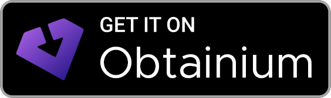

<div align="center">


# NoteDeck

**Misskey Pro — Misskey廃人のための Misskey 統合デッキ環境 (IDE: Integrated Deck Environment)**

[](https://github.com/notedeck-dev/notedeck/actions/workflows/ci.yml)
[](https://github.com/notedeck-dev/notedeck/releases/latest)
[](https://github.com/microsoft/winget-pkgs/tree/master/manifests/n/NotedeckDev/NoteDeck)
[](https://aur.archlinux.org/packages/misskey-notedeck-bin)
[](https://apps.obtainium.imranr.dev/redirect?r=obtainium://app/%7B%22id%22%3A%22com.notedeck.desktop%22%2C%22url%22%3A%22https%3A%2F%2Fgithub.com%2Fnotedeck-dev%2Fnotedeck%22%2C%22author%22%3A%22notedeck-dev%22%2C%22name%22%3A%22NoteDeck%22%2C%22additionalSettings%22%3A%22%7B%5C%22includePrereleases%5C%22%3Afalse%2C%5C%22fallbackToOlderReleases%5C%22%3Afalse%2C%5C%22versionDetection%5C%22%3Atrue%2C%5C%22apkFilterRegEx%5C%22%3A%5C%22%5C%22%2C%5C%22autoApkFilterByArch%5C%22%3Atrue%2C%5C%22appName%5C%22%3A%5C%22NoteDeck%5C%22%2C%5C%22appAuthor%5C%22%3A%5C%22notedeck-dev%5C%22%7D%22%7D)
[](https://github.com/notedeck-dev/notedeck)
[](https://github.com/notedeck-dev/notedeck/blob/main/LICENSE)
[](https://github.com/notedeck-dev/notedeck/stargazers)
[](https://github.com/notedeck-dev/notedeck/releases)
[](https://github.com/notedeck-dev/notedeck/commits)
[](https://github.com/notedeck-dev/notedeck/issues)
[](https://tauri.app)
[](https://github.com/notedeck-dev/notedeck/pulls)
[](https://deepwiki.com/notedeck-dev/notedeck)
[](https://misskey.io/@notedeck)

[Download](https://github.com/notedeck-dev/notedeck/releases/latest) ·
[Issues](https://github.com/notedeck-dev/notedeck/issues) ·
[Roadmap](ROADMAP.md) ·
[Strategy](STRATEGY.md) ·
[Architecture](ARCHITECTURE.md) ·
[Design](DESIGN.md) ·
[Development](DEVELOPMENT.md) ·
[Performance](PERFORMANCE.md) ·
[Contributing](CONTRIBUTING.md) ·
[Security](SECURITY.md) ·
[Code of Conduct](CODE_OF_CONDUCT.md)

</div>


## Install

| Windows | macOS | Linux | Android |
|---|---|---|---|
| `.exe` | `.dmg` (Universal) | `.deb` / `.AppImage` | `.apk` |

**Windows (winget)**

```
winget install NotedeckDev.NoteDeck
```

**Arch Linux (AUR)**

```bash
yay -S misskey-notedeck-bin
```

**Nix Flake**

```bash
nix run github:notedeck-dev/notedeck
```

**Android (Obtainium)**

[](https://apps.obtainium.imranr.dev/redirect?r=obtainium://app/%7B%22id%22%3A%22com.notedeck.desktop%22%2C%22url%22%3A%22https%3A%2F%2Fgithub.com%2Fnotedeck-dev%2Fnotedeck%22%2C%22author%22%3A%22notedeck-dev%22%2C%22name%22%3A%22NoteDeck%22%2C%22additionalSettings%22%3A%22%7B%5C%22includePrereleases%5C%22%3Afalse%2C%5C%22fallbackToOlderReleases%5C%22%3Afalse%2C%5C%22versionDetection%5C%22%3Atrue%2C%5C%22apkFilterRegEx%5C%22%3A%5C%22%5C%22%2C%5C%22autoApkFilterByArch%5C%22%3Atrue%2C%5C%22appName%5C%22%3A%5C%22NoteDeck%5C%22%2C%5C%22appAuthor%5C%22%3A%5C%22notedeck-dev%5C%22%7D%22%7D)

[Obtainium](https://obtainium.imranr.dev/) に GitHub Releases をソースとして登録すると、新しいバージョンが出るたびに APK の更新を自動で追従できます。バッジをタップすると設定済みの構成が Obtainium に渡ります。手動で追加する場合は Obtainium の「追加」にリポジトリ URL `https://github.com/notedeck-dev/notedeck` を貼り付けてください。端末の CPU に合う APK は自動で選ばれます。

## 貢献する

PR を歓迎します。詳しくは [CONTRIBUTING.md](CONTRIBUTING.md) を参照してください。

## ライセンス

[AGPL-3.0](LICENSE)
