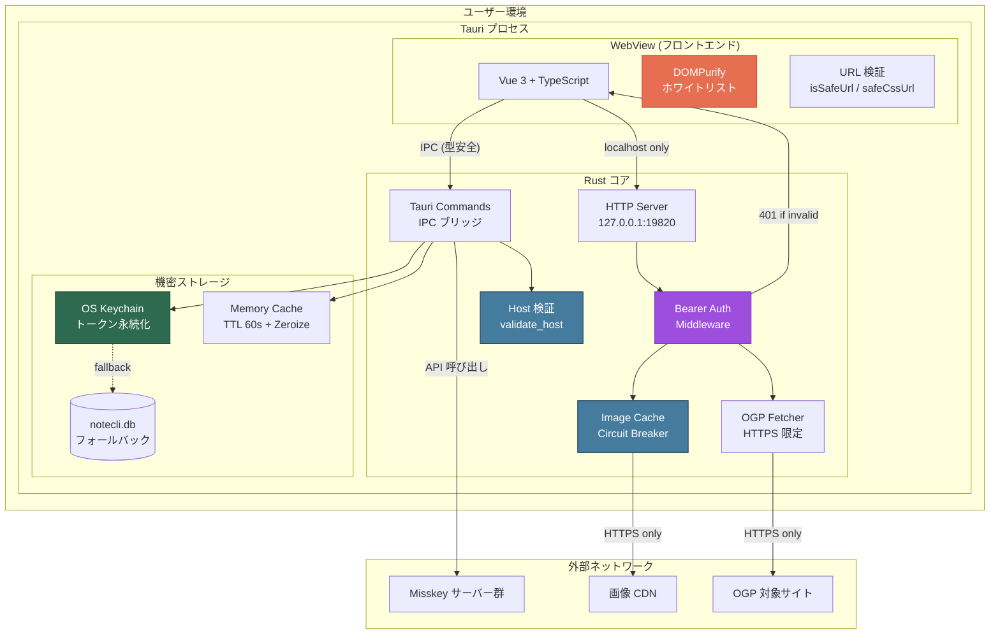
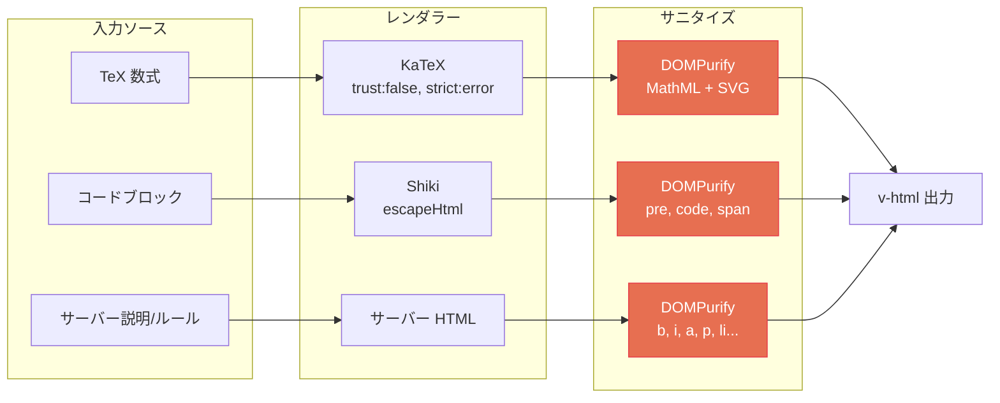
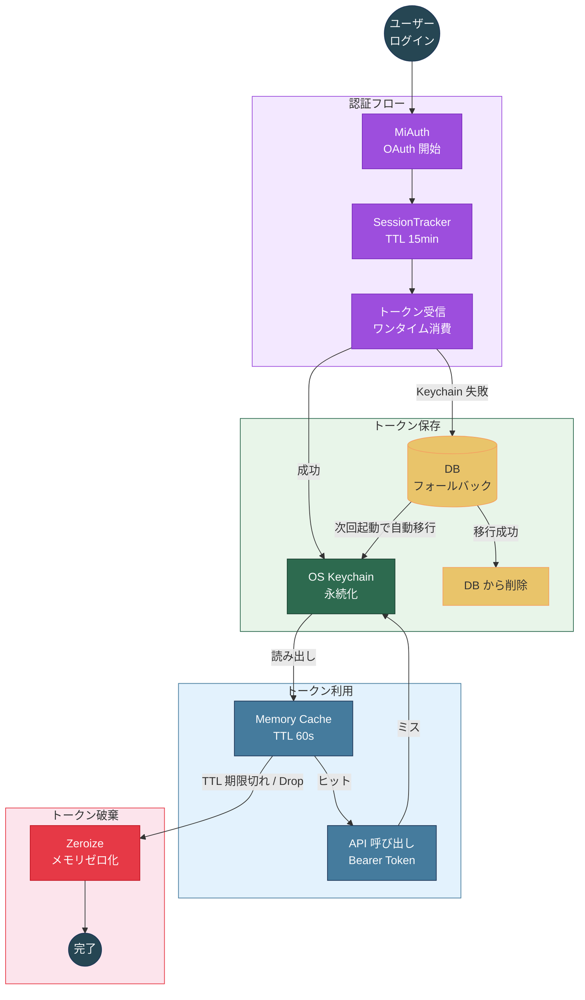
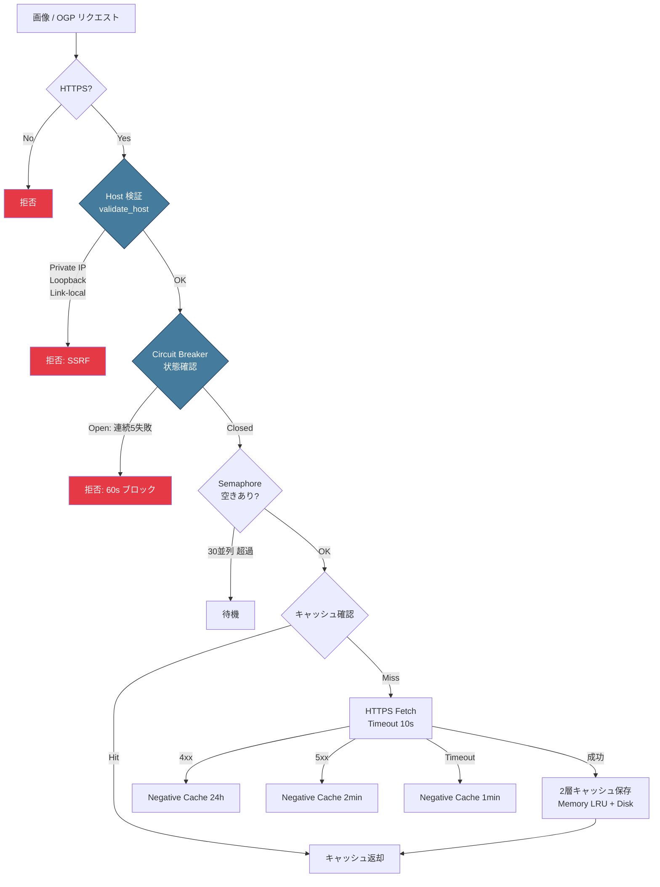
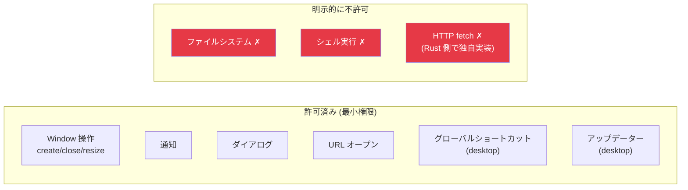
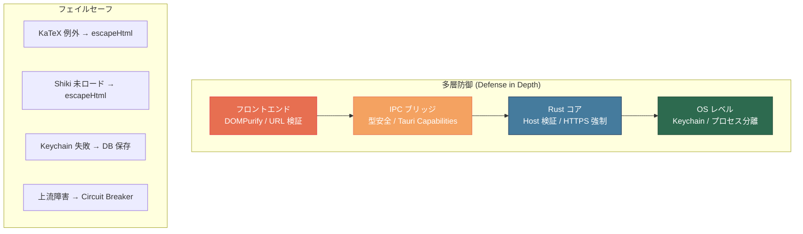

# NoteDeck セキュリティアーキテクチャ

NoteDeck のセキュリティ設計と実装状況をまとめたドキュメント。

## 全体アーキテクチャ



### 構造的セキュリティ優位

1. **Tauri のプロセス分離**: WebView (フロントエンド) と Rust コアは別プロセス。IPC ブリッジ経由でのみ通信し、フロントエンドから直接ネットワークやファイルシステムにアクセスできない
2. **Rust による境界防御**: ネットワーク通信・トークン管理・ホスト検証はすべて Rust 側で実行。メモリ安全性が保証された言語で機密処理を行う
3. **localhost 限定 HTTP サーバー**: 画像プロキシ・OGP は内部 HTTP サーバー経由。外部からアクセス不可、Bearer Token で保護

## 総合評価

| 領域 | 評価 | 備考 |
|------|------|------|
| XSS 対策 | **A** | DOMPurify + ホワイトリストで全 v-html を保護 |
| SSRF 対策 | **A** | プライベート IP / ループバック完全ブロック |
| 認証・トークン管理 | **A+** | OS キーチェーン + メモリ zeroize + 定数時間比較 + CSPRNG 256-bit トークン |
| 入力検証 | **A** | URL・ホスト・CSS パラメータを厳密に検証 + ホスト単位レート制限 |
| ネットワーク | **A+** | HTTPS 強制 + localhost 限定サーバー + DNS Rebinding 防御 |
| 耐障害性 | **A** | サーキットブレーカー + ネガティブキャッシュ + ホスト単位レート制限 |
| 可観測性 | **A** | tracing による構造化セキュリティイベントログ |

---

## 1. XSS 対策

すべての `v-html` 出力は DOMPurify でサニタイズ済み。許可タグ・属性をホワイトリストで明示指定。



### KaTeX 数式レンダリング

- **ファイル**: `src/components/common/MkMfm.vue`
- `katex.renderToString()` の出力を DOMPurify でサニタイズ
- `trust: false`, `strict: 'error'` で危険な TeX コマンドを拒否
- 許可タグ: MathML 要素 (`math`, `mrow`, `mi`, `mo`, `mfrac` 等) + SVG 描画要素
- catch フォールバックは `escapeHtml()` で安全にエスケープ

### コードハイライト

- **ファイル**: `src/utils/highlight.ts`
- Shiki の出力を DOMPurify でサニタイズ
- 許可タグ: `pre`, `code`, `span` のみ
- 許可属性: `class` のみ
- ハイライター未ロード時は `escapeHtml()` でフォールバック

### サーバー情報表示

- **ファイル**: `src/components/deck/DeckServerInfoColumn.vue`
- サーバー概要・ルールともに DOMPurify + ホワイトリストでサニタイズ
- `iframe`, `script`, `object` 等は全てブロック

---

## 2. SSRF 対策

### ホスト検証 (Rust バックエンド)

- **ファイル**: `src-tauri/src/commands/mod.rs` — `validate_host()`
- ブロック対象:
  - ループバック: `localhost`, `127.*`, `::1`, `[::1]`
  - プライベート IP: `10.*`, `192.168.*`, `172.16.0.0/12`
  - リンクローカル: `169.254.*`, `fe80:`
  - IPv6 ULA: `fc*`, `fd*`
  - IPv4-mapped IPv6: `::ffff:`
- ホスト名: 最大 253 文字、`/`, `?`, `#`, `@`, 空白を拒否

### URL 検証 (フロントエンド)

- **ファイル**: `src/utils/url.ts`
- `isSafeUrl()`: `http://` / `https://` のみ許可
- `safeCssUrl()`: CSS `url()` 内のプロトコル検証 + 文字エスケープ

### `http.fetch` Capability (AiScript / AI / コマンドパレットから利用)

- **実装**: `src/capabilities/builtins/http.ts` + Rust 側 `http_fetch_command`
- **deny ルール** (上記 SSRF ホスト検証に加えて):
  - NoteDeck 自身: `localhost:19820` を明示 deny
  - ドメインサフィックス: `.local` / `.internal` / `.localhost` を deny
- **制限**:
  - timeout: **1〜120 秒** (デフォルト 30 秒、user configurable)
  - response size: **10 MB 上限**
  - 必要 permission: `network.external` (preset `full` でのみ ON)
- **UI 確認**: `requiresConfirmation: true` で **dispatch 直前に URL を確認ダイアログ**で表示。AI からの呼び出しでもユーザー承認なしには通らない

---

## 3. 認証・トークン管理

### トークンライフサイクル



### 多層トークン保護

| 層 | 実装 | ファイル |
|----|------|----------|
| 永続化 | OS キーチェーン (primary) | `src-tauri/src/commands/auth.rs` |
| フォールバック | DB 保存 → キーチェーンへ自動移行 | 同上 |
| メモリ | TTL 60秒キャッシュ + `Zeroize` trait | 同上 |
| 破棄 | `Drop` 実装でメモリを即時ゼロ化 | 同上 |

- DB にトークンが残っている場合、キーチェーン保存成功後に DB から削除
- アカウントエクスポート JSON にはトークンを含めない（`id`, `host`, `username` のみ）

### AI プロバイダー API キー

| 項目 | 内容 |
|----|------|
| 格納先 | OS キーチェーン (`notecli::keychain`、Misskey トークンと同一機構) |
| 対象 | Anthropic / OpenAI / Custom (OpenAI 互換) の 3 プロバイダー |
| Tauri command | `ai_set_api_key` / `ai_get_api_key_status` / `ai_delete_api_key` (`src-tauri/src/commands/ai.rs`) |
| フロント側 | キー本体には触れず、`status` (bool) のみ取得 |
| 旧データ | localStorage に残っていた場合は初回起動時に keychain 移行 → クリア |

### MiAuth スコープ

- Misskey 認証時の必須スコープには **read/write 系の chat / mutes / blocks** が含まれる (`src-tauri/src/commands/auth.rs`)
- v0.20 系で legacy `messaging` API → 新 `chat` API への置換に追従し、chat scope も再定義された
- スコープ追加・削除はサーバ側の `i` トークン無効化と等価な扱いになるため、変更時はリリースノートに明記する

### 認証セッション管理

- `AuthSessionTracker`: セッション TTL 15分、ワンタイム消費
- ホスト不一致検出（リプレイ攻撃対策）
- 期限切れセッションは新規登録時に自動クリーンアップ

### 内部 API 認証

- **ファイル**: `src-tauri/src/http_server.rs`
- localhost (`127.0.0.1:19820`) のみバインド
- Bearer Token で全エンドポイントを保護（定数時間比較: `subtle` クレート）
- API トークンは CSPRNG で 256-bit 生成（`rand` クレート）
- 不正トークンには 401 Unauthorized を返却 + tracing でログ記録

---

## 4. 入力検証

### API エンドポイントパラメータ

- エンドポイント: 最大 100 文字、`[a-zA-Z0-9/-]` のみ
- ユーザー名: 文字数・文字種を制限

### AiScript コードサニタイズ

- **ファイル**: `src/aiscript/sanitize.ts` — `sanitizeCode()`
- BOM (U+FEFF) 除去
- ゼロ幅文字除去: U+200B〜U+200F, U+2060
- NBSP → 通常スペース変換
- 改行正規化 (CRLF/CR → LF)

### MFM CSS パラメータ検証

- **ファイル**: `src/components/common/MkMfm.vue`
- HEX カラー: `/^[0-9a-fA-F]{3,8}$/`
- CSS 時間: `/^\d+(\.\d+)?(s|ms)$/`
- CSS 数値: `/^-?\d+(\.\d+)?$/`
- ボーダースタイル: ホワイトリスト (`solid`, `dashed`, `dotted` 等)

---

## 5. コンテンツセキュリティ

### 外部リソース取得フロー



### 画像プロキシ

| 制御 | 値 | ファイル |
|------|-----|----------|
| プロトコル | HTTPS のみ | `src-tauri/src/image_cache.rs` |
| 最大サイズ | 20 MB | 同上 |
| 同時取得数 | 30 (semaphore、設定可能) | 同上 |
| タイムアウト | 10 秒 (共通 HTTP クライアント) | `src-tauri/src/lib.rs` |
| サーキットブレーカー | 5 連続失敗 → 60 秒ブロック (設定可能) | `src-tauri/src/perf_config.rs` |
| ネガティブキャッシュ | 4xx: 24h / 5xx: 2min / timeout: 1min | `src-tauri/src/image_cache.rs` |
| メモリキャッシュ | LRU, 64KB/item, 32MB 上限 | 同上 |
| ディスクキャッシュ | 7 日 TTL | 同上 |

### OGP フェッチ

- **ファイル**: `src-tauri/src/ogp/mod.rs`
- HTTPS 限定
- リダイレクト: 最大 5 回
- タイムアウト: 10 秒 (共通 HTTP クライアント注入)
- Player URL: 既知の壊れたドメインをブロック (`embed.pixiv.net` 等)
- OGP 画像: HTTPS URL のみ抽出

---

## 6. ネットワークセキュリティ

### TLS

- バックエンド: `rustls-tls` (純 Rust TLS 実装、OpenSSL 非依存)
- フロントエンド: 外部リソースはすべて HTTPS 経由

### localhost 限定サーバー

- 内部 HTTP サーバーは `127.0.0.1:19820` にバインド
- 外部ネットワークからアクセス不可
- DNS Rebinding 防御: `Host` ヘッダーが `127.0.0.1` / `localhost` / `[::1]` でなければ 403 拒否
- `CorsLayer::permissive()` — localhost 限定のため許容

---

## 7. Tauri セキュリティ設定

### Capabilities (権限モデル)



- **default** (`src-tauri/capabilities/default.json`): ウィンドウ操作、通知、ダイアログ等の最小権限
- **desktop** (`src-tauri/capabilities/desktop.json`): グローバルショートカット、自動起動、アップデーター
- ファイルシステムアクセス: 明示的に許可されていない
- シェル実行: 許可なし
- HTTP fetch: Tauri の capabilities では許可せず、Rust 側で独自実装

---

## 8. 依存ライブラリ

### フロントエンド

| ライブラリ | 用途 |
|-----------|------|
| `dompurify` | HTML サニタイズ (XSS 防止) |
| `katex` | 数式レンダリング (`trust: false`) |
| `shiki` | コードハイライト |

### バックエンド

| クレート | 用途 |
|---------|------|
| `zeroize` | 機密メモリのゼロ化 |
| `subtle` | 定数時間トークン比較 (timing attack 防止) |
| `rand` | CSPRNG による API トークン生成 (256-bit) |
| `reqwest` + `rustls-tls` | HTTPS 通信 |
| `axum` | HTTP サーバーフレームワーク |
| `tracing` | 構造化セキュリティイベントログ |
| `scraper` | OGP HTML パース |
| `sha2` | キャッシュキーのハッシュ化 |
| `lru` | キャッシュ LRU 管理 |

---

## 9. 設計原則



1. **多層防御**: フロントエンド → IPC → Rust → OS の各層で独立した検証。1 層が突破されても次の層で防御
2. **最小権限**: localhost 限定サーバー、Tauri capabilities で必要最小限の権限のみ許可
3. **フェイルセーフ**: HTTPS 強制、DOMPurify デフォルトブロック、catch 時は escapeHtml
4. **入力正規化**: ホスト名小文字化、Unicode 正規化、CSS パラメータ検証
5. **耐障害性**: サーキットブレーカー + ネガティブキャッシュで壊れた上流の影響を遮断

---

## 10. AI Capability セキュリティ

AI チャット・自律エージェント (HEARTBEAT) / プラグインから呼び出される **Capability Registry** が新しい攻撃面となるため、複数の防御層を組み合わせて保護している。

### 多層防御モデル

```
[AI / プラグイン]
   ↓ tool calling (Anthropic / OpenAI / Custom)
[capability sanitizer]     — `aiTool: false` を schema から除外
   ↓
[permission gate]          — preset (readonly/safe/full/custom) + AI 設定で AND 照合
   ↓
[confirmation dialog]      — write 系は dispatch 直前にユーザー承認 (Shiki 引数表示)
   ↓
[credential proxy]         — AI には credentials を渡さず NoteDeck が代理実行
   ↓
[capability execute]
```

実装: `src/capabilities/dispatcher.ts`, `src/capabilities/toolSchema.ts`, `src/composables/useAiConfig.ts`, `src/composables/useAiSystemContext.ts`

### Permission モデル

| preset | 許可される操作 |
|---|---|
| `readonly` (default) | `notes.read` / `account.read` / `drive.read` (10 項目中 3 つ) |
| `safe` | + `notes.react` / `clipboard` / `notifications` (6 項目) |
| `full` | + `notes.write` / `account.write` / `drive.write` / `network.external` (10 項目すべて) |
| `custom` | 個別 toggle |

- capability の `permissions: PermissionKey[]` と AI 設定を **AND 照合**で評価
- 不一致なら `permission_denied` を tool_result に返す (AI には実行されない)
- `useAiConfig` を module-scope singleton 化し、`dispatchCapability` 直前に `reloadAiConfig()` を呼ぶため、外部エディタや設定 UI からの変更が **再起動なしで即反映**される

### `aiTool: false` ガード (自己改変系の安全弁)

skill / widget / plugin / theme の **write 系 capability** (`skills.replaceSection` / `widgets.create` / `plugins.update` / `theme.create` 等) は属性 `aiTool: false` を持ち、`toolSchema.ts` が AI 用ツール schema を生成する際に **schema から除外** される。AI からは存在自体が見えないため、tool calling での自己改変を構造的に防ぐ。明示的に有効化するには capability 定義側で `aiTool: true` に変える必要がある。

### Credential Proxy 実行モデル

- AI / プラグインには **Misskey トークン・API キーを一切渡さない**
- capability dispatch 時に NoteDeck (Rust 側) が credentials を付加して API を実行
- `stripCredentials` (`src/composables/useAiSystemContext.ts`) が context block (`<currentAccount>` 等) を再帰 walk し、以下の denylist キーを削除:
  - `token`, `i`, `accessToken`, `refreshToken`, `apiKey`, `password`, `secret`
- 特に **`i`** は Misskey の認証トークンキーであり、漏洩すると重大なインシデントになる
- denylist は新プロトコル追加時に保守する責任があるため、追加時はテストと併せて拡張する

### Content Warning (CW) マスキング

- AI に渡る可視ノート (`<visibleNotes>`) は、`cw` (Content Warning) が設定されていると **本文を `[CW: <理由>]` に置換**
- AI は CW の存在と理由のみ認識でき、本文は学習やコンテキスト参照に使えない
- HEARTBEAT のように長期間 AI が context を蓄積するワークフローでは特に重要

### 確認ダイアログ enforce

- `requiresConfirmation: true` の capability は dispatch 直前に確認ダイアログを表示
- 引数 JSON は **code block + Shiki シンタックスハイライト**で見やすく表示 (`9e2a942e`)
- 「実行」「キャンセル」の二択。キャンセル時は AI に `cancelled` を tool_result として返す
- 連続 tool 呼び出し上限は **5 回** (`MAX_TOOL_ROUNDS=5`)

### HEARTBEAT Daemon セキュリティ

- アプリ起動中ずっと走る global daemon (`useHeartbeatDaemon` を `App.vue` で 1 mount)
- `notes.write` 等の通常許可されている権限を、**HEARTBEAT 中だけ deny** にできる (`heartbeat.permissions: PermissionsConfig`)。デフォルトは readonly
- **Cheap Check First**: AI を呼ぶ前にローカルで低コスト判定 (未読数等)。閾値以下なら即 `HEARTBEAT_OK` で終了 → トークン消費爆発と暴走を抑制
- **連続 3 回失敗で daemon 自動 disable + warning toast** (silent fail 防止)
- 詳細は [DEVELOPMENT.md](DEVELOPMENT.md) の "HEARTBEAT Daemon"

### Persona / Memo 自己編集の制約

- `memos.create` / `memos.update` の `authorId` は persona skill ID または account ID のみ。任意の skill ID を resolve できる構造ではない (`buildAuthorBlock`)
- skill は `isPersona: true` フラグで persona かどうかを宣言。AI が任意の identity を装うことはできない
- 編集履歴 (`memos.history` 等は将来追加予定、現状 skill / widget / plugin / theme で `*.history` / `*.revert` を提供) で巻き戻し可能

---

## 11. 既知の制限と今後の検討

| 項目 | 状態 | 備考 |
|------|------|------|
| 同一 OS ユーザーの他プロセス | 受容 | OS キーチェーンは別ユーザー・リモートからの窃取を防ぐが、同一ユーザー権限のプロセス (同一アカウント上のマルウェア等) からの読み取りは OS の責務。高い脅威環境ではフルディスク暗号化・信頼できるソフトウェアのみの実行を併用する |
| CSP `unsafe-eval` | 受容 | AiScript エンジンが必要とするため除去不可 |
| SSRF DNS TOCTOU | 受容 | デスクトップアプリでは脅威が限定的。DNS 解決後の IP 再検証は VPN / 社内 Misskey ユーザーをブロックするため実装しない |
| Tor (.onion) 非対応 | 受容 | HTTPS 強制の緩和はセキュリティ劣化を招き、SOCKS5 対応も VPN には不要。`.onion` Misskey インスタンスの需要もないため対応しない |
| AI tool schema からの `aiTool:false` 除外漏れ | 監視 | 自動テストで全 capability の AI schema 露出を検査する仕組みを今後追加 |
| HEARTBEAT 暴走時の rate limit | 受容 | Cheap Check First + 連続失敗 disable で防御。capability 単位の rate limit は実需要が出てから検討 |
