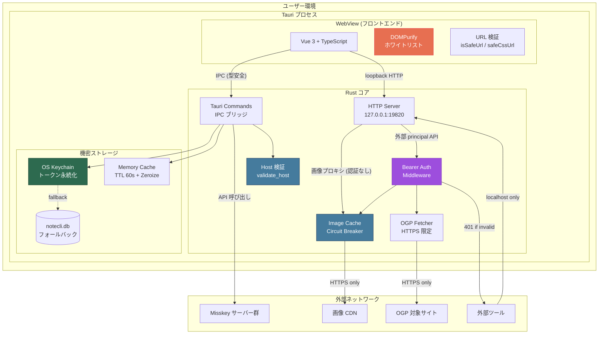
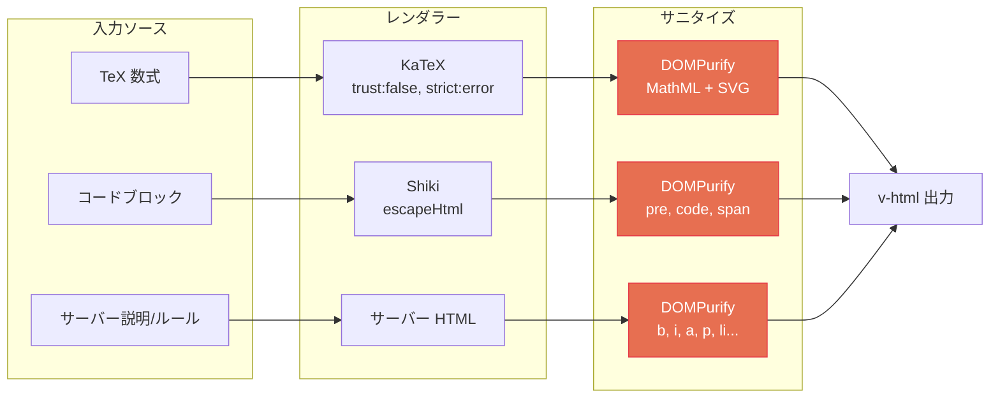
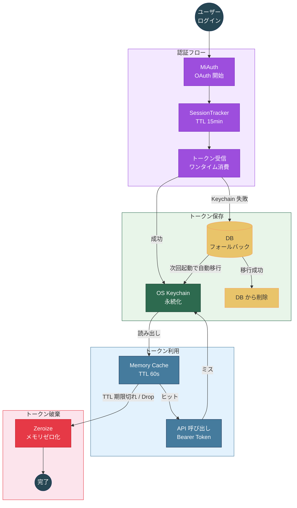
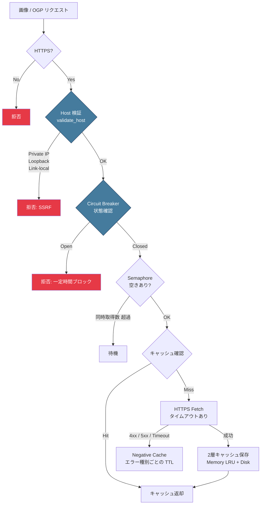
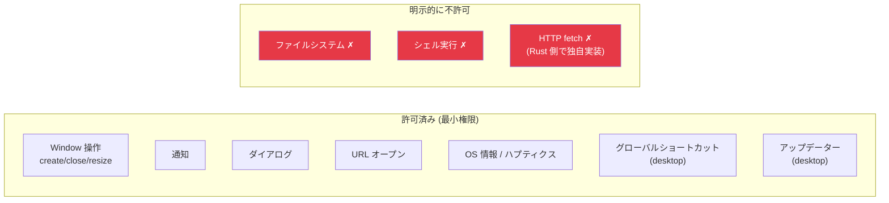
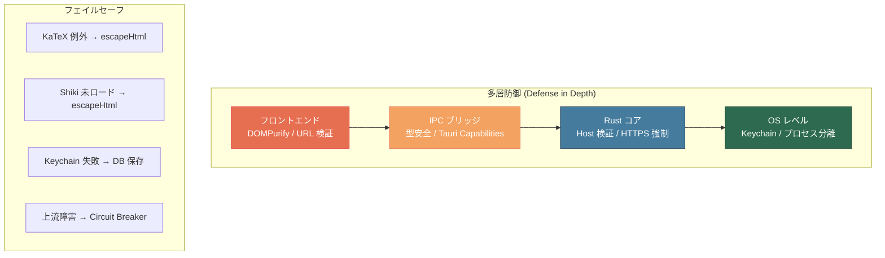

# NoteDeck セキュリティアーキテクチャ

NoteDeck のセキュリティ設計と実装状況をまとめたドキュメント。

## 全体アーキテクチャ


```mermaid
graph TB
    subgraph "ユーザー環境"
        subgraph "Tauri プロセス"
            subgraph "WebView (フロントエンド)"
                FE[Vue 3 + TypeScript]
                DP[DOMPurify<br/>ホワイトリスト]
                UV[URL 検証<br/>isSafeUrl / safeCssUrl]
            end

            subgraph "Rust コア"
                CMD[Tauri Commands<br/>IPC ブリッジ]
                HTTP[HTTP Server<br/>127.0.0.1:19820]
                AUTH[Bearer Auth<br/>Middleware]
                HV[Host 検証<br/>validate_host]
                IC[Image Cache<br/>Circuit Breaker]
                OGP[OGP Fetcher<br/>HTTPS 限定]
            end

            subgraph "機密ストレージ"
                KC[OS Keychain<br/>トークン永続化]
                MC[Memory Cache<br/>TTL 60s + Zeroize]
                DB[(notecli.db<br/>フォールバック)]
            end
        end
    end

    subgraph "外部ネットワーク"
        MK[Misskey サーバー群]
        IMG[画像 CDN]
        WEB[OGP 対象サイト]
        EXT[外部ツール]
    end

    FE -->|"IPC (型安全)"| CMD
    FE -->|"loopback HTTP"| HTTP
    EXT -->|"localhost only"| HTTP
    HTTP -->|"画像プロキシ (認証なし)"| IC
    HTTP -->|"外部 principal API"| AUTH
    AUTH -->|"401 if invalid"| EXT
    AUTH --> IC
    AUTH --> OGP
    CMD --> HV
    CMD --> KC
    KC -.->|"fallback"| DB
    CMD --> MC
    IC -->|"HTTPS only"| IMG
    OGP -->|"HTTPS only"| WEB
    CMD -->|"API 呼び出し"| MK

    style KC fill:#2d6a4f,stroke:#1b4332,color:#fff
    style AUTH fill:#9d4edd,stroke:#7b2cbf,color:#fff
    style DP fill:#e76f51,stroke:#e63946,color:#fff
    style HV fill:#457b9d,stroke:#1d3557,color:#fff
    style IC fill:#457b9d,stroke:#1d3557,color:#fff
```

### 構造的セキュリティ優位

1. **Tauri のプロセス分離**: WebView (フロントエンド) と Rust コアは別プロセス。IPC ブリッジ経由でのみ通信し、フロントエンドから直接ネットワークやファイルシステムにアクセスできない
2. **Rust による境界防御**: ネットワーク通信・トークン管理・ホスト検証はすべて Rust 側で実行。メモリ安全性が保証された言語で機密処理を行う
3. **メディア取得の単一経路**: 画像・効果音は WebView・外部ツールとも loopback に bind した内蔵 HTTP サーバー (bind 先とポートの正本は `src-tauri/src/http_server.rs`) の画像プロキシ経由。認証はルート単位で、画像プロキシは認証なし・外部 principal 向け API は Bearer Token 保護。すべて同じ Rust 側キャッシュ層に入り、HTTPS 強制・ホスト検証・サーキットブレーカーを迂回できない

---

## 1. XSS 対策

すべての `v-html` 出力は DOMPurify でサニタイズ済み。許可タグ・属性をホワイトリストで明示指定。


```mermaid
flowchart LR
    subgraph "入力ソース"
        A1["TeX 数式"]
        A2["コードブロック"]
        A3["サーバー説明/ルール"]
    end

    subgraph "レンダラー"
        B1["KaTeX<br/>trust:false, strict:error"]
        B2["Shiki<br/>escapeHtml"]
        B3["サーバー HTML"]
    end

    subgraph "サニタイズ"
        C1["DOMPurify<br/>MathML + SVG"]
        C2["DOMPurify<br/>pre, code, span"]
        C3["DOMPurify<br/>b, i, a, p, li..."]
    end

    D["v-html 出力"]

    A1 --> B1 --> C1 --> D
    A2 --> B2 --> C2 --> D
    A3 --> B3 --> C3 --> D

    style C1 fill:#e76f51,stroke:#e63946,color:#fff
    style C2 fill:#e76f51,stroke:#e63946,color:#fff
    style C3 fill:#e76f51,stroke:#e63946,color:#fff
```

### KaTeX 数式レンダリング

- **ファイル**: `src/components/common/MkMfm.vue`
- `katex.renderToString()` の出力を DOMPurify でサニタイズ
- `trust: false`, `strict: 'error'` で危険な TeX コマンドを拒否
- 許可タグ: MathML 要素 (`math`, `mrow`, `mi`, `mo`, `mfrac` 等) + SVG 描画要素
- catch フォールバックは `escapeHtml()` で安全にエスケープ

### コードハイライト

- **ファイル**: `src/utils/highlight.ts`
- Shiki の出力を DOMPurify でサニタイズ
- 許可タグ: `pre`, `code`, `span` のみ
- 許可属性: `class` のみ
- ハイライター未ロード時は `escapeHtml()` でフォールバック

### サーバー情報表示

- **ファイル**: `src/components/deck/DeckServerInfoColumn.vue`
- サーバー概要・ルールともに DOMPurify + ホワイトリストでサニタイズ
- `iframe`, `script`, `object` 等は全てブロック

---

## 2. SSRF 対策

### ホスト検証 (Rust バックエンド)

- **ファイル**: `src-tauri/src/commands/mod.rs` — `validate_host()`
- ブロック対象:
  - ループバック: `localhost`, `127.*`, `::1`, `[::1]`
  - プライベート IP: `10.*`, `192.168.*`, `172.16.0.0/12`
  - リンクローカル: `169.254.*`, `fe80:`
  - IPv6 ULA: `fc*`, `fd*`
  - IPv4-mapped IPv6: `::ffff:`
- ホスト名: 最大 253 文字、`/`, `?`, `#`, `@`, 空白を拒否

### URL 検証 (フロントエンド)

- **ファイル**: `src/utils/url.ts`
- `isSafeUrl()`: `http://` / `https://` のみ許可
- `safeCssUrl()`: CSS `url()` 内のプロトコル検証 + 文字エスケープ

### `http.fetch` Capability (AiScript / AI / コマンドパレットから利用)

- **実装**: `src/capabilities/builtins/http.ts` + Rust 側 `http_fetch_command`
- **deny ルール** (上記 SSRF ホスト検証に加えて):
  - NoteDeck 自身: `localhost:19820` を明示 deny
  - ドメインサフィックス: `.local` / `.internal` / `.localhost` を deny
- **制限**:
  - timeout: **1〜120 秒** (デフォルト 30 秒、user configurable)
  - response size: **10 MB 上限**
  - 必要 permission: `network.external` (高リスク指定。preset では `full` のみ ON。plugin principal は外部 API 連携がウィジェットの主要用途のためデフォルトで ON)
- **UI 確認**: `requiresConfirmation: true` で **dispatch 直前に URL を確認ダイアログ**で表示。AI からの呼び出しでもユーザー承認なしには通らない。plugin は「今後確認しない」を**プラグイン個体単位**で記憶する (1 ウィジェットへの同意が他へ波及しない)

---

## 3. 認証・トークン管理

### トークンライフサイクル


```mermaid
flowchart TB
    START(("ユーザー<br/>ログイン"))

    subgraph AUTH ["認証フロー"]
        direction LR
        OA["MiAuth<br/>OAuth 開始"]
        ST["SessionTracker<br/>TTL 15min"]
        TR["トークン受信<br/>ワンタイム消費"]
        OA --> ST --> TR
    end

    subgraph STORE ["トークン保存"]
        KC["OS Keychain<br/>永続化"]
        DB[(DB<br/>フォールバック)]
        TR -->|成功| KC
        TR -->|"Keychain 失敗"| DB
        DB -->|"次回起動で自動移行"| KC
        DB -->|"移行成功"| CLEAR["DB から削除"]
    end

    subgraph USE ["トークン利用"]
        direction LR
        MC["Memory Cache<br/>TTL 60s"]
        API["API 呼び出し<br/>Bearer Token"]
        KC -->|読み出し| MC
        MC -->|"ヒット"| API
        API -->|"ミス"| KC
    end

    subgraph DESTROY ["トークン破棄"]
        ZR["Zeroize<br/>メモリゼロ化"]
        DONE(("完了"))
        MC -->|"TTL 期限切れ / Drop"| ZR
        ZR --> DONE
    end

    START --> OA

    style START fill:#264653,stroke:#1d3557,color:#fff
    style OA fill:#9d4edd,stroke:#7b2cbf,color:#fff
    style ST fill:#9d4edd,stroke:#7b2cbf,color:#fff
    style TR fill:#9d4edd,stroke:#7b2cbf,color:#fff
    style KC fill:#2d6a4f,stroke:#1b4332,color:#fff
    style DB fill:#e9c46a,stroke:#f4a261,color:#333
    style CLEAR fill:#e9c46a,stroke:#f4a261,color:#333
    style MC fill:#457b9d,stroke:#1d3557,color:#fff
    style API fill:#457b9d,stroke:#1d3557,color:#fff
    style ZR fill:#e63946,stroke:#c1121f,color:#fff
    style DONE fill:#264653,stroke:#1d3557,color:#fff
    style AUTH fill:#f3e8ff,stroke:#9d4edd,color:#333
    style STORE fill:#e8f5e9,stroke:#2d6a4f,color:#333
    style USE fill:#e3f2fd,stroke:#457b9d,color:#333
    style DESTROY fill:#fce4ec,stroke:#e63946,color:#333
```

### 多層トークン保護

| 層 | 実装 | ファイル |
|----|------|----------|
| 永続化 | OS キーチェーン (primary) | `src-tauri/src/commands/mod.rs` — `get_credentials()` |
| フォールバック | DB 保存 → キーチェーンへ自動移行 | 同上 |
| メモリ | TTL 60秒キャッシュ + `Zeroize` trait | 同上 |
| 破棄 | `Drop` 実装でメモリを即時ゼロ化 | 同上 |

- DB にトークンが残っている場合、キーチェーン保存成功後に DB から削除する。ただし **再起動をまたいで永続しないキーチェーン実装 (Linux の keyutils 等) では DB フォールバックを消さない** — 消すと再起動のたびに再ログインが必要になるため (`keychain::is_persistent()` で判定)
- アカウントエクスポート JSON にはトークンを含めない（`id`, `host`, `username` のみ）

### 外部サービスのシークレット (Secret Vault #564)

AI プロバイダーの API キーを含む外部サービスのシークレットは **Secret Vault** に統合されている。

| 項目 | 内容 |
|----|------|
| 格納先 | OS キーチェーン (`service = notedeck`, `account = vault/v1/<conn_id>/<slot>`) |
| メタデータ | `<configDir>/notedeck/connections.json` (Rust が source of truth、atomic write)。secret は含まない |
| フロント側 | キー本体には触れず、接続 ID と `status` (bool) のみ扱う |
| 実行モデル | `vault_fetch` が Rust 側で認証情報を注入し、レスポンスから secret を redaction して返す |
| 開示制御 | `exposedTo` で principal クラス (ai / plugin / external) 別に開示。default は非開示 |

AI チャットは `connection_id` から endpoint / キー / protocol を Rust 側で解決するため、キー本体はフロントにも AI にも渡らない。SSRF・redaction の詳細は [DEVELOPMENT.md](DEVELOPMENT.md) の "Secret Vault"。

### MiAuth スコープ

- Misskey 認証時の必須スコープには **read/write 系の chat / mutes / blocks** が含まれる (`src-tauri/src/commands/auth.rs`)
- スコープ追加・削除はサーバ側の `i` トークン無効化と等価な扱いになるため、変更時はリリースノートに明記する

### 認証セッション管理

- `AuthSessionTracker`: セッション TTL 15分、ワンタイム消費
- ホスト不一致検出（リプレイ攻撃対策）
- 期限切れセッションは新規登録時に自動クリーンアップ

### 内部 API 認証

- **ファイル**: `src-tauri/src/http_server.rs`
- localhost (`127.0.0.1:19820`) のみバインド
- Bearer Token で全エンドポイントを保護（定数時間比較: `subtle` クレート）
- API トークンは CSPRNG で 256-bit 生成（`rand` クレート）
- 不正トークンには 401 Unauthorized を返却 + tracing でログ記録

---

## 4. 入力検証

### API エンドポイントパラメータ

- エンドポイント: 最大 100 文字、`[a-zA-Z0-9/-]` のみ
- ユーザー名: 文字数・文字種を制限

### AiScript コードサニタイズ

- **ファイル**: `src/aiscript/sanitize.ts` — `sanitizeCode()`
- BOM (U+FEFF) 除去
- ゼロ幅文字除去: U+200B〜U+200F, U+2060
- NBSP → 通常スペース変換
- 改行正規化 (CRLF/CR → LF)

### MFM CSS パラメータ検証

- **ファイル**: `src/components/common/MkMfm.vue`
- HEX カラー: `/^[0-9a-fA-F]{3,8}$/`
- CSS 時間: `/^\d+(\.\d+)?(s|ms)$/`
- CSS 数値: `/^-?\d+(\.\d+)?$/`
- ボーダースタイル: ホワイトリスト (`solid`, `dashed`, `dotted` 等)

---

## 5. コンテンツセキュリティ

### 外部リソース取得フロー


```mermaid
flowchart TB
    REQ["画像 / OGP リクエスト"]

    REQ --> PROTO{"HTTPS?"}
    PROTO -->|No| REJECT1[拒否]
    PROTO -->|Yes| HOST{"Host 検証<br/>validate_host"}
    HOST -->|"Private IP<br/>Loopback<br/>Link-local"| REJECT2[拒否: SSRF]
    HOST -->|OK| CB{"Circuit Breaker<br/>状態確認"}
    CB -->|Open| REJECT3["拒否: 一定時間ブロック"]
    CB -->|Closed| SEM{"Semaphore<br/>空きあり?"}
    SEM -->|"同時取得数 超過"| QUEUE[待機]
    SEM -->|OK| CACHE{"キャッシュ確認"}
    CACHE -->|Hit| RETURN["キャッシュ返却"]
    CACHE -->|Miss| FETCH["HTTPS Fetch<br/>タイムアウトあり"]
    FETCH -->|成功| STORE["2層キャッシュ保存<br/>Memory LRU + Disk"]
    FETCH -->|"4xx / 5xx / Timeout"| NEG["Negative Cache<br/>エラー種別ごとの TTL"]
    STORE --> RETURN

    style REJECT1 fill:#e63946,color:#fff
    style REJECT2 fill:#e63946,color:#fff
    style REJECT3 fill:#e63946,color:#fff
    style CB fill:#457b9d,stroke:#1d3557,color:#fff
    style HOST fill:#457b9d,stroke:#1d3557,color:#fff
```

### メディアプロキシ (画像・効果音)

WebView 内・外部ツールとも HTTP API `/proxy/image` の一経路 (`src-tauri/src/media_proxy.rs` が共通ロジック)。すべて `image_cache.rs` を通るため、以下の制御を迂回できない。WebView から loopback へ繋ぐための OS 側の許可は、Android が networkSecurityConfig、macOS/iOS が ATS の例外 (`src-tauri/Info.plist`)。**cleartext を loopback だけに絞るのは release ビルドのみ**で、debug ビルドは dev サーバー (LAN 上の http) に繋ぐため全面的に許可する — 許可範囲の正本は `src-tauri/android/` の各 networkSecurityConfig。

| 制御 | 内容 | ファイル |
|------|-----|----------|
| プロトコル | HTTPS のみ | `src-tauri/src/image_cache.rs` |
| ファイルサイズ上限 | あり | `src-tauri/src/perf_config.rs` |
| 同時取得数 | semaphore で制限 | 同上 |
| タイムアウト | あり | `src-tauri/src/image_cache.rs` |
| サーキットブレーカー | 連続失敗で一定時間ブロック | `src-tauri/src/perf_config.rs` |
| ネガティブキャッシュ | 4xx / 5xx / ネットワークエラーで別 TTL | `src-tauri/src/image_cache.rs` |
| メモリキャッシュ | LRU (item / 総量とも上限あり) | 同上 |
| ディスクキャッシュ | TTL + 総量上限で掃除 | 同上 |

閾値の既定値は `PerformanceConfig` (`src-tauri/src/perf_config.rs`) が正本で、ユーザー設定から実行時に変更できる。

### OGP フェッチ

- **ファイル**: `src-tauri/src/ogp/mod.rs`
- HTTPS 限定
- リダイレクト回数の上限あり
- タイムアウトあり (共通 HTTP クライアント注入)
- Player URL: 既知の壊れたドメインをブロック (`embed.pixiv.net` 等)
- OGP 画像: HTTPS URL のみ抽出

---

## 6. ネットワークセキュリティ

### TLS

- バックエンド: `rustls-tls` (純 Rust TLS 実装、OpenSSL 非依存)
- フロントエンド: 外部リソースはすべて HTTPS 経由

### localhost 限定サーバー

- 内部 HTTP サーバーは `127.0.0.1:19820` にバインド
- 外部ネットワークからアクセス不可
- DNS Rebinding 防御: `Host` ヘッダーが `127.0.0.1` / `localhost` / `[::1]` でなければ 403 拒否
- `CorsLayer::permissive()` — localhost 限定のため許容

---

## 7. Tauri セキュリティ設定

### Capabilities (権限モデル)


```mermaid
graph LR
    subgraph "許可済み (最小権限)"
        W["Window 操作<br/>create/close/resize"]
        N["通知"]
        D["ダイアログ"]
        O["URL オープン"]
        OS["OS 情報 / ハプティクス"]
        GS["グローバルショートカット<br/>(desktop)"]
        UP["アップデーター<br/>(desktop)"]
    end

    subgraph "明示的に不許可"
        FS["ファイルシステム ✗"]
        SH["シェル実行 ✗"]
        HF["HTTP fetch ✗<br/>(Rust 側で独自実装)"]
    end

    style FS fill:#e63946,color:#fff
    style SH fill:#e63946,color:#fff
    style HF fill:#e63946,color:#fff
```

- **default** (`src-tauri/capabilities/default.json`): ウィンドウ操作、通知、ダイアログ等の最小権限
- **desktop** (`src-tauri/capabilities/desktop.json`): グローバルショートカット、自動起動、アップデーター
- ファイルシステムアクセス: 明示的に許可されていない
- シェル実行: 許可なし
- HTTP fetch: Tauri の capabilities では許可せず、Rust 側で独自実装

---

## 8. 依存ライブラリ

### フロントエンド

| ライブラリ | 用途 |
|-----------|------|
| `dompurify` | HTML サニタイズ (XSS 防止) |
| `katex` | 数式レンダリング (`trust: false`) |
| `shiki` | コードハイライト |

### バックエンド

| クレート | 用途 |
|---------|------|
| `zeroize` | 機密メモリのゼロ化 |
| `subtle` | 定数時間トークン比較 (timing attack 防止) |
| `rand` | CSPRNG による API トークン生成 (256-bit) |
| `reqwest` + `rustls-tls` | HTTPS 通信 |
| `axum` | HTTP サーバーフレームワーク |
| `tracing` | 構造化セキュリティイベントログ |
| `scraper` | OGP HTML パース |
| `sha2` | キャッシュキーのハッシュ化 |
| `lru` | キャッシュ LRU 管理 |

---

## 9. 設計原則


```mermaid
graph TB
    subgraph "多層防御 (Defense in Depth)"
        direction LR
        L1["フロントエンド<br/>DOMPurify / URL 検証"]
        L2["IPC ブリッジ<br/>型安全 / Tauri Capabilities"]
        L3["Rust コア<br/>Host 検証 / HTTPS 強制"]
        L4["OS レベル<br/>Keychain / プロセス分離"]
        L1 --> L2 --> L3 --> L4
    end

    subgraph "フェイルセーフ"
        direction LR
        F1["KaTeX 例外 → escapeHtml"]
        F2["Shiki 未ロード → escapeHtml"]
        F3["Keychain 失敗 → DB 保存"]
        F4["上流障害 → Circuit Breaker"]
    end

    style L1 fill:#e76f51,stroke:#e63946,color:#fff
    style L2 fill:#f4a261,stroke:#e76f51,color:#fff
    style L3 fill:#457b9d,stroke:#1d3557,color:#fff
    style L4 fill:#2d6a4f,stroke:#1b4332,color:#fff
```

1. **多層防御**: フロントエンド → IPC → Rust → OS の各層で独立した検証。1 層が突破されても次の層で防御
2. **最小権限**: localhost 限定サーバー、Tauri capabilities で必要最小限の権限のみ許可
3. **フェイルセーフ**: HTTPS 強制、DOMPurify デフォルトブロック、catch 時は escapeHtml
4. **入力正規化**: ホスト名小文字化、Unicode 正規化、CSS パラメータ検証
5. **耐障害性**: サーキットブレーカー + ネガティブキャッシュで壊れた上流の影響を遮断

---

## 10. AI Capability セキュリティ

AI チャット・自律エージェント (HEARTBEAT) / プラグインから呼び出される **Capability Registry** が新しい攻撃面となるため、複数の防御層を組み合わせて保護している。

### 多層防御モデル

```
[AI / プラグイン]
   ↓ tool calling (Anthropic / OpenAI / Custom)
[capability sanitizer]     — `aiTool: false` の capability を schema から除外
   ↓
[permission gate]          — principal 別プロファイル (#712) と capability 宣言を AND 照合
   ↓
[confirmation dialog]      — write 系は dispatch 直前にユーザー承認 (Shiki 引数表示)
   ↓
[credential proxy]         — AI には credentials を渡さず NoteDeck が代理実行
   ↓
[capability execute]
```

実装: `src/capabilities/dispatcher.ts`, `src/capabilities/toolSchema.ts`, `src/composables/useAiConfig.ts`, `src/composables/useAiSystemContext.ts`

### Permission モデル (#712)

権限は **principal ごとに独立したプロファイル**として `<configDir>/notedeck/permissions.json5` に保存される。principal は `ai.chat` / `ai.heartbeat` / `plugin` / `external` の 4 つ。ファイルは capability 層から書き換えられない場所に隔離されている (settingsFs の固定名ラッパー経由でのみ到達)。

- 各プロファイルは preset (`readonly` / `safe` / `full` / `custom`) + 個別 toggle。権限キーの語彙は capability の `permissions[]` 宣言が Single Source of Truth (`src/permissions/schema.ts`)
- capability の `permissions: PermissionKey[]` と principal のプロファイルを **AND 照合**で評価。不一致なら `permission_denied` を tool_result に返す (AI には実行されない)
- **恒久 deny floor**: 第三者 principal (plugin / external) には保存値に関わらず OFF に clamp されるキーがある。skill / persona の書込は AI の system prompt への注入経路 (confused deputy) 、`tasks.run` は per-key gate の迂回路、`backup.create` はローカルキャッシュ全量の書き出しになるため、`full` preset を選んでも通らない
- **external の read 下限**: HTTP API トークンの発行自体を Misskey コンテンツ read への同意とみなし、その範囲は常時 ON に clamp。逆に PKM メモ・下書き・AI 会話履歴などローカル私的データの read は external のデフォルトから外してある
- 権限キー追加時は `backfillValue()` で principal ごとの既定値を宣言する。欠損キーは拒否扱い
- 設定変更は dispatch 直前に再読込されるため、外部エディタや設定 UI からの変更が **再起動なしで即反映**される

権限キーの一覧と capability との対応は [SKILLS.md](SKILLS.md) §5 を参照。

### 自己改変系 capability の安全弁

skill / widget / plugin / theme の write 系 capability は、かつて `aiTool: false` で AI の tool schema から除外していたが、このガードは AI へのプラグイン生成開放 ([#107](https://github.com/notedeck-dev/notedeck/issues/107) / [#108](https://github.com/notedeck-dev/notedeck/issues/108)) に伴い廃止された。現在の安全弁は 3 層:

1. **permission**: `skills.write` / `widgets.write` / `plugins.write` / `theme.write` が許可されたときだけ通る。plugin / external principal に対しては `skills.write` / `ai.persona.write` が恒久 deny
2. **確認ダイアログ**: `requiresConfirmation` で dispatch 直前にユーザー承認
3. **capability 個別ガード**: builtIn skill の削除拒否、`skills.create` の frontmatter 遮断 + id 内部生成、`aiscript.validate` の preflight 等

`aiTool: false` が残るのは `ai.chat` (AI 自身の再帰呼び出しを防ぐためプラグイン専用) のみ。詳細は [SKILLS.md](SKILLS.md) §5.2。

### Credential Proxy 実行モデル

- AI / プラグインには **Misskey トークン・API キーを一切渡さない**
- capability dispatch 時に NoteDeck (Rust 側) が credentials を付加して API を実行
- `stripCredentials` (`src/composables/useAiSystemContext.ts`) が context block (`<currentAccount>` 等) を再帰 walk し、以下の denylist キーを削除:
  - `token`, `i`, `accessToken`, `refreshToken`, `apiKey`, `password`, `secret`
- 特に **`i`** は Misskey の認証トークンキーであり、漏洩すると重大なインシデントになる
- denylist は新プロトコル追加時に保守する責任があるため、追加時はテストと併せて拡張する

### Content Warning (CW) マスキング

- AI に渡る可視ノート (`<visibleNotes>`) は、`cw` (Content Warning) が設定されていると **本文を `[CW: <理由>]` に置換**
- AI は CW の存在と理由のみ認識でき、本文は学習やコンテキスト参照に使えない
- HEARTBEAT のように長期間 AI が context を蓄積するワークフローでは特に重要

### 確認ダイアログ enforce

- `requiresConfirmation: true` の capability は dispatch 直前に確認ダイアログを表示
- 引数 JSON は **code block + Shiki シンタックスハイライト**で見やすく表示 (`9e2a942e`)
- 「実行」「キャンセル」の二択。キャンセル時は AI に `cancelled` を tool_result として返す
- 連続 tool 呼び出し上限は **5 回** (`MAX_TOOL_ROUNDS=5`)

### HEARTBEAT Daemon セキュリティ

- アプリ起動中ずっと走る global daemon (`useHeartbeatDaemon` を `App.vue` で 1 mount)
- `notes.write` 等の通常許可されている権限を、**HEARTBEAT 中だけ deny** にできる (`permissions.json5` の `ai.heartbeat` principal が `ai.chat` とは独立)。デフォルトは readonly
- **Cheap Check First**: AI を呼ぶ前にローカルで低コスト判定 (未読数等)。閾値以下なら即 `HEARTBEAT_OK` で終了 → トークン消費爆発と暴走を抑制
- **連続 3 回失敗で daemon 自動 disable + warning toast** (silent fail 防止)
- 詳細は [DEVELOPMENT.md](DEVELOPMENT.md) の "HEARTBEAT Daemon"

### Persona / Memo 自己編集の制約

- `memos.create` / `memos.update` の `authorId` は persona skill ID または account ID のみ。任意の skill ID を resolve できる構造ではない (`buildAuthorBlock`)
- skill は `isPersona: true` フラグで persona かどうかを宣言。AI が任意の identity を装うことはできない
- skill / widget / plugin / theme は `*.history` / `*.revert` で巻き戻し可能

---

## 11. 既知の制限

多くは意図して受容しているもの。対応方針が立っているものは issue を併記する。

| 項目 | 備考 |
|------|------|
| 同一 OS ユーザーの他プロセス | OS キーチェーンは別ユーザー・リモートからの窃取を防ぐが、同一ユーザー権限のプロセス (同一アカウント上のマルウェア等) からの読み取りは OS の責務。高い脅威環境ではフルディスク暗号化・信頼できるソフトウェアのみの実行を併用する |
| CSP `unsafe-eval` | AiScript エンジンが必要とするため除去不可 |
| SSRF DNS TOCTOU (メディアプロキシ) | Secret Vault の `vault.fetch` は DNS pinning + hop ごとの再検証を行うが、メディアプロキシは解決前のホスト名でしか検証していない。DNS 解決結果まで防御を広げる方針は [#857](https://github.com/notedeck-dev/notedeck/issues/857) で立てている。VPN / 社内 Misskey ユーザーを巻き込まない形にする必要があるため、単純な private IP 拒否は採らない |
| Tor (.onion) 非対応 | HTTPS 強制の緩和はセキュリティ劣化を招き、SOCKS5 対応も VPN には不要。`.onion` Misskey インスタンスの需要もないため対応しない |
| HEARTBEAT 暴走時の rate limit | Cheap Check First + 連続失敗 disable で防御。capability 単位の rate limit は設けていない |
